import { Image } from 'astro:assets';
import { LinkButton, Steps } from '@astrojs/starlight/components';
import mongodbIcon from '@assets/icons/mongodb-icon.png';

<Image
  src={mongodbIcon}
  alt="MongoDB logo"
  width={100}
  height={100}
  class:list={'float-inline-left icon'}
  data-zoom-off
/>

[MongoDB](https://www.mongodb.com/) is a popular, open-source NoSQL document database that offers high performance, scalability, and flexible data modeling. The Aspire MongoDB Entity Framework Core (EF Core) integration lets you model a MongoDB server and its databases as first-class resources in your AppHost, then hand the connection information to your C# consuming apps.

## Why use MongoDB EF Core with Aspire

Adding MongoDB through Aspire — rather than wiring up containers and connection strings by hand — gives you:

- **Zero-config local development.** Aspire runs MongoDB from the [`docker.io/library/mongo`](https://hub.docker.com/_/mongo) container image with credentials generated automatically for you.
- **Automatic connection configuration.** When a consuming C# project references the MongoDB database resource, Aspire injects connection details automatically so your app finds them through dependency injection.
- **Built-in health checks.** The hosting integration automatically registers a health check so the dashboard and your orchestrator can tell when the server is ready.
- **Dashboard observability.** The database resource shows up in the Aspire dashboard with logs, status, and telemetry alongside your other services.
- **A first-class C# client integration.** C# apps use the `Aspire.MongoDB.EntityFrameworkCore` package to register a `DbContext` through dependency injection, with health checks, logging, tracing, and metrics all wired up automatically.

## How the pieces fit together

The MongoDB EF Core integration has two sides: a **hosting integration** that you use in your AppHost to model the database resource, and a **client integration** for C# consuming apps that reference it.

```mermaid
architecture-beta

  group apphost(server)[AppHost]
  group consumer(server)[Consuming app]

  service hosting(server)[Hosting integration] in apphost
  service mongodb(logos:mongodb)[MongoDB server] in apphost
  service db(database)[mydb] in apphost

  service client(iconoir:server-connection)[EF Core client integration] in consumer
  service app(server)[App] in consumer

  hosting:R --> L:mongodb
  mongodb:R --> L:db
  db:R --> L:client
  client:R --> L:app
```

The **hosting integration** lives in your AppHost project and models the MongoDB server and databases as resources. The **EF Core client integration** lives in each consuming C# project and uses the connection information Aspire injects to register a `DbContext`.

Getting there is a two-step process: model the MongoDB resources in your AppHost, then connect to the database from each C# app that needs it.

<Steps>

1. ### Model MongoDB in your AppHost

    Add the MongoDB hosting integration to your AppHost, then declare a MongoDB server, one or more databases, and reference them from the apps that need to talk to the database. The [MongoDB Hosting integration](/integrations/databases/mongodb/mongodb-host/) article walks through every capability — adding databases, data volumes, MongoDB Express, init scripts, and more.

    <LinkButton
        variant='secondary'
        iconPlacement='end'
        icon='right-arrow'
        href='/integrations/databases/mongodb/mongodb-host/'>
        Set up MongoDB in the AppHost
    </LinkButton>

2. ### Connect from your C# app

    When you reference a MongoDB database from a consuming C# project, install the `Aspire.MongoDB.EntityFrameworkCore` package and register your `DbContext` subclass. See [MongoDB EF Core client integration](/integrations/databases/efcore/mongodb/mongodb-efcore-connect/) for the full configuration reference — including `AddMongoDbContext`, `EnrichMongoDbContext`, health checks, and observability.

    <LinkButton
        variant='secondary'
        iconPlacement='end'
        icon='right-arrow'
        href='/integrations/databases/efcore/mongodb/mongodb-efcore-connect/'>
        Connect to MongoDB with EF Core
    </LinkButton>

</Steps>
