import { Image } from 'astro:assets';
import { LinkButton, Steps } from '@astrojs/starlight/components';
import oracleIcon from '@assets/icons/oracle-icon.svg';

<Image
  src={oracleIcon}
  alt="Oracle Database logo"
  width={100}
  height={100}
  class:list={'float-inline-left icon'}
  data-zoom-off
/>

[Oracle Database](https://www.oracle.com/database/technologies/) is a widely-used relational database management system owned and developed by Oracle Corporation. The Aspire Oracle EF Core integration lets you model an Oracle server and its databases as first-class resources in your AppHost, then use Entity Framework Core to query and update the database from any consuming C# app.

## Why use Oracle with Aspire

Adding Oracle through Aspire — rather than wiring up containers and connection strings by hand — gives you:

- **Zero-config local development.** Aspire runs Oracle Database Free from the [`container-registry.oracle.com/database/free`](https://container-registry.oracle.com/) container image with credentials generated automatically for you.
- **Persistent container lifetime.** Because the Oracle container can be slow to start, the integration defaults to `ContainerLifetime.Persistent` so the container survives app restarts.
- **Built-in health checks.** The hosting integration automatically registers a health check so the dashboard and your orchestrator can tell when the server is ready.
- **Dashboard observability.** The database resource shows up in the Aspire dashboard with logs, status, and telemetry alongside your other services.
- **A first-class C# EF Core client integration.** C# apps can use the `Aspire.Oracle.EntityFrameworkCore` package for `DbContext` registration, health checks, retries, and OpenTelemetry, all wired up from the same resource name.

## How the pieces fit together

The Oracle EF Core integration has two sides: a **hosting integration** that you use in your AppHost to model the database resource, and a **client integration** for consuming C# apps that reference it.

```mermaid
architecture-beta

  group apphost(server)[AppHost]
  group consumer(server)[Consuming app]

  service hosting(server)[Hosting integration] in apphost
  service oracle(database)[Oracle server] in apphost
  service db(database)[oracledb] in apphost

  service client(iconoir:server-connection)[EF Core client integration] in consumer
  service app(server)[App] in consumer

  hosting:R --> L:oracle
  oracle:R --> L:db
  db:R --> L:client
  client:R --> L:app
```

The **hosting integration** lives in your AppHost project and models the Oracle server and databases as resources. The **EF Core client integration** lives in each consuming C# app and registers a `DbContext` using the connection information Aspire injects.

Getting there is a two-step process: model the Oracle resources in your AppHost, then connect to the database from each C# app that needs it.

<Steps>

1. ### Model Oracle in your AppHost

    Add the Oracle hosting integration to your AppHost, then declare an Oracle server, one or more databases, and reference them from the apps that need to talk to the database. The [Oracle Hosting integration](/integrations/databases/efcore/oracle/oracle-host/) article walks through every capability — adding databases, data volumes, password parameters, data bind mounts, and more — with C# examples.

    <LinkButton
        variant='secondary'
        iconPlacement='end'
        icon='right-arrow'
        href='/integrations/databases/efcore/oracle/oracle-host/'>
        Set up Oracle in the AppHost
    </LinkButton>

2. ### Connect from your consuming app

    When you reference an Oracle database from a consuming C# app, Aspire injects its connection information as environment variables. See [Connect to Oracle EF Core](/integrations/databases/efcore/oracle/oracle-connect/) for the full EF Core client integration reference — `AddOracleDatabaseDbContext`, `EnrichOracleDatabaseDbContext`, configuration options, health checks, and observability.

    <LinkButton
        variant='secondary'
        iconPlacement='end'
        icon='right-arrow'
        href='/integrations/databases/efcore/oracle/oracle-connect/'>
        Connect to Oracle with EF Core
    </LinkButton>

</Steps>
