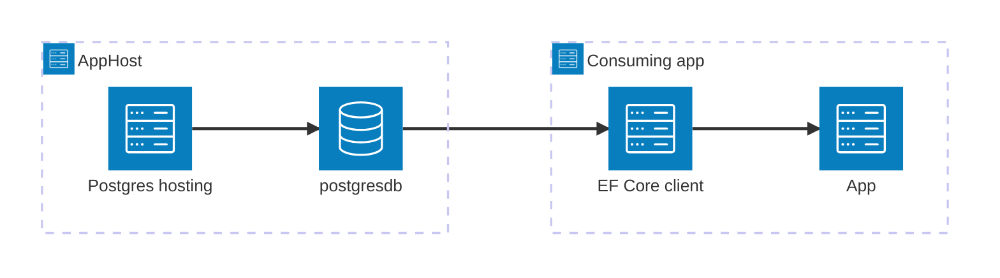

import { Image } from 'astro:assets';
import { LinkButton, Steps } from '@astrojs/starlight/components';
import postgresIcon from '@assets/icons/postgresql-icon.png';

<Image
  src={postgresIcon}
  alt="PostgreSQL logo"
  width={100}
  height={100}
  class:list={'float-inline-left icon'}
  data-zoom-off
/>

[PostgreSQL](https://www.postgresql.org/) is a mature, open-source object-relational database with a strong reputation for reliability, feature richness, and performance. The Aspire PostgreSQL EF Core integration lets .NET apps use [Entity Framework Core](https://learn.microsoft.com/ef/core/) to interact with a PostgreSQL database modeled in your AppHost using the [PostgreSQL Hosting integration](/integrations/databases/postgres/postgres-host/).

## Why use PostgreSQL with EF Core and Aspire

Combining PostgreSQL, EF Core, and Aspire in your solution gives you:

- **Zero-config local development.** Aspire runs PostgreSQL from the [`docker.io/library/postgres`](https://hub.docker.com/_/postgres) container image with credentials generated automatically for you.
- **Strongly-typed data access.** EF Core's `DbContext` maps your C# model classes to PostgreSQL tables, with full LINQ query support and compile-time safety.
- **Automatic dependency injection.** A single `AddNpgsqlDbContext<T>` call registers your `DbContext` subclass in the DI container — no manual connection-string wiring.
- **Built-in health checks.** The integration registers an EF Core `CanConnectAsync` health check so your orchestrator can tell when the database is reachable.
- **OpenTelemetry out of the box.** Logging, distributed tracing, and metrics are wired up automatically for both EF Core and the underlying Npgsql driver.
- **EF migrations support.** Use the standard `dotnet ef migrations` workflow; Aspire handles the runtime connection details.

## How the pieces fit together

The PostgreSQL EF Core integration has two sides: a **hosting integration** used in your AppHost to model the database resource, and an **EF Core client integration** used in each consuming .NET app.

The **hosting integration** lives in your AppHost project and models the PostgreSQL server and databases as resources. The **EF Core client integration** lives in each consuming .NET app and uses the connection information Aspire injects to register a `DbContext` through dependency injection.

Getting there is a two-step process: model PostgreSQL in your AppHost, then connect from your consuming app using EF Core.

<Steps>

1. ### Model PostgreSQL in your AppHost

    Add the PostgreSQL hosting integration to your AppHost, then declare a PostgreSQL server, one or more databases, and reference them from the apps that need to talk to the database. The [PostgreSQL Hosting integration](/integrations/databases/postgres/postgres-host/) reference covers every capability — adding databases, pgAdmin, pgWeb, data volumes, init scripts, and more.

    <LinkButton
        variant='secondary'
        iconPlacement='end'
        icon='right-arrow'
        href='/integrations/databases/postgres/postgres-host/'>
        Set up PostgreSQL in the AppHost
    </LinkButton>

2. ### Connect from your consuming app using EF Core

    Install the `Aspire.Npgsql.EntityFrameworkCore.PostgreSQL` package and call `AddNpgsqlDbContext<T>` to register your `DbContext` subclass. See [Connect to PostgreSQL with EF Core](/integrations/databases/efcore/postgres/postgresql-connect/) for the full reference — connection properties, keyed services, configuration providers, health checks, and telemetry.

    <LinkButton
        variant='secondary'
        iconPlacement='end'
        icon='right-arrow'
        href='/integrations/databases/efcore/postgres/postgresql-connect/'>
        Connect to PostgreSQL with EF Core
    </LinkButton>

</Steps>

## See also

- [Get started with the PostgreSQL integrations](/integrations/databases/postgres/postgres-get-started/)
- [Entity Framework Core overview](https://learn.microsoft.com/ef/core/)
- [EF Core migrations](https://learn.microsoft.com/ef/core/managing-schemas/migrations/)
