import { Image } from 'astro:assets';
import { LinkButton, Steps } from '@astrojs/starlight/components';
import elasticIcon from '@assets/icons/elastic-icon.png';

<Image
  src={elasticIcon}
  alt="Elasticsearch logo"
  width={100}
  height={100}
  class:list={'float-inline-left icon'}
  data-zoom-off
/>

[Elasticsearch](https://www.elastic.co/elasticsearch/) is a distributed, RESTful search and analytics engine, scalable data store, and vector database capable of addressing a growing number of use cases. The Aspire Elasticsearch integration lets you model an Elasticsearch instance as a first-class resource in your AppHost, then hand the connection information to any consuming app — regardless of language.

## Why use Elasticsearch with Aspire

Adding Elasticsearch through Aspire — rather than wiring up containers and connection strings by hand — gives you:

- **Zero-config local development.** Aspire runs Elasticsearch from the [`docker.io/library/elasticsearch`](https://hub.docker.com/_/elasticsearch) container image with credentials generated automatically for you.
- **Consistent connection info across languages.** Once you reference the Elasticsearch resource from a consuming app, Aspire injects the connection URI as an environment variable in a predictable format that works from C#, TypeScript, Python, Go, or any other language.
- **Built-in health checks.** The hosting integration automatically registers a health check so the dashboard and your orchestrator can tell when Elasticsearch is ready.
- **Dashboard observability.** The Elasticsearch resource shows up in the Aspire dashboard with logs, status, and telemetry alongside your other services.
- **A first-class C# client integration.** C# apps can use the `Aspire.Elastic.Clients.Elasticsearch` package for dependency injection, health checks, and OpenTelemetry, all wired up from the same resource name.

## How the pieces fit together

The Elasticsearch integration has two sides: a **hosting integration** that you use in your AppHost to model the Elasticsearch resource, and a **connection story** for consuming apps that reference it.

```mermaid
architecture-beta

  group apphost(server)[AppHost]
  group consumer(server)[Consuming app]

  service hosting(server)[Hosting integration] in apphost
  service elastic(server)[Elasticsearch instance] in apphost

  service client(iconoir:server-connection)[Client integration] in consumer
  service app(server)[App] in consumer

  hosting:R --> L:elastic
  elastic:R --> L:client
  client:R --> L:app
```

The **hosting integration** lives in your AppHost project and models the Elasticsearch instance as a resource. The **client integration** lives in each consuming app and uses the connection information Aspire injects to talk to Elasticsearch.

Getting there is a two-step process: model the Elasticsearch resource in your AppHost, then connect to it from each app that needs it.

<Steps>

1. ### Model Elasticsearch in your AppHost

    Add the Elasticsearch hosting integration to your AppHost, then declare an Elasticsearch resource and reference it from the apps that need to talk to it. The [Elasticsearch Hosting integration](/integrations/databases/elasticsearch/elasticsearch-host/) article walks through every capability — data volumes, data bind mounts, password parameters, and more — with C# examples.

    <LinkButton
        variant='secondary'
        iconPlacement='end'
        icon='right-arrow'
        href='/integrations/databases/elasticsearch/elasticsearch-host/'>
        Set up Elasticsearch in the AppHost
    </LinkButton>

2. ### Connect from your consuming app

    When you reference an Elasticsearch resource from a consuming app, Aspire injects its connection information as environment variables. See [Connect to Elasticsearch](/integrations/databases/elasticsearch/elasticsearch-connect/) for the connection properties reference and per-language examples for C#, Go, Python, and TypeScript — including the full C# client integration.

    <LinkButton
        variant='secondary'
        iconPlacement='end'
        icon='right-arrow'
        href='/integrations/databases/elasticsearch/elasticsearch-connect/'>
        Connect to Elasticsearch
    </LinkButton>

</Steps>
