import { Image } from 'astro:assets';
import { Badge, LinkButton, Steps } from '@astrojs/starlight/components';
import kurrentIcon from '@assets/icons/kurrent-icon.png';

<Badge text="⭐ Community Toolkit" variant="tip" size="large" />

<Image
  src={kurrentIcon}
  alt="KurrentDB logo"
  width={100}
  height={100}
  class:list={'float-inline-left icon'}
  data-zoom-off
/>

[KurrentDB](https://kurrent.io/) is an open-source event-sourcing database (formerly EventStoreDB) purpose-built for storing events as an immutable, append-only log. It delivers high availability and reliability for event-driven and event-sourcing architectures. The Aspire KurrentDB integration lets you model a KurrentDB server as a first-class resource in your AppHost, then hand the connection information to any consuming app — regardless of language.

## Why use KurrentDB with Aspire

Adding KurrentDB through Aspire — rather than wiring up containers and connection strings by hand — gives you:

- **Zero-config local development.** Aspire runs KurrentDB from the [`docker.io/eventstore/eventstore`](https://hub.docker.com/r/eventstore/eventstore) container image with configuration generated automatically for you.
- **Consistent connection info across languages.** Once you reference the KurrentDB resource from a consuming app, Aspire injects connection properties as environment variables in a predictable format that works from C#, TypeScript, Python, Go, or any other language.
- **Built-in health checks.** The hosting integration automatically registers a health check so the dashboard and your orchestrator can tell when KurrentDB is ready.
- **Dashboard observability.** The KurrentDB resource shows up in the Aspire dashboard with logs, status, and telemetry alongside your other services.
- **A first-class C# client integration.** C# apps can use the `CommunityToolkit.Aspire.KurrentDB` package for dependency injection, health checks, and OpenTelemetry, all wired up from the same resource name.

## How the pieces fit together

The KurrentDB integration has two sides: a **hosting integration** that you use in your AppHost to model the KurrentDB resource, and a **connection story** for consuming apps that reference it.

```mermaid
architecture-beta

  group apphost(server)[AppHost]
  group consumer(server)[Consuming app]

  service hosting(server)[Hosting integration] in apphost
  service kurrentdb(database)[KurrentDB server] in apphost

  service client(iconoir:server-connection)[Client integration] in consumer
  service app(server)[App] in consumer

  hosting:R --> L:kurrentdb
  kurrentdb:R --> L:client
  client:R --> L:app
```

The **hosting integration** lives in your AppHost project and models the KurrentDB server as a resource. The **client integration** lives in each consuming app and uses the connection information Aspire injects to talk to KurrentDB.

Getting there is a two-step process: model the KurrentDB resource in your AppHost, then connect to it from each app that needs it.

<Steps>

1. ### Model KurrentDB in your AppHost

    Add the KurrentDB hosting integration to your AppHost, then declare a KurrentDB resource and reference it from the apps that need to store or read events. The [KurrentDB Hosting integration](/integrations/databases/kurrentdb/kurrentdb-host/) article walks through every capability — data volumes, data bind mounts, and health checks — with C# examples.

    <LinkButton
        variant='secondary'
        iconPlacement='end'
        icon='right-arrow'
        href='/integrations/databases/kurrentdb/kurrentdb-host/'>
        Set up KurrentDB in the AppHost
    </LinkButton>

2. ### Connect from your consuming app

    When you reference a KurrentDB resource from a consuming app, Aspire injects its connection information as environment variables. See [Connect to KurrentDB](/integrations/databases/kurrentdb/kurrentdb-connect/) for the connection properties reference and per-language examples for C#, Go, Python, and TypeScript — including the full C# client integration.

    <LinkButton
        variant='secondary'
        iconPlacement='end'
        icon='right-arrow'
        href='/integrations/databases/kurrentdb/kurrentdb-connect/'>
        Connect to KurrentDB
    </LinkButton>

</Steps>

## See also

- [KurrentDB](https://kurrent.io/)
- [KurrentDB .NET Client](https://github.com/kurrent-io/KurrentDB-Client-Dotnet)
- [Aspire Community Toolkit GitHub repo](https://github.com/CommunityToolkit/Aspire)
