import { Image } from 'astro:assets';
import { LinkButton, Steps } from '@astrojs/starlight/components';
import Badge from '@astrojs/starlight/components/Badge.astro';
import meilisearchIcon from '@assets/icons/meilisearch-icon.png';

<Badge text="⭐ Community Toolkit" variant="tip" size="large" />

<Image
  src={meilisearchIcon}
  alt="Meilisearch logo"
  width={100}
  height={100}
  class:list={'float-inline-left icon'}
  data-zoom-off
/>

[Meilisearch](https://www.meilisearch.com/) is a fast, open-source full-text search engine. The Aspire Meilisearch integration lets you model a Meilisearch server as a first-class resource in your AppHost, then hand the connection information to any consuming app — regardless of language.

## Why use Meilisearch with Aspire

Adding Meilisearch through Aspire — rather than wiring up containers and connection strings by hand — gives you:

- **Zero-config local development.** Aspire runs Meilisearch from the [`docker.io/getmeili/meilisearch`](https://hub.docker.com/r/getmeili/meilisearch) container image with a master key generated automatically for you.
- **Consistent connection info across languages.** Once you reference the Meilisearch resource from a consuming app, Aspire injects connection properties as environment variables in a predictable format that works from C#, TypeScript, Python, Go, or any other language.
- **Built-in health checks.** The hosting integration automatically registers a health check so the dashboard and your orchestrator can tell when Meilisearch is ready.
- **Dashboard observability.** The Meilisearch resource shows up in the Aspire dashboard with logs, status, and telemetry alongside your other services.
- **A first-class C# client integration.** C# apps can use the `CommunityToolkit.Aspire.Meilisearch` package for dependency injection and health checks, all wired up from the same resource name.

## How the pieces fit together

The Meilisearch integration has two sides: a **hosting integration** that you use in your AppHost to model the Meilisearch resource, and a **connection story** for consuming apps that reference it.

```mermaid
architecture-beta

  group apphost(server)[AppHost]
  group consumer(server)[Consuming app]

  service hosting(server)[Hosting integration] in apphost
  service meili(server)[Meilisearch server] in apphost

  service client(iconoir:server-connection)[Client integration] in consumer
  service app(server)[App] in consumer

  hosting:R --> L:meili
  meili:R --> L:client
  client:R --> L:app
```

The **hosting integration** lives in your AppHost project and models the Meilisearch server as a resource. The **client integration** lives in each consuming app and uses the connection information Aspire injects to talk to Meilisearch.

Getting there is a two-step process: model the Meilisearch resource in your AppHost, then connect to it from each app that needs it.

<Steps>

1. ### Model Meilisearch in your AppHost

    Add the Meilisearch hosting integration to your AppHost, then declare a Meilisearch resource and reference it from the apps that need search capabilities. The [Meilisearch Hosting integration](/integrations/databases/meilisearch/meilisearch-host/) reference walks through every capability — data volumes, data bind mounts, and master key parameters.

    <LinkButton
        variant='secondary'
        iconPlacement='end'
        icon='right-arrow'
        href='/integrations/databases/meilisearch/meilisearch-host/'>
        Set up Meilisearch in the AppHost
    </LinkButton>

2. ### Connect from your consuming app

    When you reference a Meilisearch resource from a consuming app, Aspire injects its connection information as environment variables. See [Connect to Meilisearch](/integrations/databases/meilisearch/meilisearch-connect/) for the connection properties reference and per-language examples for C#, Go, Python, and TypeScript — including the full C# client integration.

    <LinkButton
        variant='secondary'
        iconPlacement='end'
        icon='right-arrow'
        href='/integrations/databases/meilisearch/meilisearch-connect/'>
        Connect to Meilisearch
    </LinkButton>

</Steps>

## See also

- [Meilisearch documentation](https://www.meilisearch.com/docs)
- [Aspire Community Toolkit GitHub repo](https://github.com/CommunityToolkit/Aspire)
