import { Image } from 'astro:assets';
import { LinkButton, Steps } from '@astrojs/starlight/components';
import milvusIcon from '@assets/icons/milvus-icon.png';

<Image
  src={milvusIcon}
  alt="Milvus logo"
  width={100}
  height={100}
  class:list={'float-inline-left icon'}
  data-zoom-off
/>

[Milvus](https://milvus.io/) is an open-source vector database built for AI and machine learning workloads. It efficiently stores, indexes, and searches large-scale vector embeddings, making it a popular choice for similarity search, recommendation engines, and retrieval-augmented generation (RAG) pipelines. The Aspire Milvus integration lets you model a Milvus server and its databases as first-class resources in your AppHost, then hand the connection information to any consuming app — regardless of language.

## Why use Milvus with Aspire

Adding Milvus through Aspire — rather than wiring up containers and connection strings by hand — gives you:

- **Zero-config local development.** Aspire runs Milvus from the [`milvusdb/milvus`](https://hub.docker.com/r/milvusdb/milvus) container image with credentials generated automatically for you.
- **Consistent connection info across languages.** Once you reference the database from a consuming app, Aspire injects connection properties as environment variables in a predictable format that works from C#, TypeScript, Python, Go, or any other language.
- **Built-in health checks.** The hosting integration automatically registers a health check so the dashboard and your orchestrator can tell when the server is ready.
- **Dashboard observability.** The database resource shows up in the Aspire dashboard with logs, status, and telemetry alongside your other services.
- **A first-class C# client integration.** C# apps can use the `Aspire.Milvus.Client` package for dependency injection and health checks, wired up from the same resource name.
- **Optional Attu admin UI.** Spin up the [Attu](https://zilliz.com/attu) GUI alongside your Milvus server with a single method call in the AppHost.

## How the pieces fit together

The Milvus integration has two sides: a **hosting integration** that you use in your AppHost to model the database resource, and a **connection story** for consuming apps that reference it.

```mermaid
architecture-beta

  group apphost(server)[AppHost]
  group consumer(server)[Consuming app]

  service hosting(server)[Hosting integration] in apphost
  service milvus(server)[Milvus server] in apphost
  service db(database)[milvusdb] in apphost

  service client(iconoir:server-connection)[Client integration] in consumer
  service app(server)[App] in consumer

  hosting:R --> L:milvus
  milvus:R --> L:db
  db:R --> L:client
  client:R --> L:app
```

The **hosting integration** lives in your AppHost project and models the Milvus server and databases as resources. The **client integration** lives in each consuming app and uses the connection information Aspire injects to talk to the database.

Getting there is a two-step process: model the Milvus resources in your AppHost, then connect to the database from each app that needs it.

<Steps>

1. ### Model Milvus in your AppHost

    Add the Milvus hosting integration to your AppHost, then declare a Milvus server, one or more databases, and reference them from the apps that need to talk to the database. The [Milvus Hosting integration](/integrations/databases/milvus/milvus-host/) article walks through every capability — adding databases, Attu GUI, data volumes, API key parameters, and more — with side-by-side C# and TypeScript examples.

    <LinkButton
        variant='secondary'
        iconPlacement='end'
        icon='right-arrow'
        href='/integrations/databases/milvus/milvus-host/'>
        Set up Milvus in the AppHost
    </LinkButton>

2. ### Connect from your consuming app

    When you reference a Milvus database from a consuming app, Aspire injects its connection information as environment variables. See [Connect to Milvus](/integrations/databases/milvus/milvus-connect/) for the connection properties reference and per-language examples for C#, Go, Python, and TypeScript — including the full C# client integration.

    <LinkButton
        variant='secondary'
        iconPlacement='end'
        icon='right-arrow'
        href='/integrations/databases/milvus/milvus-connect/'>
        Connect to Milvus
    </LinkButton>

</Steps>

## See also

- [Milvus documentation](https://milvus.io/docs)
