import { Image } from 'astro:assets';
import { LinkButton, Steps } from '@astrojs/starlight/components';
import mongodbIcon from '@assets/icons/mongodb-icon.png';

<Image
  src={mongodbIcon}
  alt="MongoDB logo"
  width={100}
  height={100}
  class:list={'float-inline-left icon'}
  data-zoom-off
/>

[MongoDB](https://www.mongodb.com/) is a document-oriented NoSQL database that stores data in flexible, JSON-like documents, offering high performance, high availability, and easy horizontal scaling. The Aspire MongoDB integration lets you model a MongoDB server and its databases as first-class resources in your AppHost, then hand the connection information to any consuming app — regardless of language.

## Why use MongoDB with Aspire

Adding MongoDB through Aspire — rather than wiring up containers and connection strings by hand — gives you:

- **Zero-config local development.** Aspire runs MongoDB from the [`docker.io/library/mongo`](https://hub.docker.com/_/mongo) container image with credentials generated automatically for you.
- **Consistent connection info across languages.** Once you reference the database from a consuming app, Aspire injects connection properties as environment variables in a predictable format that works from C#, TypeScript, Python, Go, or any other language.
- **Built-in health checks.** The hosting integration automatically registers a health check so the dashboard and your orchestrator can tell when the server is ready.
- **Dashboard observability.** The database resource shows up in the Aspire dashboard with logs, status, and telemetry alongside your other services.
- **A first-class C# client integration.** C# apps can use the `Aspire.MongoDB.Driver` (or `Aspire.MongoDB.Driver.v3`) package for dependency injection, health checks, and OpenTelemetry, all wired up from the same resource name.
- **MongoDB Express.** Optionally spin up the [Mongo Express](https://github.com/mongo-express/mongo-express) web admin UI alongside your database with a single API call.

## How the pieces fit together

The MongoDB integration has two sides: a **hosting integration** that you use in your AppHost to model the database resource, and a **connection story** for consuming apps that reference it.

```mermaid
architecture-beta

  group apphost(server)[AppHost]
  group consumer(server)[Consuming app]

  service hosting(server)[Hosting integration] in apphost
  service mongo(logos:mongodb)[MongoDB server] in apphost
  service db(database)[mongodbname] in apphost

  service client(iconoir:server-connection)[Client integration] in consumer
  service app(server)[App] in consumer

  hosting:R --> L:mongo
  mongo:R --> L:db
  db:R --> L:client
  client:R --> L:app
```

The **hosting integration** lives in your AppHost project and models the MongoDB server and databases as resources. The **client integration** lives in each C# consuming app and uses the connection information Aspire injects to talk to the database. Apps written in other languages read the same injected environment variables directly.

Getting there is a two-step process: model the MongoDB resources in your AppHost, then connect to the database from each app that needs it.

<Steps>

1. ### Model MongoDB in your AppHost

    Add the MongoDB hosting integration to your AppHost, then declare a MongoDB server, one or more databases, and reference them from the apps that need to talk to the database. The [MongoDB hosting integration](/integrations/databases/mongodb/mongodb-host/) reference walks through every capability — adding databases, Mongo Express, data volumes, init files, custom parameters, and more — with side-by-side C# and TypeScript examples.

    <LinkButton
        variant='secondary'
        iconPlacement='end'
        icon='right-arrow'
        href='/integrations/databases/mongodb/mongodb-host/'>
        Set up MongoDB in the AppHost
    </LinkButton>

2. ### Connect from your consuming app

    When you reference a MongoDB database from a consuming app, Aspire injects its connection information as environment variables. See [Connect to MongoDB](/integrations/databases/mongodb/mongodb-connect/) for the connection properties reference and per-language examples for C#, Go, Python, and TypeScript — including the full C# client integration.

    <LinkButton
        variant='secondary'
        iconPlacement='end'
        icon='right-arrow'
        href='/integrations/databases/mongodb/mongodb-connect/'>
        Connect to MongoDB
    </LinkButton>

</Steps>

## See also

- [MongoDB community extensions](/integrations/databases/mongodb/mongodb-extensions/)
- [Get started with the MongoDB Entity Framework Core integrations](/integrations/databases/efcore/mongodb/mongodb-efcore-get-started/)