---
title: Get started with the MySQL integrations
description: Understand how the Aspire MySQL integrations fit together — model a database resource in your AppHost, then connect to it from any consuming app.
---

import { Image } from 'astro:assets';
import { LinkButton, Steps } from '@astrojs/starlight/components';
import mysqlIcon from '@assets/icons/mysqlconnector-icon.png';

<Image
  src={mysqlIcon}
  alt="MySQL logo"
  width={100}
  height={100}
  class:list={'float-inline-left icon'}
  data-zoom-off
/>

[MySQL](https://www.mysql.com/) is a popular open-source relational database management system widely used in web applications and cloud-native microservices. The Aspire MySQL integration lets you model a MySQL server and its databases as first-class resources in your AppHost, then hand the connection information to any consuming app — regardless of language.

## Why use MySQL with Aspire

Adding MySQL through Aspire — rather than wiring up containers and connection strings by hand — gives you:

- **Zero-config local development.** Aspire runs MySQL from the [`docker.io/library/mysql`](https://hub.docker.com/_/mysql) container image with credentials generated automatically for you.
- **Consistent connection info across languages.** Once you reference the database from a consuming app, Aspire injects connection properties as environment variables in a predictable format that works from C#, TypeScript, Python, Go, or any other language.
- **Built-in health checks.** The hosting integration automatically registers a health check so the dashboard and your orchestrator can tell when the server is ready.
- **Dashboard observability.** The database resource shows up in the Aspire dashboard with logs, status, and telemetry alongside your other services.
- **A first-class C# client integration.** C# apps can use the `Aspire.MySqlConnector` package for dependency injection, health checks, and OpenTelemetry, all wired up from the same resource name. Entity Framework Core (EF Core) users can use the [Pomelo EF Core MySQL integration](/integrations/databases/efcore/mysql/mysql-get-started/) instead.
- **phpMyAdmin on demand.** Call `WithPhpMyAdmin` (or `withPhpMyAdmin`) to spin up a phpMyAdmin instance alongside your database for web-based database management.

## How the pieces fit together

The MySQL integration has two sides: a **hosting integration** that you use in your AppHost to model the database resource, and a **connection story** for consuming apps that reference it.

```mermaid
architecture-beta

  group apphost(server)[AppHost]
  group consumer(server)[Consuming app]

  service hosting(server)[Hosting integration] in apphost
  service mysql(logos:mysql)[MySQL server] in apphost
  service db(database)[mysqldb] in apphost

  service client(iconoir:server-connection)[Client integration] in consumer
  service app(server)[App] in consumer

  hosting:R --> L:mysql
  mysql:R --> L:db
  db:R --> L:client
  client:R --> L:app
```

The **hosting integration** lives in your AppHost project and models the MySQL server and databases as resources. The **client integration** lives in each consuming app and uses the connection information Aspire injects to talk to the database.

Getting there is a two-step process: model the MySQL resources in your AppHost, then connect to the database from each app that needs it.

<Steps>

1. ### Model MySQL in your AppHost

    Add the MySQL hosting integration to your AppHost, then declare a MySQL server, one or more databases, and reference them from the apps that need to talk to the database. The [MySQL Hosting integration](/integrations/databases/mysql/mysql-host/) reference walks through every capability — adding databases, phpMyAdmin, data volumes, init files, custom parameters, and more — with side-by-side C# and TypeScript examples.

    <LinkButton
        variant='secondary'
        iconPlacement='end'
        icon='right-arrow'
        href='/integrations/databases/mysql/mysql-host/'>
        Set up MySQL in the AppHost
    </LinkButton>

2. ### Connect from your consuming app

    When you reference a MySQL database from a consuming app, Aspire injects its connection information as environment variables. See [Connect to MySQL](/integrations/databases/mysql/mysql-connect/) for the connection properties reference and per-language examples for C#, Go, Python, and TypeScript — including the full C# client integration.

    <LinkButton
        variant='secondary'
        iconPlacement='end'
        icon='right-arrow'
        href='/integrations/databases/mysql/mysql-connect/'>
        Connect to MySQL
    </LinkButton>

</Steps>

## See also

- [MySQL community extensions](/integrations/databases/mysql/mysql-extensions/)
- [MySQL Entity Framework Core integration](/integrations/databases/efcore/mysql/mysql-get-started/)