import { Image } from 'astro:assets';
import { LinkButton, Steps } from '@astrojs/starlight/components';
import postgresIcon from '@assets/icons/postgresql-icon.png';

<Image
  src={postgresIcon}
  alt="PostgreSQL logo"
  width={100}
  height={100}
  class:list={'float-inline-left icon'}
  data-zoom-off
/>

[PostgreSQL](https://www.postgresql.org/) is a mature, open-source object-relational database with a strong reputation for reliability, feature richness, and performance. The Aspire PostgreSQL integration lets you model a PostgreSQL server and its databases as first-class resources in your AppHost, then hand the connection information to any consuming app — regardless of language.

## Why use PostgreSQL with Aspire

Adding PostgreSQL through Aspire — rather than wiring up containers and connection strings by hand — gives you:

- **Zero-config local development.** Aspire runs PostgreSQL from the [`docker.io/library/postgres`](https://hub.docker.com/_/postgres) container image with credentials generated automatically for you.
- **Consistent connection info across languages.** Once you reference the database from a consuming app, Aspire injects connection properties as environment variables in a predictable format that works from C#, TypeScript, Python, Go, or any other language.
- **Built-in health checks.** The hosting integration automatically registers a health check so the dashboard and your orchestrator can tell when the server is ready.
- **Dashboard observability.** The database resource shows up in the Aspire dashboard with logs, status, and telemetry alongside your other services.
- **A first-class C# client integration.** C# apps can use the `Aspire.Npgsql` package for dependency injection, health checks, and OpenTelemetry, all wired up from the same resource name.
- **An upgrade path to managed Azure.** The same AppHost model extends to [Azure Database for PostgreSQL](/integrations/cloud/azure/azure-postgresql/azure-postgresql-get-started/) when you're ready to deploy.

## How the pieces fit together

The PostgreSQL integration has two sides: a **hosting integration** that you use in your AppHost to model the database resource, and a **connection story** for consuming apps that reference it.

```mermaid
architecture-beta

  group apphost[AppHost]

  service postgres(logos:postgresql)[PostgreSQL server] in apphost
  service db(database)[postgresdb] in apphost

  service app(server)[Consuming app]

  postgres:R --> L:db
  db:R --> L:app
```

Getting there is a two-step process: model the PostgreSQL resources in your AppHost, then connect to the database from each app that needs it.

<Steps>

1. ### Model PostgreSQL in your AppHost

    Add the PostgreSQL hosting integration to your AppHost, then declare a PostgreSQL server, one or more databases, and reference them from the apps that need to talk to the database. The [PostgreSQL Hosting integration](/integrations/databases/postgres/postgres-host/) reference walks through every capability — adding databases, pgAdmin, pgWeb, data volumes, init scripts, custom parameters, and more — with side-by-side C# and TypeScript examples.

    <LinkButton
        variant='secondary'
        href='/integrations/databases/postgres/postgres-host/'>
        Add PostgreSQL hosting integration
    </LinkButton>

2. ### Connect from your consuming app

    When you reference a PostgreSQL database from a consuming app, Aspire injects its connection information as environment variables. See [Connect to PostgreSQL](/integrations/databases/postgres/postgres-connect/) for the connection properties reference and per-language examples for C#, Go, Python, and TypeScript — including the full C# client integration.

    <LinkButton
        variant='secondary'
        href='/integrations/databases/postgres/postgres-connect/'>
        Connect to PostgreSQL
    </LinkButton>

</Steps>

## See also

- [PostgreSQL community extensions](/integrations/databases/postgres/postgresql-extensions/)
