import { Image } from 'astro:assets';
import { LinkButton, Steps } from '@astrojs/starlight/components';
import qdrantIcon from '@assets/icons/qdrant-icon.svg';

<Image
  src={qdrantIcon}
  alt="Qdrant logo"
  width={100}
  height={100}
  class:list={'float-inline-left icon'}
  data-zoom-off
/>

[Qdrant](https://qdrant.tech/) is an open-source vector database designed for high-performance similarity search and retrieval-augmented generation (RAG) workloads. The Aspire Qdrant integration lets you model a Qdrant server as a first-class resource in your AppHost, then hand the connection information to any consuming app — regardless of language.

## Why use Qdrant with Aspire

Adding Qdrant through Aspire — rather than wiring up containers and connection strings by hand — gives you:

- **Zero-config local development.** Aspire runs Qdrant from the [`qdrant/qdrant`](https://hub.docker.com/r/qdrant/qdrant) container image with a randomly generated API key.
- **Consistent connection info across languages.** Once you reference the Qdrant resource from a consuming app, Aspire injects connection properties as environment variables in a predictable format that works from C#, TypeScript, Python, Go, or any other language.
- **REST and gRPC endpoints.** Qdrant exposes both a REST API (port 6333) and a gRPC API (port 6334). Aspire injects both endpoint properties so consuming apps can choose their preferred protocol.
- **Built-in health checks.** The hosting integration automatically registers a health check so the dashboard and your orchestrator can tell when Qdrant is ready.
- **Dashboard observability.** The Qdrant resource shows up in the Aspire dashboard with logs, status, and telemetry alongside your other services.
- **A first-class C# client integration.** C# apps can use the `Aspire.Qdrant.Client` package for dependency injection, health checks, and OpenTelemetry, all wired up from the same resource name.

## How the pieces fit together

The Qdrant integration has two sides: a **hosting integration** that you use in your AppHost to model the Qdrant resource, and a **connection story** for consuming apps that reference it.

```mermaid
architecture-beta

  group apphost(server)[AppHost]
  group consumer(server)[Consuming app]

  service hosting(server)[Hosting integration] in apphost
  service qdrant(server)[Qdrant server] in apphost

  service client(iconoir:server-connection)[Client integration] in consumer
  service app(server)[App] in consumer

  hosting:R --> L:qdrant
  qdrant:R --> L:client
  client:R --> L:app
```

The **hosting integration** lives in your AppHost project and models the Qdrant server as a resource. The **client integration** lives in each consuming app and uses the connection information Aspire injects to talk to Qdrant.

Getting there is a two-step process: model the Qdrant resource in your AppHost, then connect to it from each app that needs it.

<Steps>

1. ### Model Qdrant in your AppHost

    Add the Qdrant hosting integration to your AppHost, then declare a Qdrant resource and reference it from the apps that need to use the vector database. The [Qdrant Hosting integration](/integrations/databases/qdrant/qdrant-host/) article walks through every capability — API key parameters, data volumes, data bind mounts, and more — with side-by-side C# and TypeScript examples.

    <LinkButton
        variant='secondary'
        iconPlacement='end'
        icon='right-arrow'
        href='/integrations/databases/qdrant/qdrant-host/'>
        Set up Qdrant in the AppHost
    </LinkButton>

2. ### Connect from your consuming app

    When you reference a Qdrant resource from a consuming app, Aspire injects its connection information as environment variables. See [Connect to Qdrant](/integrations/databases/qdrant/qdrant-connect/) for the connection properties reference and per-language examples for C#, Go, Python, and TypeScript — including the full C# client integration.

    <LinkButton
        variant='secondary'
        iconPlacement='end'
        icon='right-arrow'
        href='/integrations/databases/qdrant/qdrant-connect/'>
        Connect to Qdrant
    </LinkButton>

</Steps>

## See also

- [Qdrant documentation](https://qdrant.tech/documentation/)
- [Qdrant .NET client](https://github.com/qdrant/qdrant-dotnet/)
