import { Image } from 'astro:assets';
import { Badge, LinkButton, Steps } from '@astrojs/starlight/components';
import ravendbIcon from '@assets/icons/ravendb-icon.png';

<Badge text="⭐ Community Toolkit" variant="tip" size="large" />

<Image
  src={ravendbIcon}
  alt="RavenDB logo"
  width={100}
  height={100}
  class:list={'float-inline-left icon'}
  data-zoom-off
/>

[RavenDB](https://ravendb.net/) is a high-performance, open-source NoSQL document database designed for fast, efficient, and scalable data storage. It supports ACID transactions, distributed data replication, and time-series data management. The Aspire RavenDB integration lets you model a RavenDB server and its databases as first-class resources in your AppHost, then hand the connection information to any consuming app — regardless of language.

## Why use RavenDB with Aspire

Adding RavenDB through Aspire — rather than wiring up containers and connection strings by hand — gives you:

- **Zero-config local development.** Aspire runs RavenDB from the [`docker.io/ravendb/ravendb`](https://hub.docker.com/r/ravendb/ravendb) container image.
- **Consistent connection info across languages.** Once you reference the database from a consuming app, Aspire injects connection properties as environment variables in a predictable format that works from C#, TypeScript, Python, Go, or any other language.
- **Built-in health checks.** The hosting integration automatically registers a health check so the dashboard and your orchestrator can tell when the server is ready.
- **Dashboard observability.** The database resource shows up in the Aspire dashboard with logs, status, and telemetry alongside your other services.
- **A first-class C# client integration.** C# apps can use the `CommunityToolkit.Aspire.RavenDB.Client` package for dependency injection, health checks, and OpenTelemetry, all wired up from the same resource name.

## How the pieces fit together

The RavenDB integration has two sides: a **hosting integration** that you use in your AppHost to model the database resource, and a **connection story** for consuming apps that reference it.

```mermaid
architecture-beta

  group apphost(server)[AppHost]
  group consumer(server)[Consuming app]

  service hosting(server)[Hosting integration] in apphost
  service ravendb(database)[RavenDB server] in apphost
  service db(database)[ravendb] in apphost

  service client(iconoir:server-connection)[Client integration] in consumer
  service app(server)[App] in consumer

  hosting:R --> L:ravendb
  ravendb:R --> L:db
  db:R --> L:client
  client:R --> L:app
```

The **hosting integration** lives in your AppHost project and models the RavenDB server and databases as resources. The **client integration** lives in each consuming app and uses the connection information Aspire injects to talk to the database.

Getting there is a two-step process: model the RavenDB resources in your AppHost, then connect to the database from each app that needs it.

<Steps>

1. ### Model RavenDB in your AppHost

    Add the RavenDB hosting integration to your AppHost, then declare a RavenDB server, one or more databases, and reference them from the apps that need to talk to the database. The [RavenDB Hosting integration](/integrations/databases/ravendb/ravendb-host/) reference walks through every capability — adding databases, data volumes, data bind mounts, secured instances, and more.

    <LinkButton
        variant='secondary'
        iconPlacement='end'
        icon='right-arrow'
        href='/integrations/databases/ravendb/ravendb-host/'>
        Set up RavenDB in the AppHost
    </LinkButton>

2. ### Connect from your consuming app

    When you reference a RavenDB database from a consuming app, Aspire injects its connection information as environment variables. See [Connect to RavenDB](/integrations/databases/ravendb/ravendb-connect/) for the connection properties reference and per-language examples for C#, Go, Python, and TypeScript — including the full C# client integration.

    <LinkButton
        variant='secondary'
        iconPlacement='end'
        icon='right-arrow'
        href='/integrations/databases/ravendb/ravendb-connect/'>
        Connect to RavenDB
    </LinkButton>

</Steps>

## See also

- [RavenDB](https://ravendb.net/)
- [RavenDB Dockerfile guide](https://docs.ravendb.net/6.2/start/containers/dockerfile/guide/)
- [Aspire Community Toolkit GitHub repo](https://github.com/CommunityToolkit/Aspire)
