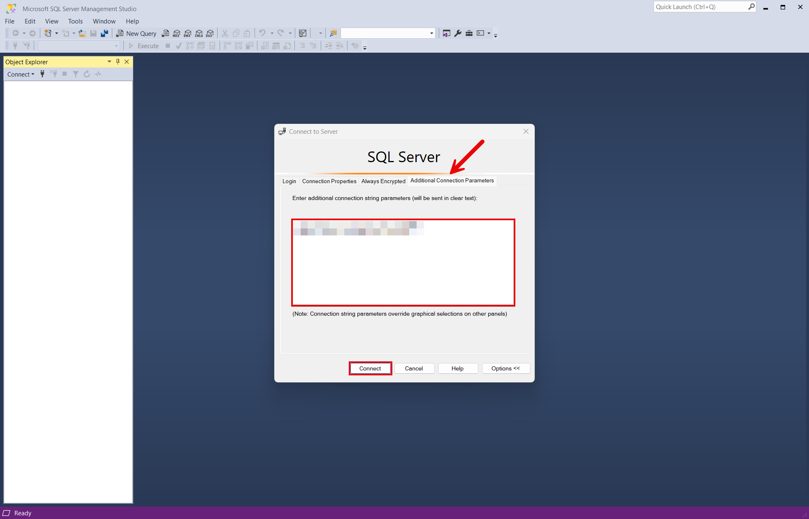
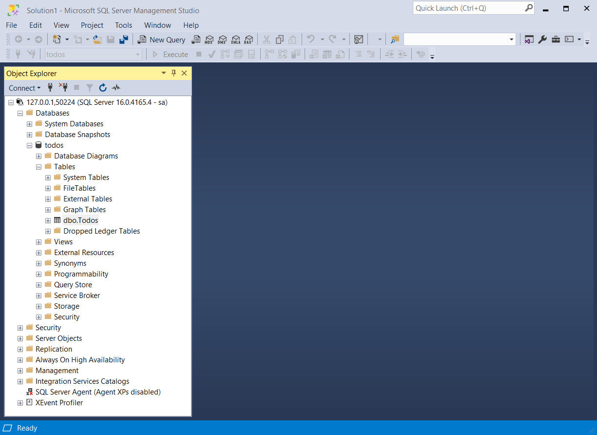
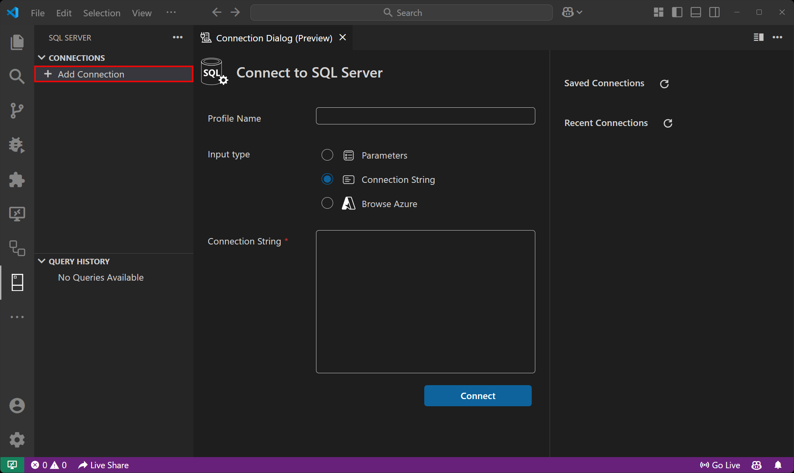
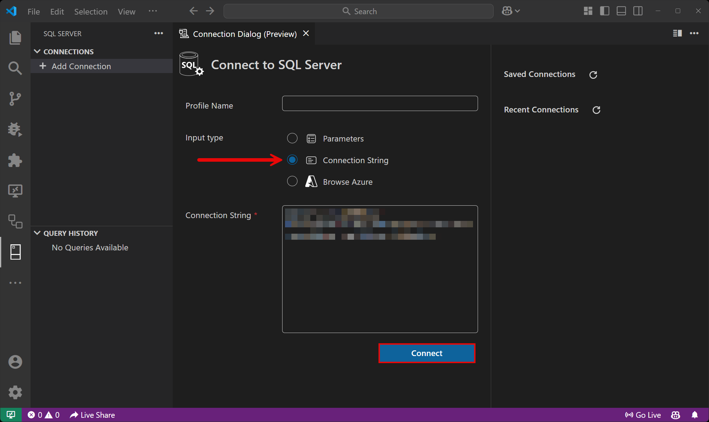
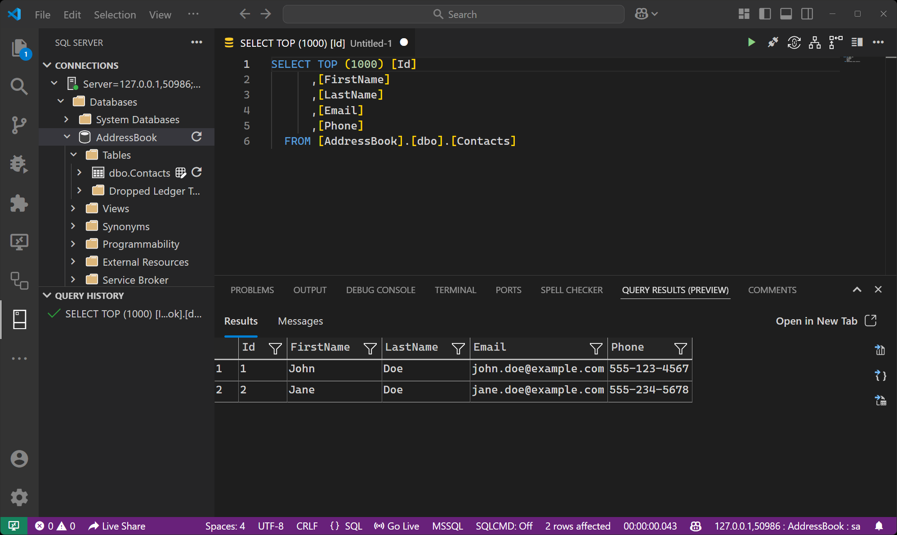

import { Image } from 'astro:assets';
import { Aside, Steps, Tabs, TabItem } from '@astrojs/starlight/components';
import LearnMore from '@components/LearnMore.astro';
import sqlIcon from '@assets/icons/sql-icon.png';

<Image
  src={sqlIcon}
  alt="SQL Server logo"
  width={100}
  height={100}
  class:list={'float-inline-left icon'}
  data-zoom-off
/>

This article is the reference for the Aspire SQL Server Hosting integration. It enumerates the AppHost APIs — with examples for both `AppHost.cs` and `apphost.ts` — that you use to model a SQL Server instance and database resources in your [`AppHost`](/get-started/app-host/) project.

If you're new to the SQL Server integration, start with the [Get started with SQL Server integrations](/integrations/databases/sql-server/sql-server-get-started/) guide. For how consuming apps read the connection information this page exposes, see [Connect to SQL Server](../sql-server-connect/). For the SQL Server Entity Framework Core (EF Core) client integration, see [Get started with the SQL Server EF Core integrations](/integrations/databases/efcore/sql-server/sql-server-get-started/).

## Installation

To start building an Aspire app that uses SQL Server, install the [📦 Aspire.Hosting.SqlServer](https://www.nuget.org/packages/Aspire.Hosting.SqlServer) NuGet package:

<Tabs syncKey="aspire-lang">
<TabItem id="csharp" label="C#">

```bash title="Terminal"
aspire add sql-server
```

<LearnMore>
  Learn more about [`aspire add`](/reference/cli/commands/aspire-add/) in the command reference.
</LearnMore>

Or, choose a manual installation approach:

```csharp title="C# — AppHost.cs"
#:package Aspire.Hosting.SqlServer@*
```

```xml title="XML — AppHost.csproj"
<PackageReference Include="Aspire.Hosting.SqlServer" Version="*" />
```

</TabItem>
<TabItem id="typescript" label="TypeScript">

```bash title="Terminal"
aspire add sql-server
```

<LearnMore>
  Learn more about [`aspire add`](/reference/cli/commands/aspire-add/) in the command reference.
</LearnMore>

This updates your `aspire.config.json` with the SQL Server hosting integration package:

```json title="aspire.config.json" ins={3}
{
  "packages": {
    "Aspire.Hosting.SqlServer": "13.3.0"
  }
}
```

</TabItem>
</Tabs>

## Add SQL Server resource

Once you've installed the hosting integration in your AppHost project, you can add a SQL Server resource and then add a database resource as shown in the following examples:

<Tabs syncKey="aspire-lang">
<TabItem id="csharp" label="C#">
```csharp title="C# — AppHost.cs"
var builder = DistributedApplication.CreateBuilder(args);

var sql = builder.AddSqlServer("sql")
    .WithLifetime(ContainerLifetime.Persistent);

var db = sql.AddDatabase("database");

var exampleProject = builder.AddProject<Projects.ExampleProject>("exampleproject")
    .WithReference(db)
    .WaitFor(db);

// After adding all resources, run the app...
builder.Build().Run();
```
</TabItem>
<TabItem id="typescript" label="TypeScript">
```typescript title="TypeScript — apphost.ts"
import { createBuilder, ContainerLifetime } from './.modules/aspire.js';

const builder = await createBuilder();

const sql = await builder.addSqlServer("sql");
await sql.withLifetime(ContainerLifetime.Persistent);

const db = await sql.addDatabase("database");

await builder.addNodeApp("api", "./api", "index.js")
    .withReference(db)
    .waitFor(db);

// After adding all resources, run the app...
await builder.build().run();
```
</TabItem>
</Tabs>

<Steps>

1. When Aspire adds a container image to the AppHost, as shown in the preceding example with the `mcr.microsoft.com/mssql/server` image, it creates a new SQL Server instance on your local machine. A reference to the `database` resource is then used to add a dependency to the consuming project.

1. When adding a database resource to the app model, the database is created if it doesn't already exist. The creation of the database relies on the AppHost eventing APIs, specifically `ResourceReadyEvent`. In other words, when the `sql` resource is _ready_, the event is raised and the database resource is created.

1. The SQL Server resource includes default credentials with a `username` of `sa` and a randomly generated `password` using the `CreateDefaultPasswordParameter` method. The password is stored in the AppHost's secret store as `sql-password`.

1. The AppHost reference call configures a connection in the consuming project named after the referenced database resource, such as `database` in the preceding example.

</Steps>

<Aside type="note">
    The SQL Server container is slow to start, so it's best to use a _persistent_ lifetime to avoid unnecessary restarts. For more information, see [Container resource lifetime](/architecture/resource-model/#built-in-resources-and-lifecycle).
</Aside>

<Aside type="note">
    When you reference a SQL Server resource from the AppHost, Aspire makes several properties available to the consuming project, such as connection URIs, hostnames, and port numbers. For a complete list of these properties and per-language connection examples, see [Connect to SQL Server](../sql-server-connect/).
</Aside>

## Add SQL Server resource with database creation script

By default, when you add a `SqlServerDatabaseResource`, it relies on the following SQL script to create the database:

```sql title="SQL — Default database creation script"
IF (NOT EXISTS (SELECT 1 FROM sys.databases WHERE name = @DatabaseName))
    CREATE DATABASE [<QUOTED_DATABASE_NAME>];
```

To supply a custom creation script, call `WithCreationScript` (or `withCreationScript`) on the database resource builder:

<Tabs syncKey="aspire-lang">
<TabItem id="csharp" label="C#">
```csharp title="C# — AppHost.cs"
var builder = DistributedApplication.CreateBuilder(args);

var sql = builder.AddSqlServer("sql")
    .WithLifetime(ContainerLifetime.Persistent);

var databaseName = "app-db";
var creationScript = $$"""
    IF DB_ID('{{databaseName}}') IS NULL
        CREATE DATABASE [{{databaseName}}];
    GO

    USE [{{databaseName}}];
    GO

    CREATE TABLE todos (
        id INT PRIMARY KEY IDENTITY(1,1),
        title VARCHAR(255) NOT NULL,
        description TEXT,
        is_completed BIT DEFAULT 0,
        due_date DATE,
        created_at DATETIME DEFAULT GETDATE()
    );
    GO
    """;

var db = sql.AddDatabase(databaseName)
    .WithCreationScript(creationScript);

var exampleProject = builder.AddProject<Projects.ExampleProject>("exampleproject")
    .WithReference(db)
    .WaitFor(db);

// After adding all resources, run the app...
builder.Build().Run();
```
</TabItem>
<TabItem id="typescript" label="TypeScript">
```typescript title="TypeScript — apphost.ts"
import { createBuilder, ContainerLifetime } from './.modules/aspire.js';

const builder = await createBuilder();

const sql = await builder.addSqlServer("sql");
await sql.withLifetime(ContainerLifetime.Persistent);

const databaseName = "app-db";
const creationScript = `
IF DB_ID('${databaseName}') IS NULL
    CREATE DATABASE [${databaseName}];

USE [${databaseName}];

CREATE TABLE todos (
    id INT PRIMARY KEY IDENTITY(1,1),
    title VARCHAR(255) NOT NULL,
    description TEXT,
    is_completed BIT DEFAULT 0,
    due_date DATE,
    created_at DATETIME DEFAULT GETDATE()
);
`;

const db = await sql.addDatabase(databaseName);
await db.withCreationScript(creationScript);

await builder.addNodeApp("api", "./api", "index.js")
    .withReference(db)
    .waitFor(db);

// After adding all resources, run the app...
await builder.build().run();
```
</TabItem>
</Tabs>

The preceding example creates a database named `app-db` with a single `todos` table. The script is executed when the database resource is created in the context of the SQL Server resource.

## Add SQL Server resource with data volume

Add a data volume to the SQL Server resource as shown in the following examples:

<Tabs syncKey="aspire-lang">
<TabItem id="csharp" label="C#">
```csharp title="C# — AppHost.cs"
var builder = DistributedApplication.CreateBuilder(args);

var sql = builder.AddSqlServer("sql")
    .WithDataVolume();

var db = sql.AddDatabase("database");

var exampleProject = builder.AddProject<Projects.ExampleProject>("exampleproject")
    .WithReference(db)
    .WaitFor(db);

// After adding all resources, run the app...
builder.Build().Run();
```
</TabItem>
<TabItem id="typescript" label="TypeScript">
```typescript title="TypeScript — apphost.ts"
import { createBuilder } from './.modules/aspire.js';

const builder = await createBuilder();

const sql = await builder.addSqlServer("sql");
await sql.withDataVolume();

const db = await sql.addDatabase("database");

await builder.addNodeApp("api", "./api", "index.js")
    .withReference(db)
    .waitFor(db);

// After adding all resources, run the app...
await builder.build().run();
```
</TabItem>
</Tabs>

The data volume is used to persist the SQL Server data outside the lifecycle of its container. The data volume is mounted at the `/var/opt/mssql` path in the SQL Server container and when a `name` parameter isn't provided, the name is generated at random. For more information on data volumes and details on why they're preferred over [bind mounts](#add-sql-server-resource-with-data-bind-mount), see [Docker docs: Volumes](https://docs.docker.com/engine/storage/volumes).

<Aside type="caution">
The password is stored in the data volume. When using a data volume and if the password changes, it will not work until you delete the volume.
</Aside>

## Add SQL Server resource with data bind mount

Add a data bind mount to the SQL Server resource as shown in the following examples:

<Tabs syncKey="aspire-lang">
<TabItem id="csharp" label="C#">
```csharp title="C# — AppHost.cs"
var builder = DistributedApplication.CreateBuilder(args);

var sql = builder.AddSqlServer("sql")
    .WithDataBindMount(source: @"C:\SqlServer\Data");

var db = sql.AddDatabase("database");

var exampleProject = builder.AddProject<Projects.ExampleProject>("exampleproject")
    .WithReference(db)
    .WaitFor(db);

// After adding all resources, run the app...
builder.Build().Run();
```
</TabItem>
<TabItem id="typescript" label="TypeScript">
```typescript title="TypeScript — apphost.ts"
import { createBuilder } from './.modules/aspire.js';

const builder = await createBuilder();

const sql = await builder.addSqlServer("sql");
await sql.withDataBindMount("C:\\SqlServer\\Data");

const db = await sql.addDatabase("database");

await builder.addNodeApp("api", "./api", "index.js")
    .withReference(db)
    .waitFor(db);

// After adding all resources, run the app...
await builder.build().run();
```
</TabItem>
</Tabs>

<Aside type="note">
    Data [bind mounts](https://docs.docker.com/engine/storage/bind-mounts/) have limited functionality compared to [volumes](https://docs.docker.com/engine/storage/volumes/), which offer better performance, portability, and security, making them more suitable for production environments. However, bind mounts allow direct access and modification of files on the host system, ideal for development and testing where real-time changes are needed.
</Aside>

Data bind mounts rely on the host machine's filesystem to persist the SQL Server data across container restarts. The data bind mount is mounted at the `C:\SqlServer\Data` on Windows (or `/SqlServer/Data` on Unix) path on the host machine in the SQL Server container. For more information on data bind mounts, see [Docker docs: Bind mounts](https://docs.docker.com/engine/storage/bind-mounts).

## Add SQL Server resource with parameters

When you want to explicitly provide the password used by the container image, you can provide it as a parameter:

<Tabs syncKey="aspire-lang">
<TabItem id="csharp" label="C#">
```csharp title="C# — AppHost.cs"
var builder = DistributedApplication.CreateBuilder(args);

var password = builder.AddParameter("password", secret: true);

var sql = builder.AddSqlServer("sql", password);
var db = sql.AddDatabase("database");

var exampleProject = builder.AddProject<Projects.ExampleProject>("exampleproject")
    .WithReference(db)
    .WaitFor(db);

// After adding all resources, run the app...
builder.Build().Run();
```
</TabItem>
<TabItem id="typescript" label="TypeScript">
```typescript title="TypeScript — apphost.ts"
import { createBuilder } from './.modules/aspire.js';

const builder = await createBuilder();

const password = await builder.addParameter("password", { secret: true });

const sql = await builder.addSqlServer("sql", { password });
const db = await sql.addDatabase("database");

await builder.addNodeApp("api", "./api", "index.js")
    .withReference(db)
    .waitFor(db);

// After adding all resources, run the app...
await builder.build().run();
```
</TabItem>
</Tabs>

When no `password` parameter is provided, Aspire generates a strong password automatically using the `CreateDefaultPasswordParameter` method. For more information on providing parameters, see [External parameters](/get-started/resources/).

## Use a specific SQL Server container image tag

To pin the SQL Server container to a specific release, call `WithImageTag` (or `withImageTag`):

<Tabs syncKey="aspire-lang">
<TabItem id="csharp" label="C#">
```csharp title="C# — AppHost.cs"
var builder = DistributedApplication.CreateBuilder(args);

var sql = builder.AddSqlServer("sql")
    .WithImageTag("2025-RTM-ubuntu-24.04-preview");

var db = sql.AddDatabase("database");

var exampleProject = builder.AddProject<Projects.ExampleProject>("exampleproject")
    .WithReference(db)
    .WaitFor(db);

// After adding all resources, run the app...
builder.Build().Run();
```
</TabItem>
<TabItem id="typescript" label="TypeScript">
```typescript title="TypeScript — apphost.ts"
import { createBuilder } from './.modules/aspire.js';

const builder = await createBuilder();

const sql = await builder.addSqlServer("sql");
await sql.withImageTag("2025-RTM-ubuntu-24.04-preview");

const db = await sql.addDatabase("database");

await builder.addNodeApp("api", "./api", "index.js")
    .withReference(db)
    .waitFor(db);

// After adding all resources, run the app...
await builder.build().run();
```
</TabItem>
</Tabs>

For a list of available tags, see [SQL Server container image tags](https://mcr.microsoft.com/en-us/artifact/mar/mssql/server/tags).

## Pass custom environment variables

By default, Aspire injects the SQL Server connection information using variable names derived from the resource name (for example, `DATABASE_URI`, `DATABASE_HOST`, `DATABASE_PORT`). If your consuming app expects a different set of environment variable names, pass individual connection properties from the AppHost:

<Tabs syncKey="aspire-lang">
<TabItem id="csharp" label="C#">
```csharp title="C# — AppHost.cs"
var builder = DistributedApplication.CreateBuilder(args);

var sql = builder.AddSqlServer("sql");
var database = sql.AddDatabase("database");

var app = builder.AddExecutable("my-app", "node", "app.js", ".")
    .WithReference(database)
    .WithEnvironment(context =>
    {
        context.EnvironmentVariables["SQL_HOST"] = sql.Resource.PrimaryEndpoint.Property(EndpointProperty.Host);
        context.EnvironmentVariables["SQL_PORT"] = sql.Resource.PrimaryEndpoint.Property(EndpointProperty.Port);
        context.EnvironmentVariables["SQL_PASSWORD"] = sql.Resource.PasswordParameter;
        context.EnvironmentVariables["SQL_DATABASE"] = database.Resource.DatabaseName;
    });

builder.Build().Run();
```
</TabItem>
<TabItem id="typescript" label="TypeScript">
```typescript title="TypeScript — apphost.ts"
import { createBuilder } from './.modules/aspire.js';

const builder = await createBuilder();

const sql = await builder.addSqlServer("sql");
const database = await sql.addDatabase("database");

await builder.addNodeApp("my-app", "./app", "index.js")
    .withReference(database)
    .withEnvironment("SQL_HOST", await sql.host())
    .withEnvironment("SQL_PORT", await sql.port())
    .withEnvironment("SQL_PASSWORD", await sql.passwordParameter.get())
    .withEnvironment("SQL_DATABASE", "database");

await builder.build().run();
```
</TabItem>
</Tabs>

## Connect to an existing SQL Server instance

To reference an externally managed SQL Server instance instead of running one as a container, use `AddConnectionString`:

<Tabs syncKey="aspire-lang">
<TabItem id="csharp" label="C#">
```csharp title="C# — AppHost.cs"
var builder = DistributedApplication.CreateBuilder(args);

var sql = builder.AddConnectionString("sql");

var exampleProject = builder.AddProject<Projects.ExampleProject>("exampleproject")
    .WithReference(sql);

// After adding all resources, run the app...
builder.Build().Run();
```
</TabItem>
<TabItem id="typescript" label="TypeScript">
```typescript title="TypeScript — apphost.ts"
import { createBuilder } from './.modules/aspire.js';

const builder = await createBuilder();

const sql = await builder.addConnectionString("sql");

await builder.addNodeApp("api", "./api", "index.js")
    .withReference(sql);

// After adding all resources, run the app...
await builder.build().run();
```
</TabItem>
</Tabs>

The connection string is resolved from the `ConnectionStrings` configuration section of the AppHost project:

```json title="JSON — appsettings.json"
{
  "ConnectionStrings": {
    "sql": "Server=myserver;Database=mydb;User Id=sa;Password=mypassword;"
  }
}
```

For more information, see [Reference existing resources](/get-started/resources/).

## Connect to database resources

When the AppHost runs, the server's database resources can be accessed from external tools, such as [SQL Server Management Studio (SSMS)](https://learn.microsoft.com/sql/ssms/download-sql-server-management-studio-ssms) or [MSSQL for Visual Studio Code](https://learn.microsoft.com/sql/tools/visual-studio-code-extensions/mssql/mssql-extension-visual-studio-code). The connection string for the database resource is available in the dependent resources environment variables and is accessed using the [Aspire dashboard: Resource details](/dashboard/explore/#resource-details) pane. The environment variable is named `ConnectionStrings__{name}` where `{name}` is the name of the database resource, in this example it's `database`. Use the connection string to connect to the database resource from external tools.

<Tabs>
    <TabItem label="SQL Server Management Studio" id="ssms">
        To connect to the database resource from SQL Server Management Studio, follow these steps:
        <Steps>
        1. Open SSMS.
        1. In the **Connect to Server** dialog, select the **Additional Connection Parameters** tab.
        1. Paste the connection string into the **Additional Connection Parameters** field and select **Connect**.

            

        1. If you're connected, you can see the database resource in the **Object Explorer**:

            

        </Steps>
        <LearnMore>
            For more information, see [SQL Server Management Studio: Connect to a server](https://learn.microsoft.com/sql/ssms/quickstarts/ssms-connect-query-sql-server).
        </LearnMore>
    </TabItem>
    <TabItem label="MSSQL for Visual Studio Code" id="mssql-vscode">
        To connect to the database resource from MSSQL for Visual Studio Code, follow these steps:

        <Steps>
        1. Open the **SQL SERVER** extension.
        1. Select the **Add Connection** option under **CONNECTIONS**.

            

        1. Change the **Input type** to **Connection string** and paste the connection string into the **Connection string** field.
        1. Select **Connect**.

            

        1. Once you're connected, you can see the database resource in the active tab and run queries against it:

            
        </Steps>
        <LearnMore>
            For more information, see [MSSQL for Visual Studio Code](https://learn.microsoft.com/sql/tools/visual-studio-code-extensions/mssql/mssql-extension-visual-studio-code).
        </LearnMore>
    </TabItem>
</Tabs>

## Connection properties

For the full reference of SQL Server connection properties — and how consuming apps in C#, TypeScript, Python, and Go read them — see [Connect to SQL Server](../sql-server-connect/).

## Hosting integration health checks

The SQL Server hosting integration automatically adds a health check for the SQL Server resource. The health check verifies that the SQL Server instance is running and that a connection can be established to it.

The hosting integration relies on the [📦 AspNetCore.HealthChecks.SqlServer](https://www.nuget.org/packages/AspNetCore.HealthChecks.SqlServer) NuGet package.
