import { Image } from 'astro:assets';
import { Badge, LinkButton, Steps } from '@astrojs/starlight/components';
import sqliteIcon from '@assets/icons/sqlite-icon.png';

<Badge text="⭐ Community Toolkit" variant="tip" size="large" />

<Image
  src={sqliteIcon}
  alt="SQLite logo"
  width={100}
  height={100}
  class:list={'float-inline-left icon'}
  data-zoom-off
/>

[SQLite](https://www.sqlite.org/) is a lightweight, serverless, self-contained SQL database engine. It stores the entire database as a single file on disk — no separate server process to run or configure. The Aspire SQLite integration (from the [.NET Aspire Community Toolkit](https://github.com/CommunityToolkit/Aspire)) lets you model a SQLite database as a first-class resource in your AppHost, then hand the file-path connection information to any consuming app — regardless of language.

## Why use SQLite with Aspire

Adding SQLite through Aspire — rather than hardcoding file paths and connection strings — gives you:

- **Ideal for local development, unit tests, and desktop apps.** No container to spin up, no server to configure — SQLite runs in-process directly from a single file on disk.
- **Consistent connection info across languages.** Once you reference the SQLite resource from a consuming app, Aspire injects the database file path as an environment variable in a predictable format that works from C#, TypeScript, Python, Go, or any other language.
- **Optional browser-based UI.** The `WithSqliteWeb` method adds a lightweight [`sqlite-web`](https://github.com/coleifer/sqlite-web) container alongside your database so you can inspect and query it during development.
- **A first-class C# client integration.** C# apps can use the `CommunityToolkit.Aspire.Microsoft.Data.Sqlite` package for dependency injection, health checks, and OpenTelemetry, all wired up from the same resource name.

## How the pieces fit together

The SQLite integration has two sides: a **hosting integration** that you use in your AppHost to model the database resource, and a **connection story** for consuming apps that reference it.

```mermaid
architecture-beta

  group apphost(server)[AppHost]
  group consumer(server)[Consuming app]

  service hosting(server)[Hosting integration] in apphost
  service db(database)[SQLite file] in apphost

  service client(iconoir:server-connection)[Client integration] in consumer
  service app(server)[App] in consumer

  hosting:R --> L:db
  db:R --> L:client
  client:R --> L:app
```

The **hosting integration** lives in your AppHost project and models the SQLite database file as a resource. Because SQLite is an embedded, file-based database, there is no container to start — Aspire simply tracks the database file path and injects it into consuming apps as environment variables.

import { Aside } from '@astrojs/starlight/components';

<Aside type="note">
  The SQLite hosting integration is C#-only. The TypeScript AppHost does not have an `addSqlite` API. To reference a SQLite file from a TypeScript AppHost, use `builder.addConnectionString(...)` with a parameter instead.
</Aside>

Getting there is a two-step process: model the SQLite resource in your AppHost, then connect to the database from each app that needs it.

<Steps>

1. ### Model SQLite in your AppHost

    Add the SQLite hosting integration to your AppHost, then declare a SQLite database resource and reference it from the apps that need to use the database. The [SQLite Hosting integration](/integrations/databases/sqlite/sqlite-host/) article walks through every capability — custom database file paths, the SQLiteWeb UI, SQLite extensions, and more.

    <LinkButton
        variant='secondary'
        iconPlacement='end'
        icon='right-arrow'
        href='/integrations/databases/sqlite/sqlite-host/'>
        Set up SQLite in the AppHost
    </LinkButton>

2. ### Connect from your consuming app

    When you reference a SQLite resource from a consuming app, Aspire injects its database file path as an environment variable. See [Connect to SQLite](/integrations/databases/sqlite/sqlite-connect/) for the connection properties reference and per-language examples for C#, Go, Python, and TypeScript — including the full C# client integration.

    <LinkButton
        variant='secondary'
        iconPlacement='end'
        icon='right-arrow'
        href='/integrations/databases/sqlite/sqlite-connect/'>
        Connect to SQLite
    </LinkButton>

</Steps>
