import { Image } from 'astro:assets';
import { Badge, LinkButton, Steps } from '@astrojs/starlight/components';
import surrealdbIcon from '@assets/icons/surrealdb-icon.png';

<Badge text="⭐ Community Toolkit" variant="tip" size="large" />

<Image
  src={surrealdbIcon}
  alt="SurrealDB logo"
  width={100}
  height={100}
  class:list={'float-inline-left icon'}
  data-zoom-off
/>

[SurrealDB](https://surrealdb.com/) is a native, open-source, multi-model database that lets you store and manage data across relational, document, graph, time-series, vector & search, and geospatial models — all in one place. The Aspire SurrealDB integration lets you model a SurrealDB server, namespace, and database as first-class resources in your AppHost, then hand the connection information to any consuming app — regardless of language.

## Why use SurrealDB with Aspire

Adding SurrealDB through Aspire — rather than wiring up containers and connection strings by hand — gives you:

- **Zero-config local development.** Aspire runs SurrealDB from the [`docker.io/surrealdb/surrealdb`](https://hub.docker.com/r/surrealdb/surrealdb) container image with credentials generated automatically for you.
- **Consistent connection info across languages.** Once you reference the database from a consuming app, Aspire injects connection properties as environment variables in a predictable format that works from C#, TypeScript, Python, Go, or any other language.
- **Built-in health checks.** The hosting integration automatically registers a health check so the dashboard and your orchestrator can tell when SurrealDB is ready.
- **Dashboard observability.** The SurrealDB resource shows up in the Aspire dashboard with logs, status, and telemetry alongside your other services.
- **A first-class C# client integration.** C# apps can use the `CommunityToolkit.Aspire.SurrealDb` package for dependency injection, health checks, and OpenTelemetry, all wired up from the same resource name.

## How the pieces fit together

The SurrealDB integration has two sides: a **hosting integration** that you use in your AppHost to model the database resources, and a **connection story** for consuming apps that reference them.

```mermaid
architecture-beta

  group apphost(server)[AppHost]
  group consumer(server)[Consuming app]

  service hosting(server)[Hosting integration] in apphost
  service surreal(database)[SurrealDB server] in apphost
  service db(database)[surrealdb] in apphost

  service client(iconoir:server-connection)[Client integration] in consumer
  service app(server)[App] in consumer

  hosting:R --> L:surreal
  surreal:R --> L:db
  db:R --> L:client
  client:R --> L:app
```

The **hosting integration** lives in your AppHost project and models the SurrealDB server, namespace, and database as resources. The **client integration** lives in each consuming app and uses the connection information Aspire injects to talk to the database.

Getting there is a two-step process: model the SurrealDB resources in your AppHost, then connect from each app that needs it.

<Steps>

1. ### Model SurrealDB in your AppHost

    Add the SurrealDB hosting integration to your AppHost, then declare a SurrealDB server, namespace, and database, and reference them from the apps that need it. The [SurrealDB Hosting integration](/integrations/databases/surrealdb/surrealdb-host/) article walks through every capability — adding Surrealist, data bind mounts, log levels, and custom parameters — with C# examples.

    <LinkButton
        variant='secondary'
        iconPlacement='end'
        icon='right-arrow'
        href='/integrations/databases/surrealdb/surrealdb-host/'>
        Set up SurrealDB in the AppHost
    </LinkButton>

2. ### Connect from your consuming app

    When you reference a SurrealDB resource from a consuming app, Aspire injects its connection information as environment variables. See [Connect to SurrealDB](/integrations/databases/surrealdb/surrealdb-connect/) for the connection properties reference and per-language examples for C#, Go, Python, and TypeScript — including the full C# client integration.

    <LinkButton
        variant='secondary'
        iconPlacement='end'
        icon='right-arrow'
        href='/integrations/databases/surrealdb/surrealdb-connect/'>
        Connect to SurrealDB
    </LinkButton>

</Steps>

## See also

- [SurrealDB](https://surrealdb.com/)
- [SurrealDB documentation](https://surrealdb.com/docs/surrealdb)
- [.NET SDK for SurrealDB](https://github.com/surrealdb/surrealdb.net)
- [Aspire Community Toolkit GitHub repo](https://github.com/CommunityToolkit/Aspire)
