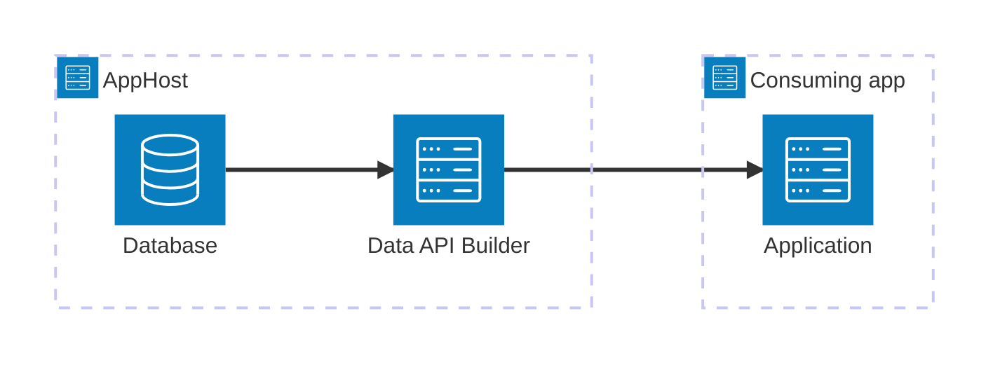

import { Image } from 'astro:assets';
import { Badge, LinkButton, Steps } from '@astrojs/starlight/components';
import dabIcon from '@assets/icons/data-api-builder-icon.png';

<Badge text="⭐ Community Toolkit" variant="tip" size="large" />

<Image
  src={dabIcon}
  alt="Data API Builder logo"
  width={100}
  height={100}
  class:list={'float-inline-left icon'}
  data-zoom-off
/>

[Data API Builder](https://learn.microsoft.com/azure/data-api-builder/overview) (DAB) generates REST and GraphQL endpoints from a database schema and a declarative configuration file. The Aspire hosting integration runs DAB as a container, passes database connections to it, and exposes its HTTP endpoint to consuming apps.

## Why use Data API Builder with Aspire

- **One application model.** Model DAB, its databases, and its consuming apps in the same AppHost.
- **Configuration-file mounting.** Aspire mounts one or more DAB configuration files into the container.
- **Database reference injection.** Referenced database resources provide the connection strings that DAB reads from its configuration.
- **Service discovery.** Consuming apps can resolve the DAB HTTP endpoint by resource name or read its endpoint environment variable.
- **Language-neutral APIs.** C#, TypeScript, Python, and Go apps can use any standard HTTP or GraphQL client.

## How the pieces fit together

<Steps>

1. ### Model Data API Builder in the AppHost

   Add the hosting integration, provide a DAB configuration file, and reference each database that the API exposes.

   <LinkButton
     variant="secondary"
     iconPlacement="end"
     icon="right-arrow"
     href="/integrations/devtools/dab/dab-host/"
   >
     Set up Data API Builder
   </LinkButton>

2. ### Connect from an app

   Reference DAB from the consuming app, then call its REST or GraphQL endpoint with the HTTP client for your language.

   <LinkButton
     variant="secondary"
     iconPlacement="end"
     icon="right-arrow"
     href="/integrations/devtools/dab/dab-connect/"
   >
     Connect to Data API Builder
   </LinkButton>

</Steps>

## See also

- [Data API Builder documentation](https://learn.microsoft.com/azure/data-api-builder/)
- [Data API Builder GitHub repository](https://github.com/Azure/data-api-builder)
- [Aspire Community Toolkit](https://github.com/CommunityToolkit/Aspire)
- [Aspire integrations overview](/integrations/overview/)
