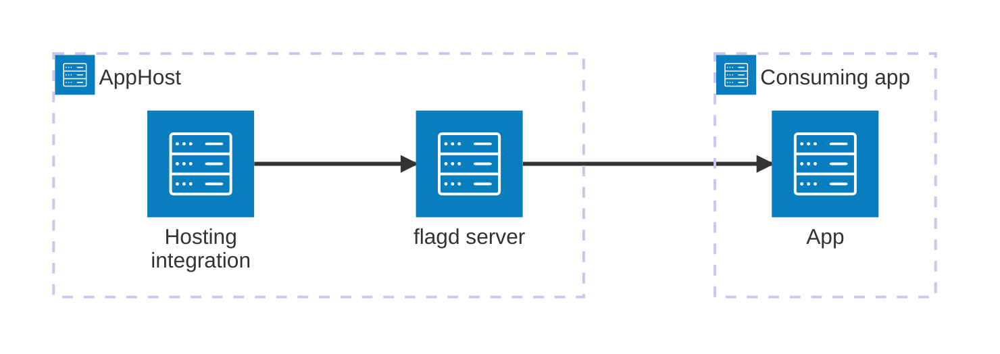

import { Image } from 'astro:assets';
import { Badge, LinkButton, Steps } from '@astrojs/starlight/components';
import ThemeImage from '@components/ThemeImage.astro';
import flagdIcon from '@assets/icons/flagd-icon.svg';
import flagdLightIcon from '@assets/icons/flagd-light-icon.svg';

<Badge text="⭐ Community Toolkit" variant="tip" size="large" />

<ThemeImage
  light={flagdLightIcon}
  dark={flagdIcon}
  alt="flagd logo"
  width={100}
  height={100}
  zoomable={false}
  classOverride="float-inline-left icon"
/>

[flagd](https://flagd.dev/) is a feature flag evaluation engine that provides an [OpenFeature](https://openfeature.dev/)-compliant backend for managing and evaluating feature flags in real-time. The Aspire flagd integration lets you model a flagd server as a first-class resource in your AppHost, then hand the connection information to any consuming app — regardless of language.

## Why use flagd with Aspire

Adding flagd through Aspire — rather than wiring up containers and connection strings by hand — gives you:

- **Zero-config local development.** Aspire runs flagd from the [`ghcr.io/open-feature/flagd`](https://github.com/open-feature/flagd/pkgs/container/flagd) container image with no manual container management required.
- **Consistent connection info across languages.** Once you reference the flagd resource from a consuming app, Aspire injects connection properties as environment variables in a predictable format that works from C#, TypeScript, Python, Go, or any other language.
- **Built-in health checks.** The hosting integration automatically registers a health check against the flagd `/healthz` endpoint so the dashboard and your orchestrator can tell when the server is ready.
- **Dashboard observability.** The flagd resource shows up in the Aspire dashboard with logs and status alongside your other services.
- **Multi-language OpenFeature clients.** Any OpenFeature-compatible SDK with a flagd provider — C#, Go, Python, or TypeScript — works with the injected connection information.

## How the pieces fit together

The flagd integration has two sides: a **hosting integration** that you use in your AppHost to model the flagd resource, and a **connection story** for consuming apps that reference it.

The **hosting integration** lives in your AppHost project and models the flagd server as a resource. Consuming apps reference it and use the connection information Aspire injects to evaluate feature flags via the OpenFeature SDK.

Getting there is a two-step process: model the flagd resource in your AppHost, then connect to it from each app that needs it.

<Steps>

1. ### Model flagd in your AppHost

    Add the flagd hosting integration to your AppHost, then declare a flagd resource and reference it from the apps that need feature flags. The [flagd Hosting integration](/integrations/devtools/flagd/flagd-host/) article walks through every capability — file-based flag sync, port customization, log levels, and health checks.

    <LinkButton
        variant='secondary'
        iconPlacement='end'
        icon='right-arrow'
        href='/integrations/devtools/flagd/flagd-host/'>
        Set up flagd in the AppHost
    </LinkButton>

2. ### Connect from your consuming app

    When you reference a flagd resource from a consuming app, Aspire injects its connection information as environment variables. See [Connect to flagd](/integrations/devtools/flagd/flagd-connect/) for the connection properties reference and per-language examples for C#, Go, Python, and TypeScript — using the OpenFeature SDK and flagd providers.

    <LinkButton
        variant='secondary'
        iconPlacement='end'
        icon='right-arrow'
        href='/integrations/devtools/flagd/flagd-connect/'>
        Connect to flagd
    </LinkButton>

</Steps>

## See also

- [flagd documentation](https://flagd.dev/)
- [OpenFeature documentation](https://openfeature.dev/)
- [Aspire Community Toolkit](https://github.com/CommunityToolkit/Aspire)
- [Aspire integrations overview](/integrations/overview/)
