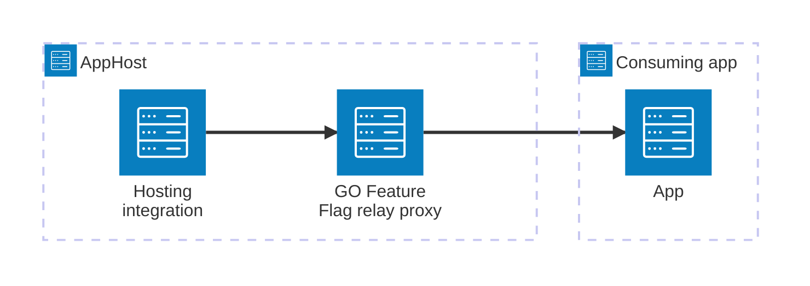

import { Image } from 'astro:assets';
import { Badge, LinkButton, Steps } from '@astrojs/starlight/components';
import goffIcon from '@assets/icons/go-feature-flag.png';

<Badge text="⭐ Community Toolkit" variant="tip" size="large" />

<Image
  src={goffIcon}
  alt="GO Feature Flag logo"
  width={100}
  height={100}
  class:list={'float-inline-left icon'}
  data-zoom-off
/>

[GO Feature Flag](https://gofeatureflag.org/) is a simple, open-source feature flag solution that acts as an [OpenFeature](https://openfeature.dev/)-compliant relay proxy. It lets you modify system behavior without deploying new code — deploy every day and release when you're ready, with support for targeted rollouts and multi-language SDKs. The Aspire GO Feature Flag integration lets you model a relay proxy resource in your AppHost, then hand the connection information to any consuming app — regardless of language.

## Why use GO Feature Flag with Aspire

Adding GO Feature Flag through Aspire — rather than wiring up containers and connection strings by hand — gives you:

- **Zero-config local development.** Aspire runs the relay proxy from the [`docker.io/gofeatureflag/go-feature-flag`](https://hub.docker.com/r/gofeatureflag/go-feature-flag) container image automatically.
- **Consistent connection info across languages.** Once you reference the relay proxy resource from a consuming app, Aspire injects the endpoint as environment variables in a predictable format that works from C#, TypeScript, Python, Go, or any other language.
- **Built-in health checks.** The hosting integration automatically registers a health check against the relay proxy `/health` endpoint so the dashboard can tell when it's ready.
- **Dashboard observability.** The GO Feature Flag resource shows up in the Aspire dashboard with logs, status, and telemetry alongside your other services.
- **OpenTelemetry export.** The relay proxy is configured to export traces and metrics through the Aspire OTLP exporter automatically.
- **A first-class C# client integration.** C# apps can use the `CommunityToolkit.Aspire.GoFeatureFlag` package to register an OpenFeature `GOFeatureFlagProvider` through dependency injection, with health checks included.

## How the pieces fit together

The GO Feature Flag integration has two sides: a **hosting integration** that you use in your AppHost to model the relay proxy resource, and a **connection story** for consuming apps that reference it.

The **hosting integration** lives in your AppHost project and models the GO Feature Flag relay proxy as a resource. The consuming app uses the endpoint information Aspire injects to evaluate feature flags through the relay proxy.

Getting there is a two-step process: model the GO Feature Flag resource in your AppHost, then connect to the relay proxy from each app that needs it.

<Steps>

1. ### Model GO Feature Flag in your AppHost

    Add the GO Feature Flag hosting integration to your AppHost, then declare a relay proxy resource and reference it from the apps that need to evaluate flags. The [GO Feature Flag Hosting integration](/integrations/devtools/goff/goff-host/) article walks through every capability — bind mounts, data volumes, log levels, custom ports, and more.

    <LinkButton
        variant='secondary'
        iconPlacement='end'
        icon='right-arrow'
        href='/integrations/devtools/goff/goff-host/'>
        Set up GO Feature Flag in the AppHost
    </LinkButton>

2. ### Connect from your consuming app

    When you reference a GO Feature Flag resource from a consuming app, Aspire injects its endpoint as environment variables. See [Connect to GO Feature Flag](/integrations/devtools/goff/goff-connect/) for the connection properties reference and per-language examples for C#, Go, Python, and TypeScript — including the full C# client integration.

    <LinkButton
        variant='secondary'
        iconPlacement='end'
        icon='right-arrow'
        href='/integrations/devtools/goff/goff-connect/'>
        Connect to GO Feature Flag
    </LinkButton>

</Steps>

## See also

- [GO Feature Flag documentation](https://gofeatureflag.org/)
- [OpenFeature documentation](https://openfeature.dev)
- [Aspire Community Toolkit](https://github.com/CommunityToolkit/Aspire)
