import { Badge, TabItem, Tabs } from '@astrojs/starlight/components';
import { Image } from 'astro:assets';
import k6Icon from '@assets/icons/k6-icon.svg';

<Badge text="⭐ Community Toolkit" variant="tip" size="large" />

<Image
  src={k6Icon}
  alt="k6 logo"
  width={100}
  height={100}
  fit="contain"
  class:list={'float-inline-left icon'}
  data-zoom-off
/>

[Grafana k6](https://k6.io/) is an open-source performance and load-testing tool. The Aspire Community Toolkit k6 hosting integration models a k6 container and its HTTP API as an AppHost resource. This lets you run load tests beside the services they test and inspect their logs, endpoint, and health in the Aspire dashboard.

## How the integration fits together

The hosting integration runs the k6 container. Your test script is mounted into that container, and can use the connection information Aspire supplies for referenced resources.

```mermaid
architecture-beta

  group apphost(server)[AppHost]
  group test(logos:javascript)[k6 test]

  service hosting(server)[k6 hosting integration] in apphost
  service k6(server)[k6 container resource] in apphost
  service script(logos:javascript)[JavaScript test script] in test
  service targetapp(server)[Application service] in apphost

  hosting:R --> L:k6
  script:R --> L:k6
  k6:B --> T:targetapp
```



## Prerequisites

- Install [Docker](https://docs.docker.com/get-docker/) and make sure it is running.
- Install the [Aspire CLI](/get-started/install-cli/) and create an AppHost.
- Create a JavaScript test script that k6 can execute.

## Setup

### Add the hosting package

Add `CommunityToolkit.Aspire.Hosting.k6` to your AppHost. See [Set up k6 in the AppHost](/integrations/devtools/k6/k6-host/#installation) for package installation options.

### Add and configure the resource

Mount the directory that contains your tests, then select the script to run:

<Tabs syncKey='aspire-lang'>
<TabItem id='csharp' label='C#'>

```csharp title="AppHost.cs"
var builder = DistributedApplication.CreateBuilder(args);

builder.AddK6("k6")
    .WithBindMount("./scripts", "/scripts", isReadOnly: true)
    .WithScript("/scripts/main.js");

builder.Build().Run();
```

</TabItem>
<TabItem id='typescript' label='TypeScript'>

```typescript title="apphost.mts"
import { createBuilder } from './.aspire/modules/aspire.mjs';

const builder = await createBuilder();

const k6 = await builder.addK6('k6');
await k6.withBindMount('./scripts', '/scripts', { isReadOnly: true });
await k6.withScript('/scripts/main.js');

await builder.build().run();
```

</TabItem>
</Tabs>

### Write the test

Use the k6 APIs in the mounted script:

```javascript title="scripts/main.js"
import http from 'k6/http';
import { sleep } from 'k6';

export default function () {
  http.get('http://host.docker.internal:8080/');
  sleep(1);
}
```

Replace the URL with the address appropriate for the service under test. When the service is also an Aspire resource, reference it from k6 and use the service-discovery configuration supplied by Aspire.

## Next steps

The [k6 hosting reference](/integrations/devtools/k6/k6-host/) covers the resource endpoint, health check, script arguments, browser image, OpenTelemetry environment variables, and publish behavior.

## See also

- [Grafana k6 documentation](https://grafana.com/docs/k6/latest/)
- [Aspire Community Toolkit](https://github.com/CommunityToolkit/Aspire)
