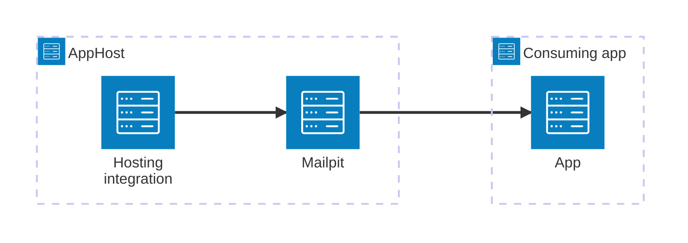

import { Badge, LinkButton, Steps } from '@astrojs/starlight/components';
import ThemeImage from '@components/ThemeImage.astro';
import mailpitIcon from '@assets/icons/mailpit-icon.svg';
import mailpitLightIcon from '@assets/icons/mailpit-light-icon.svg';

<Badge text="⭐ Community Toolkit" variant="tip" size="large" />

<ThemeImage
  light={mailpitLightIcon}
  dark={mailpitIcon}
  alt="Mailpit logo"
  width={100}
  height={100}
  zoomable={false}
  classOverride="float-inline-left icon"
/>

[Mailpit](https://mailpit.axllent.org/) is an email testing tool for developers. It acts as an SMTP server, captures outgoing emails, and exposes a web UI to inspect them. The Aspire Mailpit integration lets you model a Mailpit instance as a first-class resource in your AppHost, then hand the SMTP connection information to any consuming app — regardless of language.

## Why use Mailpit with Aspire

Adding Mailpit through Aspire — rather than wiring up containers and SMTP settings by hand — gives you:

- **Zero-config local email testing.** Aspire runs Mailpit from the [`docker.io/axllent/mailpit`](https://hub.docker.com/r/axllent/mailpit) container image with endpoints configured automatically.
- **Consistent connection info across languages.** Once you reference the Mailpit resource from a consuming app, Aspire injects SMTP connection properties as environment variables in a predictable format that works from C#, TypeScript, Python, Go, or any other language.
- **Dashboard observability.** The Mailpit resource shows up in the Aspire dashboard with logs and status alongside your other services.
- **Built-in web UI.** Mailpit's web interface for inspecting captured emails is automatically accessible through the Aspire dashboard endpoint.

## How the pieces fit together

Mailpit is a hosting-only integration — there is no separate client integration package. Your consuming apps connect to Mailpit directly using any standard SMTP library.

The **hosting integration** lives in your AppHost project and models the Mailpit instance as a resource. Your consuming apps read the SMTP connection properties that Aspire injects and use any standard SMTP library to send emails to Mailpit for inspection.

Getting there is a two-step process: model the Mailpit resource in your AppHost, then connect to it from each app that sends emails.

<Steps>

1. ### Model Mailpit in your AppHost

    Add the Mailpit hosting integration to your AppHost, then declare a Mailpit resource and reference it from the apps that need to send email. The [Mailpit Hosting integration](/integrations/devtools/mailpit/mailpit-host/) reference walks through every capability — SMTP endpoint, HTTP UI endpoint, and data volumes.

    <LinkButton
        variant='secondary'
        iconPlacement='end'
        icon='right-arrow'
        href='/integrations/devtools/mailpit/mailpit-host/'>
        Set up Mailpit in the AppHost
    </LinkButton>

2. ### Connect from your consuming app

    When you reference a Mailpit resource from a consuming app, Aspire injects its SMTP connection information as environment variables. See [Connect to Mailpit](/integrations/devtools/mailpit/mailpit-connect/) for the connection properties reference and per-language examples for C#, Go, Python, and TypeScript.

    <LinkButton
        variant='secondary'
        iconPlacement='end'
        icon='right-arrow'
        href='/integrations/devtools/mailpit/mailpit-connect/'>
        Connect to Mailpit
    </LinkButton>

</Steps>

## See also

- [Mailpit documentation](https://mailpit.axllent.org/)
- [Mailpit GitHub repository](https://github.com/axllent/mailpit)
- [Aspire Community Toolkit](https://github.com/CommunityToolkit/Aspire)
