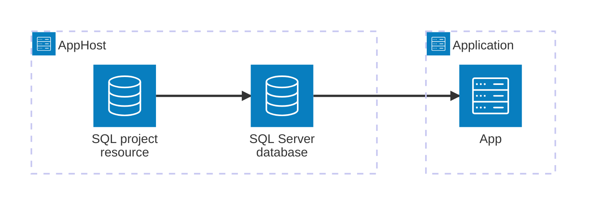

import {
  Badge,
  LinkButton,
  Tabs,
  TabItem,
} from '@astrojs/starlight/components';
import { Image } from 'astro:assets';

import sqlIcon from '@assets/icons/sql-database-projects-icon.png';

<Badge text="⭐ Community Toolkit" variant="tip" size="large" />

<Image
  src={sqlIcon}
  alt="SQL Database Projects icon"
  width={100}
  height={100}
  fit="contain"
  class:list={'float-inline-left icon'}
  data-zoom-off
/>

The [SQL Database Projects](https://learn.microsoft.com/sql/tools/sql-database-projects/sql-database-projects) hosting integration deploys a DACPAC to a SQL Server database as part of your Aspire AppHost. Use it to keep a database schema alongside the services that depend on it during local development and testing.

## How the pieces fit together

This is a hosting-only integration. Your AppHost models a SQL project resource and a target database. When the target database is ready, the integration publishes the DACPAC. The SQL project resource is a deployment task, not a connection resource; applications that need database access reference the SQL Server database directly.



## Prerequisites

- [Install the Aspire CLI](/get-started/install-cli/) and use an AppHost with the [SQL Server hosting integration](/integrations/databases/sql-server/sql-server-host/).
- Build your database with either [MSBuild.Sdk.SqlProj](https://github.com/rr-wfm/MSBuild.Sdk.SqlProj) or [Microsoft.Build.Sql](https://www.nuget.org/packages/Microsoft.Build.Sql). The integration deploys the resulting `.dacpac` file.
- For a C# AppHost, you can add a project reference to the SQL project and use the generated `Projects.*` metadata type. For a TypeScript AppHost, supply the DACPAC path.

## Add a SQL project resource

Install the Community Toolkit hosting package in the AppHost:

```bash title="Terminal"
aspire add CommunityToolkit.Aspire.Hosting.SqlDatabaseProjects
```

Then add the SQL Server database and a SQL project resource. Update the DACPAC path to match your database project's output.

<Tabs syncKey='aspire-lang'>
<TabItem id='csharp' label='C#'>

```csharp title="AppHost.cs"
var builder = DistributedApplication.CreateBuilder(args);

var database = builder.AddSqlServer("sql")
    .AddDatabase("catalog");

builder.AddSqlProject("catalog-schema")
    .WithDacpac("../Database/bin/Debug/net10.0/Database.dacpac")
    .WithReference(database);

builder.Build().Run();
```

</TabItem>
<TabItem id='typescript' label='TypeScript'>

```typescript title="apphost.mts"
import path from 'node:path';
import { fileURLToPath } from 'node:url';
import { createBuilder } from './.aspire/modules/aspire.mjs';

const builder = await createBuilder();
const appHostDirectory = path.dirname(fileURLToPath(import.meta.url));
const dacpacPath = path.join(
  appHostDirectory,
  '../Database/bin/Debug/net10.0/Database.dacpac'
);

const sql = await builder.addSqlServer('sql');
const database = await sql.addDatabase('catalog');
const databaseProject = await builder.addSqlProject('catalog-schema');

await databaseProject.withDacpac(dacpacPath);
await databaseProject.withReference(database);

await builder.build().run();
```

</TabItem>
</Tabs>

For all resource APIs, deployment options, dashboard actions, and support for an existing SQL Server, see the hosting reference.

<LinkButton
  variant="secondary"
  iconPlacement="end"
  icon="right-arrow"
  href="/integrations/devtools/sql-projects/sql-projects-host/"
>
  Configure SQL Database Projects in the AppHost
</LinkButton>

## See also

- [MSBuild.Sdk.SqlProj](https://github.com/rr-wfm/MSBuild.Sdk.SqlProj)
- [Microsoft.Build.Sql](https://www.nuget.org/packages/Microsoft.Build.Sql)
- [Aspire Community Toolkit](https://github.com/CommunityToolkit/Aspire)
