import { Image } from 'astro:assets';
import { LinkButton, Steps } from '@astrojs/starlight/components';
import blazorIcon from '@assets/icons/blazor-icon.svg';

<Image
  src={blazorIcon}
  alt="Blazor logo"
  width={100}
  height={100}
  class:list={'float-inline-left icon'}
  data-zoom-off
/>

The Aspire Blazor hosting integration helps you model a Blazor WebAssembly project and a Blazor Gateway as first-class resources in your AppHost. You can orchestrate the frontend and backing APIs together, and keep endpoint wiring in one place.

## What is the Blazor hosting integration

The integration adds AppHost APIs that let you:

- Add a Blazor WebAssembly project resource with `AddBlazorWasmProject` / `addBlazorWasmProject`.
- Add a Blazor Gateway resource with `AddBlazorGateway` / `addBlazorGateway`.
- Associate the client app with the gateway by using `WithBlazorClientApp` / `withBlazorClientApp`.

## Why use Blazor hosting with Aspire

Using Blazor hosting in Aspire gives you:

- **One app model for frontend and APIs.** Model your Blazor client and backend services in the same AppHost.
- **Consistent endpoint wiring.** Use AppHost references instead of manually tracking endpoint URLs.
- **Gateway-first browser entry point.** Expose a single external gateway endpoint for browser traffic.
- **Dashboard visibility.** See frontend and API resources together in the Aspire dashboard.

## How the pieces fit together

The Blazor hosting integration is a hosting-side API surface. You install it in your AppHost, define Blazor and API resources, and connect them through references and the gateway.

```mermaid
architecture-beta


  group client(server)[Browser]
  group apphost(server)[AppHost]

  service browser(server)[Browser] in client
  service hosting(server)[Blazor hosting integration] in apphost
  service wasm(aspire:blazor)[Blazor WebAssembly app] in apphost
  service gateway(server)[Blazor Gateway] in apphost
  service api(server)[API project] in apphost

  browser:R --> L:gateway
  hosting:R --> L:wasm
  hosting:R --> B:gateway
  wasm:B --> T:api
```

<Steps>

1. ### Set up Blazor resources in the AppHost

   Add the hosting package, create the Blazor WebAssembly and gateway resources, and associate them with `WithBlazorClientApp` / `withBlazorClientApp`.

   <LinkButton
     variant='secondary'
     iconPlacement='end'
     icon='right-arrow'
     href='/integrations/dotnet/blazor-hosting/'>
     Set up Blazor hosting in the AppHost
   </LinkButton>

2. ### Connect APIs and consumers

   Use AppHost references to expose service discovery properties for backend APIs and other consumers.

   <LinkButton
     variant='secondary'
     iconPlacement='end'
     icon='right-arrow'
     href='/integrations/dotnet/blazor-connect/'>
     Connect Blazor apps and APIs
   </LinkButton>

</Steps>

## See also

- [Set up Blazor hosting in the AppHost](/integrations/dotnet/blazor-hosting/)
- [Connect Blazor apps and APIs](/integrations/dotnet/blazor-connect/)
- [Blazor WebAssembly overview](https://learn.microsoft.com/aspnet/core/blazor/)
