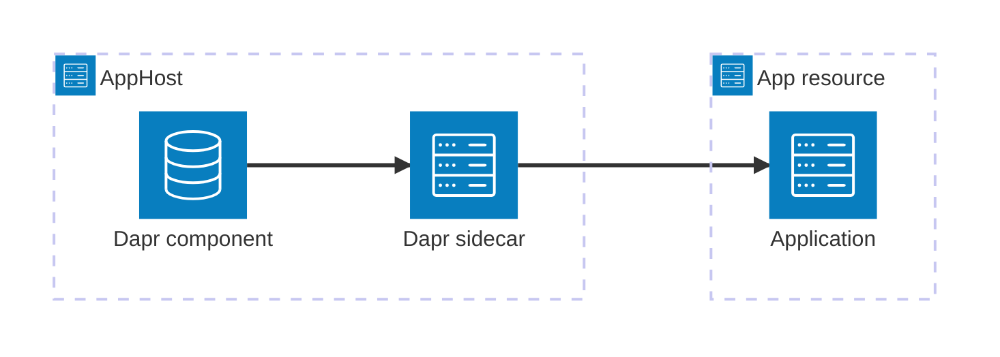

import { Image } from 'astro:assets';
import { Badge, LinkButton, Steps } from '@astrojs/starlight/components';
import daprIcon from '@assets/icons/dapr-icon.png';

<Badge text="⭐ Community Toolkit" variant="tip" size="large" />

<Image
  src={daprIcon}
  alt="Dapr logo"
  width={100}
  height={100}
  class:list={'float-inline-left icon'}
  data-zoom-off
/>

[Dapr](https://dapr.io/) is a portable runtime for building distributed applications with APIs for service invocation, state, messaging, secrets, and more. The Aspire Dapr integration models Dapr sidecars and component resources alongside the apps that use them.

## Why use Dapr with Aspire

- **Sidecars in the application model.** Add and configure a Dapr sidecar next to an app resource instead of managing a separate `dapr run` command.
- **Reusable component resources.** Model state stores, pub/sub brokers, and other Dapr components once, then reference them from sidecars.
- **Automatic endpoint injection.** Aspire passes the sidecar HTTP and gRPC ports and endpoints to each app resource.
- **Dashboard visibility.** Sidecars appear as resources with logs, endpoints, and lifecycle status in the Aspire dashboard.
- **Dapr SDK support.** C#, TypeScript, Python, and Go apps can use the official Dapr SDK for their language.

## Prerequisites

Install the [Dapr CLI](https://docs.dapr.io/getting-started/install-dapr-cli/) and run:

```bash title="Terminal"
dapr init
```

The Community Toolkit package is tested with the most recent stable Dapr release identified in its source. At the audited release, that is Dapr runtime 1.15.3 and Dapr CLI 1.15.0.

## How the pieces fit together



<Steps>

1. ### Model Dapr in the AppHost

   Install the hosting integration, add component resources, and attach a sidecar to each app that uses Dapr.

   <LinkButton
     variant="secondary"
     iconPlacement="end"
     icon="right-arrow"
     href="/integrations/frameworks/dapr/dapr-host/"
   >
     Set up Dapr in the AppHost
   </LinkButton>

2. ### Connect from an app

   Use the injected Dapr HTTP or gRPC endpoint with the official SDK for your app's language.

   <LinkButton
     variant="secondary"
     iconPlacement="end"
     icon="right-arrow"
     href="/integrations/frameworks/dapr/dapr-connect/"
   >
     Connect to Dapr
   </LinkButton>

</Steps>

## See also

- [Dapr documentation](https://docs.dapr.io/)
- [Dapr SDKs](https://docs.dapr.io/developing-applications/sdks/)
- [Aspire Community Toolkit](https://github.com/CommunityToolkit/Aspire)
- [Aspire integrations overview](/integrations/overview/)
