import { LinkButton, Steps } from '@astrojs/starlight/components';
import ThemeImage from '@components/ThemeImage.astro';
import goIcon from '@assets/icons/go-icon.png';
import goLightIcon from '@assets/icons/go-light-icon.png';

<ThemeImage
  light={goLightIcon}
  dark={goIcon}
  alt="Go logo"
  width={100}
  height={100}
  zoomable={false}
  classOverride="float-inline-left icon"
/>

The Aspire Go hosting integration lets you run Go applications alongside your other Aspire resources from the AppHost. Aspire runs Go apps with the local Go toolchain during development, wires them into the Aspire app model, supports service discovery and endpoint configuration, and can emit Dockerfile-based container build artifacts for deployment targets that need them.

:::caution[Community Toolkit package deprecated]
As of Aspire 13.4, Go hosting support is available in the official `Aspire.Hosting.Go` package. The previous `CommunityToolkit.Aspire.Hosting.Golang` package is deprecated because Go support has graduated into core Aspire. Use `Aspire.Hosting.Go` and `AddGoApp` / `addGoApp` for new Aspire 13.4+ applications.
:::

## Why use Go with Aspire

Adding Go apps through Aspire gives you:

- **One app model for every service.** Model Go applications, projects, containers, and backing services together in the AppHost.
- **Local development with the Go toolchain.** Aspire runs Go apps with commands such as `go run .` or `go run ./cmd/server` instead of requiring a container for every edit-run loop.
- **Endpoint and environment wiring.** Configure ports, environment variables, service discovery, and resource dependencies from the AppHost.
- **Dashboard visibility.** Go app resources appear in the Aspire dashboard with logs, status, endpoints, and lifecycle controls.
- **Publish-time container artifacts.** Deployment targets that need container build artifacts can use an existing Dockerfile or let Aspire generate one from the Go app resource.

## How the pieces fit together

The Go integration is a **hosting integration**. You install it in the AppHost, add one or more Go app resources, and configure how Aspire runs, debugs, and publishes each app.

```mermaid
architecture-beta

  group apphost(server)[AppHost]
  group goapp(server)[Go app]

  service hosting(server)[Go hosting integration] in apphost
  service resource(logos:go)[Go app resource] in apphost
  service toolchain(logos:go)[Go toolchain] in goapp
  service app(logos:go)[Go process] in goapp

  hosting:R --> L:resource
  resource:R --> L:toolchain
  toolchain:R --> L:app
```

<Steps>

1. ### Set up Go apps in the AppHost

   Add the `Aspire.Hosting.Go` hosting integration to your AppHost, then use `AddGoApp` / `addGoApp` to model a Go app resource. The host reference covers package installation, common Go layouts, app arguments, build options, Go module helper commands, Delve debugging, private modules, and publish behavior.

   <LinkButton
     variant="secondary"
     iconPlacement="end"
     icon="right-arrow"
     href="/integrations/frameworks/go/go-host/"
   >
     Set up Go apps in the AppHost
   </LinkButton>

2. ### Optionally try the Go AppHost templates

   The `Aspire.Hosting.Go` integration works from C# and TypeScript AppHosts. Aspire also includes experimental Go AppHost and Go starter template support in the Aspire CLI. These templates use experimental Go AppHost APIs instead of the `Aspire.Hosting.Go` package.

   <LinkButton
     variant="secondary"
     iconPlacement="end"
     icon="right-arrow"
     href="/integrations/frameworks/go/go-host/#experimental-go-apphost-templates"
   >
     Try the experimental Go templates
   </LinkButton>

</Steps>

## See also

- [Go documentation](https://go.dev/doc/)
- [Go AppHost setup reference](/integrations/frameworks/go/go-host/)
- [Aspire integrations overview](/integrations/overview/)
