import { Image } from 'astro:assets';
import { LinkButton, Steps } from '@astrojs/starlight/components';
import javaIcon from '@assets/icons/java-icon.png';

<Image
  src={javaIcon}
  alt="Java logo"
  width={100}
  height={100}
  fit="contain"
  class:list={'float-inline-left icon'}
  data-zoom-off
/>

[Java](https://dev.java/) is a general-purpose, object-oriented language whose apps run on the Java Virtual Machine (JVM). It powers popular frameworks such as [Spring Boot](https://spring.io/projects/spring-boot) and [Quarkus](https://quarkus.io/). The Aspire Java hosting integration lets you model Java apps as first-class resources in your AppHost — whether they run through a [Maven](https://maven.apache.org/) or [Gradle](https://gradle.org/) wrapper, from a prebuilt JAR, or from a container image built elsewhere — and connect them to the rest of your app, regardless of the language each part is written in.

:::note[New in Aspire 13.6]
[📦 Aspire.Hosting.Java](https://www.nuget.org/packages/Aspire.Hosting.Java) is the official Java hosting integration. It replaces [📦 CommunityToolkit.Aspire.Hosting.Java](https://www.nuget.org/packages/CommunityToolkit.Aspire.Hosting.Java) for Aspire 13.6 and later. If you use the Community Toolkit package, see [Migrate from the Community Toolkit](/integrations/frameworks/java/java-host/#migrate-from-the-community-toolkit).
:::

## Why use Java with Aspire

Adding Java apps through Aspire — rather than starting each JVM by hand and wiring up ports, URLs, and credentials yourself — gives you:

- **Framework-aware defaults.** Spring Boot and Quarkus apps are added with a single call. Aspire detects Maven or Gradle from the project's build file, launches the framework's own run goal, and delivers the app's port through the environment variable the framework already reads.
- **Builds that run for you.** Aspire launches and builds apps with the Maven or Gradle wrapper checked into each project — the same pinned tool version that your CI and your published images use — and runs a build first when an app needs one, such as a JAR that must exist before it starts.
- **Telemetry in the dashboard.** Every Java resource receives the standard OpenTelemetry exporter settings. Attach the OpenTelemetry Java agent for automatic instrumentation, or use the Quarkus OpenTelemetry extension, which Aspire points at the dashboard during local runs.
- **Service discovery and connection information.** Reference a Java app from another resource — or reference databases, caches, and other services from a Java app — and Aspire injects URLs and connection details as environment variables that your framework's configuration system can read.
- **Trusted development certificates.** Aspire gives each JVM a trust store that contains the development certificate along with the system root certificates, so HTTPS calls between local resources work without turning off certificate validation.
- **Debugging and publishing.** Debug Java apps in VS Code with the standard Aspire debugging flow, and publish them as container images built from your own Dockerfile or from one that Aspire generates.

## Prerequisites

- A JDK that matches the Java version your app targets, with `java` on your `PATH`, for each Java app that the AppHost runs locally. Aspire doesn't install a JDK; one option is [Eclipse Temurin](https://adoptium.net/). A Java app that runs from a container image uses the JDK inside that image.
- For apps built or launched with Maven or Gradle, the project's wrapper (`mvnw` or `gradlew`), checked into the app directory or into the root of its multi-module build. Aspire doesn't fall back to a globally installed `mvn` or `gradle`. To publish an app with a Dockerfile that Aspire generates, its wrapper must be in the app directory. An app that runs a prebuilt JAR doesn't need a wrapper.
- To debug in VS Code, the [Language Support for Java](https://marketplace.visualstudio.com/items?itemName=redhat.java) and [Debugger for Java](https://marketplace.visualstudio.com/items?itemName=vscjava.vscode-java-debug) extensions.
- The [Aspire CLI](/get-started/install-cli/), along with the other [Aspire prerequisites](/get-started/prerequisites/).

:::note
A C# or TypeScript AppHost can host Java apps that target any JDK version. Writing the AppHost itself in Java is a separate scenario that requires JDK 25 or later.
:::

## How the pieces fit together

The Java integration is a **hosting integration**. You install it in your AppHost and add a resource for each Java app. When a Java app starts, Aspire runs it through the project's wrapper or the `java` launcher, supplies its configuration as environment variables, and shows its logs, status, and telemetry in the dashboard.

```mermaid
architecture-beta

  group apphost(server)[AppHost]
  group javaapp(server)[Java app]

  service hosting(server)[Java hosting integration] in apphost
  service resource(logos:java)[Java app resource] in apphost
  service launcher(server)[Wrapper or java launcher] in javaapp
  service app(logos:java)[JVM process] in javaapp

  hosting:R --> L:resource
  resource:R --> L:launcher
  launcher:R --> L:app
```

There's no Aspire client package for Java. Your app reads the environment variables Aspire injects through its framework's standard configuration system — Spring Boot properties, Quarkus configuration, or plain `System.getenv` calls — and exports telemetry with the OpenTelemetry Java agent or the Quarkus OpenTelemetry extension.

Getting there is a two-step process: model your Java apps in the AppHost, then connect them to — and from — the other resources in your app.

<Steps>

1. ### Model Java apps in your AppHost

    Add the Java hosting integration to your AppHost, then declare a resource for each Java app. The [Set up Java apps in the AppHost](/integrations/frameworks/java/java-host/) article walks through every capability — Spring Boot and Quarkus apps, Maven goals and Gradle tasks, prebuilt JARs and containers, JVM options, the OpenTelemetry Java agent, debugging, and publishing — with side-by-side TypeScript and C# examples.

    <LinkButton
        variant='secondary'
        iconPlacement='end'
        icon='right-arrow'
        href='/integrations/frameworks/java/java-host/'>
        Set up Java apps in the AppHost
    </LinkButton>

2. ### Connect to and from your Java apps

    When you reference a Java app from another resource, Aspire injects the app's URLs into that resource. When you reference other resources from a Java app, Aspire injects their connection information into the JVM. See [Connect to Java apps](/integrations/frameworks/java/java-connect/) for the environment variable reference, examples in C#, Go, Python, and TypeScript, and how Spring Boot, Quarkus, and plain Java apps read Aspire configuration.

    <LinkButton
        variant='secondary'
        iconPlacement='end'
        icon='right-arrow'
        href='/integrations/frameworks/java/java-connect/'>
        Connect to Java apps
    </LinkButton>

</Steps>

## See also

- [Learn Java](https://dev.java/learn/)
- [Spring Boot documentation](https://docs.spring.io/spring-boot/)
- [Quarkus guides](https://quarkus.io/guides/)
- [OpenTelemetry Java agent](https://opentelemetry.io/docs/zero-code/java/agent/)
- [Aspire integrations overview](/integrations/overview/)
