import {
  Badge,
  LinkButton,
  TabItem,
  Tabs,
} from '@astrojs/starlight/components';
import { Image } from 'astro:assets';
import perlIcon from '@assets/icons/perl-096-1500.svg';

<Badge text="⭐ Community Toolkit" variant="tip" size="large" />

<Image
  src={perlIcon}
  alt="Perl Camel"
  width={75}
  height={75}
  class:list={'float-inline-left icon'}
  data-zoom-off
/>

The Aspire Community Toolkit Perl hosting integration runs Perl applications alongside the other resources in your AppHost. It models a Perl process as a first-class resource, manages its working directory and dependency installers, and supports local development and Dockerfile-based publishing.

## How the integration fits together

The hosting package belongs in the AppHost. It creates an executable resource for your Perl application, while your project retains its scripts, modules, and dependency files.

```mermaid
architecture-beta

  group apphost(server)[AppHost]
  group perl(logos:perl)[Perl project]

  service hosting(server)[Perl hosting integration] in apphost
  service resource(logos:perl)[Perl app resource] in apphost
  service runtime(logos:perl)[Perl runtime] in perl
  service app(logos:perl)[Perl application] in perl

  hosting:R --> L:resource
  resource:R --> L:runtime
  runtime:R --> L:app
```



## Prerequisites

- Install [Perl](https://www.perl.org/get.html) and ensure `perl` and `cpan` are on `PATH`.
- Install `cpanm` when you use `WithCpanMinus`, `WithLocalLib`, or project dependency installation. Install `carton` when you use Carton.
- Install the [Aspire CLI](/get-started/install-cli/) and create an AppHost.

:::note
Perlbrew support is Linux-only. On Windows, use a supported Perl distribution; configuring perlbrew causes the resource to fail before it starts.
:::

## Setup

### Add the hosting package

Add `CommunityToolkit.Aspire.Hosting.Perl` to your AppHost. The [Perl hosting reference](/integrations/frameworks/perl/perl-host/#installation) includes package installation options.

### Add a Perl resource

Add a script resource and use a project-local module directory:

<Tabs syncKey='aspire-lang'>
<TabItem id='csharp' label='C#'>

```csharp title="AppHost.cs"
var builder = DistributedApplication.CreateBuilder(args);

builder.AddPerlScript("worker", "../perl-worker", "worker.pl")
    .WithLocalLib("local");

builder.Build().Run();
```

</TabItem>
<TabItem id='typescript' label='TypeScript'>

```typescript title="apphost.mts"
import { createBuilder } from './.aspire/modules/aspire.mjs';

const builder = await createBuilder();

const worker = await builder.addPerlScript(
  'worker',
  '../perl-worker',
  'worker.pl'
);
await worker.withLocalLib({ path: 'local' });

await builder.build().run();
```

</TabItem>
</Tabs>

### Configure dependencies and endpoints

The resource's application directory is its working directory. Put a `cpanfile` there when you want Aspire to install project dependencies, and add an HTTP endpoint for a web API that listens on a port.

<LinkButton
  variant="secondary"
  iconPlacement="end"
  icon="right-arrow"
  href="/integrations/frameworks/perl/perl-host/"
>
  Set up Perl in the AppHost
</LinkButton>

## See also

- [Perl documentation](https://perldoc.perl.org/)
- [Perl hosting reference](/integrations/frameworks/perl/perl-host/)
- [Aspire Community Toolkit](https://github.com/CommunityToolkit/Aspire)
