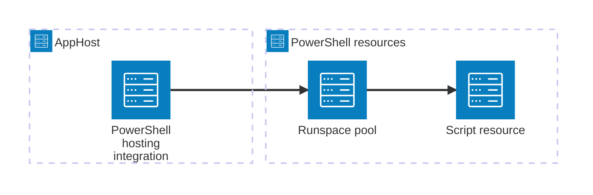

import {
  Badge,
  LinkButton,
  Steps,
  TabItem,
  Tabs,
} from '@astrojs/starlight/components';
import { Image } from 'astro:assets';
import powershellIcon from '@assets/icons/powershell-icon.png';

<Image
  src={powershellIcon}
  alt="PowerShell logo"
  width={100}
  height={100}
  fit="contain"
  class:list={'float-inline-left icon'}
  data-zoom-off
/>

<Badge text="⭐ Community Toolkit" variant="tip" size="large" />

The Community Toolkit PowerShell hosting integration runs PowerShell scripts in an in-process runspace pool that Aspire manages. Model setup, provisioning, and administrative scripts alongside your application resources, view their logs and states in the dashboard, and make later scripts wait for earlier ones to finish.

## How the pieces fit together

The integration is a hosting integration installed in your AppHost. A PowerShell runspace pool resource hosts one or more script resources. Aspire starts the pool, starts each script after its dependencies are ready, and reports the pool and script lifecycle in the dashboard.



## Prerequisites

- Create an [Aspire AppHost](/get-started/app-host/) in C# or TypeScript.
- Optionally install [PowerShell](https://learn.microsoft.com/powershell/scripting/install/installing-powershell) to develop and test scripts outside the AppHost. The integration runs scripts in-process through the PowerShell SDK, so it doesn't invoke `pwsh`.

<Steps>

1. ### Install the hosting package

   Add `CommunityToolkit.Aspire.Hosting.PowerShell` to your AppHost. You can use `aspire add communitytoolkit-powershell` or install the NuGet package directly.

2. ### Add a pool and a script

   Add a named PowerShell pool, then add a script to it. The following script appears as a resource in the dashboard.

   <Tabs syncKey='aspire-lang'>
   <TabItem id='csharp' label='C#'>

   ```csharp title="AppHost.cs"
   var builder = DistributedApplication.CreateBuilder(args);

   var scripts = builder.AddPowerShell("scripts");
   scripts.AddScript("setup", """
       Write-Information "Preparing the application"
       """);

   builder.Build().Run();
   ```

   </TabItem>
   <TabItem id='typescript' label='TypeScript'>

   ```typescript title="apphost.mts"
   import { createBuilder } from './.aspire/modules/aspire.mjs';

   const builder = await createBuilder();

   const scripts = await builder.addPowerShell('scripts');
   await scripts.addScript(
     'setup',
     'Write-Information "Preparing the application"'
   );

   await builder.build().run();
   ```

   </TabItem>
   </Tabs>

3. ### Configure scripts in the AppHost

   Configure arguments, dependencies, connection-string variables, and lifecycle behavior in the [PowerShell AppHost reference](/integrations/frameworks/powershell/powershell-host/).

   <LinkButton
     variant="secondary"
     iconPlacement="end"
     icon="right-arrow"
     href="/integrations/frameworks/powershell/powershell-host/"
   >
     Configure PowerShell resources
   </LinkButton>

</Steps>

## See also

- [PowerShell documentation](https://learn.microsoft.com/powershell/)
- [PowerShell AppHost reference](/integrations/frameworks/powershell/powershell-host/)
- [Aspire Community Toolkit](https://github.com/CommunityToolkit/Aspire)
