import { Badge, LinkButton, Steps } from '@astrojs/starlight/components';
import { Image } from 'astro:assets';
import rustIcon from '@assets/icons/rust-icon.png';

<Image
  src={rustIcon}
  alt="Rust logo"
  width={100}
  height={100}
  fit="contain"
  class:list={'float-inline-left icon'}
  data-zoom-off
/>

<Badge text="⭐ Community Toolkit" variant="tip" size="large" />

The Community Toolkit Rust hosting integration runs Rust applications through Cargo or Bacon alongside the other resources in your Aspire AppHost. Rust app resources support endpoints, service discovery, health checks, environment configuration, and OpenTelemetry export. They are also configured for Dockerfile publishing.

## How the pieces fit together

The integration is installed in the AppHost. The AppHost starts Cargo or Bacon in the Rust application's working directory, applies standard Aspire resource configuration, and exposes the resulting resource in the dashboard.

```mermaid
architecture-beta

  group apphost(server)[AppHost]
  group rustapp(server)[Rust app]

  service hosting(server)[Rust hosting integration] in apphost
  service resource(logos:rust)[Rust app resource] in apphost
  service toolchain(logos:rust)[Cargo or Bacon] in rustapp
  service app(logos:rust)[Rust process] in rustapp

  hosting:R --> L:resource
  resource:R --> L:toolchain
  toolchain:R --> L:app
```



## Prerequisites

- Install Rust with [rustup](https://www.rust-lang.org/tools/install) and make `cargo` available on your `PATH`.
- Install [Bacon](https://dystroy.org/bacon/) when you use `AddBaconApp` / `addBaconApp`.
- Create an [Aspire AppHost](/get-started/app-host/) in C# or TypeScript.

<Steps>

1. ### Install the hosting package

   Add `CommunityToolkit.Aspire.Hosting.Rust` to your AppHost. You can use `aspire add communitytoolkit-rust` or install the NuGet package directly.

2. ### Add a Rust app

   Register the directory that contains your Rust project, then configure an endpoint for the port that the app reads from `PORT`.

   ```csharp title="AppHost.cs"
   var builder = DistributedApplication.CreateBuilder(args);

   builder.AddRustApp("rust-api", "../rust-api")
       .WithHttpEndpoint(port: 8080, env: "PORT")
       .WithExternalHttpEndpoints();

   builder.Build().Run();
   ```

   ```typescript title="apphost.mts"
   import { createBuilder } from './.aspire/modules/aspire.mjs';

   const builder = await createBuilder();

   const api = await builder.addRustApp('rust-api', '../rust-api');
   await api.withHttpEndpoint({ port: 8080, env: 'PORT' });
   await api.withExternalHttpEndpoints();

   await builder.build().run();
   ```

3. ### Configure the app resource

   Choose Cargo or Bacon, pass command arguments, add health checks, and learn about publishing in the [Rust AppHost reference](/integrations/frameworks/rust/rust-host/).

   <LinkButton
     variant="secondary"
     iconPlacement="end"
     icon="right-arrow"
     href="/integrations/frameworks/rust/rust-host/"
   >
     Configure Rust apps in the AppHost
   </LinkButton>

</Steps>

## See also

- [Rust documentation](https://www.rust-lang.org/learn)
- [Cargo documentation](https://doc.rust-lang.org/cargo/)
- [Rust AppHost reference](/integrations/frameworks/rust/rust-host/)
- [Aspire Community Toolkit](https://github.com/CommunityToolkit/Aspire)
