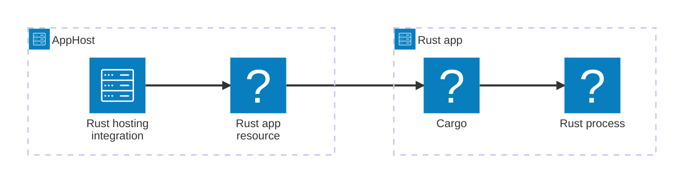

import {
  LinkButton,
  Steps,
  TabItem,
  Tabs,
} from '@astrojs/starlight/components';
import { Image } from 'astro:assets';
import rustIcon from '@assets/icons/rust-icon.png';

<Image
  src={rustIcon}
  alt="Rust logo"
  width={100}
  height={100}
  fit="contain"
  class:list={'float-inline-left icon'}
  data-zoom-off
/>

The first-party `Aspire.Hosting.Rust` integration runs Cargo applications alongside the other resources in your Aspire AppHost. Rust resources support endpoints, service discovery, health checks, environment configuration, OpenTelemetry export, debugging, and generated Dockerfiles for publishing. The package is available starting in Aspire 13.6.

## How the pieces fit together

The integration is installed in the AppHost. The AppHost starts Cargo in the Rust application's working directory, applies standard Aspire resource configuration, and exposes the resulting resource in the dashboard.


```mermaid
architecture-beta

  group apphost(server)[AppHost]
  group rustapp(server)[Rust app]

  service hosting(server)[Rust hosting integration] in apphost
  service resource(logos:rust)[Rust app resource] in apphost
  service toolchain(logos:rust)[Cargo] in rustapp
  service app(logos:rust)[Rust process] in rustapp

  hosting:R --> L:resource
  resource:R --> L:toolchain
  toolchain:R --> L:app
```

## Prerequisites

- Install Rust with [rustup](https://www.rust-lang.org/tools/install) and make Cargo 1.71 or later available on your `PATH`.
- Create an [Aspire AppHost](/get-started/app-host/) in C# or TypeScript.

<Steps>

1. ### Install the hosting package

   Add the first-party hosting package from the AppHost directory:

   ```bash title="Add Rust hosting"
   aspire add Aspire.Hosting.Rust
   ```

2. ### Add a Rust app

   Register the directory that contains your Rust project, then configure an endpoint for the port that the app reads from `PORT`.

   <Tabs syncKey='aspire-lang'>
   <TabItem id='typescript' label='TypeScript'>

   ```typescript title="apphost.mts" twoslash
   import { createBuilder } from './.aspire/modules/aspire.mjs';

   const builder = await createBuilder();

   const api = await builder.addRustApp('rust-api', '../rust-api');
   await api.withHttpEndpoint({ port: 8080, env: 'PORT' });
   await api.withExternalHttpEndpoints();

   await builder.build().run();
   ```

   </TabItem>

   <TabItem id='csharp' label='C#'>

   ```csharp title="AppHost.cs"
   var builder = DistributedApplication.CreateBuilder(args);

   builder.AddRustApp("rust-api", "../rust-api")
       .WithHttpEndpoint(port: 8080, env: "PORT")
       .WithExternalHttpEndpoints();

   builder.Build().Run();
   ```

   </TabItem>
   </Tabs>

3. ### Configure the app resource

   Configure Cargo options separately from application arguments, add health checks, and learn about debugging and publishing in the [Rust AppHost reference](/integrations/frameworks/rust/rust-host/).

   <LinkButton
     variant="secondary"
     iconPlacement="end"
     icon="right-arrow"
     href="/integrations/frameworks/rust/rust-host/"
   >
     Configure Rust apps in the AppHost
   </LinkButton>

</Steps>

## See also

If you use the Community Toolkit package, follow [Migrate from the Community Toolkit](/integrations/frameworks/rust/rust-host/#migrate-from-the-community-toolkit). Bacon support remains Toolkit-only.

- [Rust documentation](https://www.rust-lang.org/learn)
- [Cargo documentation](https://doc.rust-lang.org/cargo/)
- [Rust AppHost reference](/integrations/frameworks/rust/rust-host/)
- [Aspire Community Toolkit](https://github.com/CommunityToolkit/Aspire)
