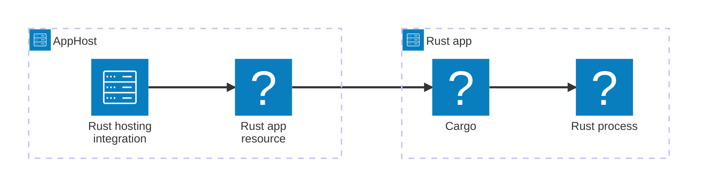

import { Image } from 'astro:assets';
import { LinkButton, Steps } from '@astrojs/starlight/components';
import rustIcon from '@assets/icons/rust-icon.png';

<Image
  src={rustIcon}
  alt="Rust logo"
  width={100}
  height={100}
  fit="contain"
  class:list={'float-inline-left icon'}
  data-zoom-off
/>

[Rust](https://www.rust-lang.org/) is a systems programming language that guarantees memory safety without a garbage collector, which makes it a popular choice for fast, reliable web services, workers, and command-line tools. Rust projects are built and run with [Cargo](https://doc.rust-lang.org/cargo/), Rust's build tool and package manager. The Aspire Rust hosting integration lets you model Cargo apps as first-class resources in your AppHost and connect them to the rest of your app, regardless of the language each part is written in.

:::note[New in Aspire 13.6]
[📦 Aspire.Hosting.Rust](https://www.nuget.org/packages/Aspire.Hosting.Rust) is the official Rust hosting integration. It replaces [📦 CommunityToolkit.Aspire.Hosting.Rust](https://www.nuget.org/packages/CommunityToolkit.Aspire.Hosting.Rust) for Cargo apps in Aspire 13.6 and later. If you use the Community Toolkit package — including its Bacon support, which remains in the Toolkit — see [Migrate from the Community Toolkit](/integrations/frameworks/rust/rust-host/#migrate-from-the-community-toolkit).
:::

## Why use Rust with Aspire

Adding Rust apps through Aspire — rather than starting each `cargo run` by hand and wiring up ports, URLs, and credentials yourself — gives you:

- **Cargo-native configuration.** Aspire runs each app with `cargo run` in its own directory, so Cargo finds the app's manifest, workspace, and lockfile as it does in a terminal. Select features, binaries, examples, workspace members, profiles, and target triples with AppHost methods, and pass your program's own arguments separately.
- **Service discovery and connection information.** Reference a Rust app from another resource — or reference databases, caches, and other services from a Rust app — and Aspire injects URLs and connection details as environment variables that your app reads with `std::env::var`.
- **Telemetry in the dashboard.** Every Rust resource receives the standard OpenTelemetry exporter settings, so an app that exports telemetry with the OpenTelemetry SDK for Rust shows its traces, metrics, and logs in the dashboard. Cargo's build output and your app's console output appear in the dashboard's console logs.
- **Trusted development certificates.** Aspire points OpenSSL and the `rustls-native-certs` crate at a directory that contains the development certificate, so HTTPS calls between local resources work without turning off certificate validation.
- **Debugging.** Debug Rust apps in VS Code with the standard Aspire debugging flow. Aspire builds each app with the same Cargo options that `cargo run` uses, and launches the binary under a native debugger.
- **Publishing without a hand-written Dockerfile.** When you publish, Aspire builds each Rust app into a container image with the `Dockerfile` in the app directory or, when there isn't one, with a multi-stage Dockerfile that it generates. By default, the generated Dockerfile makes a release build — locked to the dependency versions in `Cargo.lock`, when the app has that file — and runs the app as an unprivileged user.

## Prerequisites

- The Rust toolchain, with Cargo 1.71 or later on your `PATH`, for each Rust app that the AppHost runs locally. Install it with [rustup](https://www.rust-lang.org/tools/install). When Aspire generates the Dockerfile to publish an app, it builds the app inside the container image, but it still runs `cargo metadata` on your machine to find the app's binary.
- To debug in VS Code, the [C/C++](https://marketplace.visualstudio.com/items?itemName=ms-vscode.cpptools) extension on Windows, or the [CodeLLDB](https://marketplace.visualstudio.com/items?itemName=vadimcn.vscode-lldb) extension on Linux and macOS.
- The [Aspire CLI](/get-started/install-cli/), along with the other [Aspire prerequisites](/get-started/prerequisites/).

:::note
A C# or TypeScript AppHost can host Rust apps without turning on any experimental features. Writing the AppHost itself in Rust is a separate, experimental scenario that you turn on with the `features.experimentalPolyglot:rust` [configuration setting](/reference/cli/configuration/).
:::

## How the pieces fit together

The Rust integration is a **hosting integration**. You install it in your AppHost and add a resource for each Rust app. When a Rust app starts, Aspire runs it with Cargo, supplies its configuration as environment variables, and shows its logs, status, and telemetry in the dashboard.

```mermaid
architecture-beta

  group apphost(server)[AppHost]
  group rustapp(server)[Rust app]

  service hosting(server)[Rust hosting integration] in apphost
  service resource(logos:rust)[Rust app resource] in apphost
  service toolchain(logos:rust)[Cargo] in rustapp
  service app(logos:rust)[Rust process] in rustapp

  hosting:R --> L:resource
  resource:R --> L:toolchain
  toolchain:R --> L:app
```

There's no Aspire client crate for Rust. Your app reads the environment variables that Aspire injects with `std::env::var`, or with the configuration crate of your choice, and exports telemetry with the OpenTelemetry SDK for Rust.

Getting there is a two-step process: model your Rust apps in the AppHost, then connect them to — and from — the other resources in your app.

<Steps>

1. ### Model Rust apps in your AppHost

    Add the Rust hosting integration to your AppHost, then declare a resource for each Rust app. The [Set up Rust apps in the AppHost](/integrations/frameworks/rust/rust-host/) article walks through every capability — endpoints and health checks, Cargo features, binaries, workspace members, profiles, and target triples, program arguments, certificate trust, debugging, and publishing — with side-by-side TypeScript and C# examples.

    <LinkButton
        variant='secondary'
        iconPlacement='end'
        icon='right-arrow'
        href='/integrations/frameworks/rust/rust-host/'>
        Set up Rust apps in the AppHost
    </LinkButton>

2. ### Connect to and from your Rust apps

    When you reference a Rust app from another resource, Aspire injects the app's URLs into that resource. When you reference other resources from a Rust app, Aspire injects their connection information into the app's environment. See [Connect to Rust apps](/integrations/frameworks/rust/rust-connect/) for the environment variable reference, examples in C#, Go, Python, and TypeScript, and how Rust apps read Aspire configuration and send telemetry to the dashboard.

    <LinkButton
        variant='secondary'
        iconPlacement='end'
        icon='right-arrow'
        href='/integrations/frameworks/rust/rust-connect/'>
        Connect to Rust apps
    </LinkButton>

</Steps>

## See also

- [Learn Rust](https://www.rust-lang.org/learn)
- [The Cargo Book](https://doc.rust-lang.org/cargo/)
- [OpenTelemetry Rust](https://opentelemetry.io/docs/languages/rust/)
- [Aspire integrations overview](/integrations/overview/)
