import { Image } from 'astro:assets';
import { LinkButton, Steps } from '@astrojs/starlight/components';
import kafkaIcon from '@assets/icons/apache-kafka-icon.svg';

<Image
  src={kafkaIcon}
  alt="Apache Kafka logo"
  width={100}
  height={100}
  class:list={'float-inline-left icon'}
  data-zoom-off
/>

[Apache Kafka](https://kafka.apache.org/) is a distributed streaming platform for building real-time data pipelines and streaming applications. The Aspire Apache Kafka integration lets you model a Kafka server as a first-class resource in your AppHost, then hand the connection information to any consuming app — regardless of language.

## Why use Apache Kafka with Aspire

Adding Apache Kafka through Aspire — rather than wiring up containers and connection strings by hand — gives you:

- **Zero-config local development.** Aspire runs Kafka from the [`confluentinc/confluent-local`](https://hub.docker.com/r/confluentinc/confluent-local) container image, automatically configured for local development.
- **Consistent connection info across languages.** Once you reference the Kafka resource from a consuming app, Aspire injects connection properties as environment variables in a predictable format that works from C#, TypeScript, Python, Go, or any other language.
- **Built-in health checks.** The hosting integration automatically registers a health check so the dashboard and your orchestrator can tell when Kafka is ready.
- **Dashboard observability.** The Kafka resource shows up in the Aspire dashboard with logs, status, and telemetry alongside your other services.
- **A first-class C# client integration.** C# apps can use the `Aspire.Confluent.Kafka` package to register producers and consumers through dependency injection, with health checks and OpenTelemetry wired up from the same resource name.
- **Optional Kafka UI.** Add the Kafka UI sub-resource to your AppHost to get a web interface for monitoring and managing your Kafka cluster during development.

## How the pieces fit together

The Apache Kafka integration has two sides: a **hosting integration** that you use in your AppHost to model the Kafka resource, and a **connection story** for consuming apps that reference it.

```mermaid
architecture-beta

  group apphost(server)[AppHost]
  group consumer(server)[Consuming app]

  service hosting(server)[Hosting integration] in apphost
  service kafka(server)[Kafka server] in apphost

  service client(iconoir:server-connection)[Client integration] in consumer
  service app(server)[App] in consumer

  hosting:R --> L:kafka
  kafka:R --> L:client
  client:R --> L:app
```

The **hosting integration** lives in your AppHost project and models the Kafka server as a resource. The **client integration** lives in each consuming app and uses the connection information Aspire injects to talk to Kafka.

Getting there is a two-step process: model the Kafka resource in your AppHost, then connect to it from each app that needs it.

<Steps>

1. ### Model Apache Kafka in your AppHost

    Add the Apache Kafka hosting integration to your AppHost, then declare a Kafka server resource and reference it from the apps that need to produce or consume messages. The [Apache Kafka Hosting integration](/integrations/messaging/apache-kafka/apache-kafka-host/) article walks through every capability — Kafka UI, data volumes, data bind mounts, custom parameters, and more — with side-by-side C# and TypeScript examples.

    <LinkButton
        variant='secondary'
        iconPlacement='end'
        icon='right-arrow'
        href='/integrations/messaging/apache-kafka/apache-kafka-host/'>
        Set up Apache Kafka in the AppHost
    </LinkButton>

2. ### Connect from your consuming app

    When you reference a Kafka resource from a consuming app, Aspire injects its connection information as environment variables. See [Connect to Apache Kafka](/integrations/messaging/apache-kafka/apache-kafka-connect/) for the connection properties reference and per-language examples for C#, Go, Python, and TypeScript — including the full C# client integration with producers and consumers.

    <LinkButton
        variant='secondary'
        iconPlacement='end'
        icon='right-arrow'
        href='/integrations/messaging/apache-kafka/apache-kafka-connect/'>
        Connect to Apache Kafka
    </LinkButton>

</Steps>
