import { Image } from 'astro:assets';
import { Badge, LinkButton, Steps } from '@astrojs/starlight/components';
import lavinmqIcon from '@assets/icons/lavinmq-icon.png';

<Badge text="⭐ Community Toolkit" variant="tip" size="large" />

<Image
  src={lavinmqIcon}
  alt="LavinMQ logo"
  width={100}
  height={100}
  fit="contain"
  class:list={'float-inline-left icon'}
  data-zoom-off
/>

[LavinMQ](https://lavinmq.com/) is a message broker that implements AMQP 0-9-1 and is wire-compatible with RabbitMQ. The Aspire hosting integration runs LavinMQ as a container and exposes its AMQP connection properties to consuming apps.

## Why use LavinMQ with Aspire

- **Container orchestration.** Aspire runs `docker.io/cloudamqp/lavinmq` with AMQP and management endpoints.
- **Connection-property injection.** Referencing the resource provides the host, port, credentials, and AMQP URI to an app.
- **Persistent storage options.** Store broker data in a named volume or a host bind mount.
- **Built-in health checks.** The hosting integration checks the broker through a RabbitMQ-compatible connection.
- **Multi-language clients.** C#, TypeScript, Python, and Go can use established RabbitMQ-compatible AMQP 0-9-1 libraries.

LavinMQ has no dedicated Community Toolkit client package. Use the Aspire RabbitMQ client integration for C# or a RabbitMQ-compatible client for your language.

## How the pieces fit together

```mermaid
architecture-beta

  group apphost(server)[AppHost]
  group consumer(server)[Consuming app]

  service hosting(server)[Hosting integration] in apphost
  service lavinmq(server)[LavinMQ broker] in apphost
  service client(iconoir:server-connection)[AMQP client] in consumer
  service app(server)[Application] in consumer

  hosting:R --> L:lavinmq
  lavinmq:R --> L:client
  client:R --> L:app
```

<Steps>

1. ### Model LavinMQ in the AppHost

   Install the hosting integration, add the broker resource, and configure ports or persistent storage.

   <LinkButton
     variant="secondary"
     iconPlacement="end"
     icon="right-arrow"
     href="/integrations/messaging/lavinmq/lavinmq-host/"
   >
     Set up LavinMQ
   </LinkButton>

2. ### Connect from an app

   Reference the broker from an app and use the injected AMQP URI with a RabbitMQ-compatible client.

   <LinkButton
     variant="secondary"
     iconPlacement="end"
     icon="right-arrow"
     href="/integrations/messaging/lavinmq/lavinmq-connect/"
   >
     Connect to LavinMQ
   </LinkButton>

</Steps>

## See also

- [LavinMQ documentation](https://lavinmq.com/documentation)
- [AMQP 0-9-1 model](https://www.rabbitmq.com/tutorials/amqp-concepts/)
- [RabbitMQ integration](/integrations/messaging/rabbitmq/rabbitmq-get-started/)
- [Aspire Community Toolkit](https://github.com/CommunityToolkit/Aspire)
