import { Image } from 'astro:assets';
import { LinkButton, Steps } from '@astrojs/starlight/components';
import natsIcon from '@assets/icons/nats-icon.png';

<Image
  src={natsIcon}
  alt="NATS logo"
  width={100}
  height={100}
  class:list={'float-inline-left icon'}
  data-zoom-off
/>

[NATS](https://nats.io/) is a high-performance, open-source messaging system for cloud-native applications, IoT messaging, and microservices architectures. It supports both core messaging and, via [JetStream](https://docs.nats.io/nats-concepts/jetstream), persistent streaming with at-least-once delivery guarantees. The Aspire NATS integration lets you model a NATS server as a first-class resource in your AppHost, then hand the connection information to any consuming app — regardless of language.

## Why use NATS with Aspire

Adding NATS through Aspire — rather than wiring up containers and connection strings by hand — gives you:

- **Zero-config local development.** Aspire runs NATS from the [`docker.io/library/nats`](https://hub.docker.com/_/nats) container image with credentials generated automatically for you.
- **Consistent connection info across languages.** Once you reference the NATS resource from a consuming app, Aspire injects connection properties as environment variables in a predictable format that works from C#, TypeScript, Python, Go, or any other language.
- **Built-in health checks.** The hosting integration automatically registers a health check so the dashboard and your orchestrator can tell when NATS is ready.
- **Dashboard observability.** The NATS resource shows up in the Aspire dashboard with logs, status, and telemetry alongside your other services.
- **JetStream support.** Enable persistent streaming with a single call to `WithJetStream` (or `withJetStream`), and combine it with a data volume for durable storage across container restarts.
- **A first-class C# client integration.** C# apps can use the `Aspire.NATS.Net` package for dependency injection, health checks, and OpenTelemetry, all wired up from the same resource name.

## How the pieces fit together

The NATS integration has two sides: a **hosting integration** that you use in your AppHost to model the NATS resource, and a **connection story** for consuming apps that reference it.

```mermaid
architecture-beta

  group apphost(server)[AppHost]
  group consumer(server)[Consuming app]

  service hosting(server)[Hosting integration] in apphost
  service nats(server)[NATS server] in apphost

  service client(iconoir:server-connection)[Client integration] in consumer
  service app(server)[App] in consumer

  hosting:R --> L:nats
  nats:R --> L:client
  client:R --> L:app
```

The **hosting integration** lives in your AppHost project and models the NATS server as a resource. The **client integration** lives in each consuming app and uses the connection information Aspire injects to talk to NATS.

Getting there is a two-step process: model the NATS resource in your AppHost, then connect to it from each app that needs it.

<Steps>

1. ### Model NATS in your AppHost

    Add the NATS hosting integration to your AppHost, then declare a NATS resource and reference it from the apps that need to receive or publish messages. The [NATS Hosting integration](/integrations/messaging/nats/nats-host/) reference walks through every capability — JetStream, data volumes, data bind mounts, and custom parameters — with side-by-side C# and TypeScript examples.

    <LinkButton
        variant='secondary'
        iconPlacement='end'
        icon='right-arrow'
        href='/integrations/messaging/nats/nats-host/'>
        Set up NATS in the AppHost
    </LinkButton>

2. ### Connect from your consuming app

    When you reference a NATS resource from a consuming app, Aspire injects its connection information as environment variables. See [Connect to NATS](/integrations/messaging/nats/nats-connect/) for the connection properties reference and per-language examples for C#, Go, Python, and TypeScript — including the full C# client integration.

    <LinkButton
        variant='secondary'
        iconPlacement='end'
        icon='right-arrow'
        href='/integrations/messaging/nats/nats-connect/'>
        Connect to NATS
    </LinkButton>

</Steps>

## See also

- [NATS documentation](https://docs.nats.io/)
- [JetStream documentation](https://docs.nats.io/nats-concepts/jetstream)
