import { Image } from 'astro:assets';
import { LinkButton, Steps } from '@astrojs/starlight/components';
import rabbitmqIcon from '@assets/icons/rabbitmq-icon.svg';

<Image
  src={rabbitmqIcon}
  alt="RabbitMQ logo"
  width={100}
  height={100}
  class:list={'float-inline-left icon'}
  data-zoom-off
/>

[RabbitMQ](https://www.rabbitmq.com/) is a reliable, open-source message broker that supports multiple messaging protocols and is easy to deploy on cloud environments, on-premises, and on your local machine. The Aspire RabbitMQ integration lets you model a RabbitMQ server as a first-class resource in your AppHost, then hand the connection information to any consuming app — regardless of language.

## Why use RabbitMQ with Aspire

Adding RabbitMQ through Aspire — rather than wiring up containers and connection strings by hand — gives you:

- **Zero-config local development.** Aspire runs RabbitMQ from the [`docker.io/library/rabbitmq`](https://hub.docker.com/_/rabbitmq) container image with credentials generated automatically for you.
- **Consistent connection info across languages.** Once you reference the RabbitMQ resource from a consuming app, Aspire injects connection properties as environment variables in a predictable format that works from C#, TypeScript, Python, Go, or any other language.
- **Built-in health checks.** The hosting integration automatically registers a health check so the dashboard and your orchestrator can tell when RabbitMQ is ready.
- **Dashboard observability.** The RabbitMQ resource shows up in the Aspire dashboard with logs, status, and telemetry alongside your other services.
- **A first-class C# client integration.** C# apps can use the `Aspire.RabbitMQ.Client` package for dependency injection, health checks, and OpenTelemetry, all wired up from the same resource name.
- **Optional management plugin.** Add the RabbitMQ management UI as a sub-resource with a single call, giving you browser-based monitoring during local development.

## How the pieces fit together

The RabbitMQ integration has two sides: a **hosting integration** that you use in your AppHost to model the RabbitMQ resource, and a **connection story** for consuming apps that reference it.

```mermaid
architecture-beta

  group apphost(server)[AppHost]
  group consumer(server)[Consuming app]

  service hosting(server)[Hosting integration] in apphost
  service rabbitmq(server)[RabbitMQ server] in apphost

  service client(iconoir:server-connection)[Client integration] in consumer
  service app(server)[App] in consumer

  hosting:R --> L:rabbitmq
  rabbitmq:R --> L:client
  client:R --> L:app
```

The **hosting integration** lives in your AppHost project and models the RabbitMQ server as a resource. The **client integration** lives in each consuming app and uses the connection information Aspire injects to send and receive messages.

Getting there is a two-step process: model the RabbitMQ resource in your AppHost, then connect to it from each app that needs it.

<Steps>

1. ### Model RabbitMQ in your AppHost

    Add the RabbitMQ hosting integration to your AppHost, then declare a RabbitMQ resource and reference it from the apps that need to talk to the broker. The [RabbitMQ Hosting integration](/integrations/messaging/rabbitmq/rabbitmq-host/) article walks through every capability — data volumes, data bind mounts, custom parameters, and the management plugin — with side-by-side C# and TypeScript examples.

    <LinkButton
        variant='secondary'
        iconPlacement='end'
        icon='right-arrow'
        href='/integrations/messaging/rabbitmq/rabbitmq-host/'>
        Set up RabbitMQ in the AppHost
    </LinkButton>

2. ### Connect from your consuming app

    When you reference a RabbitMQ resource from a consuming app, Aspire injects its connection information as environment variables. See [Connect to RabbitMQ](/integrations/messaging/rabbitmq/rabbitmq-connect/) for the connection properties reference and per-language examples for C#, Go, Python, and TypeScript — including the full C# client integration.

    <LinkButton
        variant='secondary'
        iconPlacement='end'
        icon='right-arrow'
        href='/integrations/messaging/rabbitmq/rabbitmq-connect/'>
        Connect to RabbitMQ
    </LinkButton>

</Steps>

## See also

- [RabbitMQ documentation](https://www.rabbitmq.com/docs/)
- [AMQP 0-9-1 protocol overview](https://www.rabbitmq.com/tutorials/amqp-concepts/)
