import { Image } from 'astro:assets';
import { LinkButton, Steps } from '@astrojs/starlight/components';
import seqIcon from '@assets/icons/seq-icon.png';

<Image
  src={seqIcon}
  alt="Seq logo"
  width={100}
  height={100}
  class:list={'float-inline-left icon'}
  data-zoom-off
/>

[Seq](https://datalust.co/seq) is the intelligent search, analysis, and alerting server built for structured log data. The Aspire Seq integration lets you model a Seq server as a first-class resource in your AppHost, then hand the connection information to any consuming app — regardless of language.

## Why use Seq with Aspire

Adding Seq through Aspire — rather than wiring up containers and connection strings by hand — gives you:

- **Zero-config local development.** Aspire runs Seq from the [`docker.io/datalust/seq`](https://hub.docker.com/r/datalust/seq) container image with a persistent lifetime so your log history survives restarts.
- **Consistent connection info across languages.** Once you reference the Seq resource from a consuming app, Aspire injects connection properties as environment variables in a predictable format that works from C#, TypeScript, Python, Go, or any other language.
- **Dashboard observability.** The Seq resource shows up in the Aspire dashboard with logs and status alongside your other services.
- **A first-class C# client integration.** C# apps can use the `Aspire.Seq` package for automatic OpenTelemetry log and trace export to Seq, all wired up from the same resource name.

## How the pieces fit together

The Seq integration has two sides: a **hosting integration** that you use in your AppHost to model the Seq server resource, and a **connection story** for consuming apps that reference it.

```mermaid
architecture-beta

  group apphost(server)[AppHost]
  group consumer(server)[Consuming app]

  service hosting(server)[Hosting integration] in apphost
  service seq(server)[Seq server] in apphost

  service client(iconoir:server-connection)[Client integration] in consumer
  service app(server)[App] in consumer

  hosting:R --> L:seq
  seq:R --> L:client
  client:R --> L:app
```

The **hosting integration** lives in your AppHost project and models the Seq server as a resource. The **client integration** lives in each consuming app and uses the connection information Aspire injects to send logs and traces to Seq.

Getting there is a two-step process: model the Seq resource in your AppHost, then connect to it from each app that needs it.

<Steps>

1. ### Model Seq in your AppHost

    Add the Seq hosting integration to your AppHost, then declare a Seq resource and reference it from the apps that need to send telemetry. The [Seq hosting integration](/integrations/observability/seq/seq-host/) article walks through every capability — data volumes, data bind mounts, EULA acceptance, and endpoints — with side-by-side C# and TypeScript examples.

    <LinkButton
        variant='secondary'
        iconPlacement='end'
        icon='right-arrow'
        href='/integrations/observability/seq/seq-host/'>
        Set up Seq in the AppHost
    </LinkButton>

2. ### Connect from your consuming app

    When you reference a Seq resource from a consuming app, Aspire injects its connection information as environment variables. See [Connect to Seq](/integrations/observability/seq/seq-connect/) for the connection properties reference and per-language examples for C#, Go, Python, and TypeScript — including the full C# client integration that wires up OpenTelemetry export.

    <LinkButton
        variant='secondary'
        iconPlacement='end'
        icon='right-arrow'
        href='/integrations/observability/seq/seq-connect/'>
        Connect to Seq
    </LinkButton>

</Steps>

## See also

- [Seq documentation](https://docs.datalust.co/)
- [Seq EULA](https://datalust.co/doc/eula-current.pdf)
