import { Aside, Tabs, TabItem } from '@astrojs/starlight/components';

Aspire integrations are AppHost packages that add APIs for defining resources your app depends on, such as databases, caches, messaging systems, and cloud services.

<Aside type="tip">
  Always strive to use the latest version of Aspire integrations to take
  advantage of the latest features, improvements, and security updates.
</Aside>

## What integrations do

Integrations tell Aspire how to create, connect to, and pass connection details for resources in your app model. An integration can start a local resource, create or connect to a cloud resource, or point to an existing service such as a local SQL server.

In the AppHost, integrations add methods to `IDistributedApplicationBuilder` so you can describe those resources in the [_app model_](/architecture/overview/#app-model-architecture). Key characteristics include:

- Tagged with `aspire`, `integration`, and `hosting` in [official packages](/integrations/gallery/?search=hosting)
- Available from both official Aspire releases and community contributions through the Community Toolkit
- Define resources for different services and platforms
- Pass connection information to apps that reference those resources

## Wiring resources to consuming projects with references

After you create resources in the AppHost, you can pass them to apps such as APIs or web front ends by calling the "with reference" APIs. A reference tells Aspire that an app depends on a resource. When Aspire starts, it gives the app the connection details it needs by setting environment variables.

```mermaid
architecture-beta

  group apphost(server)[AppHost]
  group consumer(server)[Consuming app]

  service pghosting(server)[PostgreSQL hosting integration] in apphost
  service postgres(logos:postgresql)[PostgreSQL server] in apphost
  service redishosting(server)[Redis hosting integration] in apphost
  service redis(logos:redis)[Redis cache] in apphost

  service app(server)[App] in consumer

  pghosting:R --> L:postgres
  postgres:R --> L:app

  redishosting:R --> L:redis
  redis:R --> T:app
```

<Tabs syncKey="aspire-lang">
<TabItem id="csharp" label="C#">



```csharp title="C# — AppHost.cs"
var builder = DistributedApplication.CreateBuilder(args);

var cache = builder.AddRedis("cache");
var db = builder.AddPostgres("postgres").AddDatabase("appdb");

builder.AddProject<Projects.Api>("api")
    .WithReference(cache)
    .WithReference(db);

builder.Build().Run();
```

</TabItem>
<TabItem id="typescript" label="TypeScript">


```typescript title="TypeScript — apphost.ts" twoslash
import { createBuilder } from './.modules/aspire.js';

const builder = await createBuilder();

const cache = await builder.addRedis("cache");
const db = (await builder.addPostgres("postgres")).addDatabase("appdb");

const api = await builder.addProject("api", "../Api/Api.csproj");
await api.withReference(cache);
await api.withReference(db);

await builder.build().run();
```

</TabItem>
</Tabs>

### Environment variables set by references

The environment variables Aspire sets depend on the type of resource being referenced. For example:

- **Connection string resources**: Aspire sets a `ConnectionStrings__{name}` environment variable, where `{name}` matches the resource name. For example, referencing a resource named `"cache"` injects `ConnectionStrings__cache=localhost:54321`, where the value is the connection string.
- **Service endpoint resources**: Aspire sets `{NAME}_{SCHEME}` variables for app endpoints. For example, referencing a project named `apiservice`, that is available on port 7001, sets `APISERVICE_HTTPS=https://localhost:7001`.

Other environment variables often include credentials, port numbers, and other connection details.

### Read connection details from environment variables

Any application can read these environment variables to connect to its dependencies directly, without any Aspire-specific libraries.

<Tabs syncKey="consuming-project-lang">
<TabItem id="csharp" label="C#">

```csharp title="C# — Program.cs"
// Read the environment variable directly
var redisConnectionString = Environment.GetEnvironmentVariable("ConnectionStrings__cache");
```

</TabItem>
<TabItem id="typescript" label="TypeScript">

```typescript title="TypeScript — app.ts"
// Read the environment variable directly
const redisConnectionString = process.env["ConnectionStrings__cache"];
```

</TabItem>
<TabItem id="go" label="Go">

```go title="Go — main.go"
import "os"

// Read the environment variable directly
redisConnectionString := os.Getenv("ConnectionStrings__cache")
```

</TabItem>
<TabItem id="python" label="Python">

```python title="Python — app.py"
import os

# Read the environment variable directly
redis_connection_string = os.getenv("ConnectionStrings__cache")
```

</TabItem>
</Tabs>

## What an integration can do

Not every integration provides every capability. Each package supports the capabilities that make sense for the resource it models. Depending on the package, an integration can:

- **Define resources**: Add containers, cloud resources, executable resources, or references to existing infrastructure to the AppHost model.
- **Share connection information**: Pass endpoints, connection strings, credentials, and other resource details to consuming apps through references.
- **Support local development**: Run common dependencies locally and view their state in the Aspire Dashboard.
- **Support deployment**: Keep resource relationships in the app model so deployment tooling can understand how apps and resources connect.

## Versioning considerations

Aspire integrations are updated each release to use current stable versions of the resources they depend on. For example, when a container image has a new version, the related integration can update to use it. The Aspire update type (major, minor, patch) doesn't necessarily match the update type of the underlying resource. For example, an Aspire patch release might include a major update to a container image when necessary.

When a resource has a major breaking change, Aspire may temporarily provide version-specific integration packages to make upgrades easier.
