```mermaid
architecture-beta

  group apphost(server)[AppHost]
  group consumer(server)[Consuming app]

  service pghosting(server)[PostgreSQL hosting integration] in apphost
  service postgres(logos:postgresql)[PostgreSQL server] in apphost
  service redishosting(server)[Redis hosting integration] in apphost
  service redis(logos:redis)[Redis cache] in apphost

  service app(server)[App] in consumer

  pghosting:R --> L:postgres
  postgres:R --> L:app

  redishosting:R --> L:redis
  redis:R --> T:app
```

import { Aside, Tabs, TabItem } from '@astrojs/starlight/components';
import PivotSelector from '@components/PivotSelector.astro';
import Pivot from '@components/Pivot.astro';

Aspire integrations are a curated suite of packages that make it easy to connect your cloud-native applications with popular services like Redis and PostgreSQL. Each integration provides essential cloud-native capabilities through automatic setup or standardized configuration.

<Aside type="tip">
  Always strive to use the latest version of Aspire integrations to take
  advantage of the latest features, improvements, and security updates.
</Aside>

## Integration responsibilities

Most Aspire integrations are made up of two separate libraries, each with a different responsibility. One type represents resources within the _app host_ project—known as [hosting integrations](#hosting-integrations). The other type of integration represents client libraries that connect to the resources modeled by hosting integrations, and they're known as [client integrations](#client-integrations).

### Hosting integrations

Hosting integrations configure applications by provisioning resources (like containers or cloud resources) or pointing to existing instances (such as a local SQL server). These packages model various services, platforms, or capabilities, including caches, databases, logging, storage, and messaging systems.

Hosting integrations extend the `IDistributedApplicationBuilder` interface to enable the _app host_ project to express resources within its [_app model_](/architecture/overview/#app-model-architecture). Key characteristics include:

- Tagged with `aspire`, `integration`, and `hosting` in [official packages](/integrations/gallery/?search=hosting)
- Available from both official Aspire releases and community contributions through the Community Toolkit
- Enable resource modeling for various services and platforms

### Client integrations

Client integrations wire up client libraries to dependency injection (DI), define configuration schema, and add _health checks_, _resiliency_, and _telemetry_ where applicable. Aspire client integration libraries are prefixed with `Aspire.` and then include the full package name that they integrate with, such as `Aspire.StackExchange.Redis`.

These packages configure existing client libraries to connect to hosting integrations. Key characteristics include:

- Extend the `IHostApplicationBuilder` interface for client-consuming projects (web apps, APIs)
- Tagged with `aspire`, `integration`, and `client` in [official packages](/integrations/gallery/?search=client)
- Available from both official Aspire releases and community contributions through the Community Toolkit

### Relationship between hosting and client integrations

Hosting and client integrations work together but are **not** coupled and can be used independently. Configuration via environment variables connects client integrations to their corresponding hosting integrations, with the AppHost project managing this connection.

## Wiring resources to consuming projects with references

Once you've created resources, such as databases or messaging systems, by setting up hosting integrations in the AppHost, you can pass those resources to consuming projects, such as APIs or web apps, by calling the "with reference" APIs. These methods express an explicit dependency between a resource and a consuming project. When Aspire starts, it injects connection information as environment variables into the consuming project so it can locate and connect to that resource.

```mermaid
architecture-beta

  group apphost(server)[AppHost]
  group consumer(server)[Consuming app]

  service pghosting(server)[PostgreSQL hosting integration] in apphost
  service postgres(logos:postgresql)[PostgreSQL server] in apphost
  service redishosting(server)[Redis hosting integration] in apphost
  service redis(logos:redis)[Redis cache] in apphost

  service pgclient(iconoir:server-connection)[PostgreSQL client integration] in consumer
  service app(server)[App] in consumer
  service redisclient(iconoir:server-connection)[Redis client integration] in consumer

  pghosting:R --> L:postgres
  postgres:R --> L:pgclient
  pgclient:R --> L:app

  redishosting:R --> L:redis
  redis:R --> L:redisclient
  redisclient:R --> T:app
```

<Tabs syncKey="aspire-lang">
<TabItem id="csharp" label="C#">



```csharp title="C# — AppHost.cs"
var builder = DistributedApplication.CreateBuilder(args);

var cache = builder.AddRedis("cache");
var db = builder.AddPostgres("postgres").AddDatabase("appdb");

builder.AddProject<Projects.Api>("api")
    .WithReference(cache)
    .WithReference(db);

builder.Build().Run();
```

</TabItem>
<TabItem id="typescript" label="TypeScript">



```typescript title="TypeScript — apphost.ts" twoslash
import { createBuilder } from './.modules/aspire.js';

const builder = await createBuilder();

const cache = await builder.addRedis("cache");
const db = (await builder.addPostgres("postgres")).addDatabase("appdb");

const api = await builder.addProject("api", "../Api/Api.csproj");
await api.withReference(cache);
await api.withReference(db);

await builder.build().run();
```

</TabItem>
</Tabs>

### Environment variables injected with references

The environment variables Aspire injects depend on the type of resource being referenced. For example:

- **Connection string resources**: Aspire sets a `{NAME}_{PROPERTY}` environment variables, where `{NAME}` matches the resource name. For example, referencing a resource named `"cache"`, that is available on port 6379, and has the password "Passw0rd", injects `CACHE_URI=redis://:Passw0rd@localhost:6379`.
- **Service endpoint resources**: Aspire sets `{NAME}_{SCHEME}` variables used for service discovery. For example, referencing a project named `apiservice`, that is available on port 7001, injects `APISERVICE_HTTPS=https://localhost:7001`.

Other environment variables often include credentials, port numbers, and other connection details.

### Consuming the injected variables

Any application can read these environment variables to connect to its dependencies directly, without any Aspire-specific libraries.

<Tabs syncKey="consuming-project-lang">
<TabItem id="csharp" label="C#">

If your consuming project is written in C#, you have an additional option: [**Aspire client integrations**](#client-integrations):

```csharp title="C# — Program.cs (consuming .NET project)"
var builder = WebApplication.CreateBuilder(args);

// Client integration reads connection string injected by WithReference
builder.AddRedisClient(connectionName: "cache");

var app = builder.Build();
```

</TabItem>
<TabItem id="typescript" label="TypeScript">

```typescript title="TypeScript — app.ts"
// Read the injected environment variable directly
const redisUrl = process.env["ConnectionStrings__cache"];
```

</TabItem>
<TabItem id="go" label="Go">

```go title="Go — main.go"
import "os"

// Read the injected environment variable directly
redisURL := os.Getenv("ConnectionStrings__cache")
```

</TabItem>
<TabItem id="python" label="Python">

```python title="Python — app.py"
import os

# Read the injected environment variable directly
redis_url = os.getenv("ConnectionStrings__cache")
```

</TabItem>
</Tabs>

## Integration features

When you add a client integration to a project within your Aspire solution, _service defaults_ are automatically applied to that project; meaning the Service Defaults project is referenced and the `AddServiceDefaults` extension method is called. These defaults are designed to work well in most scenarios and can be customized as needed. The following service defaults are applied:

- **Observability and telemetry**: Automatically sets up logging, tracing, and metrics configurations:
  - **Logging**: A technique where code is instrumented to produce logs of interesting events that occurred while the program was running.
  - **Tracing**: A specialized form of logging that helps you localize failures and performance issues within applications distributed across multiple machines or processes.
  - **Metrics**: Numerical measurements recorded over time to monitor application performance and health. Metrics are often used to generate alerts when potential problems are detected.

- **Health checks**: Exposes HTTP endpoints to provide basic availability and state information about an app. Health checks are used to influence decisions made by container orchestrators, load balancers, API gateways, and other management services.
- **Resiliency**: The ability of your system to react to failure and still remain functional. Resiliency extends beyond preventing failures to include recovering and reconstructing your cloud-native environment back to a healthy state.

## Versioning considerations

Hosting and client integrations are updated each release to target the latest stable versions of dependent resources. When container images are updated with new image versions, the hosting integrations update to these new versions. Similarly, when a new package version is available for a dependent client library, the corresponding client integration updates to the new version. This ensures the latest features and security updates are available to applications. The Aspire update type (major, minor, patch) doesn't necessarily indicate the type of update in dependent resources. For example, a new major version of a dependent resource may be updated in a Aspire patch release, if necessary.

When major breaking changes happen in dependent resources, integrations may temporarily split into version-dependent packages to ease updating across the breaking change.
