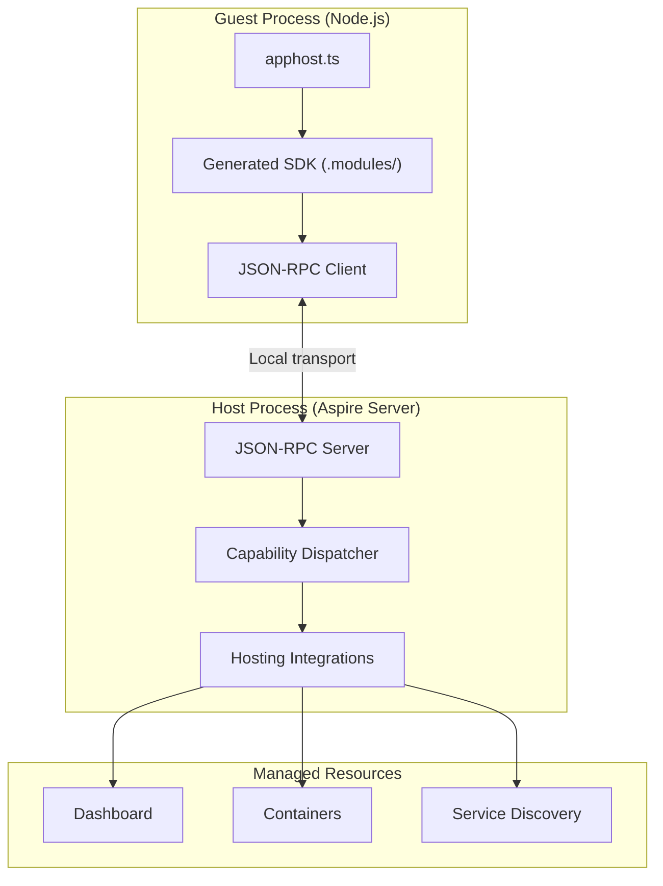

import LearnMore from '@components/LearnMore.astro';

Aspire は複数の言語で AppHost を記述することをサポートしています。オーケストレーションエンジンは .NET 上に構築されていますが、ゲスト/ホストアーキテクチャにより、現在は TypeScript で記述された AppHost が、そして将来は他の言語で書かれた AppHost が、Aspire インテグレーション、サービス検知、およびダッシュボードにアクセスできます。

## 共有バックエンドが必要な理由

Aspire のホスティングインテグレーションとデプロイパブリッシャーは .NET で記述されており、ローカルオーケストレーション、診断、パブリッシングに必要なランタイム動作がすでに蓄積されています。それらのインテグレーションをゲスト言語ごとに書き直すと、大量の動作が重複し、メンテナンスコストが大幅に増加します。

代わりに、ゲスト言語は `addRedis`、`addPostgres`、`withReference` などのリソースを宣言するだけで、.NET ホストがコンテナの起動、サービス検知の配線、正常性チェックの実行、デプロイ成果物の生成などのオーケストレーション処理を担当します。トレードオフはローカル IPC ホップですが、複数の言語で同じインテグレーションサーフェスを個別に維持するよりもはるかにコストが低くなります。

## ゲスト/ホストモデル

TypeScript AppHost を実行すると、Aspire CLI は 2 つのプロセスをオーケストレーションします。

- **ゲスト**: Node.js 上で動作する `apphost.ts` プロセス
- **ホスト**: .NET 上で動作する Aspire オーケストレーションサーバー

ゲストはローカルトランスポート経由で JSON-RPC を使用してホストと通信します。macOS と Linux では Unix ソケット、Windows では名前付きパイプを使用します。コードが `addRedis()` や `withReference()` などのメソッドを呼び出すと、生成された SDK がそれらの呼び出しを RPC リクエストに変換します。

## 起動シーケンス

1. CLI が必要なホスティングパッケージを含むホストプロセスを準備します。
2. ATS スキャナーがエクスポート用のアセンブリを検査し、TypeScript SDK を `.modules/` に生成します。
3. CLI がホストプロセスを起動し、ローカルソケットまたはパイプエンドポイントを作成します。
4. CLI がゲストプロセスを起動し、環境変数を通じて接続詳細を渡します。
5. ゲストが接続し、`createBuilder`、`addRedis`、`build`、`run` などの機能を呼び出します。
6. ホストがリソースをオーケストレーションし、ダッシュボードを起動して、アプリケーションのライフサイクルを管理します。

## トークンベース認証

ゲストプロセスは、そのセッションのために生成されてスタートアップ時に環境変数を通じて渡されるワンタイムトークンを使用してホストに対して認証を行います。ローカルトランスポートはオペレーティングシステムのファイルパーミッションによっても保護されているため、同じユーザーとして実行されているプロセスのみが接続できます。ゲストからホストへの通信にはパブリックネットワークポートは関与しません。

## Aspire 型システム

Aspire 型システム (ATS) は、.NET とゲスト言語をつなぐコントラクトです。境界を越えるすべてのエクスポート型は、そのアセンブリと型名から派生したポータブルな型 ID を取得します。

### 型カテゴリ

| カテゴリ | 説明 | シリアル化 |
|----------|-------------|---------------|
| **Primitive** | `string`、`int`、`bool`、`double`、およびそれに類するスカラー型 | JSON ネイティブ値 |
| **Enum** | .NET 列挙型 | 文字列メンバー名 |
| **Handle** | ホスト側オブジェクトへの不透明な参照 | JSON ハンドルエンベロープ |
| **DTO** | エクスポートとしてマークされたデータ転送オブジェクト | JSON オブジェクト |
| **Callback** | ゲスト提供のデリゲート関数 | コールバック識別子 |
| **Array** | イミュータブルコレクション | JSON 配列 |
| **List / dictionary** | ミュータブルコレクション | プロパティにはハンドル、パラメーターには JSON |

### ATS から TypeScript へのマッピング

| .NET 型 | TypeScript 表現 |
|----------|---------------------------|
| Primitives | ネイティブ TypeScript プリミティブ |
| Enums | 文字列リテラルユニオン |
| Resource types | フルーエントメソッドを持つ型付きハンドルオブジェクト |
| DTOs | JSON としてシリアル化されるインターフェイス |
| Collections | 配列および `Record<string, T>` |
| Delegates | 非同期コールバック関数 |

リソース型はハンドルで渡されます。実際のインスタンスはホストプロセスに残り、TypeScript SDK は参照を保持してメソッド呼び出しを JSON-RPC リクエストとしてディスパッチします。

## ポリモーフィズムのフラット化

.NET API は継承、インターフェイス、ジェネリクスに依存しています。ゲスト SDK はその完全な形状を直接公開する必要はありません。スキャン中に ATS がエクスポートされた型システムをフラット化することで、生成されたゲスト API が使いやすくなります。

- 具象型は適用可能なすべての機能を受け取ります。
- インターフェイスの関係は直接呼び出し可能なメンバーに展開されます。
- ジェネリクス制約はエクスポート可能な具象サーフェスに解決されます。

このフラット化により、`RedisResource` などのリソースは、ゲスト言語に元の継承ツリーのモデリングを強制することなく、共有インターフェイスからのフルーエントメソッドを Redis 固有の API とともに公開できます。

## SDK 生成

TypeScript SDK はホスティングインテグレーションのアセンブリから生成されます。`aspire add` でインテグレーションを追加すると、CLI は次の処理を行います。

1. インテグレーションアセンブリを読み込みます。
2. エクスポートされたメソッドと型をスキャンします。
3. ポリモーフィズムのフラット化を含む ATS ルールを適用します。
4. 型付き TypeScript ラッパーを `.modules/` に出力します。

これにより SDK は .NET 実装と同期が保たれます。インテグレーション作者は TypeScript バインディングを手書きする必要はなく、.NET API をエクスポートすれば CLI がゲストサーフェスを自動的に生成します。

<LearnMore>
  ホスティングインテグレーションを構築していて TypeScript AppHost で動作させたい場合は、
  [マルチ言語インテグレーション](/ja/extensibility/multi-language-integration-authoring/) を参照してください。
</LearnMore>

## 同じモデル、異なる構文

AppHost モデルは言語に関係なく同じです。TypeScript AppHost は C# AppHost と同じリソース、参照、依存グラフを定義します。違いはオーサリング構文です。

| 概念 | C# | TypeScript |
|---------|----|------------|
| ビルダーを作成 | `DistributedApplication.CreateBuilder(args)` | `await createBuilder()` |
| リソースを追加 | `builder.AddRedis("cache")` | `await builder.addRedis("cache")` |
| 参照 | `.WithReference(db)` | `.withReference(db)` |
| 待機 | `.WaitFor(api)` | `.waitFor(api)` |
| ビルドして実行 | `builder.Build().Run()` | `await builder.build().run()` |

生成されるダッシュボード、サービス検知の動作、正常性チェック、およびデプロイ成果物は、すべて同じホスト側オーケストレーションエンジンから提供されます。

## 関連項目

- [最初のアプリを構築する](/ja/get-started/first-app/?lang=typescript) — TypeScript AppHost で始める
- [リソースモデル](/ja/architecture/resource-model/) — Aspire がリソースと関係をモデル化する方法を理解する
- [マルチ言語インテグレーション](/ja/extensibility/multi-language-integration-authoring/) — インテグレーションをマルチ言語 AppHost で動作させる
