import { Aside, Tabs, TabItem } from '@astrojs/starlight/components';

Aspire は、所有、包含、グループ化を表現するために、リソース間の **親子関係** をモデル化できます。

親子関係には、2 つの目的があります:

- **ライフサイクル包含**: 子の実行は親に結び付けられ、開始、停止、障害は親から子へ自動的に連鎖します。
- **ダッシュボード可視化**: ダッシュボードや可視化で子が親の **下にネスト** されて表示され、可読性が向上します。

### ライフサイクル包含

リソースが `IResourceWithParent` インターフェイスを実装すると、**真の包含** が宣言されます。つまり、そのライフサイクルは親によって制御されます:

- **起動**: 子リソースは、親が起動した後にのみ起動します（ただし準備完了は独立しています）。
- **停止**: 親が停止または削除されると、子も自動的に停止されます。
- **障害伝播**: 親が終端障害状態（`FailedToStart` など）に入ると、依存する子は停止されます。

<Aside type="note">
  ログ用サイドカー コンテナーは、メイン アプリケーション
  コンテナーのライフサイクルに結び付いており、メイン アプリが停止すると、ログ用サイドカーも終了します。
</Aside>

### 視覚的グループ化（ライフサイクルへの影響なし）

Aspire は、リソース構築時に `WithParentRelationship()` メソッドを使うことで、**視覚専用の親子関係** もサポートします。

視覚的関係:

- **ダッシュボード レイアウトのみに** 影響します。
- **ライフサイクルには影響しません**。リソースは運用上独立しています。
- 関連コンポーネントを論理的にまとめることで **明確性** を高めます。

<Aside type="tip">
  Redis データベース コンテナーと Redis Commander 管理 UI コンテナーは、
  起動が独立していても視覚的にグループ化できます。
</Aside>

### 手動リレーションシップ — 推論なし

Aspire は、名前、依存関係、ネットワーク リンクに基づいて親子関係を自動推論 **しません**。

関係は、次のいずれかで **明示的に宣言** する必要があります:

- **`IResourceWithParent` を実装**: ライフサイクル依存と視覚的ネストを作成します。
- **`.WithParentRelationship()` を使用**: 視覚的ネストのみを作成します。

この明示性により、開発者はリソースの包含と表示を完全に制御できます。

### 実運用シナリオ

次のシナリオは、Aspire が親子関係をどのようにモデル化するかを示しています:

| シナリオ                                        | 親                  | 子                     |
| ----------------------------------------------- | ------------------ | ---------------------- |
| ログ用サイドカーを持つメイン アプリ コンテナー | App コンテナー      | Fluentd コンテナー      |
| 管理ダッシュボード付きデータベース             | Database コンテナー | Admin UI コンテナー     |
| 関連する正常性モニターを持つマイクロサービス   | API コンテナー      | Health probe コンテナー |

## 値と参照

Aspire では、構成、接続の詳細、分散リソース間の依存関係を **構造化値** でモデル化します。これらの値は、単なる文字列としてではなく関係を明示的に捉えるため、アプリケーション グラフは **可搬性が高く、検査可能で、進化可能** になります。

Aspire は、これらの関係を **異種混在の有向非巡回グラフ（<abbr title="Directed Acyclic Graph" data-tooltip-placement="top">DAG</abbr>）** で表現します。このグラフは依存順序だけでなく、構成、接続、実行時動作という複数の抽象レベルで **構造化値** がリソース間をどのように渡るかも追跡します。

```csharp title="C# — AppHost.cs"
var builder = DistributedApplication.CreateBuilder(args);

var db = builder.AddPostgres("pg");
var api = builder.AddProject("api").WithReference(db);
var web = builder.AddNpmApp("web").WithReference(api);

builder.Build().Run();
```



```mermaid
architecture-beta

  service db(logos:postgresql)[pg]
  service epr(iconoir:server-connection)[Endpoint Reference]
  service api(logos:dotnet)[api]
  service ctr(iconoir:server-connection)[Connection String Reference]
  service frontend(logos:react)[web]

  db:L <-- R:ctr
  ctr:L <-- R:api
  api:L <-- R:epr
  epr:L <-- R:frontend
```

### 特別なケース: エンドポイント

通常、リソース参照は非巡回グラフを形成し、**循環は許可されません**。ただし、**エンドポイント参照は特別扱い** され、意図的に **循環を形成できる** 場合があります。

エンドポイントは **外部エンティティ** としてモデル化されます:

- リソース依存グラフにおける **エッジではありません**。
- 次のような現実的な相互参照を可能にします:
  - フロントエンド アプリと OIDC サーバーが互いの URL（リダイレクト、ログイン コールバック）を参照する。
  - フロントエンド URL を参照する CORS 設定をバックエンドが公開する。

<Aside type="tip">
  エンドポイントは厳密な依存エッジとは別に管理され、
  現実的で柔軟なサービス接続を可能にします。
</Aside>

### DAG が形成される仕組み

リソースは次を通じて互いに接続されます:

- **`WithReference()` 呼び出し**: 直接的なリソース間依存。
- **環境変数と CLI 引数**: 構造化参照を含む構成値。
- **その他の構成ソース**: 構造化値参照で設定される値。

各参照はグラフに **エッジを追加** し、Aspire は次を可能にします:

- 依存順序の追跡。
- サービス間での構造化値のクリーンな伝播。
- 実行前のアプリケーション整合性の検証。

<Aside type="note">
  Aspire は参照を **自動推論しません**。すべての値フローは
  開発者が明示的に記述する必要があります。
</Aside>

### 構造化値とリテラル値

Aspire は、**構造化値** と **リテラル値** を区別します。

- **構造化値** は意味を保持します（例: 「これはサービス URL」対「これは生の文字列」）。
- **リテラル値** は不活性で、モードをまたいでそのまま運ばれます。

公開時と実行時には:

- 構造化値は、可能であれば **解決** され、またはターゲット成果物（環境変数、引数値など）へ **変換** されます。
- リテラル値は単純にコピーされます。

<Aside type="caution">
  **値を早期にフラット化すると、可搬性、環境置換、
  クロスプラットフォーム互換性が失われます。** Aspire はグラフ忠実性を維持するため、
  可能な限りフラット化を遅延させます。
</Aside>

### 値プロバイダーと遅延評価

Aspire の各構造化値型は、2 つの基本インターフェイスを実装します:

| インターフェイス             | 使用タイミング | 目的                                                                                  |
| ----------------------------- | ------------ | --------------------------------------------------------------------------------- |
| `IValueProvider`              | Run mode     | アプリケーション起動時にライブ値を解決します。                                     |
| `IManifestExpressionProvider` | Publish mode | 配置成果物に構造化式（`{pg.outputs.url}` のような）を出力します。                 |

この二重インターフェイス モデルは、**遅延評価** を可能にします:

- **publish** 中は、構造化プレースホルダーが出力され、実行時値はまだ解決されません。
- **run** 中は、構造化参照が URL、ポート、接続文字列などのライブ値へ解決されます。

内部的には、値プロバイダーはアプリケーション グラフ構築中に、環境変数、CLI 引数、構成フィールド、その他の構造化出力へ関連付けられます。

<Aside type="note">
  遅延評価により、Aspire アプリケーションは **安全に公開** でき、
  **柔軟にデプロイ** でき、環境をまたいで **一貫して実行** できます。
</Aside>

### 主要な値型（拡張）

| 型                            | 表すもの                                              | Run Mode                                | Publish Mode                                               |
| ----------------------------- | ----------------------------------------------------- | --------------------------------------- | ---------------------------------------------------------- |
| `string`                      | リテラル文字列値。                                    | 同じリテラル。                          | 同じリテラル。                                             |
| `EndpointReference`           | 別リソース上の名前付きエンドポイントへのリンク。      | 具体 URL（`http://localhost:5000`）。   | ターゲット固有のエンドポイント変換（DNS、ingress など）。 |
| `EndpointReferenceExpression` | エンドポイントのプロパティ（`Host`, `Port`, `Scheme`）。 | 具体値。                             | プラットフォーム固有の変換。                               |
| `ConnectionStringReference`   | リソース接続文字列へのシンボリック ポインター。       | 具体文字列。                            | トークンまたは外部化シークレット。                         |
| `ParameterResource`           | 外部入力、シークレット、または設定。                  | ローカル開発値または環境参照。          | 置換用プレースホルダー `${PARAM}`。                        |
| `ReferenceExpression`         | 参照を埋め込んだ複合文字列。                          | 具体的な書式済み文字列。                | 置換用に保持された書式文字列。                             |

## `ReferenceExpression`

`ReferenceExpression` は、補間文字列の中にエンドポイント、パラメーター、接続文字列などの **構造化値オブジェクト** を保持し、安全なタイミングまで評価を遅延させます。

Aspire はモデルを **2 つの明確なモード** で評価します:

| フェーズ      | `ReferenceExpression` の結果                                     |
| ----------- | ----------------------------------------------------------------------- |
| **Publish** | 発行先固有のプレースホルダー テキスト（例: `{api.bindings.http.host}`）。 |
| **Run**     | `localhost` などの具体値。                                               |

**例 — `ReferenceExpression` の使用:**

```csharp title="C# — AppHost.cs"
var ep = api.GetEndpoint("http");

builder.WithEnvironment("HEALTH_URL",
    ReferenceExpression.Create(
        $"https://{ep.Property(EndpointProperty.Host)}:{ep.Property(EndpointProperty.Port)}/health"
    )
);
```

_公開マニフェスト抜粋:_

```ini
HEALTH_URL=https://{api.bindings.http.host}:{api.bindings.http.port}/health
```

_実行時の値:_

```ini
HEALTH_URL=https://localhost:5000/health
```

<Aside type="tip">
  **値を直接解決しないでください**。文字列全体を
  `ReferenceExpression.Create()` の中で構築し、構造を保持します。
</Aside>

### `ExecutionContext` を使う代替パターン

```csharp title="C# — AppHost.cs"
var ep = api.GetEndpoint("http");

if (builder.ExecutionContext.IsRunMode)
{
    builder.WithEnvironment("HEALTH_URL",
        $"{ep.Url}/health"); // 具体値
}
else
{
    builder.WithEnvironment("HEALTH_URL",
        ReferenceExpression.Create($"{ep}/health")); // 構造化値
}
```

### `IResourceWithConnectionString` で使われるパターン

一般的な実装では、`ReferenceExpression` で接続文字列を構築し、値オブジェクト（エンドポイント プロパティ、パラメーター、その他参照）を混在させます:

```csharp
private static ReferenceExpression BuildConnectionString(
    EndpointReference endpoint,
    ParameterResource  passwordParameter)
{
    var host = endpoint.Property(EndpointProperty.IPV4Host);
    var port = endpoint.Property(EndpointProperty.Port);
    var pwd  = passwordParameter;

    return ReferenceExpression.Create(
        $"Server={host},{port};User ID=sa;Password={pwd};TrustServerCertificate=true");
}
```

### よくあるエラー

次のパターンは `ReferenceExpression` 使用時によくある誤りです:

| エラー                                  | 正しいアプローチ                                          |
| -------------------------------------- | ------------------------------------------------------- |
| まず文字列を作り、後からラップする。   | `ReferenceExpression.Create(...)` **内で** 構築する。   |
| publish 中に `Endpoint.Url` へアクセスする。 | 式内で `Endpoint.Property(...)` を使う。             |
| 解決済み文字列とプレースホルダーを混在させる。 | 値全体を 1 つの `ReferenceExpression` に入れる。     |

## エンドポイント プリミティブ

`EndpointReference` は、他リソースのエンドポイントとやり取りするための基本型です。次のようなプロパティを提供します:

- `Url`: エンドポイントの完全 URL（例: `http://localhost:6379`）。
- `Host`: エンドポイントのホスト名または IP アドレス。
- `Port`: エンドポイントのポート番号。

これらのプロパティは、アプリケーションの起動シーケンス中に動的に解決されます。エンドポイント割り当て前にアクセスすると例外になります。

### `IResourceWithEndpoints`

エンドポイントをサポートするリソースは `IResourceWithEndpoints` を実装し、`GetEndpoint(name)` を使って `EndpointReference` を取得できるようにする必要があります。これは組み込みの `ProjectResource`、`ContainerResource`、`ExecutableResource` に実装されています。これにより、エンドポイントへプログラムからアクセスし、リソース間で受け渡せます。

```csharp title="例 — エンドポイントへのアクセスと解決"
var builder = DistributedApplication.CreateBuilder(args);

var redis = builder.AddContainer("redis", "redis")
                   .WithEndpoint(name: "tcp", targetPort: 6379);

// "tcp" という名前のエンドポイントへの参照を取得
var endpoint = redis.GetEndpoint("tcp");

builder.Build().Run();
```

### "allocated" とは何か?

エンドポイントは、Aspire が **run mode** 中に実行時値（`Host`、`Port`、`Url` など）を解決すると **allocated** になります。割り当ては **起動シーケンス** の一部として行われ、ローカル開発でエンドポイントを使用できる状態を保証します。

**publish mode** では、エンドポイントは具体値で割り当てられません。代わりに、値は **マニフェスト式** またはバインディング（例: `{redis.bindings.tcp.host}:{redis.bindings.tcp.port}`）として表現され、デプロイ基盤側で解決されます。

#### 比較: Run Mode と Publish Mode

| **コンテキスト**      | **Run Mode**                              | **Publish Mode**                                                  |
| ------------------- | ---------------------------------------- | ----------------------------------------------------------------- |
| **エンドポイント値** | 完全解決（`tcp://localhost:6379`）。      | マニフェスト式（`{redis.bindings.tcp.url}`）として表現。          |
| **ユース ケース**    | ローカル開発とデバッグ。                  | デプロイ環境（Kubernetes、Azure、AWS など）。                    |
| **動作**            | エンドポイントは動的に割り当てられる。     | エンドポイント プレースホルダーは実行時に解決される。            |

`EndpointReference` の `IsAllocated` プロパティを使うと、実行時値へアクセスする前に割り当て済みかを確認できます。

### 割り当て済みエンドポイントへ安全にアクセスする

エンドポイント解決は `DistributedApplication` の起動シーケンス中に行われます。エンドポイント値（`Url`、`Host`、`Port` など）へ安全にアクセスするには、割り当て完了まで待つ必要があります。Aspire は `AfterEndpointsAllocatedEvent` などのイベント API を提供し、割り当て後にエンドポイントへアクセスできます。これにより、エンドポイント準備完了後にのみコードが実行されます。

```csharp title="例 — 割り当て確認とイベント使用"
var builder = DistributedApplication.CreateBuilder(args);

// TCP エンドポイントを持つ Redis コンテナーを追加
var redis = builder.AddContainer("redis", "redis")
                   .WithEndpoint(name: "tcp", targetPort: 6379);

// EndpointReference を取得
var endpoint = redis.GetEndpoint("tcp");

// 割り当て状態を確認し Url へアクセス
Console.WriteLine($"IsAllocated: {endpoint.IsAllocated}");

try
{
    Console.WriteLine($"Url: {endpoint.Url}");
}
catch (Exception ex)
{
    Console.WriteLine($"Error accessing Url: {ex.Message}");
}

// 解決済みプロパティを得るため AfterEndpointsAllocatedEvent を購読
builder.Eventing.Subscribe<AfterEndpointsAllocatedEvent>(
    (@event, cancellationToken) =>
    {
        Console.WriteLine($"Endpoint allocated: {endpoint.IsAllocated}");
        Console.WriteLine($"Resolved Url: {endpoint.Url}");
        return Task.CompletedTask;
    });

// アプリケーションを起動
builder.Build().Run();
```

前述のコードは、アプリケーションが **run mode** か **publish mode** かで異なる結果を出力します:

**Run Mode**:

```bash title="Run Mode — コンソール出力"
IsAllocated: True
Resolved Url: http://localhost:6379
```

**Publish Mode**:

```bash title="Publish Mode — コンソール出力"
IsAllocated: False
Error accessing Url: Endpoint has not been allocated.
```

<Aside type="tip">
  コールバックを受け取る `WithEnvironment` のオーバーロードは、
  エンドポイント割り当て後に実行されます。
</Aside>

## 他リソースからのエンドポイント参照

このセクションでは、Aspire で他リソースのエンドポイントを参照し、依存関係と構成を効果的に接続する方法を説明します。

### `WithReference` の使用

`WithReference` API を使うと、エンドポイント参照をターゲット リソースへ直接渡せます。

```csharp title="C# — AppHost.cs"
var builder = DistributedApplication.CreateBuilder(args);

var redis = builder.AddContainer("redis", "redis")
                   .WithEndpoint(name: "tcp", targetPort: 6379);

builder.AddProject<Projects.Worker>("worker")
       .WithReference(redis.GetEndpoint("tcp"));

builder.Build().Run();
```

`WithReference` は、サービス検知を使うアプリケーション向けに最適化されています。

### `WithEnvironment` の使用

`WithEnvironment` API は、エンドポイント詳細を環境変数として公開し、実行時構成を可能にします。

```csharp title="例 — 環境変数として Redis エンドポイントを渡す"
var builder = DistributedApplication.CreateBuilder(args);

var redis = builder.AddContainer("redis", "redis")
                   .WithEndpoint(name: "tcp", targetPort: 6379);

builder.AddProject<Worker>("worker")
       .WithEnvironment("RedisUrl", redis.GetEndpoint("tcp"));

builder.Build().Run();
```

`WithEnvironment` は、ターゲット リソースに注入する構成名を完全に制御できます。

## `EndpointReferenceExpression` — エンドポイント要素へのアクセス

`EndpointReferenceExpression` は、エンドポイントの **1 つのフィールド**（`Host`、`Port`、`Scheme` など）を表します。
C# では `endpoint.Property(...)` を呼び出してそのフィールドを取得します。TypeScript AppHost では `await endpoint.property(...)` を呼び出します。結果は引き続き構造化値であり、publish/run 時まで遅延されます。

| 必要なもの                             | パターン                                                                                                      |
| --------------------------------------- | ---------------------------------------------------------------------------------------------------------------- |
| 1 つの要素のみ（例: host）              | C#: `endpoint.Property(EndpointProperty.Host)`<br />TypeScript: `await endpoint.property(EndpointProperty.Host)` |
| 複数要素を 1 つの設定へ合成する         | `ReferenceExpression` を構築する（専用セクションを参照）。                                                     |

<Tabs syncKey='aspire-lang'>
<TabItem id='csharp' label='C#'>

```csharp title="C# — AppHost.cs"
var redis = builder.AddContainer("redis", "redis")
                   .WithEndpoint("tcp", 6379);

builder.AddProject("worker")
       .WithEnvironment(ctx =>
       {
           var ep = redis.GetEndpoint("tcp");
           ctx.EnvironmentVariables["REDIS_HOST"] = ep.Property(EndpointProperty.Host);
           ctx.EnvironmentVariables["REDIS_PORT"] = ep.Property(EndpointProperty.Port);
       });
```

</TabItem>
<TabItem id='typescript' label='TypeScript'>

```typescript title="TypeScript — apphost.ts"
import { createBuilder, EndpointProperty } from './.modules/aspire.js';

const builder = await createBuilder();

const redis = await builder.addContainer('redis', 'redis');
await redis.withEndpoint({ name: 'tcp', targetPort: 6379 });

const ep = await redis.getEndpoint('tcp');
const redisHost = await ep.property(EndpointProperty.Host);
const redisPort = await ep.property(EndpointProperty.Port);

await builder
  .addProject('worker', '../Worker/Worker.csproj')
  .withEnvironment('REDIS_HOST', redisHost)
  .withEnvironment('REDIS_PORT', redisPort);

await builder.build().run();
```

</TabItem>
</Tabs>

このパターンでは、エンドポイント プロパティ呼び出しは `EndpointReferenceExpression` を返し、これは実行時に解決される構造化値です。

```csharp title="例 — 完全な Redis URL を構築"
var ep = redis.GetEndpoint("tcp");

builder.WithEnvironment("REDIS_URL",
    ReferenceExpression.Create(
        $"redis://{ep.Property(EndpointProperty.HostAndPort)}"
    )
);
```

このパターンはエンドポイント値の早期解決を避け、publish mode と run mode の両方で機能します。

### `EndpointProperty` API サーフェス

| プロパティ               | 意味                                              |
| ---------------------- | ------------------------------------------------ |
| `Url`                  | 完全修飾 URL（`scheme://host:port`）。            |
| `Host` or `IPV4Host`   | ホスト名または IPv4 リテラル。                    |
| `Port` or `TargetPort` | 割り当て済みホスト ポートとコンテナー内ポート。   |
| `Scheme`               | `http`、`tcp` など。                              |
| `HostAndPort`          | 便利な複合値（`host:port`）。                     |

`EndpointReference` 型は、エンドポイントのライブ値またはプレースホルダー値を公開し、`.Property(...)` で `EndpointReferenceExpression` を作成できます。

主要メンバー:

| メンバー                                                   | 説明                                                   |
| -------------------------------------------------------- | ------------------------------------------------------ |
| `Url`, `Host`, `Port`, `Scheme`, `TargetPort`            | run mode では具体値、publish mode では未定義。         |
| `bool IsAllocated`                                       | 具体値が利用可能か（run mode）を示す。                 |
| `EndpointReferenceExpression Property(EndpointProperty)` | 1 つのフィールドに対する遅延式を作成する。             |

`EndpointReferenceExpression` は同じ `IManifestExpressionProvider` / `IValueProvider` の組を実装しているため、`ReferenceExpression` に埋め込むことも、`GetValueAsync()` で直接解決することもできます。

## コンテキスト ベースのエンドポイント解決

Aspire は、ソース リソースとターゲット リソースの関係に応じてエンドポイントを異なる方法で解決します。これにより、すべての環境で適切な通信が保証されます。

### 解決ルール

| **Source**           | **Target**           | **Resolution**                              | **Example URL**             |
| -------------------- | -------------------- | ------------------------------------------- | --------------------------- |
| Container            | Container            | Container network (`resource name:port`).   | `redis:6379`                |
| Executable / Project | Container            | Host network (`localhost:port`).            | `localhost:6379`            |
| Container            | Executable / Project | Host network (`host.docker.internal:port`). | `host.docker.internal:5000` |

### 高度なシナリオ: 既定のエンドポイント解決の上書き

Aspire は、実行コンテキスト（run mode と publish mode、コンテナーと実行可能ファイルなど）に基づいてエンドポイントを異なる方法で解決します。場合によっては、既定とは異なる視点でエンドポイントを取得するために、この解決動作を上書きする必要があります。

たとえば、ある project リソースが Grafana と Keycloak コンテナーを構成する必要があるケースを考えてみます。この project 自体は通常ホスト ベース URL を受け取りますが、これらのサービス同士を通信させるために、コンテナー間 URL を提供する必要があります。

### ValueProviderContext を使った明示的なコンテキスト解決

Aspire 13.2 以降では、`ValueProviderContext` を使用してエンドポイント解決コンテキストを明示的に制御できます。これにより、特定リソースやネットワークの視点で解決したい場合に、URL を手動構築するよりもクリーンな代替手段になります。

#### 特定リソース（Caller）から解決する

`Caller` プロパティを使うと、特定の呼び出し元リソースの視点でエンドポイントを解決できます:

```csharp title="C# — リソース視点でエンドポイントを解決"
var builder = DistributedApplication.CreateBuilder(args);

var redis = builder.AddRedis("cache");
var containerApp = builder.AddContainer("worker", "myimage");

// エンドポイント参照を取得
var endpoint = redis.GetEndpoint("tcp");

// コンテナー視点で URL を解決
var url = await endpoint.GetValueAsync(new ValueProviderContext {
    Caller = containerApp.Resource,
});

// URL はコンテナー間通信に適したものになる
// 例: リソース名をホスト名として使う "cache:6379"
```

これは、異なるコンテキスト（コンテナーとホスト プロセス）で実行される可能性があるリソース間で接続情報を渡す必要がある場合に特に有用です。

#### 特定ネットワークから解決する

`Network` プロパティを使うと、特定ネットワークの視点でエンドポイントを解決できます:

```csharp title="C# — ネットワーク視点でエンドポイントを解決"
var builder = DistributedApplication.CreateBuilder(args);

var redis = builder.AddRedis("cache");

// エンドポイント参照を取得
var endpoint = redis.GetEndpoint("tcp");

// 既定の Aspire コンテナー ネットワーク向け URL を解決
var url = await endpoint.GetValueAsync(new ValueProviderContext {
    Network = KnownNetworkIdentifiers.DefaultAspireContainerNetwork
});

// URL はコンテナー ネットワークに適したものになる
// 例: リソース名をホスト名として使う "cache:6379"
```

`KnownNetworkIdentifiers` クラスは、事前定義済みネットワーク識別子を提供します:

- `LocalhostNetwork`: localhost ベース URL に解決
- `DefaultAspireContainerNetwork`: リソース名を使うコンテナー ネットワーク URL に解決
- `PublicInternet`: 外部アクセス可能な URL に解決

<Aside type="note">
  これらの API は Aspire 13.1 にも存在しましたが、期待どおりには動作しませんでした。Aspire
  13.2 では、指定されたコンテキストに基づいてエンドポイントを正しく解決できるようになりました。詳細は
  [Aspire 13.2 の新機能
  13.2](/ja/whats-new/aspire-13-2/#コンテキストに応じたエンドポイント解決) を参照してください。
</Aside>

### クロスコンテキスト通信の例

次のコードは、Grafana や Keycloak など他リソースと通信する必要がある project に対して環境変数を設定する方法を示します。URL が実行コンテキスト（run mode と publish mode）に応じて正しく解決されることを保証します。

Aspire 13.2 では、`ValueProviderContext` を使ってこれを簡素化できます:

```csharp title="C# — ValueProviderContext で簡素化（Aspire 13.2+）"
var builder = DistributedApplication.CreateBuilder(args);

var keycloak = builder.AddKeycloak("keycloak", 8080);
var grafana = builder.AddContainer("grafana", "grafana/grafana");

var api = builder.AddProject<Projects.Api>("api")
    .WithEnvironment(async ctx =>
    {
        var keyCloakEndpoint = keycloak.GetEndpoint("http");
        var grafanaEndpoint = grafana.GetEndpoint("http");

        ctx.EnvironmentVariables["Grafana__Url"] = grafanaEndpoint;

        if (ctx.ExecutionContext.IsRunMode)
        {
            // コンテナー ネットワーク視点で解決
            var keycloakUrl = await keyCloakEndpoint.GetValueAsync(new ValueProviderContext
            {
                Network = KnownNetworkIdentifiers.DefaultAspireContainerNetwork
            });

            ctx.EnvironmentVariables["Keycloak__AuthServerUrl"] = keycloakUrl;
        }
        else
        {
            // publish mode ではエンドポイント リゾルバーに URL 処理を任せる
            ctx.EnvironmentVariables["Keycloak__AuthServerUrl"] = keyCloakEndpoint;
        }
    });

builder.Build().Run();
```

**Aspire 13.2 より前** では、URL を手動で構築する必要がありました:

```csharp title="C# — URL の手動構築（pre-13.2）"
var builder = DistributedApplication.CreateBuilder(args);

var keycloak = builder.AddKeycloak("keycloak", 8080);
var grafana = builder.AddContainer("grafana", "grafana/grafana");

var api = builder.AddProject<Projects.Api>("api")
    .WithEnvironment(ctx =>
    {
        var keyCloakEndpoint = keycloak.GetEndpoint("http");
        var grafanaEndpoint = grafana.GetEndpoint("http");

        ctx.EnvironmentVariables["Grafana__Url"] = grafanaEndpoint;

        if (ctx.ExecutionContext.IsRunMode)
        {
            // pre-13.2 では URL の手動構築が必要
            var keycloakUrl = new UriBuilder(keyCloakEndpoint.Url)
            {
                Host = keycloak.Resource.Name,
                Port = keyCloakEndpoint.TargetPort ?? keyCloakEndpoint.Port,
            };

            ctx.EnvironmentVariables["Keycloak__AuthServerUrl"] = keycloakUrl.ToString();
        }
        else
        {
            // publish mode ではエンドポイント リゾルバーに URL 処理を任せる
            ctx.EnvironmentVariables["Keycloak__AuthServerUrl"] = keyCloakEndpoint;
        }
    });

builder.Build().Run();
```
