import { Aside, Steps } from '@astrojs/starlight/components';
import LearnMore from '@components/LearnMore.astro';

Aspire の AppHost は「リソースモデル」として知られるリソースの集合を表します。このモデルにより、開発者はアプリケーションを構成する様々なコンポーネントやサービスを定義・管理できます。開発ライフサイクル全体を通じてこれらのリソースと対話する統一的な方法を提供します。

リソースモデルは**有向非環グラフ（<abbr title="Directed Acyclic Graph" data-tooltip-placement="top">DAG</abbr>）** です。リソースはノード、依存関係はエッジです。この構造により、Aspire は複雑なリソース間の関係を管理でき、予測可能な方法でリソースを開始・停止・監視できます。

## 基本的な例

基本的な使用法を示す簡単な例です：

```csharp title="C# — AppHost.cs"
var builder = DistributedApplication.CreateBuilder(args);

var db = builder.AddPostgres("pg").AddDatabase("appdata");
var api = builder.AddProject<Projects.Api>("api").WithReference(db);
var web = builder.AddNpmApp("web", "../web").WithReference(api);

builder.Build().Run();
```

前述の `AppHost` コードは 3 つのリソースでアーキテクチャを定義します：

```mermaid
architecture-beta

  service db(logos:postgresql)[pq]
  service api(logos:dotnet)[api]
  service frontend(logos:react)[web]

  api:R --> L:db
  frontend:R --> L:api
```



<Steps>

1. リソースを追加・宣言するには `.AddXyz(...)` ヘルパーメソッドを使用します（例：`.AddPostgres(...)`、`.AddProject(...)`）。
1. リソース間の明示的な依存関係を表すには `.WithReference(...)` などを使用します。
1. `Build().Run()` を呼び出します - Aspire がアプリケーションモデル（グラフ）をビルドして実行し、以下を処理します：

   - ポート割り当て
   - 環境変数
   - スタートアップ順序

</Steps>

<LearnMore>
TypeScript で AppHost を記述したいですか？ [初めての Aspire アプリを構築する](/ja/get-started/first-app/?lang=typescript)で始めましょう。
</LearnMore>

## リソースの基礎

Aspire では、**リソース** は分散アプリケーションをモデリングするための基本的な単位です。リソースはサービス、インフラストラクチャ要素、または支援コンポーネントを表し、これらが合わさって分散システムを構成します。

Aspire のリソースは `IResource` インターフェースを実装し、ほとんどの組み込みリソースは基本的な `Resource` クラスから派生しています。

- リソースは**デフォルトでは不活発** です - つまり、**純粋なデータオブジェクト** で、機能、設定、関係を説明します。リソース **ライフサイクルを自身で管理しません**（例：開始、停止、ヘルスチェック）。リソースライフサイクルはオーケストレーターとライフサイクルフック によって外部から調整されます。
- リソースはアプリケーショングラフ内で **一意な名前** で識別されます。この名前はリソースの参照、配線、可視化の基礎となります。

### アノテーション

リソースメタデータは、**アノテーション** を通じて表現されます。アノテーションは `IResourceAnnotation` インターフェースを実装する、厳密に型指定されたオブジェクトです。

アノテーションは、リソースの中核となるクラスを変更することなく、リソースに追加の構造化情報をアタッチできます。Aspire の**主要な拡張メカニズム** で、以下を可能にします：

- コアシステムの動作（例：サービス検知、接続文字列、正常性プローブ）。
- カスタム拡張とサードパーティ統合。
- 継承や厳密なカップリングなしで、オプション機能を階層化。

<Aside type="tip">
  リソースは他のリソースが必要とする、環境変数、エンドポイント情報、またはサービス検知メタデータのアノテーションを持つかもしれません。
</Aside>

<LearnMore>
  アノテーションの詳細については、[リソース API パターン：アノテーション](/ja/architecture/resource-api-patterns/#annotations)を参照してください。
</LearnMore>

### Fluent 拡張メソッド

リソースは通常、 `.AddRedis(...)`、`.AddProject(...)`、`.AddPostgres(...)` などの Fluent **拡張メソッド** を使用して追加されます。拡張メソッドは以下をカプセル化します：

- リソースオブジェクトの**構築**。
- デフォルト、検知ヒント、またはランタイムの動作を説明する**アノテーションのアタッチ**。
- 依存関係の配線（例：`.WithReference(...)`）などの**関係**。

このパターンは開発者体験を改善します：

- **健全なデフォルト** を自動的に設定。
- **必要な設定を明らか** にして発見しやすくします。
- インフラストラクチャを追加する際に**製品のような感覚** を提供。

<Aside type="note">
  拡張メソッドがなければ、リソースを手動で構築し、アノテーションを手動で設定し、関係を手動で配線することを覚えておく必要があります。
</Aside>

### リソースの追加と依存関係の配線

前の例から続けて、以下は `AppHost` でリソースを追加し、それらを一緒に配線する方法です：

```csharp '.WithReference' title="C# — AppHost.cs"
var builder = DistributedApplication.CreateBuilder(args);

var db = builder.AddPostgres("pg").AddDatabase("appdata");
var api = builder.AddProject<Projects.Api>("api").WithReference(db);
var web = builder.AddNpmApp("web", "../web").WithReference(api);

builder.Build().Run();
```

前述の例：

- PostgreSQL サーバー（`pg`）が作成され、`appdata` という名前のデータベースで設定されます。
- バックエンドサービス（`api`）が作成され、データベースに接続されます。
- フロントエンドアプリ（`web`）が作成され、バックエンドへのトラフィックをリバースプロキシします。

各リソースはアプリケーショングラフに受動的に参加し、依存関係は参照を通じて表現されます。

### 重要なポイント

リソースは**機能を説明します** （直接管理するのではなく）。**アノテーション** はリソースに対して豊かで拡張性の高いメタデータシステムを提供し、**Fluent 拡張メソッド** は開発者に正しく完全な設定へと導きます。**名前** はアプリケーショングラフ全体での配線と依存関係解決のための ID アンカーとして機能します。

## 組み込みリソースとライフサイクル

Aspire では、**組み込みリソースタイプ** として多くの一般的なインフラストラクチャとアプリケーションパターンが利用可能です。組み込みリソースは、Aspire ランタイム、ライフサイクル管理、正常性追跡、およびダッシュボード可視化と自動的に統合する既製の構成要素を提供することで、実世界のシステムのモデリングを簡素化します。

組み込みリソース：

- **ライフサイクル遷移** を自動的に処理します。
- **ライフサイクルイベント**（スタートアップ と就緒信号など）を発生させます。
- リアルタイムオーケストレーションと監視のため、システムに**ステータス更新** をプッシュします。
- 依存リソースが必要とする**エンドポイント、環境変数、メタデータ** を公開します。

これらは開発者が分散アプリケーションを**一貫性を持って** 表現するのに役立ち、スタートアップ、シャットダウン、依存関係配線を手動でオーケストレーションする必要がありません。

### リソースの既知の状態

Aspire のすべてのリソースは、アプリケーショングラフに追加されると `Unknown` 状態で始まります。これにより、**リソースグラフを実行、依存関係解決、発行の前に完全に構築** できます。

| 状態 | 意味 |
|--|--|
| `Exited` | 実行完了（通常は短期間のジョブ、マイグレーション、ワンショットタスク用）。 |
| `FailedToStart` | スタートアップ初期化中に失敗しました。 |
| `Finished` | 正常に実行完了（バッチワークロードまたはスクリプト用）。 |
| `Hidden` | モデル内に存在しますが、意図的にダッシュボード UI から非表示（例：インフラストラクチャヘルパー）。 |
| `NotStarted` | 定義されていますが、まだ開始予定になっていません。 |
| `Running` | 正常に開始；別のアプリケーションレベルの正常性プローブがある場合があります。 |
| `RuntimeUnhealthy` | コンテナまたはホストランタイム環境（例：Docker デーモン）が利用できず、スタートアップを妨げています。 |
| `Starting` | 積極的に開始中；就緒性はまだ確認されていません。 |
| `Stopping` | リソースが正常にシャットダウンしています。 |
| `Unknown` | グラフに最初に追加されたときのデフォルト状態。実行予定はまだ立てられていません。 |
| `TerminalStates` | ターミナル状態のリスト（例：`Finished`、`Exited`、`FailedToStart`）。 |
| `Waiting` | 依存関係の就緒を待機中（例：`.WaitFor(...)` を使用）。 |

リソース状態は以下を駆動します：

- 依存リソースのブロック解除のための**就緒性チェック**。
- **ダッシュボード可視化** とステータスの色分け。
- スタートアップとシャットダウンのための**オーケストレーション シーケンス**。
- **ランタイムでの正常性監視**。

### 組み込みタイプ

Aspire は、実行ユニットのモデリングの基礎を成す基本的な組み込みリソースタイプのセットを提供します：

| タイプ | 目的 |
|---|---|
| `ContainerResource` | リソースとして Docker コンテナを実行します。 |
| `ExecutableResource` | リソースとして任意の実行可能ファイルまたはスクリプトを起動します。 |
| `ProjectResource` | .NET プロジェクトを直接実行します（ビルド + 起動ワークフロー）。 |
| `ParameterResource` | パラメーターまたは設定値を表します。 |

これらのタイプは**インフラストラクチャ指向のプリミティブ** です。コードとアプリケーションがどのようにパッケージ化・実行されるかをモデリングします。

<Aside type="note">
  Redis、Postgres、RabbitMQ などの特化したサービスは、Aspire コア内の真の「組み込み」リソースタイプ **ではありません** - これらは通常、`ContainerResource` またはカスタムリソースタイプ上に構築する外部パッケージまたは拡張機能によって提供されます。
</Aside>

組み込みタイプ：

- 自動的にリソースオーケストレーションに参加します。
- 手動介入なしで標準ライフサイクルイベントを発生させます。
- 正常性と就緒性ステータスを報告します。
- 依存サービスのための接続エンドポイントを公開します。

カスタムリソースは、これらの動作に**手動でオプトイン** する必要があります。

### よく知られたライフサイクルイベント

Aspire は、リソースライフサイクルをオーケストレーションするため、以下の順序で標準イベントを定義します：

<Steps>

1. `InitializeResourceEvent`: リソースが初めて作成されたときに発生し、リソースのライフサイクルをキックオフします。
1. `ConnectionStringAvailableEvent`: 接続文字列が準備できたときに発生し、依存リソースがリソースの出力に基づいて動的に自身を配線できます。
1. `ResourceEndpointsAllocatedEvent`: エンドポイントが割り当てられ、正常に評価できるようになったときに発生します。
1. `BeforeResourceStartedEvent`: リソースが実行を開始する直前に発生し、最後の機会に動的セットアップまたは検証ポイントです。
1. `ResourceReadyEvent`: リソースが「就緒」と見なされたときに発生し、リソースを待機している依存リソースのブロックを解除します。

</Steps>

ライフサイクルイベントは以下を可能にします：

- スタートアップ前の動的再設定。
- 就緒性に基づいた依存リソース有効化。
- ランタイム生成出力に基づいたサービス間の配線。

<Aside type="caution">
  イベント発行は**同期的かつブロッキング** です - イベントハンドラは実行のさらなる進行を遅延させることができます。
</Aside>

### ステータスレポート

イベント以上に、Aspire は**非同期ステータススナップショット** を使用して継続的にリソースステータスを報告します。

- `ResourceNotificationService` がスナップショット更新を処理します。
- ステータス更新には以下が関係します：
  1. 前回の不変スナップショットを受け取ります。
  2. 更新されたステータスを表す新しいスナップショットに変更を加えます。
  3. 新しいスナップショットをダッシュボードとオーケストレーターに発行します。

スナップショットは：

- 常に**最新の既知状態** を反映します。
- **ノンブロッキング** で、オーケストレーションを遅延させません。
- **ダッシュボード可視化** とオーケストレーション決定を駆動します。

<Aside type="note">
イベントは**特定時点のアクション** を表します。スナップショットは**継続中の状態** を表します。
</Aside>

### リソース正常性

Aspire は .NET 正常性チェック と統合され、リソース開始後のリソースステータスを監視します。正常性チェックメカニズムはリソースライフサイクルに関連付けられています：

<Steps>

1. リソースが `Running` 状態に遷移するとき、Aspire は関連する正常性チェックアノテーション（通常は `.WithHealthCheck(...)` 経由で追加）があるかをチェックします。
1. **正常性チェックが設定されている場合：** Aspire はこれらのチェックを定期的に実行を開始します。リソースは正常性チェックが正常に完了した後にのみ完全に「就緒」と見なされます。就緒になると、Aspire は自動的に `ResourceReadyEvent` を発行します。
1. **正常性チェックが設定されていない場合：** リソースは `Running` 状態に入ると即座に「就緒」と見なされます。Aspire はこの場合、直ちに `ResourceReadyEvent` を自動的に発行します。

</Steps>

この自動処理により、依存リソース（`.WaitFor(...)` などのメカニズムを使用）は、単に実行しているか、定義された正常性チェックに合格した場合のいずれかで、ターゲットリソースが本当に就緒になった場合にのみ進行するようになります。

<Aside type="danger">
  開発者は `ResourceReadyEvent` を手動で発行**してはいけません**。Aspire は正常性チェックの存在と結果に基づいて、就緒状態への遷移を管理します。このイベントを手動で発生させると、オーケストレーションロジックに干渉できます。
</Aside>

### リソースロギング

Aspire はリソースごとのログ出力をサポートしており、コンソールウィンドウに表示され、ダッシュボードにも表示できます。このログストリームは、リソースがリアルタイムで何をしているかを監視するのに特に便利です。

組み込みリソースの場合、Aspire は以下からの出力をキャプチャして転送します：

- コンテナの `stdout` と `stderr`（例：Docker）。
- 実行可能ファイルまたは .NET プロジェクトのプロセス出力。

カスタムリソースの場合、開発者は `ResourceLoggerService` を使用してリソースのログに直接書き込むことができます。

このサービスは個別のリソースインスタンスにスコープ された `ILogger` を提供し、人間が読める文脈的なロギングを可能にします。

```csharp
var logger = resourceLoggerService.GetLogger(myResource);
logger.LogInformation("Starting provisioning…");
```

<Aside type="note">
カスタムリソースロギングと Talking Clock リソースの例は、[完全な例](/ja/architecture/resource-examples/)セクションにあります。
</Aside>

#### リソースロギング API の共通事項

リソースロギングで使用される可能性が高い API は以下の通りです：

| API | 説明 |
|---|---|
| `ResourceLoggerService.GetLogger(IResource)` | スコープされた `ILogger` を返します。 |
| `ResourceLoggerService.WatchAsync` | ログ行をストリームします。 |

リソースログは人間が読める形式で設計されており、リソースの動作、状態変更、実行中に発生した問題についての洞察を提供します。構造化されたステータス変更を公開するには `ResourceNotificationService` を使用してください。

## 標準インターフェース

Aspire は、リソースが**オプション標準インターフェース** のセットを定義し、構造化された、発見可能な方法でリソースがその機能を宣言できるようにします。これらのインターフェースを実装することにより、**動的配線、発行、サービス検知、オーケストレーション** が、ハードコードされた型の知識なしで可能になります。

これらのインターフェースは Aspire のポリモーフィズム動作の基礎です - ツール、パブリッシャー、ランタイムがリソースが**何である かではなく、何ができるかに基づいて、リソースを一様に扱うことができます。

### 標準インターフェースの利点

- **動的検知：** ツールとランタイムシステムはリソース機能に基づいて自動的に適応できます。
- **疎結合：** 動作（環境配線、サービス検知、接続共有など）はオプトインです。
- **拡張性：** 新しいリソースタイプは 1 つ以上のインターフェースを実装することで、Aspire エコシステムにシームレスに統合できます。

### 共通インターフェース

| インターフェース | 目的 |
|---|---|
| `IResourceWithArgs` | プロジェクトまたは実行可能ファイルを起動するときに追加の CLI 引数を提供します。 |
| `IResourceWithConnectionString` | コンシューマーがリソースに接続するための接続文字列出力を提供します。 |
| `IResourceWithEndpoints` | 他のリソースが利用できるポート、URL、または接続ポイントを公開します。 |
| `IResourceWithEnvironment` | リソースに環境変数を設定することをサポートします。 |
| `IResourceWithServiceDiscovery` | 他のリソースによる検知のためにサービスホスト名とメタデータを登録します。 |
| `IResourceWithWaitSupport` | このリソースは他のリソースを待機できます。 |
| `IResourceWithWithoutLifetime` | このリソースにはライフサイクルがありません。（例：接続文字列、パラメーター） |

### インターフェースごとの例

**`IResourceWithEnvironment`**

```csharp
builder.WithEnvironment("MY_SETTING", "value");
```

リソース開始時にリソースに渡される環境変数を設定できます。

**`IResourceWithServiceDiscovery`**

```csharp
builder.WithReference(myResourceWithDiscovery);
```

DNS スタイルのサービス検知を通じてリソースを公開します。ダウンストリームリソースは論理名で参照できます。

**`IResourceWithEndpoints`**

```csharp
builder.GetEndpoint("http");
```

リソースが `IResourceWithEndpoints` を実装する場合、特定のエンドポイント（例：`http`、`tcp`）を参照できます（リバースプロキシまたは接続ターゲット向け）。

**`IResourceWithConnectionString`**

```csharp
builder.WithReference(myDatabaseResource);
```

データベース接続文字列を環境変数、設定、または CLI 引数に配線できます。

**`IResourceWithArgs`**

```csharp
builder.WithArgs("2", "--url", endpoint);
```

リソースのコマンドライン引数を設定できます。

**`IResourceWithWaitSupport`**

```csharp
builder.WaitFor(otherResource)
```

このリソースは他のリソースを待機できます。`ParameterResource` は待機できないリソースの例です。

<Aside type="note">
これらの API と動作は、[📦 Aspire.Hosting](https://www.nuget.org/packages/Aspire.Hosting) パッケージで定義されています。
</Aside>

### ポリモーフィズムの重要性

インターフェースを通じて動作をモデリングすることで、具体的な型ではなく、Aspire は以下を有効にします：

- **ツール の柔軟性**：パブリッシャーは環境変数、エンドポイント、引数を汎用的に配線できます。
- **ランタイムの均一性**：ダッシュボードとオーケストレーターは、型固有のロジックではなく、機能に基づいてリソースを扱います。
- **エコシステム拡張性**：新しいリソースタイプはコアコードを変更することなく、システムにプラグインできます。

インターフェースにより、Aspire は新しいタイプのサービス、プラットフォーム、デプロイメントターゲットが出現するにつれ、**開かれていて、柔軟で、適応可能** なままです。
