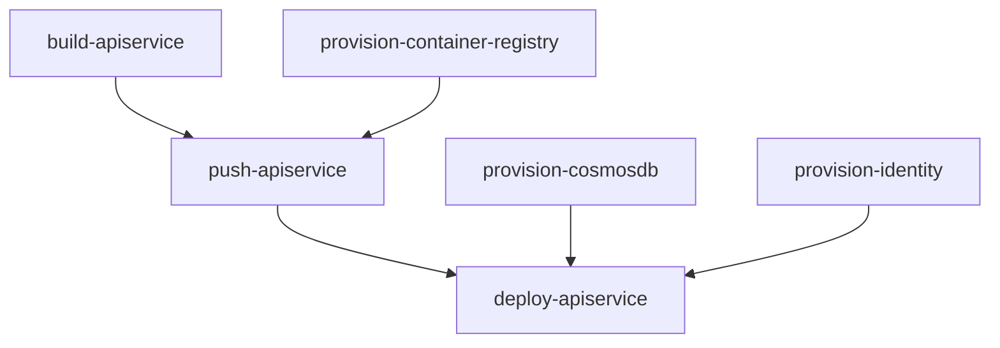
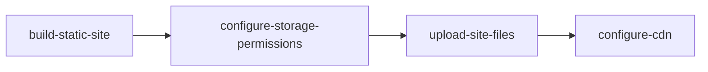

import { Aside, Steps, Tabs, TabItem } from '@astrojs/starlight/components';
import LearnMore from '@components/LearnMore.astro';

Aspire の**AppHost**で分散アプリを構成する場合、単にローカル開発とオーケストレーション用のサービスを定義しているのではなく、デプロイメントの基盤も設定しています。ローカルで実行およびデバッグするために使用する同じ構成は、アプリを発行する際にも活用され、開発から本番環境まで一貫性が確保されます。

## 再利用可能なアプリトポロジー

Aspire は既存のデプロイメントワークフローに干渉しません。代わりに、アプリケーションアーキテクチャを定義し、異なる環境およびプラットフォーム全体にデプロイできる一貫した方法を提供します。

3層アーキテクチャの例から続けて、ローカルマシン、クラウドプロバイダー、または独自のサーバーなど、様々な環境に同じアプリトポロジーをデプロイできます。

```mermaid
architecture-beta

  service db(logos:postgresql)[PostgreSQL]
  service api(server)[API Service]
  service frontend(logos:react)[Frontend]

  api:R --> L:db
  frontend:R --> L:api
```



このテーブルは、異なるプラットフォーム全体で同じリソースをデプロイする方法を示しています:

| リソース    | ローカル                        | AWS                         | Azure                 | オンプレミス |
| ----------- | ---------------------------- | --------------------------- | --------------------- | ----------- |
| フロントエンド    | `npm run dev`                | Elastic Container Service   | Container Apps        | カスタム      |
| API サービス | ローカルプロセス                | AWS Lambda                  | Functions             | カスタム      |
| PostgreSQL  | `docker.io/library/postgres` | Relational Database Service | Database for Postgres | カスタム      |

<Aside type="tip">
  Aspire の AppHost により、プラットフォームに依存しないアプリアーキテクチャを定義できます。
  つまり、同じコードをローカルで実行することも、変更なしで任意の環境にデプロイすることもできます。
</Aside>

Aspire は拡張可能で構成可能なデプロイメントワークフローを実現するパイプラインベースのデプロイメントシステムを使用しています。このシステムにより、異なる環境間で一貫性を保ちながら、アプリケーションのデプロイ方法をカスタマイズできます。

<Aside type="note">
  パイプラインベースのデプロイメントは Aspire 13での実験的機能です。
  API と機能は将来のリリースで変更される可能性があります。
</Aside>

## パイプラインデプロイメントモデル

パイプラインデプロイメントシステムは、クラウドアプリケーションをデプロイするための柔軟で同時実行対応のモデルを提供します。パイプラインはデプロイメントをパフォーマンスと信頼性のために最適化でき、デプロイメントプロセスの可視性を保つ、離散的でよく定義されたステップに分割します。

### パイプラインが重要な理由

最新のクラウドアプリケーションは、分散システムの複雑さに対処するための高度なデプロイメントオーケストレーションが必要です。 Aspire のパイプラインシステムは以下を提供します:

- **インテリジェント同時実行性**: 独立した操作が並列で実行され、リソース利用率が最大化され、総デプロイメント時間が最小化されます
- **粒度の細かい制御**: 各ステップを独立して実行、監視、リトライできます。具体的なエラーレポートとターゲット化された復旧機能があります
- **スマート依存関係管理**: ステップは実際の依存関係のみを待つため、最適な実行順序が確保されながら正確性も保たれます
- **包括的な可観測性**: ステップとサブタスク レベルでのリアルタイムの進捗レポートにより、デプロイメント操作が明確に可視化されます
- **柔軟な実行**: 特定のニーズに基づいて、完全なデプロイメントまたは選択的なステップ実行を実行します

### コア機能

パイプラインデプロイメントシステムは、次のいくつかの主要機能を実現します:

- **デプロイメントを拡張する**: 特定のリソースまたはシナリオのカスタムデプロイメントステップを追加します
- **実行順序を制御する**: ステップ間に依存関係を宣言して、適切なシーケンス処理を確保します
- **選択的なステップを実行する**: 特定のステップとその依存関係のみを実行して、より高速な反復処理を実現します
- **操作を並列化する**: 独立したステップは同時に実行でき、パフォーマンスが向上します
- **状態永続化**: 複数のデプロイメント実行全体でデプロイメント状態とパラメータをキャッシュします
- **インテリジェント粒度**: 細かい粒度の制御とデプロイメント効率のバランスを取ります

## コアコンセプト

パイプラインシステムは、柔軟で効率的なデプロイメントオーケストレーションを提供するために連携する基本的なコンセプトに基づいて構築されています。

### パイプラインステップ

パイプラインステップはアプリケーションパイプライン内の離散的な作業単位を表します。各ステップはデプロイメントプロセスの特定の側面をカプセル化し、全体の操作をより管理可能でデバッグしやすくします。

各ステップは以下を持ちます:

- **名前**: ステップの一意の識別子
- **アクション**: デプロイメント中に実行される作業
- **依存関係**: このステップが実行される前に完了する必要がある他のステップ
- **リソースコンテキスト**: アプリケーションのリソースモデルと設定へのアクセス

パイプラインステップはさまざまな粒度レベルで動作します。例えば、フロントエンド、 API サービス、データベース、ストレージを含む一般的な Web アプリケーションをデプロイする場合、パイプラインには以下が含まれる可能性があります:

**インフラストラクチャステップ** (並列で実行可能):

- `provision-cosmosdb`: CosmosDB データベースをプロビジョニングします
- `provision-storage`: Azure Storage アカウントをプロビジョニングします
- `provision-aca-env`: Azure Container Apps 環境をプロビジョニングします
- `provision-container-registry`: コンテナイメージレジストリを設定します

**ビルドステップ** (並列で実行可能):

- `build-apiservice`: API サービスのコンテナイメージをビルドします
- `build-webfrontend`: フロントエンドのコンテナイメージをビルドします

**デプロイメントステップ** (ビルドとインフラストラクチャに依存):

- `push-apiservice`: API サービスイメージをレジストリにプッシュします
- `push-webfrontend`: フロントエンドイメージをレジストリにプッシュします
- `deploy-apiservice`: API サービスをコンピュートプラットフォームにデプロイします
- `deploy-webfrontend`: フロントエンドをコンピュートプラットフォームにデプロイします

この細かい粒度のアプローチにより、パイプラインは並列性を最大化できます。データベースはコンテナイメージの構築中にプロビジョニングされ、コンテナレジストリとイメージの両方が準備完了と同時に、関連しない他の操作を待つことなく直ちにイメージをプッシュできます。

### ステップ実行フェーズ

パイプラインシステムは3つの異なるフェーズを通じて動作します:

<Steps>

1. #### 登録フェーズ

   ステップは2つのソースから収集されます:
   - **リソースアノテーション**: アプリケーションモデル内のリソースが提供するステップ（例：データベースリソースはそのプロビジョニングステップを提供します）
   - **パイプライン API 呼び出し**: AppHost 内のパイプライン設定を通じて直接追加されるステップ

   この分散化されたアプローチにより、フレームワークコンポーネントとユーザーコードの両方が、中央設定への変更を必要とさずにデプロイメントプロセスに参加できます。

1. #### 解決フェーズ

   パイプラインシステムは登録されたすべてのステップを分析して以下を行います:
   - **依存関係を検証する**: 参照されるすべてのステップが存在し、循環依存関係がないことを確認します
   - **実行順序を計算する**: すべての依存関係制約を尊重する最適なシーケンスを決定します
   - **並列実行機会を識別する**: 並列で実行できるステップをグループ化します

1. #### 実行フェーズ
   ステップは解決されたプランに従って実行されます:
   - **並列実行**: 独立したステップが同時に開始します
   - **依存関係待機**: ステップは特定の依存関係のみを待ち、関連しない操作は待ちません
   - **進捗レポート**: 個別のステップと全体的なパイプラインの進捗についてのリアルタイムステータス更新
   - **エラー分離**: 失敗したステップは関連しない操作をブロックしません

</Steps>

### 依存関係管理

Aspire パイプラインの依存関係は明示的で目的が明確です。従来のデプロイメントシステムとは異なり、依存関係が暗黙的または過度に広い可能性があります。

ステップは以下を使用して関係を宣言します:

- `PipelineStep.DependsOn`: このステップは別のステップが正常に完了した後に実行される必要があります
- `PipelineStep.RequiredBy`: 別のステップはこのステップ後に実行される必要があります（逆の依存関係宣言）

**依存関係の例:**



この例では:

- `push-apiservice` はイメージが構築されていることとレジストリが利用可能であることの両方に依存します
- `deploy-apiservice` はイメージがプッシュされ、データベースがプロビジョニングされ、マネージドアイデンティティが設定された直後に開始できます
- `provision-cosmosdb` と `build-apiservice` は相互に依存していないため、並列で実行できます

パイプラインシステムは以下を確保するために依存関係を検証します:

- **循環依存関係がない**: ステップ A がステップ B に依存する場合、ステップ B はステップ A に依存できません
- **すべての参照が存在する**: すべての依存関係宣言は登録されているステップを参照します
- **論理的一貫性**: 依存関係グラフは有効な実行計画を表します

## デプロイメントパターン

Aspire のパイプラインシステムはデプロイメント操作のインテリジェントオーケストレーションの周りに設計されており、アプリケーションが異なる環境全体で効率的かつ確実にデプロイされることを保証します。

### 最適な粒度設計

パイプラインシステムは、デプロイメント効率を保ちながら正確な制御と可視性を提供するために細かい粒度のステップを使用します:

**リソースレベルの粒度**: 各インフラストラクチャリソース（データベース、ストレージアカウント、コンテナレジストリ）は個別のステップとしてプロビジョニングされます。これにより以下が可能になります:

- **正確なエラーレポート**: 特定のリソースが失敗した場合、何が間違っていたかが正確にわかります
- **ターゲット化された再試行機能**: 正常にプロビジョニングされたコンポーネントに影響を与えずに、失敗したリソースのみを再試行します
- **進捗の透明性**: どのリソースがプロビジョニング中であり、その現在の状態はどうなっているかが明確に見えます
- **柔軟な復旧**: 問題を修正し、障害の時点から続行する機能

**操作レベルの組織化**: 関連操作は論理的にグループ化されながらも独立性を保ちます:

- **ビルド操作**: 複数のコンテナイメージを利用可能なシステムリソースを使って並列にビルドできます
- **プッシュ操作**: イメージがビルドされ、レジストリが利用可能になった直後にプッシュできます
- **デプロイメント操作**: 依存関係（イメージ、インフラストラクチャ）が準備完了したらサービスをデプロイします

## よく知られているステップ

Aspire は、デプロイメントパイプラインの統合ポイントとして機能するよく知られているステップのデフォルトセットを登録します。これらのステップは、リソースとアプリケーションが一般的なデプロイメントワークフローに参加するための標準化された方法を提供します。

### エントリーポイントステップ

- **`WellKnownPipelineSteps.Deploy`**: `aspire deploy` コマンドのプライマリエントリーポイント。このステップはインフラストラクチャプロビジョニング、イメージビルド、アプリケーションデプロイメントを含む完全なデプロイメントプロセスをオーケストレートします。

- **`WellKnownPipelineSteps.Publish`**: `aspire publish` コマンドのエントリーポイント。通常、実際のデプロイメントを実行せずにデプロイメント成果物を生成します。

- **`WellKnownPipelineSteps.Build`**: `aspire do build` コマンドのエントリーポイント。アプリケーションで定義されたコンピュートリソースのコンテナイメージをビルドします。

- **`WellKnownPipelineSteps.Push`**: `aspire do push` コマンドのエントリーポイント。ビルド後、コンテナイメージをレジストリにプッシュします。

### 前提条件ステップ

- **`WellKnownPipelineSteps.BuildPrereq`**: 依存関係解決、環境セットアップ、ビルドツール検証など、ビルドの前提条件であるステップを定義します。

- **`WellKnownPipelineSteps.DeployPrereqs`**: 認証、環境検証、前提条件リソース確認など、デプロイメントの前提条件であるステップを定義します。

- **`WellKnownPipelineSteps.PublishPrereqs`**: ビルド環境セットアップ、成果物準備など、発行の前提条件であるステップを定義します。

- **`WellKnownPipelineSteps.PushPrereq`**: レジストリ認証、接続検証など、コンテナイメージをプッシュするための前提条件であるステップを定義します。

これらのよく知られているステップは、システムのさまざまな部分が予測可能な方法で統合できるコントラクトを作成します。例えば、カスタム認証ステップは `DeployPrereqs` で必須として宣言でき、デプロイメント操作が開始される前に実行されます。

### リソース提供ステップ

アプリケーションモデル内のリソースはアノテーションを通じて独自のパイプラインステップを提供できます。このパターンにより、ライブラリと統合がアプリケーションコードへの変更を必要とさずにデプロイメントロジックをカプセル化できます。

**リソース提供ステップの仕組み:**

<Steps>

1. **アノテーションベースの登録**: リソースはアノテーションを使用してパイプラインステップを宣言します
2. **自動発見**: パイプラインシステムは登録フェーズ中にすべてのリソースからステップを自動的に発見します
3. **依存関係統合**: リソースステップはよく知られているステップまたは他のリソースステップに依存できます

</Steps>

**例: 静的サイトリソースがステップを提供する**

静的サイトリソースは複数の関連ステップを提供する可能性があります:



各ステップは静的サイトデプロイメントの特定の側面を処理します:

<Steps>

1. **サイト成果物のビルド**: 静的ファイルをコンパイル、最適化、準備します
2. **ストレージアクセス許可の設定**: 適切なアクセス制御をセットアップします
3. **ファイルのアップロード**: ビルドされた成果物をクラウドストレージに転送します
4. **CDN の設定**: コンテンツ配布とルーティングをセットアップします

</Steps>

このアプローチにより、デプロイメントロジックがリソース定義の近くに保たれながら、パイプラインシステムは実行順序を最適化し、依存関係を自動的に処理できます。

### アプリケーション固有のステップ

アプリケーションは、特定のリソースに属さないが、アプリケーションのデプロイメント要件に固有のシナリオのパイプライン API を通じて直接カスタムステップを追加できます。

**一般的なアプリケーション固有のステップシナリオ:**

- **データベースマイグレーション**: スキーマ更新またはデータ変換の実行
- **スモークテスト**: デプロイメント完了前にデプロイされたサービスを検証します
- **設定更新**: 外部サービスまたはサードパーティ統合を更新します
- **通知ワークフロー**: チーム通信チャネルにデプロイメントステータス更新を送信します

**例: カスタム検証ステップの追加**

<Tabs syncKey='aspire-lang'>
<TabItem id='csharp' label='C#'>
```csharp title="AppHost.cs"
using Aspire.Hosting.Pipelines;

var builder = DistributedApplication.CreateBuilder(args);

#pragma warning disable ASPIREPIPELINES001
// カスタムデプロイ検証を追加
builder.Pipeline.AddStep("validate-deployment", async context =>
{
// カスタム検証ロジック
await ValidateApiHealth(context);
await ValidateDatabaseConnection(context);
}, requiredBy: WellKnownPipelineSteps.Deploy);
#pragma warning restore ASPIREPIPELINES001

// リソースを定義
var database = builder.AddPostgres("myapp-db");
var api = builder.AddProject<Api>("api").WithReference(database);

```
</TabItem>
<TabItem id='typescript' label='TypeScript'>
:::note
TypeScript AppHost SDK では `builder.pipeline` API はまだ利用できないため、このカスタムパイプラインの例は現在 C# のみです。
:::
</TabItem>
</Tabs>

このパターンにより、アプリケーションはパイプラインの依存関係管理と実行調整から利益を得ながら、デプロイメントプロセスをカスタムロジックで拡張できます。

## 実行制御

パイプラインシステムは、デプロイメントステップの実行方法とタイミングを制御するための洗練されたメカニズムを提供します。デプロイメントプロセスに対して正確な制御が可能です。

### 特定のステップを実行する

`aspire do` コマンドにより、個別のステップとその依存関係を実行できます。これはデプロイメントプロセスに対する細かい粒度の制御を提供します。この機能は、パイプライン全体を実行する必要がない、または望ましくない実世界のデプロイメントシナリオをいくつか対応します。

**選択的ステップ実行のユースケース:**

- **段階的なデプロイメント**: フロントエンドコードのみを変更した後、アプリケーション全体をリビルドおよび再デプロイするのではなく、フロントエンド関連のステップのみを実行します
- **トラブルシューティングと再試行**: 特定のステップが失敗した場合（例：データベースプロビジョニングがタイムアウト）、成功した操作を繰り返さずに、そのステップとその依存関係のみを再試行できます
- **開発ワークフロー**: 開発中に、インフラストラクチャを1回プロビジョニングしてからリソースを再プロビジョニングせずに、コード変更を繰り返しデプロイすることができます
- **選択的操作**: 組織のポリシーまたは承認プロセスに合わせるため、インフラストラクチャプロビジョニングとアプリケーションデプロイメントを分離します

**選択的実行の仕組み:**

実行するステップを指定すると、パイプラインシステムは自動的に以下を行います:

<Steps>

1. **すべての依存関係を含める**: 前提条件ステップが正しい順序で実行されることを確認します
2. **不要なステップをスキップする**: ターゲットステップに必要でないステップの実行を避けます
3. **一貫性を保つ**: デプロイメント状態が一貫性を保つことを検証します

</Steps>

**選択的実行シナリオの例:**

```bash
# Provision only infrastructure resources
aspire do provision-infra

# Deploy only a specific service after code changes
aspire do deploy-apiservice

# Run database migrations without full redeployment
aspire do migrate-database
```

### 並列実行とパフォーマンス最適化

パイプラインシステムは、正確性と信頼性を保ちながら、インテリジェント並列実行によるデプロイメントパフォーマンスの最大化を目的として設計されています。

**並行性分析と最適化:**

システムは依存関係の高度な分析を実行して、並列化の機会を特定および活用します:

- **独立した操作**: 相互に依存していないステップは同時に実行され、利用可能なシステムリソースを完全に活用します
- **リソースグループ化**: 関連する操作（複数のイメージビルドなど）は、共有リソースを効率的に使用するように調整されます
- **クリティカルパス最適化**: システムは最長の依存関係チェーンを識別し、総デプロイメント時間を最小化するため実行を最適化します
- **リソース認識スケジューリング**: CPU 集約的、 I/O 集約的、ネットワーク操作のバランスが取られ、リソースの競合を回避します

**実世界のパフォーマンス利点:**

一般的な Web アプリケーションのデプロイメントは、パイプライン並列化の効果を実証します:

**パイプライン実行は最適なパフォーマンスを提供します**: 合計5～7分

- インフラストラクチャプロビジョニング（並列）: 3分（最も遅いリソースによって制限）
- イメージビルド（並列）: 2分（最も遅いビルドによって制限）
- デプロイメント操作: 2～3分（依存関係を尊重）

**インテリジェントなリソース利用:**

- **CPU 集約的な操作**（コンテナイメージビルド）: 複数のコアで利用可能なビルド容量を完全に活用します
- **I/O 集約的な操作**（イメージプッシュ、ファイルアップロード）: ネットワークリソースを過度に使用しないよう適切なレート制限で同時実行します
- **クラウド API 操作**（リソースプロビジョニング）: クラウドプロバイダーのレート制限とクォータを尊重しながら並列実行します

**障害処理と復旧:**

パイプラインシステムは並列実行中の堅牢な障害処理を提供します:

<Steps>

1. **即座の障害検出**: 失敗したステップは、関連しない操作の完了を待つことなく素早く特定および報告されます
2. **スマート依存関係カスケード防止**: ステップが失敗すると、その依存ステップのみがキャンセルされ、関連しない操作は続行できます
3. **部分的な成功の保持**: 正常に完了したステップはその状態を保持し、再試行操作時に繰り返す必要がありません
4. **エラー分離**: パイプラインの一部の障害は含まれ、独立した操作には影響しません

</Steps>

システムは包括的なロギングと状態情報を保ち、効率的なデバッグとリカバリをサポートします。これにより、開発者は問題を素早く特定および解決でき、すべての成功した作業を保持できます。

## aspire do コマンドの使用

`aspire do` コマンドはパイプラインシステムと相互作用するためのプライマリインターフェースです。これはパイプライン実行に対する細かい粒度の制御を提供し、特定のステップを実行し、問題をデバッグしてデプロイメントワークフローを最適化できます。

### 基本的な使用方法

コマンドは依存関係を自動的に解決し、正しい順序でステップを実行します:

```bash title="Aspire CLI — Basic aspire do usage"
# Run the default deployment pipeline
aspire do deploy

# Build all container images
aspire do build

# Push images to registry
aspire do push

# Generate deployment artifacts
aspire do publish
```

### コマンドオプション

`aspire do` コマンドは実行のカスタマイズ用のいくつかのオプションをサポートしています:

```bash title="Aspire CLI — aspire do with options"
# Custom output path for artifacts
aspire do publish --output-path ./artifacts

# Target specific environment
aspire do deploy --environment Production

# Verbose logging for troubleshooting
aspire do deploy --pipeline-log-level debug

# Include exception details in logs
aspire do deploy --include-exception-details
```

<LearnMore>
完全なコマンドリファレンスについては、[aspire do command](/ja/reference/cli/commands/aspire-do/)を参照してください。
</LearnMore>

### 利用可能なステップの発見

パイプラインステップを実行する前に、 `--list-steps` フラグを使用して、指定したコマンドで実行されるステップを発見できます。すべてのパイプラインコマンド（`aspire deploy` 、 `aspire publish` 、 `aspire destroy` 、および `aspire do`）はこれを受け入れます:

```bash title="Aspire CLI — Discover pipeline steps"
aspire deploy --list-steps
```

出力例:

```text title="Output"
1. parameter-prompt
   └─ No dependencies

2. provision-redis-infra
   ├─ Depends on: parameter-prompt
   └─ Tags: provision-infra

3. build-webapi
   ├─ Depends on: parameter-prompt
   └─ Tags: build-compute

4. deploy-webapi
   ├─ Depends on: provision-redis-infra, build-webapi
   └─ Tags: deploy-compute
```

これは、選択したコマンドで実行されるパイプラインステップを実行順に一覧し、実際に実行することなく表示します。各エントリはステップの位置、依存するステップ、および実行するタグを示します。 `--list-steps` を実行する予定のコマンドと組み合わせて使用します（例：`aspire publish --list-steps` または `aspire do build --list-steps`）。指定した呼び出しで実行されるステップを正確に確認できます。

## カスタムパイプラインステップ

パイプラインシステムにより、アプリケーション固有のデプロイメント要件を処理するカスタムステップを追加できます。アプリケーションレベルステップとリソースレベルステップの2つのレベルでステップを追加できます。

### アプリケーションレベルステップ

`builder.Pipeline.AddStep` を使用して、アプリケーション全体に適用されるカスタムステップを追加します:

```csharp title="C# — Application-level custom step"
var builder = DistributedApplication.CreateBuilder(args);

// カスタム検証ステップを追加
builder.Pipeline.AddStep("validate", async (context) =>
{
    context.Logger.LogInformation("Running validation checks...");
    
    // カスタム検証ロジック
    await ValidateApiEndpoints(context);
    await CheckDatabaseConnection(context);
    
    context.Logger.LogInformation("Validation completed successfully");
}, requiredBy: WellKnownPipelineSteps.Deploy);

// リソースを定義
var database = builder.AddPostgres("db");
var api = builder.AddProject<Projects.Api>("api").WithReference(database);

builder.Build().Run();
```

その後、このカスタムステップを実行できます:

```bash title="Aspire CLI — Run custom step"
aspire do validate
```

### リソースレベルステップ

リソースは `WithPipelineStepFactory` を使用して独自のパイプラインステップを提供できます:

```csharp title="C# — Resource-level custom step"
var api = builder.AddProject<Projects.Api>("api")
    .WithPipelineStepFactory(context =>
    {
        return new PipelineStep()
        {
            Name = "custom-api-deploy",
            Action = async (pipelineContext, cancellationToken) =>
            {
                // このリソース向けのカスタムデプロイロジック
                pipelineContext.Logger.LogInformation("Custom API deployment starting...");
                
                // ここにデプロイロジックを実装
                await DeployApiAsync(pipelineContext, cancellationToken);
                
                pipelineContext.Logger.LogInformation("Custom API deployment completed");
            },
            RequiredBySteps = [WellKnownPipelineSteps.Deploy]
        };
    });
```

### ステップ依存関係

依存関係を使用してステップ実行順序を制御します:

```csharp title="C# — Step with dependencies"
// 他のステップに依存するステップ
builder.Pipeline.AddStep("database-migration", async (context) =>
{
    context.Logger.LogInformation("Running database migrations...");
    await RunMigrations(context);
}, 
dependsOn: ["provision-database"],
requiredBy: ["deploy-apiservice"]);
```

ステップの順序を固定するために2つの依存関係タイプから選択できます:

- **`dependsOn`**: このステップは指定したステップの完了後に実行されます。
- **`requiredBy`**: このステップは指定したステップが実行される前に完了する必要があります。

### パイプライン設定

リソースは `WithPipelineConfiguration` を使用してパイプラインにどのように参加するかをカスタマイズすることもでき、ステップの順序付けとリソース固有のパイプライン動作を制御できます。

<Aside type="note">
`WithPipelineConfiguration` API は実験的であり、将来のリリースで変更される可能性があります。
[aspire do コマンドリファレンス](/ja/reference/cli/commands/aspire-do/)を参照して、パイプライン設定の最新の詳細を確認してください。
</Aside>

## 一般的なユースケース

パイプラインの理解を深めるために、その使用方法のシナリオを検証してみましょう。

### マルチ環境デプロイメント

テスト、ステージング、本番環境、またはその他の環境にデプロイする場合、各環境で異なるデプロイメントアクションを実行することもあります。パイプラインコンテキストを使用して、環境固有のパイプラインステップを作成できます:

```csharp title="C# — Multi-environment deployment"
var builder = DistributedApplication.CreateBuilder(args);

// 環境固有の検証を追加
builder.Pipeline.AddStep("validate-production", async (context) =>
{
    if (context.Environment == "Production")
    {
        context.Logger.LogInformation("Running production-specific validations...");
        await ValidateProductionReadiness(context);
    }
}, requiredBy: WellKnownPipelineSteps.Deploy);

// デプロイ後のスモークテストを追加
builder.Pipeline.AddStep("smoke-tests", async (context) =>
{
    context.Logger.LogInformation("Running smoke tests...");
    await RunSmokeTests(context);
}, 
dependsOn: [WellKnownPipelineSteps.Deploy]);

builder.Build().Run();
```

`--environment` オプションを使用して異なる環境にデプロイでき、上記の環境固有のステップをトリガーできます:

```bash title="Aspire CLI — Deploy to specific environment"
# Deploy to staging
aspire do deploy --environment Staging

# Deploy to production
aspire do deploy --environment Production
```

### カスタムビルドステップ

パイプラインと統合するカスタムビルドロジックを追加します:

```csharp title="C# — Custom build step"
var builder = DistributedApplication.CreateBuilder(args);

// カスタムのビルド前ステップを追加
builder.Pipeline.AddStep("generate-assets", async (context) =>
{
    context.Logger.LogInformation("Generating static assets...");
    await GenerateStaticAssets(context);
}, requiredBy: WellKnownPipelineSteps.Build);

// カスタムのビルド後ステップを追加
builder.Pipeline.AddStep("optimize-images", async (context) =>
{
    context.Logger.LogInformation("Optimizing container images...");
    await OptimizeImages(context);
}, 
dependsOn: [WellKnownPipelineSteps.Build],
requiredBy: [WellKnownPipelineSteps.Push]);

builder.Build().Run();
```

### データベースマイグレーション

デプロイメントの一部としてデータベースが確実に入力されるようにする場合、データベースマイグレーションをデプロイメントパイプラインに統合するステップを作成できます:

```csharp title="C# — Database migrations step"
var builder = DistributedApplication.CreateBuilder(args);

var database = builder.AddPostgres("db");

// データベースのプロビジョニング後に実行されるマイグレーションステップを追加
builder.Pipeline.AddStep("migrate-database", async (context) =>
{
    context.Logger.LogInformation("Running database migrations...");
    
    // コンテキストからデータベース接続文字列を取得
    var connectionString = await GetConnectionString(context, database);
    
    // マイグレーションを実行
    await RunDatabaseMigrations(connectionString, context.Logger);
    
    context.Logger.LogInformation("Database migrations completed");
}, 
dependsOn: ["provision-database"],
requiredBy: ["deploy-apiservice"]);

var api = builder.AddProject<Projects.Api>("api").WithReference(database);

builder.Build().Run();
```

## 発行コールバックからの移行

Aspire 13.0はより柔軟なパイプラインシステムで発行コールバックシステムを置き換えました。 Aspire 9.x からアップグレードしている場合、コードを移行する必要があります。

### 変更内容

古い発行コールバックシステムは削除され、パイプラインステップに置き換えられました:

**削除された API:**
- `WithPublishingCallback` 拡張メソッド
- `PublishingContext` と `PublishingCallbackAnnotation`
- `DeployingContext` と `DeployingCallbackAnnotation`
- `IDistributedApplicationPublisher` インターフェース

**新しい API:**
- `WithPipelineStepFactory` 拡張メソッド
- `PipelineStep` クラス
- `builder.Pipeline.AddStep` メソッド

### 移行ステップ

Aspire 9.x の発行コードを Aspire 13.x のパイプラインに置き換えるには、次のステップに従います:

<Steps>

1. **発行コールバックを特定**します。 `WithPublishingCallback` を使用するコード内の発行コールバックを識別します。
2. **コールバックをパイプラインステップに変換**します。 `WithPipelineStepFactory` または `builder.Pipeline.AddStep` を使用してコールバックをパイプラインステップに変換します。
3. **依存関係をパラメータまたはプロパティで更新**します。 `builder.Pipeline.AddStep` を使用する場合、 `dependsOn` / `requiredBy` パラメータで依存関係を構成します。 `PipelineStep` インスタンスを直接作成する場合、 `DependsOn` と `RequiredBySteps` プロパティを使用します。
4. **移行をテスト**します。 `aspire deploy --list-steps` と `aspire deploy` を使用して移行をテストします。

</Steps>

### 前後の例

Aspire 9.x コードと Aspire 13.x の同等物を示すコード例を以下に示します。

#### リソースレベルコールバック

**前（Aspire 9.x）:**

```csharp title="C# — Old publishing callback"
var api = builder.AddProject<Projects.Api>("api")
    .WithPublishingCallback(async (context, cancellationToken) =>
    {
        // カスタムデプロイロジック
        await CustomDeployAsync(context, cancellationToken);
    });
```

**後（Aspire 13.0）:**

```csharp title="C# — New pipeline step"
var api = builder.AddProject<Projects.Api>("api")
    .WithPipelineStepFactory(context =>
    {
        return new PipelineStep()
        {
            Name = "custom-deploy-api",
            Action = async (pipelineContext, cancellationToken) =>
            {
                // カスタムデプロイロジック
                await CustomDeployAsync(pipelineContext, cancellationToken);
            },
            RequiredBySteps = [WellKnownPipelineSteps.Deploy]
        };
    });
```

#### アプリケーションレベルコールバック

**前（Aspire 9.x）:**

```csharp title="C# — Old application-level callback"
builder.Services.AddLifecycleHook<CustomPublishingHook>();

public class CustomPublishingHook : IDistributedApplicationLifecycleHook
{
    public async Task AfterEndpointsAllocatedAsync(
        DistributedApplicationModel model,
        CancellationToken cancellationToken)
    {
        // カスタムロジック
        await SendDeploymentNotification();
    }
}
```

**後（Aspire 13.0）:**

```csharp title="C# — New pipeline step"
builder.Pipeline.AddStep("notify-deployment", async (context) =>
{
    // カスタムロジック
    await SendDeploymentNotification(context);
}, 
dependsOn: [WellKnownPipelineSteps.Deploy]);
```

#### 複雑なデプロイメントワークフロー

**前（Aspire 9.x）:**

```csharp title="C# — Old complex callback"
var api = builder.AddProject<Projects.Api>("api")
    .WithPublishingCallback(async (context, cancellationToken) =>
    {
        // 複数のデプロイステップ
        await ProvisionInfrastructure(context);
        await BuildAndPushImages(context);
        await RunDatabaseMigrations(context);
        await DeployApplication(context);
        await RunSmokeTests(context);
    });
```

**後（Aspire 13.0）:**

```csharp title="C# — New pipeline steps with dependencies"
// 依存関係付きの離散ステップに分割
builder.Pipeline.AddStep("provision-infra", async (context) =>
{
    await ProvisionInfrastructure(context);
}, requiredBy: [WellKnownPipelineSteps.Build]);

builder.Pipeline.AddStep("migrate-database", async (context) =>
{
    await RunDatabaseMigrations(context);
}, 
dependsOn: ["provision-infra"],
requiredBy: ["deploy-application"]);

var api = builder.AddProject<Projects.Api>("api")
    .WithPipelineStepFactory(context =>
    {
        return new PipelineStep()
        {
            Name = "deploy-application",
            Action = async (ctx, ct) => await DeployApplication(ctx, ct),
            DependsOn = [WellKnownPipelineSteps.Build, WellKnownPipelineSteps.Push]
        };
    });

builder.Pipeline.AddStep("smoke-tests", async (context) =>
{
    await RunSmokeTests(context);
}, dependsOn: ["deploy-application"]);
```

### 新しいシステムの利点

パイプラインシステムは発行コールバックよりもいくつかの利点を提供します:

- **より良い可視性**: `aspire deploy --list-steps` を使用してデプロイメント実行されるすべてのステップとその実行順序を確認します。
- **選択的実行**: `aspire do <step-name>` で特定のステップを実行します。
- **並列実行**: 独立したステップは自動的に同時実行されます。
- **明確な依存関係**: `DependsOn` と `RequiredBySteps` で明示的に依存関係を宣言します。
- **エラー処理の向上**: 失敗したステップは関連しない操作をブロックしません。
- **再利用可能性**: ステップはさまざまなデプロイメントシナリオで再利用できます。

<Aside type="tip">
移行後、 `aspire deploy --list-steps` を使用してパイプラインステップが正しく設定され、依存関係が適切に宣言されていることを確認します。
</Aside>
