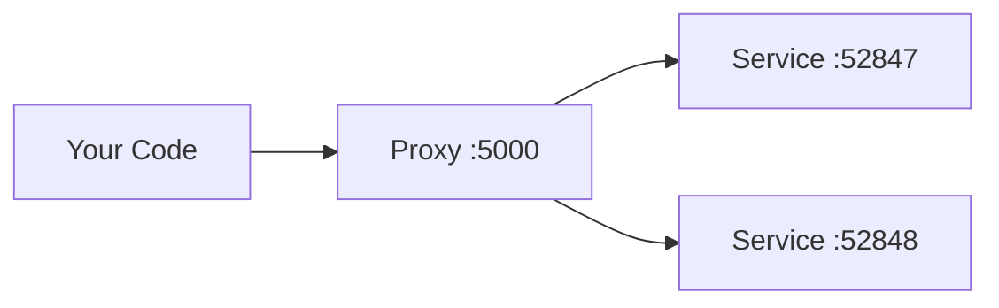

import { Aside } from '@astrojs/starlight/components';
import LearnMore from '@components/LearnMore.astro';
import { Image } from 'astro:assets';
import networkingProxies from '@assets/fundamentals/networking/networking-proxies-1x.png';
import proxyWithReplicas from '@assets/fundamentals/networking/proxy-with-replicas-1x.png';
import proxyHostPortAndRandomPort from '@assets/fundamentals/networking/proxy-host-port-and-random-port-1x.png';
import proxyWithRandomPorts from '@assets/fundamentals/networking/proxy-with-random-ports-1x.png';
import proxyWithDockerPortMapping from '@assets/fundamentals/networking/proxy-with-docker-port-mapping-1x.png';

Aspire で開発する利点の 1 つは、クラウドネイティブ アプリをローカルで開発、テスト、デバッグできることです。内部ループ ネットワークは、開発環境でアプリ同士を通信させる Aspire の重要な要素です。この記事では、プロキシ、エンドポイント、エンドポイント構成、コンテナー ネットワークを通じて、Aspire がさまざまなネットワーク シナリオをどう処理するかを学びます。

## プロキシの考え方

Aspire のネットワークをホテルのフロントにたとえると理解しやすくなります:

- **クライアント**（API を呼び出すあなたのコード）は、常に既知で安定したアドレスにある **フロント**（プロキシ）と通信します
- フロントは、リクエストを **実際の部屋**（あなたのサービス）が現在いる場所へルーティングします
- **複数の部屋**（レプリカ）がある場合は、どこに接続するかをフロントが処理します

この設計は、次のような問題を解決します:

| 問題 | プロキシが役立つ理由 |
|---------|---------------------|
| **ポート競合** | 2 つのサービスは同じ 5000 番ポートを使えませんが、プロキシならそれぞれに別ポートを割り当てられます |
| **レプリカ** | サービスの複数インスタンスには負荷分散が必要ですが、プロキシがこれを自動処理します |
| **サービス再起動** | サービスが新しいポートで再起動しても、プロキシのアドレスは変わりません |



<Aside type="tip" title="重要なポイント">
サービスが実際にどのポートで動いているかを把握する必要はありません。プロキシのアドレスだけを使えば、残りは Aspire が処理します。
</Aside>

## 内部ループにおけるネットワーク

内部ループとは、アプリをターゲット環境にデプロイする前に、ローカルで開発とテストを進めるプロセスです。Aspire は、内部ループでのネットワーク体験を簡素化して高めるために、次のようなツールと機能を提供します:

- **エンドポイント / エンドポイント構成**: エンドポイントは、データベース、メッセージ キュー、API など、アプリが依存するサービスとの接続です。エンドポイントには、サービス名、ホスト ポート、スキーム、環境変数などの情報が含まれます。Aspire はリソース構成から自動でエンドポイントを作成でき、`WithEndpoint` の呼び出しで明示的に追加することもできます。
- **プロキシ**: Aspire は、アプリに追加した各サービス バインディングごとにプロキシを自動起動し、そのプロキシが待ち受けるポートを割り当てます。プロキシは、アプリが待ち受けるポート（プロキシ ポートと異なる場合があります）にリクエストを転送します。これにより、ポート競合を避けつつ、アプリとサービスに一貫した予測可能な URL でアクセスできます。
- **コンテナー ネットワーク**: Aspire はコンテナー リソース用の専用ネットワークを作成・管理し、ローカル開発中にコンテナー同士が相互に検出して通信できるようにします。

## エンドポイントの仕組み

Aspire のサービス バインディングは 2 つの統合から成り立ちます。1 つは、アプリが必要とする外部リソース（たとえばデータベース、メッセージ キュー、API）を表す **サービス**、もう 1 つは、アプリとサービスの接続を確立し必要な情報を提供する **バインディング** です。

Aspire はリソース構成からサービス バインディングを自動作成でき、`WithEndpoint` を使って追加のバインディングを明示的に作成することもできます。

バインディングが暗黙・明示のどちらで作成された場合でも、Aspire は指定ポートで軽量なリバース プロキシを起動し、アプリからサービスへのリクエストのルーティングと負荷分散を処理します。プロキシは Aspire の実装詳細であり、設定や管理を意識する必要はありません。

エンドポイントの仕組みを視覚的に把握するために、Aspire スターター テンプレートの内部ループ ネットワーク図を見てみましょう:

<Image
  src={networkingProxies}
  alt="Aspire Starter Application テンプレートの内部ループ ネットワーク図。"
/>

## コンテナー ネットワークの管理方法

1 つ以上のコンテナー リソースを追加すると、Aspire はコンテナー間のサービス検出を有効にする専用のコンテナー ブリッジ ネットワークを作成します。このブリッジ ネットワークは、コンテナー同士を通信させる仮想ネットワークであり、DNS 名を使ったコンテナー間のサービス検出向けに DNS サーバーも提供します。

ネットワークのライフタイムはコンテナー リソースに依存します:

- すべてのコンテナーがセッション ライフタイムの場合、ネットワークもセッション ベースになり、AppHost プロセスの終了時にクリーンアップされます。
- いずれかのコンテナーが永続ライフタイムの場合、ネットワークは永続化され、AppHost プロセス終了後も稼働し続けます。Aspire は後続の実行でこのネットワークを再利用するため、AppHost が動いていない間でも永続コンテナー同士は通信を継続できます。

コンテナーのライフタイムの詳細は、[永続コンテナーのライフタイム](/ja/app-host/persistent-containers/) を参照してください。

コンテナー ネットワークの命名規則は次のとおりです:

- **セッション ネットワーク**: `aspire-session-network-<unique-id>-<app-host-name>`
- **永続ネットワーク**: `aspire-persistent-network-<project-hash>-<app-host-name>`

各 AppHost インスタンスは独自のネットワーク リソースを取得します。違いはネットワークのライフタイムと名前だけで、サービス検出の仕組み自体は両者で同じです。

コンテナーはリソース名を使ってネットワークに登録されます。Aspire はこの名前をコンテナー間のサービス検出に使います。たとえば `pgadmin` コンテナーは、`postgres` という名前のデータベース リソースへ `postgres:5432` で接続できます。

<Aside type="note">
  プロジェクトや他の実行可能ファイルなどのホスト サービスは、コンテナー
  ネットワークを使いません。これらは、公開されたコンテナー ポートを使ってサービス検出し、
  コンテナーと通信します。サービス検出の詳細については、
  [サービス検出](/ja/fundamentals/service-discovery/) を参照してください。
</Aside>

### コンテナー ネットワーク エイリアス

既定では、コンテナーは DNS エイリアスとして **リソース名** を使ってコンテナー ネットワーク上からアクセスできます。たとえば `AddContainer("mydb", ...)` で追加したコンテナーは、他のコンテナーから `mydb:5432` で到達できます。

サードパーティ ツールが特定のホスト名を期待する場合や、既存の Docker Compose 構成から移行する場合など、追加のエイリアスが必要になることがあります。カスタム DNS 名を追加するには `WithContainerNetworkAlias` を使います:

```csharp title="AppHost.cs"
var redis = builder.AddRedis("cache")
    .WithContainerNetworkAlias("redis-primary")
    .WithContainerNetworkAlias("session-store");
```

これで他のコンテナーは、次のいずれの名前でも Redis に接続できます:
- `cache:6379`（既定のリソース名）
- `redis-primary:6379`（カスタム エイリアス）
- `session-store:6379`（カスタム エイリアス）

<Aside type="tip" title="ネットワーク エイリアスを使うタイミング">
- **サードパーティ連携**: 一部ツールは `redis` や `postgres` のようなホスト名をハードコードしています
- **Docker Compose からの移行**: 既存アプリが想定するサービス名に合わせられます
- **多目的コンテナー**: 1 つの Redis インスタンスをキャッシュ兼セッション ストアとして使えます
</Aside>

コンテナーからホスト ベースのサービスに到達する必要がある場合、Aspire は **コンテナー トンネル** を使って信頼性の高い接続を提供します。詳細は [コンテナー ネットワーク](/ja/fundamentals/container-networking/) を参照してください。

一部のエンドポイント動作はリソース種別に依存します。そうした詳細は、この概要に重複して書くのではなく、各リソース種別のドキュメントに置くようにしてください。

<LearnMore>
.NET 固有のエンドポイント動作については、[C# 起動プロファイル](/ja/integrations/dotnet/launch-profiles/) と [プロジェクト リソース](/ja/integrations/dotnet/project-resources/) を参照してください。
</LearnMore>

## ポートとプロキシ

サービス バインディングを定義するとき、ホスト ポートは _常に_ サービス手前のプロキシに割り当てられます。これにより、サービスが単一レプリカでも複数レプリカでも同様に動作できます。さらに、`WithReference` API を使うすべてのリソース依存関係は、環境変数経由で渡されるプロキシ エンドポイントに依存します。

サービスが複数レプリカで動作する場合にも、同じプロキシ パターンが適用されます。ブラウザーは引き続き 1 つの安定したホスト ポートに接続し、プロキシが利用可能なレプリカへトラフィックを振り分けます:

前述のコードにより、次のネットワーク図になります:

<Image
  src={proxyWithReplicas}
  alt="特定のホスト ポートと 2 つのレプリカを持つ Aspire フロントエンド アプリのネットワーク図。"
/>

前述の図は次の内容を示しています:

- アプリのエントリ ポイントである Web ブラウザー。
- 5066 のホスト ポート。
- Web ブラウザーとフロントエンド サービス レプリカの間にあり、ポート 5066 で待ち受けるフロントエンド プロキシ。
- ランダム割り当てのポート 65001 で待ち受ける `frontend_0` フロントエンド サービス レプリカ。
- ランダム割り当てのポート 65002 で待ち受ける `frontend_1` フロントエンド サービス レプリカ。

環境変数から待ち受けポートを読み取る JavaScript アプリでは、次のように安定したホスト ポートを公開できます:

```csharp title="AppHost.cs"
builder.AddJavaScriptApp("frontend", "./frontend")
       .WithHttpEndpoint(port: 5066, env: "PORT");
```

定義されるポートは 2 つあります:

- 5066 のホスト ポート。
- 基盤サービスがバインドされるランダムなプロキシ ポート。

<Image
  src={proxyHostPortAndRandomPort}
  alt="特定のホスト ポートとランダム ポートを持つ Aspire フロントエンド アプリのネットワーク図。"
/>

前述の図は次の内容を示しています:

- アプリのエントリ ポイントである Web ブラウザー。
- 5066 のホスト ポート。
- Web ブラウザーとフロントエンド サービスの間にあり、ポート 5066 で待ち受けるフロントエンド プロキシ。
- ランダム ポート 65001 で待ち受けるフロントエンド サービス。

基盤サービスは引き続き独自のポートで待ち受け、Aspire は割り当てられたそのポートを `PORT` 環境変数経由でアプリに提供します。

<Aside type="tip">
  エンドポイントをプロキシ化しないようにするには、`WithEndpoint` 拡張メソッド呼び出し時に
  `IsProxied` プロパティを `false` に設定します。詳細は
  [エンドポイント拡張: 追加の考慮事項](#追加の考慮事項) を参照してください。
</Aside>

## ホスト ポートを省略する

ホスト ポートを省略すると、Aspire はホスト ポートとサービス ポートの両方にランダム ポートを生成します。これは、ポート競合を避けたいが、ホスト ポートやサービス ポートを気にしない場合に便利です。次のコードを見てみましょう:

```csharp title="AppHost.cs"
builder.AddJavaScriptApp("frontend", "./frontend")
       .WithHttpEndpoint(env: "PORT");
```

このシナリオでは、次の図のようにホスト ポートとサービス ポートの両方がランダムになります:

<Image
  src={proxyWithRandomPorts}
  alt="ランダムなホスト ポートとプロキシ ポートを持つ Aspire フロントエンド アプリのネットワーク図。"
/>

前述の図は次の内容を示しています:

- アプリのエントリ ポイントである Web ブラウザー。
- ランダムなホスト ポート 65000。
- Web ブラウザーとフロントエンド サービスの間にあり、ポート 65000 で待ち受けるフロントエンド プロキシ。
- ランダム ポート 65001 で待ち受けるフロントエンド サービス。

## コンテナー ポート

コンテナー リソースを追加すると、Aspire はコンテナーにランダム ポートを自動割り当てします。コンテナー ポートを指定するには、希望するポートでコンテナー リソースを構成します:

```csharp title="AppHost.cs"
builder.AddContainer("frontend", "mcr.microsoft.com/dotnet/samples", "aspnetapp")
           .WithHttpEndpoint(port: 8000, targetPort: 8080);
```

前述のコードは次のことを行います:

- `mcr.microsoft.com/dotnet/samples:aspnetapp` イメージから `frontend` という名前のコンテナー リソースを作成します。
- ホストをポート 8000 にバインドし、コンテナーのポート 8080 にマップして `http` エンドポイントを公開します。

次の図を参照してください:

<Image
  src={proxyWithDockerPortMapping}
  alt="Docker ホストを含む Aspire フロントエンド アプリのネットワーク図。"
/>

## エンドポイント拡張メソッド

`IResourceWithEndpoints` インターフェイスを実装する任意のリソースは、`WithEndpoint` 拡張メソッドを使用できます。この拡張には複数のオーバーロードがあり、スキーム、コンテナー ポート、ホスト ポート、環境変数名、エンドポイントをプロキシ化するかどうかを指定できます。

さらに、エンドポイントを構成するデリゲートを指定できるオーバーロードもあります。これは、環境やその他の要因に応じてエンドポイントを構成したい場合に便利です。次のコードを見てみましょう:

```csharp title="AppHost.cs"
builder.AddContainer("apiService", "nginx")
       .WithEndpoint(
             endpointName: "admin",
             callback: static endpoint =>
        {
            endpoint.Port = 17003;
           endpoint.UriScheme = "http";
           endpoint.Transport = "http";
       });
```

前述のコードは、エンドポイント構成用のコールバック デリゲートを提供しています。エンドポイント名は `admin` で、`http` スキームとトランスポート、およびホスト ポート 17003 を使うように構成されています。コンシューマーは `http://_admin.apiservice` のような URI で、このエンドポイントを名前指定で参照できます。`_` センチネルは、`admin` セグメントが `apiservice` サービスに属するエンドポイント名であることを示します。詳細は [サービス検出](/ja/fundamentals/service-discovery/) を参照してください。

### 追加の考慮事項

`WithEndpoint` 拡張メソッドを呼び出すとき、`callback` オーバーロードでは生の `EndpointAnnotation` が公開されるため、利用者はエンドポイントの多くの側面をカスタマイズできます。

`AllocatedEndpoint` プロパティでは、サービスのエンドポイントを取得または設定できます。`IsExternal` と `IsProxied` プロパティは、エンドポイントをどう管理して公開するかを決定します。`IsExternal` は公開アクセス可能にするかどうかを決め、`IsProxied` は DCP に管理させることで、内部ポート差異やレプリケーションを可能にします。

<Aside type="tip">
  独自のプロキシを実行する外部実行可能ファイルをホストしていて、
  DCP がすでにそのポートをバインドしているためにポート バインド問題が起きる場合は、
  `IsProxied` プロパティを `false` にしてみてください。
  これにより DCP はプロキシ管理を行わなくなり、実行可能ファイルが正常にポートをバインドできます。
</Aside>

`Name` プロパティはサービスを識別し、`Port` と `TargetPort` プロパティは、それぞれ希望ポートと待ち受けポートを指定します。

ネットワーク通信では、`Protocol` プロパティが **TCP** と **UDP** をサポートしており、将来さらに増える可能性があります。また `Transport` プロパティはトランスポート プロトコル（**HTTP**、**HTTP2**、**HTTP3**）を示します。最後に、サービスが URI でアドレス指定可能な場合、`UriScheme` プロパティがサービス URI 構築用の URI スキームを提供します。

詳細は [EndpointAnnotation のプロパティ](https://learn.microsoft.com/ja-jp/dotnet/api/aspire.hosting.applicationmodel.endpointannotation#properties) を参照してください。

プロジェクト リソース固有のエンドポイント フィルタリングについては、[プロジェクト リソース](/ja/integrations/dotnet/project-resources/) を参照してください。

### サービス検出からエンドポイントを除外する

既定では、別のリソースが `WithReference(resource)` で参照するとき、あるリソース上のすべてのエンドポイントが含まれます。管理ダッシュボードやヘルスチェック ポートのような補助エンドポイントを公開するリソースでは、コンシューマー サービスがそれらを自動検出すべきでない場合があります。既定の参照セットからエンドポイントを除外するには、`EndpointAnnotation` の `ExcludeReferenceEndpoint` プロパティを使います:

```csharp title="AppHost.cs"
builder.AddContainer("myservice", "myimage")
    .WithHttpEndpoint(name: "management", port: 8080)
    .WithEndpoint("management", ep => ep.ExcludeReferenceEndpoint = true);
```

`ExcludeReferenceEndpoint` が `true` のとき、そのエンドポイントは通常の `WithReference(resource)` 呼び出しでは依存サービスに **注入されません**。それでも、名前指定なら明示的に参照できます:

```csharp title="AppHost.cs"
var myService = builder.AddContainer("myservice", "myimage")
    .WithHttpEndpoint(name: "api", port: 5000)
    .WithHttpEndpoint(name: "management", port: 8080)
    .WithEndpoint("management", ep => ep.ExcludeReferenceEndpoint = true);

// コンシューマーは "api" エンドポイントのみを取得し、"management" は除外される
var api = builder.AddProject<Projects.Api>("api")
    .WithReference(myService);

// 管理エンドポイントが実際に必要な場合だけ明示的にオプトインする
var adminApp = builder.AddProject<Projects.Admin>("admin")
    .WithReference(myService.GetEndpoint("management"));
```

次の Aspire 組み込み統合では、補助エンドポイントにすでにこのパターンが適用されています:

| リソース | 除外されるエンドポイント |
|---|---|
| Keycloak | 管理ダッシュボード (`management`) |
| Azure Cosmos DB Emulator | ヘルスチェック エンドポイント (`emulatorHealth`) |
| Azure Event Hubs Emulator | ヘルスチェック エンドポイント (`emulatorHealth`) |
| Azure Service Bus Emulator | ヘルスチェック エンドポイント (`emulatorHealth`) |

:::note
`ExcludeReferenceEndpoint` の既定値は `false` です。プロパティを明示的に `true` に設定しない限り、既存エンドポイントの挙動はこれまでどおりです。
:::

## トラブルシューティング

### ポートがすでに使用中

**症状**: `Address already in use` や `Failed to bind to port` のようなエラー メッセージ

**よくある原因**:
- アプリの別インスタンスがまだ実行中
- 以前の Aspire セッションが正常に終了しなかった
- 別のアプリケーションが同じポートを使用している

**解決策**:
1. `Ctrl+C` で実行中の Aspire セッションを停止するか、ダッシュボードを閉じる
2. そのポートを使っているプロセスを確認する: `netstat -ano | findstr :5000`（Windows）または `lsof -i :5000`（macOS/Linux）
3. `WithEndpoint` から明示的なポート番号を外し、Aspire にランダム ポートを割り当てさせる

### コンテナーに接続できない

**症状**: コンテナー リソースへの接続時にタイムアウトまたは接続拒否が発生する

**よくある原因**:
- コンテナーの起動がまだ完了していない
- `WaitFor()` 依存関係が不足している
- コンテナー ネットワーク上のコンテナーに、ホスト側から接続しようとしている

**解決策**:
1. 依存サービスより先にコンテナーの準備完了を保証するため、`.WaitFor(container)` を追加する
2. コンテナー リソースに `.WithHttpHealthCheck()` または `.WithHealthCheck()` を追加する
3. ホスト サービスが **公開ポート**（コンテナー内部ポートではない）を使っていることを確認する:

```csharp
// コンテナーはポート 5432 をホストに公開する
var db = builder.AddPostgres("db");

// ホスト サービスは公開ポート経由で接続する（WithReference が処理）
var api = builder.AddJavaScriptApp("api", "./api")
    .WithHttpEndpoint(env: "PORT")
    .WithReference(db); // ✅ 正しい: 公開ポートを使用
```

### サービスが見つからない

**症状**: サービス検出が「service not found」や DNS 解決エラーで失敗する

**解決策**:
1. プロデューサーとコンシューマーの間で `WithReference()` が設定されていることを確認する
2. URI 内のエンドポイント名が完全一致（大文字と小文字を区別）していることを確認する
3. [サービス検出のトラブルシューティング](/ja/fundamentals/service-discovery/#トラブルシューティング) を確認する
