import { Aside, Code, FileTree, Steps, TabItem, Tabs } from '@astrojs/starlight/components';
import LearnMore from '@components/LearnMore.astro';
import SimpleAppHostCode from '@components/SimpleAppHostCode.astro';
import PivotSelector from '@components/PivotSelector.astro';
import Pivot from '@components/Pivot.astro';

Aspire の AppHost は、アプリケーションのサービスやそれらの関係性を コードファーストで宣言するための場所です。分散した設定ファイルを管理する代わりに、アーキテクチャをコードで記述します。その後のローカル オーケストレーションは Aspire が担ってくれるため、機能開発に集中できます。

<PivotSelector
    title="Select your API platform"
    key="lang"
    options={[
        { id: "csharp", title: "C#" },
        { id: "python", title: "Python" },
        { id: "nodejs", title: "Node.js" },
        { id: "go", title: "Go" },
        { id: "java", title: "Java" },
    ]}
/>

## アーキテクチャの定義

フロントエンドが API と通信し、API がデータベースと通信する、シンプルな 3 層アーキテクチャを考えてみましょう:

```mermaid
architecture-beta

  service db(logos:postgresql)[PostgreSQL]
  service api(logos:dotnet)[API service]
  service frontend(logos:react)[React front end]

  api:R --> L:db
  frontend:R --> L:api
```

<Pivot id="csharp">

このアーキテクチャは、**.NET API** が **PostgreSQL データベース** に接続し、**React フロントエンド** がその API を利用する構成を示しています。.NET API は ASP.NET Core を使用し、Entity Framework または接続文字列を用いて PostgreSQL に接続します。React フロントエンドは Vite で構築され、HTTP 経由で API と通信します。

このアーキテクチャを手順どおりに構築するには、クイックスタートの [最初の Aspire アプリを作成する](/ja/get-started/first-app/?lang=csharp)を参照してください。

</Pivot>
<Pivot id="python">

このアーキテクチャは、**Python API（FastAPI/Uvicorn を使用** が **PostgreSQL データベース**に接続し、**React フロントエンド**がその API を利用する構成を示しています。Python API は FastAPI や Flask などのフレームワークを使用し、psycopg2 や SQLAlchemy などのライブラリを用いて PostgreSQL に接続します。React フロントエンドは Vite で構築され、HTTP 経由で API と通信します。

このアーキテクチャを手順どおりに構築するには、クイックスタートの [最初の Aspire アプリを作成する](/ja/get-started/first-app/?lang=python)を参照してください。

<Aside type="tip">
Python との統合は、NuGet パッケージの [CommunityToolkit.Aspire.Hosting.Python.Extensions](https://www.nuget.org/packages/CommunityToolkit.Aspire.Hosting.Python.Extensions) によって提供されます。詳細については、ドキュメントの[Python との統合](/ja/integrations/frameworks/python/)をご覧ください。
</Aside>

</Pivot>
<Pivot id="nodejs">

このアーキテクチャは、**Node.js API** が **PostgreSQL データベース**に接続し、**React フロントエンド** がその API を利用する構成を示しています。Node.js API は Express や Fastify などのフレームワークを使用し、pg や Prisma などのライブラリを用いて PostgreSQL に接続します。React フロントエンドは Vite で構築され、HTTP 経由で API と通信します。

<Aside type="tip">
JavaScript/Node.js との統合は、NuGet パッケージの [Aspire.Hosting.JavaScript](https://www.nuget.org/packages/Aspire.Hosting.JavaScript) によって提供されます。詳細については、ドキュメントの[JavaScript との統合](/ja/integrations/frameworks/javascript/) をご覧ください。
</Aside>

</Pivot>
<Pivot id="go">

このアーキテクチャは、**Go API** が **PostgreSQL データベース**に接続し、**React フロントエンド**がその API を利用する構成を示しています。Go API は標準ライブラリの `net/http` パッケージ、または Gin や Echo などのフレームワークを使用し、pgx や database/sql などのライブラリを用いて PostgreSQL に接続します。React フロントエンドは Vite で構築され、HTTP 経由で API と通信します。

<Aside type="tip">
Go との統合は、NuGet パッケージの [CommunityToolkit.Aspire.Hosting.Golang](https://www.nuget.org/packages/CommunityToolkit.Aspire.Hosting.Golang) によって提供されます。詳細については、ドキュメントの [Go との統合](/ja/integrations/frameworks/go-apps/)をご覧ください。
</Aside>

</Pivot>
<Pivot id="java">

このアーキテクチャは、**Java API**（Spring Boot を使用）が **PostgreSQL データベース**に接続し、**React フロントエンド** がその API を利用する構成を示しています。Java API は Spring Boot と Spring Data JPA を使用し、JDBC または Spring Data を用いて PostgreSQL に接続します。React フロントエンドは Vite で構築され、HTTP 経由で API と通信します。

<Aside type="tip">
Java との統合は、NuGet パッケージの [CommunityToolkit.Aspire.Hosting.Java](https://www.nuget.org/packages/CommunityToolkit.Aspire.Hosting.Java) によって提供されます。詳細については、ドキュメントの [Java との統合](/ja/integrations/frameworks/java/)をご覧ください。
</Aside>

</Pivot>

このアーキテクチャは、次のように AppHost で表現できます:

<Pivot id="csharp">
<SimpleAppHostCode lang="csharp" />
</Pivot>
<Pivot id="python">
<SimpleAppHostCode lang="python" />
</Pivot>
<Pivot id="nodejs">
<SimpleAppHostCode lang="nodejs" />
</Pivot>
<Pivot id="go">
<SimpleAppHostCode lang="go" />
</Pivot>
<Pivot id="java">
<SimpleAppHostCode lang="java" />
</Pivot>

AppHost は、分散アプリケーションを宣言的にモデル化します。上部の各タブは、**PostgreSQL データベース**、**API サービス**、**React フロントエンド**からなる同一の 3 層アーキテクチャを示していますが、API の実装が異なります。タブを切り替えると、API リソースの種類のみが変更されます:

<Pivot id="csharp">

.NET プロジェクトを参照するために `AddProject<Projects.Api>()` を使用します。

</Pivot>
<Pivot id="python">

FastAPI などの ASGI アプリには、`WithUv()` と組み合わせて `AddUvicornApp()` を使用します。

</Pivot>
<Pivot id="nodejs">

Node.js アプリケーションには、`WithNpm()` と組み合わせて `AddNodeApp()` を使用します。

</Pivot>
<Pivot id="go">

Go アプリケーションには `AddGolangApp()` を使用します。

</Pivot>
<Pivot id="java">

Spring Boot アプリケーションには `AddSpringApp()` を使用します。

</Pivot>

いずれの場合も、PostgreSQL データベースと React フロントエンドは同一のままです。Aspire の `WithReference()` メソッドはリソース間の依存関係を定義し、`WaitFor()` はサービスが正しい順序で起動することを保証します。

Aspire は、使用する言語やフレームワークに関係なく、サービス、リソース、そしてそれらの接続関係という一貫したモデルを提供します。

### AppHost コードの分解

ここでは、典型的な AppHost の主要な部分を取り上げ、各ステップが何をしているのかを説明します。

<Pivot id="csharp">
<SimpleAppHostCode lang="csharp" collapse={['3-16']} />
</Pivot>
<Pivot id="python">
<SimpleAppHostCode lang="python" collapse={['3-17']} />
</Pivot>
<Pivot id="nodejs">
<SimpleAppHostCode lang="nodejs" collapse={['3-17']} />
</Pivot>
<Pivot id="go">
<SimpleAppHostCode lang="go" collapse={['3-17']} />
</Pivot>
<Pivot id="java">
<SimpleAppHostCode lang="java" collapse={['3-17']} />
</Pivot>

展開されている行では、次の処理を行っています:

<Steps>

1. `DistributedApplication.CreateBuilder(args)` を使用して、分散アプリケーション ビルダーを作成します。
1. `Build()` を呼び出して、構成を実行可能な AppHost として具体化します。
1. `Run()` を呼び出してオーケストレーションを開始し、サービスは依存関係の順序に従って起動されます。

</Steps>

AppHost は分散アプリケーションの設計図であり、残りの処理は Aspire が管理します。

#### PostgreSQL リソースの追加

ビルダーの準備ができたら、リソースやサービスを定義します。次のスニペットは、PostgreSQL サーバーとデータベースを追加する方法を示しています:

<Pivot id="csharp">
<SimpleAppHostCode lang="csharp" mark={{ range: '4-6' }} collapse={['8-17']} />
</Pivot>
<Pivot id="python">
<SimpleAppHostCode lang="python" mark={{ range: '4-6' }} collapse={['8-18']} />
</Pivot>
<Pivot id="nodejs">
<SimpleAppHostCode lang="nodejs" mark={{ range: '4-6' }} collapse={['8-18']} />
</Pivot>
<Pivot id="go">
<SimpleAppHostCode lang="go" mark={{ range: '4-6' }} collapse={['8-18']} />
</Pivot>
<Pivot id="java">
<SimpleAppHostCode lang="java" mark={{ range: '4-6' }} collapse={['8-18']} />
</Pivot>

仕組みの説明:

- `AddPostgres("db")` は、`db` という名前の PostgreSQL コンテナーを登録します。
  - これは `IResourceBuilder<PostgresServerResource>` を返すため、Fluent スタイルで設定を連結できます。
- `.AddDatabase("appdata")` は、そのサーバー上に `appdata` という名前のデータベースを作成します。
- `.WithDataVolume()` は、コンテナーの再起動後もデータが保持されるように、ボリュームをプロビジョニングします。

<LearnMore>
  詳しくは公式の [PostgreSQL integration](/ja/integrations/databases/postgres/postgres-get-started/)をご覧ください。
</LearnMore>

#### API リソースの追加と依存関係の宣言

次に、API サービスを登録し、PostgreSQL リソースに接続します:

<Pivot id="csharp">
<SimpleAppHostCode lang="csharp" mark={{ range: '9-11' }} collapse={['1-6', '13-17']} />
</Pivot>
<Pivot id="python">
<SimpleAppHostCode lang="python" mark={{ range: '9-12' }} collapse={['1-6', '14-18']} />
</Pivot>
<Pivot id="nodejs">
<SimpleAppHostCode lang="nodejs" mark={{ range: '9-12' }} collapse={['1-6', '14-18']} />
</Pivot>
<Pivot id="go">
<SimpleAppHostCode lang="go" mark={{ range: '9-12' }} collapse={['1-6', '14-18']} />
</Pivot>
<Pivot id="java">
<SimpleAppHostCode lang="java" mark={{ range: '9-12' }} collapse={['1-6', '14-18']} />
</Pivot>

これで行われること:

<Pivot id="csharp">

- `AddProject<Projects.Api>("api")` は、API プロジェクトを `api` という名前のサービスとして登録します。
- `WithReference(postgres)` は、接続情報（ホスト、ポート、資格情報、接続文字列）を API の構成に注入します。
- `WaitFor(postgres)` は、PostgreSQL が正常状態（healthy）になるまで API の起動を遅らせ、起動タイミングに依存した脆さを避けます。

</Pivot>
<Pivot id="python">

- `AddUvicornApp("api", "../api", "main:app")` は、Uvicorn ベースの Python アプリを `api` という名前のサービスとして登録し、エントリーポイントに `main:app` を指定します。
- `WithUv()` は、依存関係のインストールに [uv](https://docs.astral.sh/uv/) パッケージマネージャーを使用するようにアプリを構成します。
- `WithReference(postgres)` は、接続情報を API の構成に注入します。
- `WaitFor(postgres)` は、PostgreSQL が正常な状態になるまで API の起動を遅延させます。

</Pivot>
<Pivot id="nodejs">

- `AddNodeApp("api", "../api", "server.js")` は、Node.js アプリを `api `という名前のサービスとして登録し、エントリーポイントに `server.js` を指定します。
- `WithNpm()` は、依存関係のインストールに npm を使用するようにアプリを構成します。
- `WithReference(postgres)` は、接続情報を API の構成に注入します。
- `WaitFor(postgres)` は、PostgreSQL が正常な状態になるまで API の起動を遅延させます。

</Pivot>
<Pivot id="go">

- `AddGolangApp("api", "../api")` は、Go アプリを `api` という名前のサービスとして登録します。
- `WithHttpEndpoint(env: "PORT")` は、ポートを構成し、PORT 環境変数を設定します。
- `WithReference(postgres)` は、接続情報を API の構成に注入します。
- `WaitFor(postgres)` は、PostgreSQL が正常な状態になるまで API の起動を遅延させます。

</Pivot>
<Pivot id="java">

- `AddSpringApp("api", "../api", "../agents/opentelemetry-javaagent.jar")` は、OpenTelemetry エージェントのパスを指定して、Spring Boot アプリを `api` という名前のサービスとして登録します。
- `WithHttpEndpoint(port: 8080)` は、Spring Boot アプリをポート 8080 で公開します。
- `WithReference(postgres)` は、接続情報を API の構成に注入します。
- `WaitFor(postgres)` は、PostgreSQL が正常な状態になるまで API の起動を遅延させます。

</Pivot>

これで `api` サービスが定義できたので、次はフロントエンドを接続できます。

#### フロントエンド リソースの追加

フロントエンド プロジェクトを登録し、API への依存関係を宣言すると、AppHost が API のアドレスを自動的に提供します。

<Aside type="note">
  この例では Node.js（React）のフロントエンドを使用していますが、Aspire ではどんなフロントエンドも実行可能なサービスとして扱われるため、どの言語やフレームワークでも利用できます。
</Aside>

<Pivot id="csharp">
<SimpleAppHostCode lang="csharp" mark={{ range: '14-16' }} collapse={['1-11']} />
</Pivot>
<Pivot id="python">
<SimpleAppHostCode lang="python" mark={{ range: '15-17' }} collapse={['1-12']} />
</Pivot>
<Pivot id="nodejs">
<SimpleAppHostCode lang="nodejs" mark={{ range: '15-17' }} collapse={['1-12']} />
</Pivot>
<Pivot id="go">
<SimpleAppHostCode lang="go" mark={{ range: '15-17' }} collapse={['1-12']} />
</Pivot>
<Pivot id="java">
<SimpleAppHostCode lang="java" mark={{ range: '15-17' }} collapse={['1-12']} />
</Pivot>

ポイント:

- `.AddViteApp("front end", "../frontend")` は、（Vite ベースの）フロントエンド プロジェクトを `front end` という名前のサービスとして登録します。
- `.WithHttpEndpoint(env: "PORT", targetPort: 3000)` は、アプリケーションをポート `3000` で公開します。`PORT` 環境変数で上書きすることも可能です。
- `.WithReference(api)` は、API のベース アドレスをフロントエンドの構成に注入します

要するに、バックエンド（DB → API）を先に定義し、その後 UI から API を参照するという流れです。 AppHost は、依存関係のグラフ、接続の流れ、起動順序をまとめて管理します。

#### 構成とネットワーク

これらの依存関係や接続は、Aspire によって自動的に管理されます。AppHost は、接続文字列やエンドポイントといった構成値を生成し、必要に応じて各サービスへ注入します。 AppHost でリソースを追加する際には、 `db`, `api`, `front end` のように名前を付けますが、Aspire はこれらの名前を DNS 解決に使用するため、サービス同士は予測可能なアドレスで通信できます。また、利用側のサービスは、これらの名前を基に構成情報の注入を受け取ります。

```mermaid
architecture-beta

  service db(logos:postgresql)[pg]
  service epr(iconoir:server-connection)[Endpoint Reference]
  service api(logos:dotnet)[api]
  service ctr(iconoir:server-connection)[Connection String Reference]
  service frontend(logos:react)[front end]

  db:L <-- R:ctr
  ctr:L <-- R:api
  api:L <-- R:epr
  epr:L <-- R:frontend
```

<Pivot id="csharp">

.NET API は PostgreSQL から **ConnectionStringReference** を受け取り、React フロントエンドが利用する **EndpointReference** を公開します。これにより、`PostgreSQL → .NET API → React フロントエンド` という明確な依存関係のチェーンが構築されます。

</Pivot>
<Pivot id="python">

Python API は PostgreSQL から **ConnectionStringReference** を受け取り、React フロントエンドが利用する **EndpointReference** を公開します。これにより、`PostgreSQL → Python API → React フロントエンド` という明確な依存関係のチェーンが構築されます。

</Pivot>
<Pivot id="nodejs">

Node.js API は PostgreSQL から **ConnectionStringReference** を受け取り、React フロントエンドが利用する **EndpointReference** を公開します。これにより、`PostgreSQL → Node.js API → React フロントエンド` という明確な依存関係のチェーンが構築されます。

</Pivot>
<Pivot id="go">

Go API は PostgreSQL から **ConnectionStringReference** を受け取り、React フロントエンドが利用する **EndpointReference** を公開します。これにより、`PostgreSQL → Go API → React フロントエンド` という明確な依存関係のチェーンが構築されます。

</Pivot>
<Pivot id="java">

Java API は PostgreSQL から **ConnectionStringReference** を受け取り、React フロントエンドが利用する **EndpointReference** を公開します。これにより、`PostgreSQL → Java API → React フロントエンド` という明確な依存関係のチェーンが構築されます。

</Pivot>

**これらのリソースがどのようにやり取りするか**

<Steps>

1. `pg` 、接続文字列（ホスト、ポート、データベース、ユーザー、パスワード）をまとめた、Aspire が理解できる強く型付けされた `ConnectionStringReference` (host, port, database, user, password) を公開します。
1. `api` はその参照への依存関係を宣言し、Aspire はローカル実行時・デプロイ時の両方において、シークレット、パラメーター、接続文字列を含む設定値を注入する独自の構成フローを通じて、接続文字列を設定に注入します。
1. `api` は、HTTP エンドポイントが割り当てられた後に、自身のベース URL として `EndpointReference` を公開します。
1. `front end` はそのエンドポイントに依存し、Aspire が API のベース URL を注入するため、アドレスをハードコードする必要がありません。

</Steps>

<Aside type="tip">
  Aspire は、場当たり的な実行スクリプト、分散した環境変数、脆弱なコピー＆ペーストの接続文字列を、**単一の宣言的な信頼できる情報源**に置き換えます。サービス、リソース、依存関係をコードでモデル化することで、エンドポイント、資格情報、接続文字列といった型付き構成を必要な場所へ直接提供し、設定の乖離を防ぎ、オンボーディングを加速し、接着コードを書き直すことなくアーキテクチャを進化させられるようにします。
</Aside>

## AppHost の仕組み

AppHost を実行すると、Aspire は次のような中核的な役割を担います:

<Steps>

1. **サービス検出**: AppHost に宣言されたサービスやリソースを検出します。
1. **依存関係の解決**: 宣言された依存関係に基づき、正しい順序でサービスを起動します。
1. **構成情報の注入**: 接続文字列、エンドポイント、その他の構成値を自動的に注入します。
1. **状態監視**: サービスの状態を監視し、必要に応じて再起動します。

</Steps>

<LearnMore>
  Aspire のオーケストレーションや [リソースモデル](/ja/architecture/resource-model/)について、さらに詳しくご覧ください。
</LearnMore>

## AppHost の構成

テンプレートの AppHost は、次のような構成になっています:

<Tabs syncKey="apphost-type">
  <TabItem label="File-based AppHost" icon="seti:c-sharp">
    <FileTree>
    - **AspireApp.AppHost**
        - apphost.cs  開発時オーケストレーター
        - apphost.run.json
    </FileTree>
  </TabItem>
  <TabItem label="Project-based AppHost" icon="seti:html">
    <FileTree>
    - **AspireApp.AppHost**
        - Properties
          - launchSettings.json
        - appsettings.Development.json
        - appsettings.json
        - AspireApp.AppHost.csproj
        - AppHost.cs  開発時オーケストレーター
    </FileTree>
  </TabItem>
</Tabs>

## AppHost のライフサイクル イベント

AppHost では、起動時やリソース割り当ての過程でカスタム ロジックを実行するために、ライフサイクル イベントにフックできます。

<Steps>

1. `BeforeStartEvent`: AppHost がサービスの起動を開始する前に発生します。
1. `AfterEndpointsAllocatedEvent`: サービスのエンドポイントが割り当てられた後に発生します。
1. `AfterResourcesCreatedEvent`: すべてのリソースが作成された後に発生します。

</Steps>

<LearnMore>
  より細かなライフサイクル制御については、 [既知のライフサイクル イベント](/ja/architecture/resource-model/#well-known-lifecycle-events)をご覧ください。
</LearnMore>

## ベスト プラクティス

- まずは AppHost をシンプルに保ち、必要に応じて段階的に複雑さを追加しましょう。
- `.WithReference(...)` を使って明示的に依存関係を定義し、接続関係を分かりやすくします。
- 開発・テスト・本番で構成を分けて管理しましょう。
- デバッグやログを容易にするため、リソースには分かりやすく説明的な名前を付けましょう。
