```mermaid
architecture-beta
    group api-docker(logos:docker-icon)[API container]
    group f-docker(logos:docker-icon)[Front end container]

    service api(logos:dotnet)[API service] in api-docker
    service http(iconoir:server-connection)[https]
    service frontend(aspire:blazor)[Blazor front end] in f-docker

    frontend:L --> R:http
    http:L --> R:api
```

```mermaid
architecture-beta
  group docker(logos:docker-icon)[Python and static site server container]  

  service api(logos:fastapi)[API service] in docker
  service http(iconoir:server-connection)[https] in docker
  service frontend(logos:react)[React front end] in docker

  frontend:L --> R:http
  http:L --> R:api
```

import { Image } from 'astro:assets';
import { Aside, Code, CardGrid, LinkCard, Steps, Tabs, TabItem, Icon, FileTree } from '@astrojs/starlight/components';
import { Kbd } from 'starlight-kbd/components'
import Expand from '@components/Expand.astro';
import LearnMore from '@components/LearnMore.astro';
import InstallPackage from '@components/InstallPackage.astro';
import PivotSelector from '@components/PivotSelector.astro';
import Pivot from '@components/Pivot.astro';
import ThemeImage from '@components/ThemeImage.astro';

import azureIcon from '@assets/icons/azure-icon.png';
import dockerIcon from '@assets/icons/docker.svg';

<PivotSelector
    title="最初にプログラミング言語を選択しましょう"
    key="lang"
    options={[
        { id: "csharp", title: "C#" },
        { id: "python", title: "Python" },
        { id: "javascript", title: "JavaScript (coming soon)", disabled: true },
    ]}
/>

このチュートリアルでは、 [最初のアプリを作成する](/ja/get-started/first-app/) のクイックスタートで作成したアプリをデプロイします。この作業は、いくつかの重要なステップに分けて進めることができます。:

<Steps>

1. [デプロイパッケージを追加する](#デプロイ-パッケージを追加する) — 対象環境向けのホスティングパッケージを追加します。
1. [AppHost を更新する](#apphost-を更新する) — 環境 API を構成します。
1. [アプリをデプロイする](#アプリをデプロイする) — Aspire CLI を使ってアプリをデプロイします。
1. [デプロイを検証する](#デプロイを検証する) — アプリが期待どおりに動作していることを確認します。
1. [リソースをクリーンアップする](#リソースをクリーンアップする) — コストが発生しないよう、デプロイ済みリソースを削除します。

</Steps>

次の図は、これからデプロイするサンプルアプリのアーキテクチャを示しています:

<Pivot id="csharp">


ASP.NET Core Blazor & Minimal API のスターターテンプレートは、2 つのリソースで構成されており、それぞれが個別のコンテナーとしてデプロイされます。
</Pivot>
<Pivot id="python">



React（Vite）と FastAPI のスターターテンプレートは、2 つのリソースで構成されていますが、1 つのコンテナーとしてデプロイされます。
FastAPI サーバーが、API と React によって生成された静的フロントエンドファイルの双方をホストします。
</Pivot>

## 事前準備

<Tabs syncKey="deploy-target">
    <TabItem id="docker-compose" label="Docker Compose">
        <div class="sl-flex sl-gap-4 sl-items-center sl-mb-4">
            <div>
                <Image src={dockerIcon} alt="Docker logo" class="icon md" data-zoom-off />
            </div>
            - [Docker Desktop](https://www.docker.com/products/docker-desktop) がインストールされ、起動していること。
            - [Podman (alternative to Docker)](https://podman.io/getting-started/installation) がインストールされ、起動していること。詳細については、[OCI 準拠のコンテナーランタイムをインストール](/ja/get-started/prerequisites/#oci-準拠のコンテナーランタイムをインストール)をご覧ください。
        </div>
    </TabItem>
    <TabItem id="azure" label="Azure">
        <div class="sl-flex sl-gap-4 sl-items-center sl-mb-4">
        <div>
            <Image src={azureIcon} alt="Azure logo" class="icon md" data-zoom-off />
        </div>
        - 有効なサブスクリプションを持つ [Azure アカウント](https://azure.microsoft.com/free/)。
        - [Azure CLI](https://learn.microsoft.com/cli/azure/install-azure-cli) がインストールされ、設定されていること。 `az login`を使用してログインしている必要があります。
        </div>
    </TabItem>    
</Tabs>

## デプロイ パッケージを追加する

前のクイックスタートで作成した Aspire ソリューションの ルートディレクトリ で、次のコマンドをターミナルで実行し、対象環境に応じたホスティング用デプロイパッケージを追加してください:

<Tabs syncKey="deploy-target">
    <TabItem id="docker-compose" label="Docker Compose">

        [Docker Compose](https://docs.docker.com/compose/) は、複数のコンテナーで構成される Docker アプリケーションを定義し、実行するためのツールです。YAML ファイルを使用して、アプリケーションの サービス、ネットワーク、ボリューム を構成できるため、複雑なアプリケーションをローカルやさまざまな環境で管理・デプロイしやすくなります。

        ```bash title="Aspire CLI — Docker Compose を追加"
        aspire add docker
        ```

        Aspire CLI は対話形式のため、 [📦 Aspire.Hosting.Docker](https://www.nuget.org/packages/Aspire.Hosting.Docker) の追加したいバージョンに対応する検索結果を正しく選択してください。

    </TabItem>
    <TabItem id="azure" label="Azure">

        ```bash title="Aspire CLI — Azure Container Apps を追加"
        aspire add azure-appcontainers
        ```

        Aspire CLI は対話形式のため、 [📦 Aspire.Hosting.Azure.AppContainers](https://www.nuget.org/packages/Aspire.Hosting.Azure.AppContainers) の追加したいバージョンに対応する検索結果を正しく選択してください。

    </TabItem>

    追加の選択肢が表示された場合は、 <Kbd windows="↑" mac="↑" /> および <Kbd windows="↓" mac="↓" /> キーでオプションを移動し、<Kbd windows="Enter" mac="Return" /> を押して選択を確定してください。

    <LearnMore>
    `aspire add` コマンドの詳細については、 [リファレンス ドキュメント](/reference/cli/commands/aspire-add/)をご覧ください。
    </LearnMore>
</Tabs>

## AppHost を更新する

AppHost では、対象環境に応じた適切な Environment API を必ず追加してください。

<Tabs syncKey="deploy-target">
    <TabItem id="docker-compose" label="Docker Compose">

        <Pivot id="csharp">
            ```csharp title="C# — AppHost.cs project-based orchestrator" {3-4} ".WithExternalHttpEndpoints()"
            var builder = DistributedApplication.CreateBuilder(args);

            // Add the following line to configure the Docker Compose environment
            builder.AddDockerComposeEnvironment("env");

            var apiService = builder.AddProject<Projects.AspireApp_ApiService>("apiservice")
                .WithHttpHealthCheck("/health");

            builder.AddProject<Projects.AspireApp_Web>("webfrontend")
                .WithExternalHttpEndpoints()
                .WithHttpHealthCheck("/health")
                .WithReference(apiService)
                .WaitFor(apiService);

            builder.Build().Run();
            ```
        </Pivot>
        <Pivot id="python">
            ```csharp title="C# — apphost.cs file-based orchestrator" {4,8-9} ".WithExternalHttpEndpoints()"
            #:sdk Aspire.AppHost.Sdk@13.0.0
            #:package Aspire.Hosting.JavaScript@13.0.0
            #:package Aspire.Hosting.Python@13.0.0
            #:package Aspire.Hosting.Docker@13.0.0

            var builder = DistributedApplication.CreateBuilder(args);

            // Add the following line to configure the Docker Compose environment
            builder.AddDockerComposeEnvironment("env");

            var app = builder.AddUvicornApp("app", "./app", "main:app")
                .WithUv()
                .WithExternalHttpEndpoints()
                .WithHttpHealthCheck("/health");

            var frontend = builder.AddViteApp("frontend", "./frontend")
                .WithReference(app)
                .WaitFor(app);

            app.PublishWithContainerFiles(frontend, "./static");

            builder.Build().Run();
            ```
        </Pivot>

        - `AddDockerComposeEnvironment` — デプロイ用の Docker Compose 環境を構成します。この呼び出しにより、AppHost 内のリソースをデプロイ時にコンテナ化するためのサポートが暗黙的に追加されます。
        - `WithExternalHttpEndpoints` — デプロイ時に、リソースの HTTP エンドポイントを外部へ公開します。

    </TabItem>
    <TabItem id="azure" label="Azure">

        <Pivot id="csharp">
            ```csharp title="C# — AppHost.cs project-based orchestrator" {3-4} ".WithExternalHttpEndpoints()"
            var builder = DistributedApplication.CreateBuilder(args);

            // Add the following line to configure the Azure App Container environment
            builder.AddAzureContainerAppEnvironment("env");

            var apiService = builder.AddProject<Projects.AspireApp_ApiService>("apiservice")
                .WithHttpHealthCheck("/health");

            builder.AddProject<Projects.AspireApp_Web>("webfrontend")
                .WithExternalHttpEndpoints()
                .WithHttpHealthCheck("/health")
                .WithReference(apiService)
                .WaitFor(apiService);

            builder.Build().Run();
            ```
        </Pivot>
        <Pivot id="python">
            ```csharp title="C# — apphost.cs file-based orchestrator" {4,8-9} ".WithExternalHttpEndpoints()"
            #:sdk Aspire.AppHost.Sdk@13.0.0
            #:package Aspire.Hosting.JavaScript@13.0.0
            #:package Aspire.Hosting.Python@13.0.0
            #:package Aspire.Hosting.Azure.AppContainers@13.0.0

            var builder = DistributedApplication.CreateBuilder(args);

            // Add the following line to configure the Azure App Container environment
            builder.AddAzureContainerAppEnvironment("env");

            var app = builder.AddUvicornApp("app", "./app", "main:app")
                .WithUv()
                .WithExternalHttpEndpoints()
                .WithHttpHealthCheck("/health");

            var frontend = builder.AddViteApp("frontend", "./frontend")
                .WithReference(app)
                .WaitFor(app);

            app.PublishWithContainerFiles(frontend, "./static");

            builder.Build().Run();
            ```
        </Pivot>

        - `AddAzureContainerAppEnvironment` — デプロイ用の Azure Container Apps 環境を構成します。この呼び出しにより、AppHost 内のリソースをデプロイ時にコンテナ化するためのサポートが暗黙的に追加されます。
        - `WithExternalHttpEndpoints` — デプロイ時に、リソースの HTTP エンドポイントを外部に公開します。

    </TabItem>
</Tabs>

<Aside type="tip" title="CLI protip" icon="forward-slash">
新しいデプロイ パッケージをインストールした後は、ターミナルで `aspire do diagnostics` を実行すると、利用可能なデプロイ手順を確認できます。詳しくは、 [aspire do diagnostics](/reference/cli/commands/aspire-do/) のリファレンスドキュメントをご覧ください。
</Aside>

## アプリをデプロイする

デプロイ パッケージを追加し、AppHost の更新も完了したら、いよいよ Aspire アプリをデプロイできます。

```bash title="Aspire CLI — アプリをデプロイする"
aspire deploy
```

`aspire deploy` を実行すると、Aspire CLI は各リソースのコンテナーイメージをビルドし、その結果を（必要に応じて）ターゲット環境へイメージをプッシュし、そしてAppHost の構成に従ってリソースをデプロイします。

<Aside type="note" title="よくある落とし穴..." icon="seti:todo">
を実行した際に次のような出力が表示される場合は、対象環境に適した Environment API を AppHost に追加するよう 「[AppHost を更新する](#apphost-を更新する) 」を実行したかどうかを確認してください。この出力は、対象環境向けのデプロイ手順が構成されていないことを示しています。

```bash title="Aspire CLI - 空の デプロイメント結果"
14:17:26 (pipeline execution) → Starting pipeline execution...
14:17:26 (deploy) → Starting deploy...
14:17:26 (deploy) ✓ deploy completed successfully
14:17:26 (pipeline execution) ✓ Completed successfully
------------------------------------------------------------
✓ 2/2 steps succeeded • Total time: 0.0s

Steps Summary:
   0.0 s  ✓ pipeline execution
   0.0 s  ✓ deploy

✓ PIPELINE SUCCEEDED
------------------------------------------------------------
```
</Aside>

<Tabs syncKey="deploy-target">

    <TabItem id="docker-compose" label="Docker Compose">

Docker Compose へのデプロイでは、コンテナーイメージがビルドされ、Docker Compose を使用してローカルでサービスが起動されます。次の出力例をご覧ください:

    <Pivot id="csharp">
    
    <Expand summary="ASP.NET Core／Blazor アプリを Docker Compose にデプロイした際の出力例"
            backgroundColor="--sl-color-bg">

    ```bash title="Aspire CLI - ASP.NET Core/Blazor アプリを Docker Compose にデプロイ"
    14:28:15 (pipeline execution) → Starting pipeline execution...
    14:28:15 (build-prereq) → Starting build-prereq...
    14:28:15 (publish-env) → Starting publish-env...
    14:28:15 (deploy-prereq) → Starting deploy-prereq...
    14:28:15 (build-prereq) ✓ build-prereq completed successfully
    14:28:15 (deploy-prereq) i [INF] Initializing deployment for environment 'Production'
    14:28:15 (publish-env) i [INF] Generating Compose output
    14:28:15 (deploy-prereq) i [INF] Setting default deploy tag 'aspire-deploy-20251107202815' for compute resource(s).
    14:28:15 (deploy-prereq) ✓ deploy-prereq completed successfully
    14:28:15 (build-webfrontend) → Starting build-webfrontend...
    14:28:15 (build-apiservice) → Starting build-apiservice...
    14:28:15 (publish-env) → Writing the Docker Compose file to the output path.
    14:28:15 (build-webfrontend) i [INF] Building container image for resource webfrontend
    14:28:15 (build-apiservice) i [INF] Building container image for resource apiservice
    14:28:15 (build-webfrontend) i [INF] Building image: webfrontend
    14:28:15 (publish-env) ✓ Docker Compose file written successfully to .\AspireApp\AspireApp.AppHost\aspire-output\docker-compose.yaml. (0.0s)
    14:28:15 (publish-env) ✓ publish-env completed successfully
    14:28:15 (publish) → Starting publish...
    14:28:15 (publish) ✓ publish completed successfully
    14:28:28 (build-webfrontend) i [INF] Building image for webfrontend completed
    14:28:28 (build-apiservice) i [INF] Building image: apiservice
    14:28:28 (build-webfrontend) ✓ build-webfrontend completed successfully
    14:28:32 (build-apiservice) i [INF] Building image for apiservice completed
    14:28:32 (build-apiservice) ✓ build-apiservice completed successfully
    14:28:32 (build) → Starting build...
    14:28:32 (build) ✓ build completed successfully
    14:28:32 (prepare-env) → Starting prepare-env...
    14:28:32 (prepare-env) ✓ prepare-env completed successfully
    14:28:32 (docker-compose-up-env) → Starting docker-compose-up-env...
    14:28:32 (docker-compose-up-env) → Running docker compose up for env
    14:28:35 (docker-compose-up-env) ✓ Service env is now running with Docker Compose locally (2.3s)
    14:28:35 (docker-compose-up-env) ✓ docker-compose-up-env completed successfully
    14:28:35 (deploy) → Starting deploy...
    14:28:35 (deploy) ✓ deploy completed successfully
    14:28:35 (pipeline execution) ✓ Completed successfully
    ------------------------------------------------------------
    ✓ 11/11 steps succeeded • Total time: 20.0s

    Steps Summary:
    19.9 s  ✓ pipeline execution
    17.6 s  ✓ build-apiservice
    12.9 s  ✓ build-webfrontend
    2.3 s  ✓ docker-compose-up-env
    0.0 s  ✓ publish-env
    0.0 s  ✓ deploy-prereq
    0.0 s  ✓ build-prereq
    0.0 s  ✓ build
    0.0 s  ✓ prepare-env
    0.0 s  ✓ deploy
    0.0 s  ✓ publish

    ✓ PIPELINE SUCCEEDED
    ------------------------------------------------------------
    ```

    </Expand>

    </Pivot>
    <Pivot id="python">

    <Expand summary="Python／React アプリを Docker Compose にデプロイした際の出力例"
            backgroundColor="--sl-color-bg">

    ```bash title="Aspire CLI - Python/React アプリを Docker Compose にデプロイ"
    13:23:29 (pipeline execution) → Starting pipeline execution...
    13:23:29 (publish-env) → Starting publish-env...
    13:23:29 (build-prereq) → Starting build-prereq...
    13:23:29 (deploy-prereq) → Starting deploy-prereq...
    13:23:29 (build-prereq) ✓ build-prereq completed successfully
    13:23:29 (deploy-prereq) i [INF] Initializing deployment for environment 'Production'
    13:23:29 (publish-env) i [INF] Generating Compose output
    13:23:29 (deploy-prereq) i [INF] Setting default deploy tag 'aspire-deploy-20251107192329' for compute resource(s).
    13:23:29 (deploy-prereq) ✓ deploy-prereq completed successfully
    13:23:29 (build-frontend) → Starting build-frontend...
    13:23:29 (build-frontend) i [INF] Building container image for resource frontend
    13:23:29 (build-frontend) i [INF] Building image: frontend
    13:23:29 (publish-env) → Writing the Docker Compose file to the output path.
    13:23:29 (publish-env) ✓ Docker Compose file written successfully to ./aspire-app/aspire-output/docker-compose.yaml. (0.0s)
    13:23:29 (publish-env) ✓ publish-env completed successfully
    13:23:29 (publish) → Starting publish...
    13:23:29 (publish) ✓ publish completed successfully
    13:23:51 (build-frontend) i [INF] docker buildx for frontend:5ee04da8ac438e73afdb5ab3a7b551d3be1a5feb succeeded.
    13:23:51 (build-frontend) i [INF] Building image for frontend completed
    13:23:51 (build-frontend) ✓ build-frontend completed successfully
    13:23:51 (build-app) → Starting build-app...
    13:23:51 (build-app) i [INF] Building container image for resource app
    13:23:51 (build-app) i [INF] Building image: app
    13:24:07 (build-app) i [INF] docker buildx for app:5d592d0c1d2f417b0c14c4c4a9efb4f0760be8e4 succeeded.
    13:24:07 (build-app) i [INF] Building image for app completed
    13:24:07 (build-app) ✓ build-app completed successfully
    13:24:07 (build) → Starting build...
    13:24:07 (build) ✓ build completed successfully
    13:24:07 (prepare-env) → Starting prepare-env...
    13:24:07 (prepare-env) ✓ prepare-env completed successfully
    13:24:07 (docker-compose-up-env) → Starting docker-compose-up-env...
    13:24:07 (docker-compose-up-env) → Running docker compose up for env
    13:24:13 (docker-compose-up-env) ✓ Service env is now running with Docker Compose locally (5.6s)
    13:24:13 (docker-compose-up-env) ✓ docker-compose-up-env completed successfully
    13:24:13 (deploy) → Starting deploy...
    13:24:13 (deploy) ✓ deploy completed successfully
    13:24:13 (pipeline execution) ✓ Completed successfully
    ------------------------------------------------------------
    ✓ 11/11 steps succeeded • Total time: 44.1s

    Steps Summary:
    44.0 s  ✓ pipeline execution
    22.2 s  ✓ build-frontend
    16.3 s  ✓ build-app
    5.6 s  ✓ docker-compose-up-env
    0.0 s  ✓ publish-env
    0.0 s  ✓ deploy-prereq
    0.0 s  ✓ build-prereq
    0.0 s  ✓ deploy
    0.0 s  ✓ build
    0.0 s  ✓ prepare-env
    0.0 s  ✓ publish

    ✓ PIPELINE SUCCEEDED
    ------------------------------------------------------------
    ```

    </Expand>

    </Pivot>

    </TabItem>
    <TabItem id="azure" label="Azure">

    Azure へのデプロイ時、 `aspire deploy` コマンドは対話形式で実行されます。プロンプトを回避したい場合（例：CI/CD で実行する場合）は、次の環境変数を設定してください:

    - `Azure__SubscriptionId`: ターゲットの Azure サブスクリプション ID。
    - `Azure__Location`: Azure リージョン（例：eastus）。
    - `Azure__ResourceGroup`: 作成または再利用するリソースグループ名。

    Azure Container Apps へのデプロイでは、コンテナーイメージがビルドされ、サービスが Azure Container Apps にデプロイされます。次の出力例をご覧ください:

    <Pivot id="csharp">

    <Expand summary="ASP.NET Core／Blazor アプリを Azure Container Apps にデプロイした際の出力例"
            backgroundColor="--sl-color-bg">

    ```bash title="Aspire CLI - ASP.NET Core/Blazor アプリを Azure Container Apps にデプロイ"
    09:19:34 (pipeline execution) → Starting pipeline execution...
    09:19:34 (deploy-prereq) → Starting deploy-prereq...
    09:19:34 (build-prereq) → Starting build-prereq...
    09:19:34 (build-prereq) ✓ build-prereq completed successfully
    09:19:34 (deploy-prereq) i [INF] Initializing deployment for environment 'Production'
    09:19:34 (deploy-prereq) i [INF] Deployment state will be loaded from:
      %USERPROFILE%\.aspire\deployments\{AppHost:Sha}\production.json
    09:19:34 (deploy-prereq) i [INF] Setting default deploy tag 'aspire-deploy-20251110151934' for compute resource(s).
    09:19:34 (deploy-prereq) ✓ deploy-prereq completed successfully
    09:19:34 (validate-azure-login) → Starting validate-azure-login...
    09:19:34 (build-webfrontend) → Starting build-webfrontend...
    09:19:34 (build-apiservice) → Starting build-apiservice...
    09:19:34 (build-apiservice) i [INF] Building container image for resource apiservice
    09:19:34 (build-webfrontend) i [INF] Building container image for resource webfrontend
    09:19:34 (build-apiservice) i [INF] Building image: apiservice
    09:19:36 (validate-azure-login) ✓ Azure CLI authentication validated successfully
    09:19:36 (create-provisioning-context) → Starting create-provisioning-context...
    09:19:36 (create-provisioning-context) i [INF] Using DefaultAzureCredential for provisioning.
    09:19:38 (create-provisioning-context) i [INF] Default subscription: {SUB_NAME} subscription (/subscriptions/xxxxxxxx-xxxx-xxxx-xxxx-xxxxxxxxxxxx)
    09:19:38 (create-provisioning-context) i [INF] Tenant: xxxxxxxx-xxxx-xxxx-xxxx-xxxxxxxxxxxx
    09:19:38 (create-provisioning-context) i [INF] Using existing resource group pinesharp-rg.
    09:19:39 (create-provisioning-context) ✓ create-provisioning-context completed successfully
    09:19:39 (provision-env) → Starting provision-env...
    09:19:39 (provision-env) → Deploying env
    09:19:39 (provision-env) ✓ Using existing deployment for env (0.1s)
    09:19:39 (provision-env) ✓ provision-env completed successfully
    09:19:39 (login-to-acr-env) → Starting login-to-acr-env...
    09:19:39 (login-to-acr-env) → Logging in to envacrdwu3vj6ylvngg
    09:19:41 (login-to-acr-env) i [INF] Start processing HTTP request POST https://envacrdwu3vj6ylvngg.azurecr.io/oauth2/exchange
    09:19:41 (login-to-acr-env) i [INF] Sending HTTP request POST https://envacrdwu3vj6ylvngg.azurecr.io/oauth2/exchange
    09:19:41 (login-to-acr-env) i [INF] Received HTTP response headers after 224.2336ms - 200
    09:19:41 (login-to-acr-env) i [INF] End processing HTTP request after 234.3842ms - 200
    09:19:43 (login-to-acr-env) i [INF] Docker login to envacrdwu3vj6ylvngg.azurecr.io succeeded.
    09:19:43 (login-to-acr-env) ✓ Successfully logged in to envacrdwu3vj6ylvngg.azurecr.io (3.5s)
    09:19:43 (login-to-acr-env) ✓ login-to-acr-env completed successfully
    09:19:44 (build-apiservice) i [INF] Building image for apiservice completed
    09:19:44 (build-webfrontend) i [INF] Building image: webfrontend
    09:19:44 (build-apiservice) ✓ build-apiservice completed successfully
    09:19:44 (push-apiservice) → Starting push-apiservice...
    09:19:44 (push-apiservice) → Pushing apiservice to envacrdwu3vj6ylvngg
    09:19:45 (push-apiservice) i [INF] Docker tag for apiservice -> envacrdwu3vj6ylvngg.azurecr.io/apiservice:aspire-deploy-20251110151934 succeeded.
    09:19:54 (build-webfrontend) i [INF] Building image for webfrontend completed
    09:19:54 (build-webfrontend) ✓ build-webfrontend completed successfully
    09:19:54 (push-webfrontend) → Starting push-webfrontend...
    09:19:54 (push-webfrontend) → Pushing webfrontend to envacrdwu3vj6ylvngg
    09:19:55 (push-webfrontend) i [INF] Docker tag for webfrontend -> envacrdwu3vj6ylvngg.azurecr.io/webfrontend:aspire-deploy-20251110151934 succeeded.
    09:21:04 (push-apiservice) i [INF] Docker push for envacrdwu3vj6ylvngg.azurecr.io/apiservice:aspire-deploy-20251110151934 succeeded.
    09:21:04 (push-apiservice) ✓ Successfully pushed apiservice to envacrdwu3vj6ylvngg.azurecr.io/apiservice:aspire-deploy-20251110151934 (79.7s)
    09:21:04 (push-apiservice) ✓ push-apiservice completed successfully
    09:21:04 (provision-apiservice-containerapp) → Starting provision-apiservice-containerapp...
    09:21:04 (provision-apiservice-containerapp) → Deploying apiservice-containerapp
    09:21:04 (push-webfrontend) i [INF] Docker push for envacrdwu3vj6ylvngg.azurecr.io/webfrontend:aspire-deploy-20251110151934 succeeded.
    09:21:04 (push-webfrontend) ✓ Successfully pushed webfrontend to envacrdwu3vj6ylvngg.azurecr.io/webfrontend:aspire-deploy-20251110151934 (70.9s)
    09:21:04 (push-webfrontend) ✓ push-webfrontend completed successfully
    09:21:04 (provision-webfrontend-containerapp) → Starting provision-webfrontend-containerapp...
    09:21:04 (provision-webfrontend-containerapp) → Deploying webfrontend-containerapp
    09:21:44 (provision-webfrontend-containerapp) ✓ Successfully provisioned webfrontend-containerapp (39.9s)
    09:21:44 (provision-webfrontend-containerapp) ✓ provision-webfrontend-containerapp completed successfully
    09:21:44 (print-webfrontend-summary) → Starting print-webfrontend-summary...
    09:21:44 (print-webfrontend-summary) i [INF] Successfully deployed webfrontend to https://webfrontend.nicesea-f33ccead.centralus.azurecontainerapps.io
    09:21:44 (print-webfrontend-summary) ✓ print-webfrontend-summary completed successfully
    09:21:49 (provision-apiservice-containerapp) ✓ Successfully provisioned apiservice-containerapp (45.4s)
    09:21:49 (provision-apiservice-containerapp) ✓ provision-apiservice-containerapp completed successfully
    09:21:49 (provision-azure-bicep-resources) → Starting provision-azure-bicep-resources...
    09:21:49 (provision-azure-bicep-resources) ✓ provision-azure-bicep-resources completed successfully
    09:21:49 (print-dashboard-url-env) → Starting print-dashboard-url-env...
    09:21:49 (print-apiservice-summary) → Starting print-apiservice-summary...
    09:21:49 (print-apiservice-summary) i [INF] Successfully deployed apiservice to Azure Container Apps environment env. No public endpoints were configured.
    09:21:49 (print-apiservice-summary) ✓ print-apiservice-summary completed successfully
    09:21:49 (print-dashboard-url-env) ✓ Dashboard available at dashboard URL
    09:21:49 (deploy) → Starting deploy...
    09:21:49 (deploy) ✓ deploy completed successfully
    09:21:49 (pipeline execution) ✓ Completed successfully
    ------------------------------------------------------------
    ✓ 18/18 steps succeeded • Total time: 134.8s

    Steps Summary:
    134.8 s  ✓ pipeline execution
    79.7 s  ✓ push-apiservice
    70.9 s  ✓ push-webfrontend
    45.4 s  ✓ provision-apiservice-containerapp
    39.9 s  ✓ provision-webfrontend-containerapp
    19.1 s  ✓ build-webfrontend
    9.7 s  ✓ build-apiservice
    3.5 s  ✓ login-to-acr-env
    3.2 s  ✓ create-provisioning-context
    1.5 s  ✓ validate-azure-login
    0.1 s  ✓ provision-env
    0.0 s  ✓ deploy-prereq
    0.0 s  ✓ print-dashboard-url-env
    0.0 s  ✓ print-apiservice-summary
    0.0 s  ✓ print-webfrontend-summary
    0.0 s  ✓ provision-azure-bicep-resources
    0.0 s  ✓ build-prereq
    0.0 s  ✓ deploy

    ✓ PIPELINE SUCCEEDED
    ------------------------------------------------------------

    ```

    </Expand>

    </Pivot>
    <Pivot id="python">

    <Expand summary="Python／React アプリを Azure Container Apps にデプロイした際の出力例"
            backgroundColor="--sl-color-bg">

    ```bash title="Aspire CLI - Python/React アプリを Azure Container Apps にデプロイ"
    09:24:18 (pipeline execution) → Starting pipeline execution...
    09:24:18 (deploy-prereq) → Starting deploy-prereq...
    09:24:18 (build-prereq) → Starting build-prereq...
    09:24:18 (deploy-prereq) i [INF] Initializing deployment for environment 'Production'
    09:24:18 (build-prereq) ✓ build-prereq completed successfully
    09:24:18 (deploy-prereq) i [INF] Deployment state will be loaded from:
      $HOME/.aspire/deployments/{AppHost:Sha256}/production.json
    09:24:18 (deploy-prereq) i [INF] Setting default deploy tag 'aspire-deploy-20251110152418' for compute resource(s).
    09:24:18 (deploy-prereq) ✓ deploy-prereq completed successfully
    09:24:18 (validate-azure-login) → Starting validate-azure-login...
    09:24:18 (build-frontend) → Starting build-frontend...
    09:24:18 (build-frontend) i [INF] Building container image for resource frontend
    09:24:18 (build-frontend) i [INF] Building image: frontend
    09:24:19 (validate-azure-login) ✓ Azure CLI authentication validated successfully
    09:24:19 (create-provisioning-context) → Starting create-provisioning-context...
    09:24:19 (create-provisioning-context) i [INF] Using DefaultAzureCredential for provisioning.
    09:24:21 (create-provisioning-context) i [INF] Default subscription: {SUB_NAME} subscription (/subscriptions/xxxxxxxx-xxxx-xxxx-xxxx-xxxxxxxxxxxx)
    09:24:21 (create-provisioning-context) i [INF] Tenant: xxxxxxxx-xxxx-xxxx-xxxx-xxxxxxxxxxxx
    09:24:21 (create-provisioning-context) i [INF] Using existing resource group pinethon-rg.
    09:24:22 (create-provisioning-context) ✓ create-provisioning-context completed successfully
    09:24:22 (provision-env) → Starting provision-env...
    09:24:22 (provision-env) → Deploying env
    09:24:22 (provision-env) ✓ Using existing deployment for env (0.0s)
    09:24:22 (provision-env) ✓ provision-env completed successfully
    09:24:22 (login-to-acr-env) → Starting login-to-acr-env...
    09:24:22 (login-to-acr-env) → Logging in to envacrkolahqusw5xw6
    09:24:22 (build-frontend) i [INF] docker buildx for frontend:2288f09e7ab91348b0092685454d4864f32f778f succeeded.
    09:24:22 (build-frontend) i [INF] Building image for frontend completed
    09:24:22 (build-frontend) ✓ build-frontend completed successfully
    09:24:22 (build-app) → Starting build-app...
    09:24:22 (build-app) i [INF] Building container image for resource app
    09:24:22 (build-app) i [INF] Building image: app
    09:24:23 (login-to-acr-env) i [INF] Start processing HTTP request POST https://envacrkolahqusw5xw6.azurecr.io/oauth2/exchange
    09:24:23 (login-to-acr-env) i [INF] Sending HTTP request POST https://envacrkolahqusw5xw6.azurecr.io/oauth2/exchange
    09:24:24 (login-to-acr-env) i [INF] Received HTTP response headers after 341.5701ms - 200
    09:24:24 (login-to-acr-env) i [INF] End processing HTTP request after 351.3163ms - 200
    09:24:25 (login-to-acr-env) i [INF] Docker login to envacrkolahqusw5xw6.azurecr.io succeeded.
    09:24:25 (login-to-acr-env) ✓ Successfully logged in to envacrkolahqusw5xw6.azurecr.io (3.2s)
    09:24:25 (login-to-acr-env) ✓ login-to-acr-env completed successfully
    09:24:27 (build-app) i [INF] docker buildx for app:023f0ae2975b959c9ce3f3a45c13a739c0841b16 succeeded.
    09:24:27 (build-app) i [INF] Building image for app completed
    09:24:27 (build-app) ✓ build-app completed successfully
    09:24:27 (push-app) → Starting push-app...
    09:24:27 (push-app) → Pushing app to envacrkolahqusw5xw6
    09:24:28 (push-app) i [INF] Docker tag for app:023f0ae2975b959c9ce3f3a45c13a739c0841b16 -> envacrkolahqusw5xw6.azurecr.io/app:aspire-deploy-20251110152418 succeeded.
    09:25:06 (push-app) i [INF] Docker push for envacrkolahqusw5xw6.azurecr.io/app:aspire-deploy-20251110152418 succeeded.
    09:25:06 (push-app) ✓ Successfully pushed app to envacrkolahqusw5xw6.azurecr.io/app:aspire-deploy-20251110152418 (38.5s)
    09:25:06 (push-app) ✓ push-app completed successfully
    09:25:06 (provision-app-containerapp) → Starting provision-app-containerapp...
    09:25:06 (provision-app-containerapp) → Deploying app-containerapp
    09:25:29 (provision-app-containerapp) ✓ Successfully provisioned app-containerapp (23.6s)
    09:25:29 (provision-app-containerapp) ✓ provision-app-containerapp completed successfully
    09:25:29 (print-app-summary) → Starting print-app-summary...
    09:25:29 (provision-azure-bicep-resources) → Starting provision-azure-bicep-resources...
    09:25:29 (provision-azure-bicep-resources) ✓ provision-azure-bicep-resources completed successfully
    09:25:29 (print-dashboard-url-env) → Starting print-dashboard-url-env...
    09:25:29 (print-app-summary) i [INF] Successfully deployed app to {DEPLOY_URL}
    09:25:29 (print-app-summary) ✓ print-app-summary completed successfully
    09:25:29 (print-dashboard-url-env) ✓ Dashboard available at dashboard URL
    09:25:29 (deploy) → Starting deploy...
    09:25:29 (deploy) ✓ deploy completed successfully
    09:25:29 (pipeline execution) ✓ Completed successfully
    ------------------------------------------------------------
    ✓ 15/15 steps succeeded • Total time: 71.6s

    Steps Summary:
    71.5 s  ✓ pipeline execution
    38.5 s  ✓ push-app
    23.6 s  ✓ provision-app-containerapp
    4.8 s  ✓ build-frontend
    4.7 s  ✓ build-app
    3.2 s  ✓ login-to-acr-env
    3.1 s  ✓ create-provisioning-context
    1.3 s  ✓ validate-azure-login
    0.0 s  ✓ provision-env
    0.0 s  ✓ deploy-prereq
    0.0 s  ✓ print-app-summary
    0.0 s  ✓ build-prereq
    0.0 s  ✓ print-dashboard-url-env
    0.0 s  ✓ provision-azure-bicep-resources
    0.0 s  ✓ deploy

    ✓ PIPELINE SUCCEEDED
    ------------------------------------------------------------
    ```

    </Expand>
    
    </Pivot>

    </TabItem>
</Tabs>

<LearnMore>
このコマンドに関する追加情報は、 [`aspire deploy`](/reference/cli/commands/aspire-deploy/) のリファレンスドキュメントで確認できます。
</LearnMore>

### デプロイ後の出力

デプロイ後、Aspire CLI は指定された出力パス（指定がない場合は既定の出力パス）に、デプロイ対象に応じた一連のファイルを書き出します。これには、Docker Compose ファイル、Kubernetes マニフェスト、クラウドプロバイダー固有の構成ファイルなどが含まれる場合があります。
<Tabs syncKey="deploy-target">
    <TabItem id="docker-compose" label="Docker Compose">

    <Pivot id="csharp">
        <FileTree>
        - aspire-output
          - .env
          - .env.Production
          - docker-compose.yaml
        </FileTree>

        `aspire-output` ディレクトリには、生成された環境変数と Docker Compose の構成が含まれています。いちばん良い点は、開発者であるあなたがこれらのファイルを書いたり理解したりする必要がないことです！

        `.env.Production` ファイルには、アプリのイメージ名が記載されています:

        ```dotenv title="./aspire-output/.env.Production"
        # Container image name for apiservice
        APISERVICE_IMAGE=apiservice:latest

        # Default container port for apiservice
        APISERVICE_PORT=8080

        # Container image name for webfrontend
        WEBFRONTEND_IMAGE=webfrontend:latest

        # Default container port for webfrontend
        WEBFRONTEND_PORT=8080
        ```

        最後に、`docker-compose.yaml` ファイルには、API とフロントエンドの両方のサービスが定義されています:

        ```yaml title="./aspire-output/docker-compose.yaml"
        services:
          env-dashboard:
            image: "mcr.microsoft.com/dotnet/nightly/aspire-dashboard:latest"
            expose:
            - "18888"
            - "18889"
            networks:
            - "aspire"
            restart: "always"
          apiservice:
            image: "${APISERVICE_IMAGE}"
            environment:
            OTEL_DOTNET_EXPERIMENTAL_OTLP_EMIT_EXCEPTION_LOG_ATTRIBUTES: "true"
            OTEL_DOTNET_EXPERIMENTAL_OTLP_EMIT_EVENT_LOG_ATTRIBUTES: "true"
            OTEL_DOTNET_EXPERIMENTAL_OTLP_RETRY: "in_memory"
            ASPNETCORE_FORWARDEDHEADERS_ENABLED: "true"
            HTTP_PORTS: "${APISERVICE_PORT}"
            OTEL_EXPORTER_OTLP_ENDPOINT: "http://env-dashboard:18889"
            OTEL_EXPORTER_OTLP_PROTOCOL: "grpc"
            OTEL_SERVICE_NAME: "apiservice"
            expose:
            - "${APISERVICE_PORT}"
            networks:
            - "aspire"
          webfrontend:
            image: "${WEBFRONTEND_IMAGE}"
            environment:
            OTEL_DOTNET_EXPERIMENTAL_OTLP_EMIT_EXCEPTION_LOG_ATTRIBUTES: "true"
            OTEL_DOTNET_EXPERIMENTAL_OTLP_EMIT_EVENT_LOG_ATTRIBUTES: "true"
            OTEL_DOTNET_EXPERIMENTAL_OTLP_RETRY: "in_memory"
            ASPNETCORE_FORWARDEDHEADERS_ENABLED: "true"
            HTTP_PORTS: "${WEBFRONTEND_PORT}"
            APISERVICE_HTTP: "http://apiservice:${APISERVICE_PORT}"
            services__apiservice__http__0: "http://apiservice:${APISERVICE_PORT}"
            APISERVICE_HTTPS: "https://apiservice:${APISERVICE_PORT}"
            OTEL_EXPORTER_OTLP_ENDPOINT: "http://env-dashboard:18889"
            OTEL_EXPORTER_OTLP_PROTOCOL: "grpc"
            OTEL_SERVICE_NAME: "webfrontend"
            ports:
            - "${WEBFRONTEND_PORT}"
            depends_on:
            apiservice:
                condition: "service_started"
            networks:
            - "aspire"
        networks:
          aspire:
            driver: "bridge"
        ```

    </Pivot>
    <Pivot id="python">
        <FileTree>
        - aspire-output
          - .env
          - .env.Production
          - app.Dockerfile
          - docker-compose.yaml
        </FileTree>

        `aspire-output` ディレクトリには、生成された環境変数、`app.Dockerfile`、および Docker Compose の構成が含まれています。いちばん良い点は、開発者であるあなたがこれらのファイルを自分で作成する必要がないことです！

        `.env.Production` ファイルには、アプリのイメージ名が記載されています。:

        ```dotenv title="./aspire-output/.env.Production"
        APP_IMAGE=app:5d592d0c1d2f417b0c14c4c4a9efb4f0760be8e4
        ```

        `app.Dockerfile` は、Python をビルドし、さらに Uvicorn を使って React フロントエンドを提供するためのマルチステージ Dockerfile として生成されます:

        ```dockerfile title="./aspire-output/app.Dockerfile"
        ARG FRONTEND_IMAGENAME=frontend:50f0ed07a5b8f57b3213e99d96b2e8ff68a1d5d7

        FROM ghcr.io/astral-sh/uv:python3.13-bookworm-slim AS builder

        # Enable bytecode compilation and copy mode for the virtual environment
        ENV UV_COMPILE_BYTECODE=1
        ENV UV_LINK_MODE=copy

        WORKDIR /app

        # Copy pyproject.toml to install dependencies
        COPY pyproject.toml /app/

        # Install dependencies and generate lock file
        # Uses BuildKit cache mount to speed up repeated builds
        RUN --mount=type=cache,target=/root/.cache/uv \
            uv sync --no-install-project --no-dev

        # Copy the rest of the application source and install the project
        COPY . /app
        RUN --mount=type=cache,target=/root/.cache/uv \
            uv sync --no-dev

        FROM ${FRONTEND_IMAGENAME} AS frontend_stage

        FROM python:3.13-slim-bookworm AS app

        COPY --from=frontend_stage /app/dist /app/./static

        # ------------------------------
        # 🚀 Runtime stage
        # ------------------------------
        # Create non-root user for security
        RUN groupadd --system --gid 999 appuser && useradd --system --gid 999 --uid 999 --create-home appuser

        # Copy the application and virtual environment from builder
        COPY --from=builder --chown=appuser:appuser /app /app

        # Add virtual environment to PATH and set VIRTUAL_ENV
        ENV PATH=/app/.venv/bin:${PATH}
        ENV VIRTUAL_ENV=/app/.venv
        ENV PYTHONDONTWRITEBYTECODE=1
        ENV PYTHONUNBUFFERED=1

        # Use the non-root user to run the application
        USER appuser

        # Set working directory
        WORKDIR /app

        # Run the application
        ENTRYPOINT ["uvicorn"]
        ```

        最後に、`docker-compose.yaml`ファイルには、API とフロントエンドの両方のサービスが定義されています:

        ```yaml title="./aspire-output/docker-compose.yaml"
        services:
          env-dashboard:
            image: "mcr.microsoft.com/dotnet/nightly/aspire-dashboard:latest"
            expose:
            - "18888"
            - "18889"
            networks:
            - "aspire"
            restart: "always"
          app:
            image: "${APP_IMAGE}"
            command:
            - "main:app"
            - "--host"
            - "0.0.0.0"
            - "--port"
            - "8000"
            environment:
            OTEL_TRACES_EXPORTER: "otlp"
            OTEL_LOGS_EXPORTER: "otlp"
            OTEL_METRICS_EXPORTER: "otlp"
            OTEL_PYTHON_LOGGING_AUTO_INSTRUMENTATION_ENABLED: "true"
            PORT: "8000"
            OTEL_EXPORTER_OTLP_ENDPOINT: "http://env-dashboard:18889"
            OTEL_EXPORTER_OTLP_PROTOCOL: "grpc"
            OTEL_SERVICE_NAME: "app"
            ports:
            - "8000"
            networks:
            - "aspire"
        networks:
          aspire:
            driver: "bridge"
        ```

    </Pivot>

    </TabItem>
    <TabItem id="azure" label="Azure">

    Azure Container Apps へデプロイした後、Aspire CLI はデプロイ状態ファイルをローカルマシンに保存します。

    <Pivot id="csharp">
        <FileTree>
        - %USERPROFILE%
          - .aspire/deployments/[AppHost-Sha256]/production.json
        </FileTree>
    </Pivot>
    <Pivot id="python">
        <FileTree>
        - $HOME
          - .aspire/deployments/[AppHost-Sha256]/production.json
        </FileTree>
    </Pivot>

    <Aside type="tip" title="AppHost SHA256">
    デプロイ状態は、AppHost のフルパスを SHA256 でハッシュ化した名前のディレクトリに保存されます。これにより、アプリケーションやバージョンごとのデプロイが分離して管理されます。
    </Aside>

    </TabItem>
</Tabs>

## デプロイを検証する

import csharpStarterPng from "@assets/get-started/csharp-starter.png";
import pythonStarterDarkPng from "@assets/get-started/python-starter-dark.png";
import pythonStarterLightPng from "@assets/get-started/python-starter-light.png";

デプロイ後にアプリケーションが期待どおりに動作していることを確認するには、デプロイ先に応じた以下の手順に従ってください。

<Tabs syncKey="deploy-target">
    <TabItem id="docker-compose" label="Docker Compose">

        Docker Compose へデプロイした場合は、Web ブラウザで `http://localhost:{PORT}` にアクセスしてアプリケーションが動作しているか確認します。ここで `{PORT}` は、Aspire アプリケーション内で Web フロントエンドのサービスに設定したポート番号です。

        ```bash title="Docker CLI - List running containers"
        docker ps
        ```        

        <Pivot id="csharp">

        上記のコマンドを実行した後、`webfrontend:latest` で始まる名前のイメージと、 `COMMAND` が `dotnet /app/AspireApp.W...` のようになっている項目を探してください。これは ASP.NET Core／Blazor アプリケーションが正常に実行されていることを示します。
        

        ```bash title="Docker CLI - List running containers" "0.0.0.0:55445->80/tcp"
        CONTAINER ID  IMAGE               COMMAND                CREATED         STATUS        PORTS                  NAMES
        d4f1e8c3b6a1  webfrontend:latest  "dotnet /app/Aspire…"  10 seconds ago  Up 8 seconds  0.0.0.0:55445->80/tcp  aspire_app_webfrontend_1
        a1b2c3d4e5f6  apiservice:latest   "dotnet /app/Aspire…"  10 seconds ago  Up 8 seconds                         aspire_app_apiservice_1
        ```

        `PORTS` 列に表示されているポート番号を確認してください。 `0.0.0.0:55445->80/tcp` のように表示されます。その後、Web ブラウザで `http://localhost:55445` (`55445` は実際のポート番号に置き換えてください) にアクセスすると、デプロイされたアプリケーションを確認できます。

        <ThemeImage
            light={csharpStarterPng}
            dark={csharpStarterPng}
            alt="Docker Compose 上で実行中のデプロイ済み ASP.NET Core／Blazor アプリケーション"
        />

        フロントエンドには、ASP.NET Core Blazor アプリケーションの天気予報データが表示されます。

        </Pivot>
        <Pivot id="python">
        
        上記のコマンドを実行した後、 `app:` に続いて SHA ハッシュ (例： `app:1b50e6124ca45c2d2539808a72664d40cfeed109`) が付いた名前のイメージと、`COMMAND` が `uvicorn main:app...` となっている項目を探してください。これは Python／React アプリケーションが正常に実行されていることを示します。
        
        ```bash title="Docker CLI - List running containers" "0.0.0.0:53588->80/tcp"
        CONTAINER ID  IMAGE          COMMAND              CREATED         STATUS         PORTS                  NAMES
        e7b8c9d0f1a2  app:1b50e6...  "uvicorn main:app…"  15 seconds ago  Up 12 seconds  0.0.0.0:53588->80/tcp  aspire_app_frontend_1
        ```

        `PORTS` 列に表示されているポート番号を確認してください。 `0.0.0.0:53588->80/tcp` のように表示されます。その後、Web ブラウザで `http://localhost:53588` （`53588` は実際のポート番号に置き換えてください） にアクセスすると、デプロイされたアプリケーションを確認できます。

        <ThemeImage
            light={pythonStarterLightPng}
            dark={pythonStarterDarkPng}
            alt="Docker Compose 上で実行中のデプロイ済み Python／React アプリケーション"
        />

        フロントエンドには、美しい React テンプレートで天気予報データが表示されます。この例では、API サービスと React フロントエンドの両方が同じ Docker コンテナー内で実行されています。

        </Pivot>

    </TabItem>

    <TabItem id="azure" label="Azure">

        <Pivot id="csharp">
        Azure Container Apps へデプロイした際は、デプロイ出力に表示される URL にアクセスすることで、ASP.NET Core／Blazor アプリケーションが動作しているか確認できます。出力の中に次のような行が含まれているはずです:

        ```bash title="Aspire CLI - Deployment summary"
        09:21:44 (print-webfrontend-summary) i [INF] Successfully deployed webfrontend to 
            https://{NAME}.{LOCATION}.azurecontainerapps.io
        ```

        Web ブラウザを開き、表示された URL にアクセスしてデプロイされたアプリケーションをご確認ください。

        <ThemeImage
            light={csharpStarterPng}
            dark={csharpStarterPng}
            alt="Docker Compose 上で実行中のデプロイ済み ASP.NET Core／Blazor アプリケーション"
        />

        フロントエンドには、ASP.NET Core Blazor アプリケーションの天気予報データが表示されます。

        </Pivot>
        <Pivot id="python">
        Azure Container Apps へデプロイした際は、デプロイ出力に表示される URL にアクセスすることで、Python／React アプリケーションが動作しているか確認できます。出力の中に次のような行が含まれているはずです:

        ```bash title="Aspire CLI - Deployment summary"
        09:25:29 (print-app-summary) i [INF] Successfully deployed app to 
            https://{NAME}.{LOCATION}.azurecontainerapps.io
        ```

        Web ブラウザを開き、表示された URL にアクセスしてデプロイされたアプリケーションをご確認ください。

        <ThemeImage
            light={pythonStarterLightPng}
            dark={pythonStarterDarkPng}
            alt="Azure Container Apps 上で実行中のデプロイ済み Python／React アプリケーション"
        />

        フロントエンドには、美しい React テンプレートで天気予報データが表示されます。この例では、API サービスと React フロントエンドの両方が同じ Docker コンテナー内で実行されています。
        </Pivot>

    </TabItem>

</Tabs>

## リソースをクリーンアップする

After deploying your application, it's important to clean up resources to avoid incurring unnecessary costs or consuming local system resources.

<Tabs syncKey="deploy-target">
    <TabItem id="docker-compose" label="Docker Compose">
        Docker Compose でデプロイした後のリソースをクリーンアップするには、次のコマンドを使用して実行中のコンテナーを停止・削除できます:

        ```bash title="Aspire CLI - コンテナを停止し、削除"
        aspire do docker-compose-down-env
        ```
    </TabItem>
    <TabItem id="azure" label="Azure">
        Azure へデプロイした後のリソースをクリーンアップするには、Azure CLI を使用してアプリケーションを含むリソースグループを削除します。これにより、そのリソースグループ内のすべてのリソースが削除されます。

        ```bash title="Azure CLI - リソースグループを削除"
        az group delete --name <RESOURCE_GROUP_NAME> --yes --no-wait
        ```
    </TabItem>
</Tabs>

<LearnMore>
関連する基礎概念を詳しく知るには、[Pipelines and app topology](/get-started/pipelines/)をご覧ください。
</LearnMore>

初めての Aspire アプリを構築し、本番環境へデプロイしました。おめでとうございます！ 🎉 次に思うのはきっとこうでしょう: 「これらすべてのサービスが本当に正しく連携して動くことを、どうやって確認するの？」 そこで登場するのが 統合テスト です。Aspire なら、サービス間通信やリソース依存関係を含むアプリケーション全体のスタックを簡単にテストできます。さっそく始めてみませんか？ [最初のテストを書く](/testing/write-your-first-test/)

