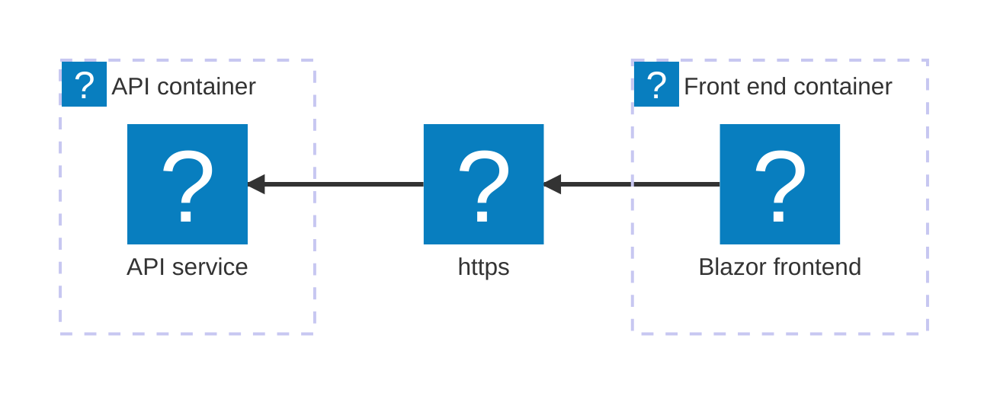
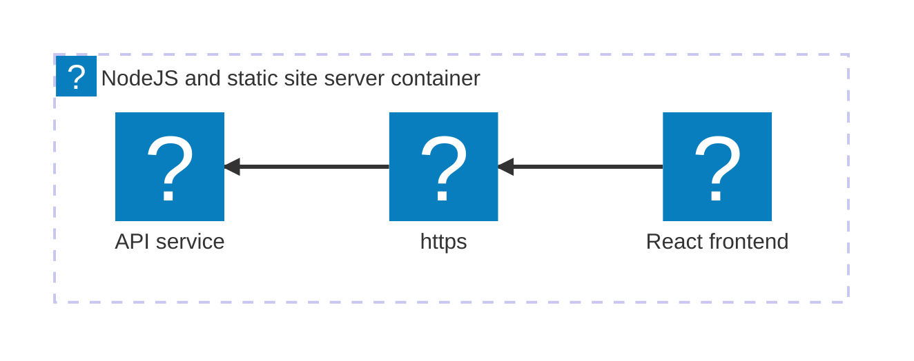

import { Aside, FileTree, Steps, TabItem, Tabs } from '@astrojs/starlight/components';
import { Image } from 'astro:assets';
import { Kbd } from 'starlight-kbd/components';
import Expand from '@components/Expand.astro';
import LearnMore from '@components/LearnMore.astro';
import PivotSelector from '@components/PivotSelector.astro';
import Pivot from '@components/Pivot.astro';
import ThemeImage from '@components/ThemeImage.astro';
import azureIcon from '@assets/icons/azure-icon.png';
import dockerIcon from '@assets/icons/docker.svg';
import csharpStarterPng from '@assets/get-started/csharp-starter.png';
import javascriptStarterDarkPng from '@assets/get-started/javascript-starter-dark.png';
import javascriptStarterLightPng from '@assets/get-started/javascript-starter-light.png';

<PivotSelector
    title="プログラミング言語を選択してください"
    key="aspire-lang"
    options={[
        { id: "csharp", title: "C#" },
        { id: "typescript", title: "TypeScript" },
    ]}
/>

<Pivot id="csharp">

このチュートリアルでは、[最初の Aspire アプリを構築する — C# AppHost](/ja/get-started/first-app/) クイックスタートで作成したアプリを取得し、デプロイします。これは、いくつかの重要な手順に分けることができます。

<Steps>

1. [デプロイメントパッケージを追加する](#デプロイメントパッケージを追加) - ターゲットのホスティング パッケージを追加します。
1. [AppHost を更新する](#apphost-を更新する) - 環境 API を構成します。
1. [アプリをデプロイする](#アプリをデプロイする) - Aspire CLI を使用してデプロイします。
1. [デプロイメントを確認する](#デプロイメントを確認する) - アプリが期待どおりに実行されていることを確認します。
1. [リソースをクリーンアップする](#リソースをクリーンアップする) - コストの発生を避けるために、デプロイされたリソースを削除します。

</Steps>

次の図は、デプロイしているサンプル アプリのアーキテクチャを示しています。


```mermaid
architecture-beta
    group api-docker(logos:docker-icon)[API container]
    group f-docker(logos:docker-icon)[Front end container]

    service api(logos:dotnet)[API service] in api-docker
    service http(iconoir:server-connection)[https]
    service frontend(aspire:blazor)[Blazor frontend] in f-docker

    frontend:L --> R:http
    http:L --> R:api
```

ASP.NET Core Blazor および Minimal API スターター テンプレートは 2 つのリソースで構成され、それぞれが別のコンテナーとしてデプロイされます。

</Pivot>
<Pivot id="typescript">

このチュートリアルでは、[最初の Aspire アプリを構築する — TypeScript AppHost](/ja/get-started/first-app/) クイックスタートで作成したアプリを取得してデプロイします。これは、いくつかの重要な手順に分けることができます。

<Steps>

1. [デプロイメントパッケージを追加する](#デプロイメントパッケージを追加) - ターゲットのホスティング パッケージを追加します。
1. [AppHost を更新する](#apphost-を更新する) - 環境 API を構成します。
1. [アプリをデプロイする](#アプリをデプロイする) - Aspire CLI を使用してデプロイします。
1. [デプロイメントを確認する](#デプロイメントを確認する) - アプリが期待どおりに実行されていることを確認します。
1. [リソースをクリーンアップする](#リソースをクリーンアップする) - コストの発生を避けるために、デプロイされたリソースを削除します。

</Steps>

次の図は、デプロイしているサンプル アプリのアーキテクチャを示しています。


```mermaid
architecture-beta
  group docker(logos:docker-icon)[NodeJS and static site server container]

  service api(logos:nodejs-icon)[API service] in docker
  service http(iconoir:server-connection)[https] in docker
  service frontend(logos:react)[React frontend] in docker

  frontend:L --> R:http
  http:L --> R:api
```

React (Vite) および Express スターター テンプレートは、単一のコンテナーとしてデプロイされる 2 つのリソースで構成されます。 Express サーバーは、API と React によって生成された静的フロントエンド ファイルの両方をホストします。

<LearnMore>
このチュートリアルでは、**バックエンドがフロントエンドにサービスを提供する** デプロイメント モデルを使用します。リバース プロキシやゲートウェイ/BFF アプローチなど、`AddViteApp` と `AddJavaScriptApp` で利用できる他の運用パターンについては、[JavaScript アプリをデプロイする](/ja/deployment/javascript-apps/) を参照してください。
</LearnMore>

</Pivot>

## 前提条件

<Pivot id="csharp">

Aspire アプリを展開する場所に応じて、次の前提条件がインストールおよび構成されていることを確認してください。

<Tabs syncKey="deploy-target">
    <TabItem id="docker-compose" label="Docker Compose">
        <div class="sl-flex sl-gap-4 sl-items-center sl-mb-4">
            <div>
                <Image src={dockerIcon} alt="Docker ロゴ" class="icon md" data-zoom-off />
            </div>
            - [Docker Desktop](https://www.docker.com/products/docker-desktop) がインストールされ、実行中です。
            - [Podman (Docker の代替)](https://podman.io/getting-started/installation) がインストールされ、実行中です。詳細については、[OCI 互換コンテナーランタイム](/ja/get-started/prerequisites/#install-an-oci-compliant-container-runtime) を参照してください。
        </div>
    </TabItem>
    <TabItem id="azure" label="Azure">
        <div class="sl-flex sl-gap-4 sl-items-center sl-mb-4">
        <div>
            <Image src={azureIcon} alt="Azure ロゴ" class="icon md" data-zoom-off />
        </div>
        - アクティブなサブスクリプションを持つ [Azure アカウント](https://azure.microsoft.com/free/)。
        - [Azure CLI](https://learn.microsoft.com/ja-jp/cli/azure/install-azure-cli) がインストールされ、構成されています。`az login` を使用してログインする必要があります。
        </div>
    </TabItem>
</Tabs>

</Pivot>
<Pivot id="typescript">

Aspire アプリを展開する場所に応じて、次の前提条件がインストールおよび構成されていることを確認してください。

<Tabs syncKey="deploy-target">
  <TabItem id="docker-compose" label="Docker Compose">
    <div class="sl-flex sl-gap-4 sl-items-center sl-mb-4">
      <div>
        <Image
          src={dockerIcon}
          alt="Docker ロゴ"
          class="icon md"
          data-zoom-off
        />
      </div>
      <ul>
        <li>
<a href="https://www.docker.com/products/docker-desktop">Docker デスクトップ</a>{' '}がインストールされ、実行されています。
        </li>
        <li>
<a href="https://podman.io/getting-started/installation">Podman (Docker の代替)</a>{' '}がインストールされ、実行されています。詳細は、「<a href="/ja/get-started/prerequisites/#install-an-oci-compliant-container-runtime">OCI互換コンテナのランタイム</a>」を参照してください。
        </li>
      </ul>
    </div>
  </TabItem>
  <TabItem id="azure" label="Azure">
    <div class="sl-flex sl-gap-4 sl-items-center sl-mb-4">
      <div>
        <Image src={azureIcon} alt="Azure ロゴ" class="icon md" data-zoom-off />
      </div>
      <ul>
        <li>
アクティブなサブスクリプションを持つ <a href="https://azure.microsoft.com/free/">Azure アカウント</a>。
        </li>
        <li>
<a href="https://learn.microsoft.com/ja-jp/cli/azure/install-azure-cli">Azure CLI</a>{' '}がインストールされ、構成されています。 <code>az login</code> を使用してログインする必要があります。
        </li>
      </ul>
    </div>
  </TabItem>
</Tabs>

</Pivot>

## デプロイメントパッケージを追加

<Pivot id="csharp">
前のクイックスタートで作成した Aspire ソリューションのルート ディレクトリで、ターミナルで次のコマンドを実行して、適切なホスティング展開パッケージを追加します。

<Tabs syncKey="deploy-target">
    <TabItem id="docker-compose" label="Docker Compose">

[Docker Compose](https://docs.docker.com/compose/) は、複数コンテナーの Docker アプリケーションを定義および実行するためのツールです。 YAML ファイルを使用してアプリケーションのサービス、ネットワーク、ボリュームを構成できるため、複雑なアプリケーションをローカルまたはさまざまな環境で管理およびデプロイすることが容易になります。

        ```bash title="Aspire CLI — Add Docker Compose"
        aspire add docker
        ```

Aspire CLI は対話型です。追加する [📦 Aspire.Hosting.Docker](https://www.nuget.org/packages/Aspire.Hosting.Docker) バージョンに適切な検索結果を必ず選択してください。

    </TabItem>
    <TabItem id="azure" label="Azure">

        ```bash title="Aspire CLI — Add Azure App Containers"
        aspire add azure-appcontainers
        ```

Aspire CLI は対話型です。追加する [📦 Aspire.Hosting.Azure.AppContainers](https://www.nuget.org/packages/Aspire.Hosting.Azure.AppContainers) バージョンに適切な検索結果を必ず選択してください。

    </TabItem>

追加の選択を求められた場合は、<Kbd windows="↑" mac="↑" /> キーと <Kbd windows="↓" mac="↓" /> キーを使用してオプションを移動します。 <Kbd windows="Enter" mac="Return" /> を押して選択を確認します。

    <LearnMore>
`aspire add` コマンドの詳細については、[参考資料](/ja/reference/cli/commands/aspire-add/) をご覧ください。
    </LearnMore>

</Tabs>

</Pivot>
<Pivot id="typescript">

前のクイックスタートで作成した Aspire アプリのルート ディレクトリで、ターミナルで次のコマンドを実行して、適切なホスティング展開パッケージを追加します。

<Tabs syncKey="deploy-target">
    <TabItem id="docker-compose" label="Docker Compose">

[Docker Compose](https://docs.docker.com/compose/) は、複数コンテナーの Docker アプリケーションを定義および実行するためのツールです。 YAML ファイルを使用してアプリケーションのサービス、ネットワーク、ボリュームを構成できるため、複雑なアプリケーションをローカルまたはさまざまな環境で管理およびデプロイすることが容易になります。

        ```bash title="Aspire CLI — Add Docker Compose"
        aspire add docker
        ```

Aspire CLI は対話型です。追加する [📦 Aspire.Hosting.Docker](https://www.nuget.org/packages/Aspire.Hosting.Docker) バージョンに適切な検索結果を必ず選択してください。

    </TabItem>
    <TabItem id="azure" label="Azure">

        ```bash title="Aspire CLI — Add Azure App Containers"
        aspire add azure-appcontainers
        ```

Aspire CLI は対話型です。追加する [📦 Aspire.Hosting.Azure.AppContainers](https://www.nuget.org/packages/Aspire.Hosting.Azure.AppContainers) バージョンに適切な検索結果を必ず選択してください。

    </TabItem>

追加の選択を求められた場合は、<Kbd windows="↑" mac="↑" /> キーと <Kbd windows="↓" mac="↓" /> キーを使用してオプションを移動します。 <Kbd windows="Enter" mac="Return" /> を押して選択を確認します。

    <LearnMore>
`aspire add` コマンドの詳細については、[参考資料](/ja/reference/cli/commands/aspire-add/) をご覧ください。
    </LearnMore>

</Tabs>

</Pivot>

## AppHost を更新する

<Pivot id="csharp">

AppHost で、適切な環境 API メソッドへの呼び出しを連鎖させて、ターゲットのデプロイメント環境を構成します。

<Tabs syncKey="deploy-target">
  <TabItem id="docker-compose" label="Docker Compose">

    ```csharp title="C# — AppHost.cs project-based orchestrator" {3-4}
    var builder = DistributedApplication.CreateBuilder(args);

    // 次の行を追加して、Docker Compose 環境を構成します。
    builder.AddDockerComposeEnvironment("env");

    var apiService = builder.AddProject<Projects.AspireApp_ApiService>("apiservice")
      .WithHttpHealthCheck("/health");

    builder.AddProject<Projects.AspireApp_Web>("webfrontend")
      .WithExternalHttpEndpoints()
      .WithHttpHealthCheck("/health")
      .WithReference(apiService)
      .WaitFor(apiService);

    builder.Build().Run();
    ```

    - `AddDockerComposeEnvironment` - デプロイ用に Docker Compose 環境を構成します。この呼び出しにより、デプロイの一部として AppHost 内のリソースをコンテナー化するサポートが暗黙的に追加されます。
    - `WithExternalHttpEndpoints` - デプロイ時にリソースの HTTP エンドポイントを公開します。

  </TabItem>
  <TabItem id="azure" label="Azure">

    ```csharp title="C# — AppHost.cs project-based orchestrator" {3-4}
    var builder = DistributedApplication.CreateBuilder(args);

    // 次の行を追加して、Azure App Container 環境を構成します。
    builder.AddAzureContainerAppEnvironment("env");

    var apiService = builder.AddProject<Projects.AspireApp_ApiService>("apiservice")
      .WithHttpHealthCheck("/health");

    builder.AddProject<Projects.AspireApp_Web>("webfrontend")
      .WithExternalHttpEndpoints()
      .WithHttpHealthCheck("/health")
      .WithReference(apiService)
      .WaitFor(apiService);

    builder.Build().Run();
    ```

    - `AddAzureContainerAppEnvironment` - デプロイ用に Azure App Container 環境を構成します。この呼び出しにより、デプロイの一部として AppHost 内のリソースをコンテナー化するサポートが暗黙的に追加されます。
    - `WithExternalHttpEndpoints` - デプロイ時にリソースの HTTP エンドポイントを公開します。

  </TabItem>
</Tabs>

<Aside type="tip" title="CLI のヒント" icon="forward-slash">
新しい展開パッケージをインストールした後、ターミナルで `aspire deploy --list-steps` を実行すると、展開のために実行されるパイプライン ステップを確認できます。詳細については、[`aspire deploy`](/ja/reference/cli/commands/aspire-deploy/) リファレンス ドキュメントを参照してください。
</Aside>

</Pivot>
<Pivot id="typescript">

AppHost で、適切な環境 API メソッドへの呼び出しを連鎖させて、ターゲットのデプロイメント環境を構成します。

<Tabs syncKey="deploy-target">
  <TabItem id="docker-compose" label="Docker Compose">

    ```typescript title="TypeScript — apphost.ts" {5-6} twoslash
    import { createBuilder } from './.modules/aspire.js';

    const builder = await createBuilder();

    // 次の行を追加して、Docker Compose 環境を構成します。
    await builder.addDockerComposeEnvironment("env");

    const app = await builder
      .addNodeApp("app", "./api", "src/index.ts")
      .withHttpEndpoint({ env: "PORT" })
      .withExternalHttpEndpoints();

    const frontend = await builder
      .addViteApp("frontend", "./frontend")
      .withReference(app)
      .waitFor(app);

    await app.publishWithContainerFiles(frontend, "./static");

    await builder.build().run();
    ```

    - `addDockerComposeEnvironment` - デプロイ用に Docker Compose 環境を構成します。この呼び出しにより、デプロイの一部として AppHost 内のリソースをコンテナー化するサポートが暗黙的に追加されます。
    - `withExternalHttpEndpoints` - デプロイ時にリソースの HTTP エンドポイントを公開します。

  </TabItem>
  <TabItem id="azure" label="Azure">

    ```typescript title="TypeScript — apphost.ts" {5-6} twoslash
    import { createBuilder } from './.modules/aspire.js';

    const builder = await createBuilder();

    // 次の行を追加して、Azure App Container 環境を構成します。
    await builder.addAzureContainerAppEnvironment("env");

    const app = await builder
      .addNodeApp("app", "./api", "src/index.ts")
      .withHttpEndpoint({ env: "PORT" })
      .withExternalHttpEndpoints();

    const frontend = await builder
      .addViteApp("frontend", "./frontend")
      .withReference(app)
      .waitFor(app);

    await app.publishWithContainerFiles(frontend, "./static");

    await builder.build().run();
    ```

    - `addAzureContainerAppEnvironment` - デプロイ用に Azure App Container 環境を構成します。この呼び出しにより、デプロイの一部として AppHost 内のリソースをコンテナー化するサポートが暗黙的に追加されます。
    - `withExternalHttpEndpoints` - デプロイ時にリソースの HTTP エンドポイントを公開します。

  </TabItem>

</Tabs>

<Aside type="tip" title="CLI のヒント" icon="forward-slash">
新しい展開パッケージをインストールした後、ターミナルで `aspire deploy --list-steps` を実行すると、展開のために実行されるパイプライン ステップを確認できます。詳細については、[`aspire deploy`](/ja/reference/cli/commands/aspire-deploy/) リファレンス ドキュメントを参照してください。
</Aside>

</Pivot>

## アプリをデプロイする

<Pivot id="csharp">

デプロイメント パッケージを追加し、AppHost を更新したので、Aspire アプリをデプロイできます。

<Tabs syncKey="deploy-target">

    <TabItem id="docker-compose" label="Docker Compose">

Docker Compose にデプロイすると、コンテナー イメージが構築され、Docker Compose を使用してサービスがローカルで開始されます。

    ```bash title="Aspire CLI — Deploy your app"
    aspire deploy
    ```

次の出力例を考えてみましょう。

<Expand summary="ASP.NET Core/Blazor アプリを Docker Compose にデプロするための出力例"
backgroundColor="--sl-color-bg">

    ```bash title="Aspire CLI - Deploy ASP.NET Core/Blazor app with Docker Compose"
    14:28:15 (pipeline execution) → Starting pipeline execution...
    14:28:15 (build-prereq) → Starting build-prereq...
    14:28:15 (publish-env) → Starting publish-env...
    14:28:15 (deploy-prereq) → Starting deploy-prereq...
    14:28:15 (build-prereq) ✓ build-prereq completed successfully
    14:28:15 (deploy-prereq) i [INF] Initializing deployment for environment 'Production'
    14:28:15 (publish-env) i [INF] Generating Compose output
    14:28:15 (deploy-prereq) i [INF] Setting default deploy tag 'aspire-deploy-20251107202815' for compute resource(s).
    14:28:15 (deploy-prereq) ✓ deploy-prereq completed successfully
    14:28:15 (build-webfrontend) → Starting build-webfrontend...
    14:28:15 (build-apiservice) → Starting build-apiservice...
    14:28:15 (publish-env) → Writing the Docker Compose file to the output path.
    14:28:15 (build-webfrontend) i [INF] Building container image for resource webfrontend
    14:28:15 (build-apiservice) i [INF] Building container image for resource apiservice
    14:28:15 (build-webfrontend) i [INF] Building image: webfrontend
    14:28:15 (publish-env) ✓ Docker Compose file written successfully to .\AspireApp\AspireApp.AppHost\aspire-output\docker-compose.yaml. (0.0s)
    14:28:15 (publish-env) ✓ publish-env completed successfully
    14:28:15 (publish) → Starting publish...
    14:28:15 (publish) ✓ publish completed successfully
    14:28:28 (build-webfrontend) i [INF] Building image for webfrontend completed
    14:28:28 (build-apiservice) i [INF] Building image: apiservice
    14:28:28 (build-webfrontend) ✓ build-webfrontend completed successfully
    14:28:32 (build-apiservice) i [INF] Building image for apiservice completed
    14:28:32 (build-apiservice) ✓ build-apiservice completed successfully
    14:28:32 (build) → Starting build...
    14:28:32 (build) ✓ build completed successfully
    14:28:32 (prepare-env) → Starting prepare-env...
    14:28:32 (prepare-env) ✓ prepare-env completed successfully
    14:28:32 (docker-compose-up-env) → Starting docker-compose-up-env...
    14:28:32 (docker-compose-up-env) → Running docker compose up for env
    14:28:35 (docker-compose-up-env) ✓ Service env is now running with Docker Compose locally (2.3s)
    14:28:35 (docker-compose-up-env) ✓ docker-compose-up-env completed successfully
    14:28:35 (print-env-dashboard-summary) → Starting print-env-dashboard-summary...
    14:28:35 (print-webfrontend-summary) → Starting print-webfrontend-summary...
    14:28:35 (print-env-dashboard-summary) i [INF] Successfully deployed env-dashboard to http://localhost:54633.
    14:28:35 (print-webfrontend-summary) i [INF] Successfully deployed webfrontend to http://localhost:54463.
    14:28:35 (print-env-dashboard-summary) ✓ print-env-dashboard-summary completed successfully
    14:28:35 (print-webfrontend-summary) ✓ print-webfrontend-summary completed successfully
    14:28:35 (deploy) → Starting deploy...
    14:28:35 (deploy) ✓ deploy completed successfully
    14:28:35 (pipeline execution) ✓ Completed successfully
    ------------------------------------------------------------
    ✓ 13/13 steps succeeded • Total time: 20.0s

    Steps Summary:
    19.9 s  ✓ pipeline execution
    17.6 s  ✓ build-apiservice
    12.9 s  ✓ build-webfrontend
    2.3 s  ✓ docker-compose-up-env
    0.0 s  ✓ publish-env
    0.0 s  ✓ deploy-prereq
    0.0 s  ✓ build-prereq
    0.0 s  ✓ build
    0.0 s  ✓ prepare-env
    0.0 s  ✓ print-env-dashboard-summary
    0.0 s  ✓ print-webfrontend-summary
    0.0 s  ✓ deploy
    0.0 s  ✓ publish

    ✓ PIPELINE SUCCEEDED
    ------------------------------------------------------------
    ```

    </Expand>

    </TabItem>
    <TabItem id="azure" label="Azure">

Azure にデプロイする場合、`aspire deploy` コマンドは対話型です。プロンプトを回避するには (CI/CD での実行時など)、次の環境変数を設定します。

    - `Azure__SubscriptionId`: ターゲットの Azure サブスクリプション ID。
    - `Azure__Location`: Azure リージョン (例: eastus)。
    - `Azure__ResourceGroup`: 作成または再利用するリソース グループ名。

Azure App Containers にデプロイすると、コンテナー イメージが構築され、サービスが Azure App Containers にデプロイされます。

    ```bash title="Aspire CLI — Deploy your app"
    aspire deploy
    ```

次の出力例を考えてみましょう。

<Expand summary="ASP.NET Core/Blazor アプリを Azure アプリ コンテナーにデプロイするための出力例"
backgroundColor="--sl-color-bg">

    ```bash title="Aspire CLI - Deploy ASP.NET Core/Blazor app to Azure App Containers"
    09:19:34 (pipeline execution) → Starting pipeline execution...
    09:19:34 (deploy-prereq) → Starting deploy-prereq...
    09:19:34 (build-prereq) → Starting build-prereq...
    09:19:34 (build-prereq) ✓ build-prereq completed successfully
    09:19:34 (deploy-prereq) i [INF] Initializing deployment for environment 'Production'
    09:19:34 (deploy-prereq) i [INF] Deployment state will be loaded from:
      %USERPROFILE%\.aspire\deployments\{AppHost:Sha}\production.json
    09:19:34 (deploy-prereq) i [INF] Setting default deploy tag 'aspire-deploy-20251110151934' for compute resource(s).
    09:19:34 (deploy-prereq) ✓ deploy-prereq completed successfully
    09:19:34 (validate-azure-login) → Starting validate-azure-login...
    09:19:34 (build-webfrontend) → Starting build-webfrontend...
    09:19:34 (build-apiservice) → Starting build-apiservice...
    09:19:34 (build-apiservice) i [INF] Building container image for resource apiservice
    09:19:34 (build-webfrontend) i [INF] Building container image for resource webfrontend
    09:19:34 (build-apiservice) i [INF] Building image: apiservice
    09:19:36 (validate-azure-login) ✓ Azure CLI authentication validated successfully
    09:19:36 (create-provisioning-context) → Starting create-provisioning-context...
    09:19:36 (create-provisioning-context) i [INF] Using AzureCliCredential for provisioning.
    09:19:38 (create-provisioning-context) i [INF] Default subscription: {SUB_NAME} subscription (/subscriptions/xxxxxxxx-xxxx-xxxx-xxxx-xxxxxxxxxxxx)
    09:19:38 (create-provisioning-context) i [INF] Tenant: xxxxxxxx-xxxx-xxxx-xxxx-xxxxxxxxxxxx
    09:19:38 (create-provisioning-context) i [INF] Using existing resource group pinesharp-rg.
    09:19:39 (create-provisioning-context) ✓ create-provisioning-context completed successfully
    09:19:39 (provision-env) → Starting provision-env...
    09:19:39 (provision-env) → Deploying env
    09:19:39 (provision-env) ✓ Using existing deployment for env (0.1s)
    09:19:39 (provision-env) ✓ provision-env completed successfully
    09:19:39 (login-to-acr-env) → Starting login-to-acr-env...
    09:19:39 (login-to-acr-env) → Logging in to envacrdwu3vj6ylvngg
    09:19:41 (login-to-acr-env) i [INF] Start processing HTTP request POST https://envacrdwu3vj6ylvngg.azurecr.io/oauth2/exchange
    09:19:41 (login-to-acr-env) i [INF] Sending HTTP request POST https://envacrdwu3vj6ylvngg.azurecr.io/oauth2/exchange
    09:19:41 (login-to-acr-env) i [INF] Received HTTP response headers after 224.2336ms - 200
    09:19:41 (login-to-acr-env) i [INF] End processing HTTP request after 234.3842ms - 200
    09:19:43 (login-to-acr-env) i [INF] Docker login to envacrdwu3vj6ylvngg.azurecr.io succeeded.
    09:19:43 (login-to-acr-env) ✓ Successfully logged in to envacrdwu3vj6ylvngg.azurecr.io (3.5s)
    09:19:43 (login-to-acr-env) ✓ login-to-acr-env completed successfully
    09:19:44 (build-apiservice) i [INF] Building image for apiservice completed
    09:19:44 (build-webfrontend) i [INF] Building image: webfrontend
    09:19:44 (build-apiservice) ✓ build-apiservice completed successfully
    09:19:44 (push-apiservice) → Starting push-apiservice...
    09:19:44 (push-apiservice) → Pushing apiservice to envacrdwu3vj6ylvngg
    09:19:45 (push-apiservice) i [INF] Docker tag for apiservice -> envacrdwu3vj6ylvngg.azurecr.io/apiservice:aspire-deploy-20251110151934 succeeded.
    09:19:54 (build-webfrontend) i [INF] Building image for webfrontend completed
    09:19:54 (build-webfrontend) ✓ build-webfrontend completed successfully
    09:19:54 (push-webfrontend) → Starting push-webfrontend...
    09:19:54 (push-webfrontend) → Pushing webfrontend to envacrdwu3vj6ylvngg
    09:19:55 (push-webfrontend) i [INF] Docker tag for webfrontend -> envacrdwu3vj6ylvngg.azurecr.io/webfrontend:aspire-deploy-20251110151934 succeeded.
    09:21:04 (push-apiservice) i [INF] Docker push for envacrdwu3vj6ylvngg.azurecr.io/apiservice:aspire-deploy-20251110151934 succeeded.
    09:21:04 (push-apiservice) ✓ Successfully pushed apiservice to envacrdwu3vj6ylvngg.azurecr.io/apiservice:aspire-deploy-20251110151934 (79.7s)
    09:21:04 (push-apiservice) ✓ push-apiservice completed successfully
    09:21:04 (provision-apiservice-containerapp) → Starting provision-apiservice-containerapp...
    09:21:04 (provision-apiservice-containerapp) → Deploying apiservice-containerapp
    09:21:04 (push-webfrontend) i [INF] Docker push for envacrdwu3vj6ylvngg.azurecr.io/webfrontend:aspire-deploy-20251110151934 succeeded.
    09:21:04 (push-webfrontend) ✓ Successfully pushed webfrontend to envacrdwu3vj6ylvngg.azurecr.io/webfrontend:aspire-deploy-20251110151934 (70.9s)
    09:21:04 (push-webfrontend) ✓ push-webfrontend completed successfully
    09:21:04 (provision-webfrontend-containerapp) → Starting provision-webfrontend-containerapp...
    09:21:04 (provision-webfrontend-containerapp) → Deploying webfrontend-containerapp
    09:21:44 (provision-webfrontend-containerapp) ✓ Successfully provisioned webfrontend-containerapp (39.9s)
    09:21:44 (provision-webfrontend-containerapp) ✓ provision-webfrontend-containerapp completed successfully
    09:21:44 (print-webfrontend-summary) → Starting print-webfrontend-summary...
    09:21:44 (print-webfrontend-summary) i [INF] Successfully deployed webfrontend to https://webfrontend.nicesea-f33ccead.centralus.azurecontainerapps.io
    09:21:44 (print-webfrontend-summary) ✓ print-webfrontend-summary completed successfully
    09:21:49 (provision-apiservice-containerapp) ✓ Successfully provisioned apiservice-containerapp (45.4s)
    09:21:49 (provision-apiservice-containerapp) ✓ provision-apiservice-containerapp completed successfully
    09:21:49 (provision-azure-bicep-resources) → Starting provision-azure-bicep-resources...
    09:21:49 (provision-azure-bicep-resources) ✓ provision-azure-bicep-resources completed successfully
    09:21:49 (print-dashboard-url-env) → Starting print-dashboard-url-env...
    09:21:49 (print-apiservice-summary) → Starting print-apiservice-summary...
    09:21:49 (print-apiservice-summary) i [INF] Successfully deployed apiservice to Azure Container Apps environment env. No public endpoints were configured.
    09:21:49 (print-apiservice-summary) ✓ print-apiservice-summary completed successfully
    09:21:49 (print-dashboard-url-env) ✓ Dashboard available at dashboard URL
    09:21:49 (deploy) → Starting deploy...
    09:21:49 (deploy) ✓ deploy completed successfully
    09:21:49 (pipeline execution) ✓ Completed successfully
    ------------------------------------------------------------
    ✓ 18/18 steps succeeded • Total time: 134.8s

    Steps Summary:
    134.8 s  ✓ pipeline execution
    79.7 s  ✓ push-apiservice
    70.9 s  ✓ push-webfrontend
    45.4 s  ✓ provision-apiservice-containerapp
    39.9 s  ✓ provision-webfrontend-containerapp
    19.1 s  ✓ build-webfrontend
    9.7 s  ✓ build-apiservice
    3.5 s  ✓ login-to-acr-env
    3.2 s  ✓ create-provisioning-context
    1.5 s  ✓ validate-azure-login
    0.1 s  ✓ provision-env
    0.0 s  ✓ deploy-prereq
    0.0 s  ✓ print-dashboard-url-env
    0.0 s  ✓ print-apiservice-summary
    0.0 s  ✓ print-webfrontend-summary
    0.0 s  ✓ provision-azure-bicep-resources
    0.0 s  ✓ build-prereq
    0.0 s  ✓ deploy

    ✓ PIPELINE SUCCEEDED
    ------------------------------------------------------------

    ```

    </Expand>

    </TabItem>
</Tabs>

`aspire deploy` を呼び出すと、Aspire CLI はリソースのコンテナー イメージを構築し、それらをターゲット環境 (該当する場合) にプッシュし、AppHost の構成に従ってリソースをデプロイします。

<Aside type="note" title="よくある落とし穴…" icon="seti:todo">
`aspire deploy` を呼び出して次のような出力が表示された場合は、実際に [AppHost を更新しました](#apphost-を更新する) して、ターゲットに適切な環境 API を含めたことを確認してください。この出力は、ターゲット環境に構成されたデプロイ手順がないことを示しています。

```bash title="Aspire CLI - Empty deployment output"
14:17:26 (pipeline execution) → Starting pipeline execution...
14:17:26 (deploy) → Starting deploy...
14:17:26 (deploy) ✓ deploy completed successfully
14:17:26 (pipeline execution) ✓ Completed successfully
------------------------------------------------------------
✓ 2/2 steps succeeded • Total time: 0.0s

Steps Summary:
0.0 s  ✓ pipeline execution
0.0 s  ✓ deploy

✓ PIPELINE SUCCEEDED
------------------------------------------------------------
```
</Aside>

<LearnMore>
このコマンドに関する追加情報は、[`aspire deploy`](/ja/reference/cli/commands/aspire-deploy/) リファレンス ドキュメントに記載されています。
</LearnMore>

### 導入後の出力

デプロイメント後、Aspire CLI は、デプロイメント ターゲットに基づいて、指定された出力パス (または何も指定されていない場合はデフォルトの出力パス) にファイルのセットを書き込みます。これには、Docker Compose ファイル、Kubernetes マニフェスト、クラウド プロバイダー固有の構成ファイルなどのファイルが含まれる場合があります。

<Tabs syncKey="deploy-target">
    <TabItem id="docker-compose" label="Docker Compose">

      <FileTree>
      - aspire-output
        - .env
        - .env.Production
        - docker-compose.yaml
      </FileTree>

`aspire-output` ディレクトリには、生成された環境変数と Docker Compose 構成が含まれています。最も良い点は、これらのファイルは開発者にとっては不透明であるということです。自分で記述する必要はありません。

`.env.Production` ファイルには、アプリ イメージの名前が含まれています。

      ```dotenv title="./aspire-output/.env.Production"
      # apiservice のコンテナー イメージ名
      APISERVICE_IMAGE=apiservice:latest

      # apiservice のデフォルトのコンテナー ポート
      APISERVICE_PORT=8080

      # Webフロントエンドのコンテナイメージ名
      WEBFRONTEND_IMAGE=webfrontend:latest

      # Webフロントエンドのデフォルトのコンテナポート
      WEBFRONTEND_PORT=8080
      ```

最後に、`docker-compose.yaml` ファイルは API とフロントエンドの両方のサービスを定義します。

      ```yaml title="./aspire-output/docker-compose.yaml"
      services:
        env-dashboard:
          image: "mcr.microsoft.com/dotnet/nightly/aspire-dashboard:latest"
          expose:
          - "18888"
          - "18889"
          networks:
          - "aspire"
          restart: "always"
        apiservice:
          image: "${APISERVICE_IMAGE}"
          environment:
          OTEL_DOTNET_EXPERIMENTAL_OTLP_EMIT_EXCEPTION_LOG_ATTRIBUTES: "true"
          OTEL_DOTNET_EXPERIMENTAL_OTLP_EMIT_EVENT_LOG_ATTRIBUTES: "true"
          OTEL_DOTNET_EXPERIMENTAL_OTLP_RETRY: "in_memory"
          ASPNETCORE_FORWARDEDHEADERS_ENABLED: "true"
          HTTP_PORTS: "${APISERVICE_PORT}"
          OTEL_EXPORTER_OTLP_ENDPOINT: "http://env-dashboard:18889"
          OTEL_EXPORTER_OTLP_PROTOCOL: "grpc"
          OTEL_SERVICE_NAME: "apiservice"
          expose:
          - "${APISERVICE_PORT}"
          networks:
          - "aspire"
        webfrontend:
          image: "${WEBFRONTEND_IMAGE}"
          environment:
          OTEL_DOTNET_EXPERIMENTAL_OTLP_EMIT_EXCEPTION_LOG_ATTRIBUTES: "true"
          OTEL_DOTNET_EXPERIMENTAL_OTLP_EMIT_EVENT_LOG_ATTRIBUTES: "true"
          OTEL_DOTNET_EXPERIMENTAL_OTLP_RETRY: "in_memory"
          ASPNETCORE_FORWARDEDHEADERS_ENABLED: "true"
          HTTP_PORTS: "${WEBFRONTEND_PORT}"
          APISERVICE_HTTP: "http://apiservice:${APISERVICE_PORT}"
          services__apiservice__http__0: "http://apiservice:${APISERVICE_PORT}"
          APISERVICE_HTTPS: "https://apiservice:${APISERVICE_PORT}"
          OTEL_EXPORTER_OTLP_ENDPOINT: "http://env-dashboard:18889"
          OTEL_EXPORTER_OTLP_PROTOCOL: "grpc"
          OTEL_SERVICE_NAME: "webfrontend"
          ports:
          - "${WEBFRONTEND_PORT}"
          depends_on:
          apiservice:
              condition: "service_started"
          networks:
          - "aspire"
      networks:
        aspire:
          driver: "bridge"
      ```

    </TabItem>
    <TabItem id="azure" label="Azure">

Azure App Containers にデプロイした後、Aspire CLI はデプロイ状態ファイルをローカル マシンに保存します。

    <FileTree>
    - %USERPROFILE%
      - .aspire/deployments/[AppHost-Sha256]/production.json
    </FileTree>

    <Aside type="tip" title="アプリホスト SHA256">
デプロイ状態は、完全な AppHost パスの SHA256 ハッシュにちなんで名付けられたディレクトリに保存されます。これにより、異なるアプリケーションまたはバージョンのデプロイメントが確実に分離されます。
    </Aside>

    </TabItem>
</Tabs>

</Pivot>
<Pivot id="typescript">

デプロイメント パッケージを追加し、AppHost を更新したので、Aspire アプリをデプロイできます。

<Tabs syncKey="deploy-target">

    <TabItem id="docker-compose" label="Docker Compose">

Docker Compose にデプロイすると、コンテナー イメージが構築され、Docker Compose を使用してサービスがローカルで開始されます。

    ```bash title="Aspire CLI — Deploy your app"
    aspire deploy
    ```

次の出力例を考えてみましょう。

<Expand summary="Express/React アプリを Docker Compose にデプロイするための出力例"
backgroundColor="--sl-color-bg">

    ```bash title="Aspire CLI - Deploy Express/React app with Docker Compose"
    13:23:29 (pipeline execution) → Starting pipeline execution...
    13:23:29 (publish-env) → Starting publish-env...
    13:23:29 (build-prereq) → Starting build-prereq...
    13:23:29 (deploy-prereq) → Starting deploy-prereq...
    13:23:29 (build-prereq) ✓ build-prereq completed successfully
    13:23:29 (deploy-prereq) i [INF] Initializing deployment for environment 'Production'
    13:23:29 (publish-env) i [INF] Generating Compose output
    13:23:29 (deploy-prereq) i [INF] Setting default deploy tag 'aspire-deploy-20251107192329' for compute resource(s).
    13:23:29 (deploy-prereq) ✓ deploy-prereq completed successfully
    13:23:29 (build-frontend) → Starting build-frontend...
    13:23:29 (build-frontend) i [INF] Building container image for resource frontend
    13:23:29 (build-frontend) i [INF] Building image: frontend
    13:23:29 (publish-env) → Writing the Docker Compose file to the output path.
    13:23:29 (publish-env) ✓ Docker Compose file written successfully to ./aspire-app/aspire-output/docker-compose.yaml. (0.0s)
    13:23:29 (publish-env) ✓ publish-env completed successfully
    13:23:29 (publish) → Starting publish...
    13:23:29 (publish) ✓ publish completed successfully
    13:23:51 (build-frontend) i [INF] docker buildx for frontend succeeded.
    13:23:51 (build-frontend) i [INF] Building image for frontend completed
    13:23:51 (build-frontend) ✓ build-frontend completed successfully
    13:23:51 (build-app) → Starting build-app...
    13:23:51 (build-app) i [INF] Building container image for resource app
    13:23:51 (build-app) i [INF] Building image: app
    13:24:07 (build-app) i [INF] docker buildx for app succeeded.
    13:24:07 (build-app) i [INF] Building image for app completed
    13:24:07 (build-app) ✓ build-app completed successfully
    13:24:07 (build) → Starting build...
    13:24:07 (build) ✓ build completed successfully
    13:24:07 (prepare-env) → Starting prepare-env...
    13:24:07 (prepare-env) ✓ prepare-env completed successfully
    13:24:07 (docker-compose-up-env) → Starting docker-compose-up-env...
    13:24:07 (docker-compose-up-env) → Running docker compose up for env
    13:24:13 (docker-compose-up-env) ✓ Service env is now running with Docker Compose locally (5.6s)
    13:24:13 (docker-compose-up-env) ✓ docker-compose-up-env completed successfully
    13:24:13 (print-env-dashboard-summary) → Starting print-env-dashboard-summary...
    13:24:13 (print-app-summary) → Starting print-app-summary...
    13:24:13 (print-env-dashboard-summary) i [INF] Successfully deployed env-dashboard to http://localhost:54633.
    13:24:13 (print-app-summary) i [INF] Successfully deployed app to http://localhost:54463.
    13:24:13 (print-env-dashboard-summary) ✓ print-env-dashboard-summary completed successfully
    13:24:13 (print-app-summary) ✓ print-app-summary completed successfully
    13:24:13 (deploy) → Starting deploy...
    13:24:13 (deploy) ✓ deploy completed successfully
    13:24:13 (pipeline execution) ✓ Completed successfully
    ------------------------------------------------------------
    ✓ 13/13 steps succeeded • Total time: 44.1s

    Steps Summary:
    44.0 s  ✓ pipeline execution
    22.2 s  ✓ build-frontend
    16.3 s  ✓ build-app
    5.6 s  ✓ docker-compose-up-env
    0.0 s  ✓ publish-env
    0.0 s  ✓ deploy-prereq
    0.0 s  ✓ build-prereq
    0.0 s  ✓ print-env-dashboard-summary
    0.0 s  ✓ print-app-summary
    0.0 s  ✓ deploy
    0.0 s  ✓ build
    0.0 s  ✓ prepare-env
    0.0 s  ✓ publish

    ✓ PIPELINE SUCCEEDED
    ------------------------------------------------------------
    ```

    </Expand>

    </TabItem>
    <TabItem id="azure" label="Azure">

Azure にデプロイする場合、`aspire deploy` コマンドは対話型です。プロンプトを回避するには (CI/CD での実行時など)、次の環境変数を設定します。

    - `Azure__SubscriptionId`: ターゲットの Azure サブスクリプション ID。
    - `Azure__Location`: Azure リージョン (例: eastus)。
    - `Azure__ResourceGroup`: 作成または再利用するリソース グループ名。

Azure App Containers にデプロイすると、コンテナー イメージが構築され、サービスが Azure App Containers にデプロイされます。

    ```bash title="Aspire CLI — Deploy your app"
    aspire deploy
    ```

次の出力例を考えてみましょう。

<Expand summary="Express/React アプリを Azure アプリ コンテナーにデプロイするための出力例"
backgroundColor="--sl-color-bg">

    ```bash title="Aspire CLI - Deploy Express/React app to Azure App Containers"
    09:24:18 (pipeline execution) → Starting pipeline execution...
    09:24:18 (deploy-prereq) → Starting deploy-prereq...
    09:24:18 (build-prereq) → Starting build-prereq...
    09:24:18 (deploy-prereq) i [INF] Initializing deployment for environment 'Production'
    09:24:18 (build-prereq) ✓ build-prereq completed successfully
    09:24:18 (deploy-prereq) i [INF] Setting default deploy tag 'aspire-deploy-20251110152418' for compute resource(s).
    09:24:18 (deploy-prereq) ✓ deploy-prereq completed successfully
    09:24:18 (validate-azure-login) → Starting validate-azure-login...
    09:24:18 (build-frontend) → Starting build-frontend...
    09:24:18 (build-frontend) i [INF] Building container image for resource frontend
    09:24:18 (build-frontend) i [INF] Building image: frontend
    09:24:19 (validate-azure-login) ✓ Azure CLI authentication validated successfully
    09:24:19 (create-provisioning-context) → Starting create-provisioning-context...
    09:24:19 (create-provisioning-context) i [INF] Using AzureCliCredential for provisioning.
    09:24:22 (create-provisioning-context) ✓ create-provisioning-context completed successfully
    09:24:22 (provision-env) → Starting provision-env...
    09:24:22 (provision-env) → Deploying env
    09:24:22 (provision-env) ✓ Using existing deployment for env (0.0s)
    09:24:22 (provision-env) ✓ provision-env completed successfully
    09:24:22 (login-to-acr-env) → Starting login-to-acr-env...
    09:24:22 (build-frontend) i [INF] docker buildx for frontend succeeded.
    09:24:22 (build-frontend) i [INF] Building image for frontend completed
    09:24:22 (build-frontend) ✓ build-frontend completed successfully
    09:24:22 (build-app) → Starting build-app...
    09:24:22 (build-app) i [INF] Building container image for resource app
    09:24:22 (build-app) i [INF] Building image: app
    09:24:25 (login-to-acr-env) ✓ Successfully logged in to ACR (3.2s)
    09:24:25 (login-to-acr-env) ✓ login-to-acr-env completed successfully
    09:24:27 (build-app) i [INF] docker buildx for app succeeded.
    09:24:27 (build-app) i [INF] Building image for app completed
    09:24:27 (build-app) ✓ build-app completed successfully
    09:24:27 (push-app) → Starting push-app...
    09:24:27 (push-app) → Pushing app to ACR
    09:25:06 (push-app) ✓ Successfully pushed app to ACR (38.5s)
    09:25:06 (push-app) ✓ push-app completed successfully
    09:25:06 (provision-app-containerapp) → Starting provision-app-containerapp...
    09:25:06 (provision-app-containerapp) → Deploying app-containerapp
    09:25:29 (provision-app-containerapp) ✓ Successfully provisioned app-containerapp (23.6s)
    09:25:29 (provision-app-containerapp) ✓ provision-app-containerapp completed successfully
    09:25:29 (print-app-summary) → Starting print-app-summary...
    09:25:29 (provision-azure-bicep-resources) → Starting provision-azure-bicep-resources...
    09:25:29 (provision-azure-bicep-resources) ✓ provision-azure-bicep-resources completed successfully
    09:25:29 (print-dashboard-url-env) → Starting print-dashboard-url-env...
    09:25:29 (print-app-summary) i [INF] Successfully deployed app to {DEPLOY_URL}
    09:25:29 (print-app-summary) ✓ print-app-summary completed successfully
    09:25:29 (print-dashboard-url-env) ✓ Dashboard available at dashboard URL
    09:25:29 (deploy) → Starting deploy...
    09:25:29 (deploy) ✓ deploy completed successfully
    09:25:29 (pipeline execution) ✓ Completed successfully
    ------------------------------------------------------------
    ✓ 15/15 steps succeeded • Total time: 71.6s

    Steps Summary:
    71.5 s  ✓ pipeline execution
    38.5 s  ✓ push-app
    23.6 s  ✓ provision-app-containerapp
    4.8 s  ✓ build-frontend
    4.7 s  ✓ build-app
    3.2 s  ✓ login-to-acr-env
    3.1 s  ✓ create-provisioning-context
    1.3 s  ✓ validate-azure-login
    0.0 s  ✓ provision-env
    0.0 s  ✓ deploy-prereq
    0.0 s  ✓ print-app-summary
    0.0 s  ✓ build-prereq
    0.0 s  ✓ print-dashboard-url-env
    0.0 s  ✓ provision-azure-bicep-resources
    0.0 s  ✓ deploy

    ✓ PIPELINE SUCCEEDED
    ------------------------------------------------------------
    ```

    </Expand>

    </TabItem>

</Tabs>

`aspire deploy` を呼び出すと、Aspire CLI はリソースのコンテナー イメージを構築し、それらをターゲット環境 (該当する場合) にプッシュし、AppHost の構成に従ってリソースをデプロイします。

<Aside type="note" title="よくある落とし穴…" icon="seti:todo">
`aspire deploy` を呼び出して次のような出力が表示された場合は、実際に [AppHost を更新しました](#apphost-を更新する) して、ターゲットに適切な環境 API を含めたことを確認してください。この出力は、ターゲット環境に構成されたデプロイ手順がないことを示しています。

```bash title="Aspire CLI - Empty deployment output"
14:17:26 (pipeline execution) → Starting pipeline execution...
14:17:26 (deploy) → Starting deploy...
14:17:26 (deploy) ✓ deploy completed successfully
14:17:26 (pipeline execution) ✓ Completed successfully
------------------------------------------------------------
✓ 2/2 steps succeeded • Total time: 0.0s

Steps Summary:
0.0 s  ✓ pipeline execution
0.0 s  ✓ deploy

✓ PIPELINE SUCCEEDED
------------------------------------------------------------
```

</Aside>

<LearnMore>
このコマンドに関する追加情報は、[`aspire deploy`](/ja/reference/cli/commands/aspire-deploy/) リファレンス ドキュメントに記載されています。
</LearnMore>

### 導入後の出力

デプロイメント後、Aspire CLI は、デプロイメント ターゲットに基づいて、指定された出力パス (または何も指定されていない場合はデフォルトの出力パス) にファイルのセットを書き込みます。これには、Docker Compose ファイル、Kubernetes マニフェスト、クラウド プロバイダー固有の構成ファイルなどのファイルが含まれる場合があります。

<Tabs syncKey="deploy-target">
    <TabItem id="docker-compose" label="Docker Compose">

        <FileTree>
        - aspire-output
          - .env
          - .env.Production
          - app.Dockerfile
          - docker-compose.yaml
        </FileTree>

`aspire-output` ディレクトリには、生成された環境変数、`app.Dockerfile`、および Docker Compose 構成が含まれています。最も良い点は、これらのファイルは開発者にとっては不透明であるということです。自分で記述する必要はありません。

`app.Dockerfile` は、Express API を構築し、React フロントエンドも提供するためのマルチステージ Dockerfile として生成されます。

        ```dockerfile title="./aspire-output/app.Dockerfile"
        ARG FRONTEND_IMAGENAME=frontend:latest

        FROM node:22-slim AS builder

        WORKDIR /app

        COPY package*.json ./
        RUN npm ci --production

        COPY . .

        FROM ${FRONTEND_IMAGENAME} AS frontend_stage

        FROM node:22-slim AS app

        COPY --from=frontend_stage /app/dist /app/./static
        COPY --from=builder /app /app

        USER node
        WORKDIR /app
        ENTRYPOINT ["node", "--import", "tsx", "src/index.ts"]
        ```

最後に、`docker-compose.yaml` ファイルでサービスを定義します。

        ```yaml title="./aspire-output/docker-compose.yaml"
        services:
          env-dashboard:
            image: "mcr.microsoft.com/dotnet/nightly/aspire-dashboard:latest"
            expose:
            - "18888"
            - "18889"
            networks:
            - "aspire"
            restart: "always"
          app:
            image: "${APP_IMAGE}"
            environment:
            PORT: "8000"
            OTEL_EXPORTER_OTLP_ENDPOINT: "http://env-dashboard:18889"
            OTEL_EXPORTER_OTLP_PROTOCOL: "grpc"
            OTEL_SERVICE_NAME: "app"
            ports:
            - "8000"
            networks:
            - "aspire"
        networks:
          aspire:
            driver: "bridge"
        ```

    </TabItem>
    <TabItem id="azure" label="Azure">

Azure App Containers にデプロイした後、Aspire CLI はデプロイ状態ファイルをローカル マシンに保存します。

        <FileTree>
        - $HOME
          - .aspire/deployments/[AppHost-Sha256]/production.json
        </FileTree>

    <Aside type="tip" title="アプリホスト SHA256">
デプロイ状態は、完全な AppHost パスの SHA256 ハッシュにちなんで名付けられたディレクトリに保存されます。これにより、異なるアプリケーションまたはバージョンのデプロイメントが確実に分離されます。
    </Aside>

    </TabItem>

</Tabs>

</Pivot>

## デプロイメントを確認する

<Pivot id="csharp">

デプロイメント後にアプリケーションが期待どおりに実行されていることを確認するには、以下で選択したデプロイメント ターゲットの手順に従ってください。

<Tabs syncKey="deploy-target">
  <TabItem id="docker-compose" label="Docker Compose">

Docker Compose にデプロイする場合、`aspire deploy` コマンドはサービスが実行されている URL を表示します。デプロイメント出力で `print-*-summary` ステップを探します。これには、`WithExternalHttpEndpoints` で構成された各サービスのローカルホスト URL が表示されます。

デプロイメント出力には、次のような行が表示されます。

    ```bash title="Aspire CLI - Deployment summary"
    14:28:35 (print-env-dashboard-summary) i [INF] Successfully deployed env-dashboard to http://localhost:54633.
    14:28:35 (print-webfrontend-summary) i [INF] Successfully deployed webfrontend to http://localhost:54463.
    ```

Web ブラウザを開き、Web フロントエンドに表示されている URL (`http://localhost:54463` など) に移動して、デプロイされたアプリケーションを確認します。

<ThemeImage
light={csharpStarterPng}
dark={csharpStarterPng}
alt="Docker Compose で実行されるデプロイされた ASP.NET Core/Blazor アプリケーション"
    />

フロントエンドは、ASP.NET Core Blazor アプリケーションに天気予報データを表示します。

  </TabItem>

  <TabItem id="azure" label="Azure">

Azure App Containers にデプロイする場合、デプロイ出力で提供される URL に移動することで、ASP.NET Core/Blazor アプリケーションが実行されていることを確認できます。出力内で次のような行を探します。

    ```bash title="Aspire CLI - Deployment summary"
    09:21:44 (print-webfrontend-summary) i [INF] Successfully deployed webfrontend to
      https://{NAME}.{LOCATION}.azurecontainerapps.io
    ```

Web ブラウザを開いて指定された URL に移動し、デプロイされたアプリケーションを表示します。

<ThemeImage
light={csharpStarterPng}
dark={csharpStarterPng}
alt="Docker Compose で実行されるデプロイされた ASP.NET Core/Blazor アプリケーション"
    />

フロントエンドは、ASP.NET Core Blazor アプリケーションに天気予報データを表示します。

  </TabItem>

</Tabs>

</Pivot>

<Pivot id="typescript">

デプロイメント後にアプリケーションが期待どおりに実行されていることを確認するには、以下で選択したデプロイメント ターゲットの手順に従ってください。

<Tabs syncKey="deploy-target">
  <TabItem id="docker-compose" label="Docker Compose">

Docker Compose にデプロイする場合、`aspire deploy` コマンドはサービスが実行されている URL を表示します。デプロイメント出力で `print-*-summary` ステップを探します。これには、`withExternalHttpEndpoints` で構成された各サービスのローカルホスト URL が表示されます。

デプロイメント出力には、次のような行が表示されます。

    ```bash title="Aspire CLI - Deployment summary"
    13:24:13 (print-env-dashboard-summary) i [INF] Successfully deployed env-dashboard to http://localhost:54633.
    13:24:13 (print-app-summary) i [INF] Successfully deployed app to http://localhost:54463.
    ```

Web ブラウザを開いて、アプリに表示されている URL (`http://localhost:54463` など) に移動して、デプロイされたアプリケーションを確認します。

<ThemeImage
light={javascriptStarterLightPng}
dark={javascriptStarterDarkPng}
alt="Docker Compose で実行されるデプロイされた Express/React アプリケーション"
    />

フロントエンドは、天気予報データを React テンプレートで表示します。この例では、API サービスと React フロントエンドの両方が同じ Docker コンテナ内で実行されています。

  </TabItem>

  <TabItem id="azure" label="Azure">

Azure App Containers にデプロイする場合、デプロイ出力で提供される URL に移動することで、Express/React アプリケーションが実行されていることを確認できます。出力内で次のような行を探します。

    ```bash title="Aspire CLI - Deployment summary"
    09:25:29 (print-app-summary) i [INF] Successfully deployed app to
      https://{NAME}.{LOCATION}.azurecontainerapps.io
    ```

Web ブラウザを開いて指定された URL に移動し、デプロイされたアプリケーションを表示します。

<ThemeImage
light={javascriptStarterLightPng}
dark={javascriptStarterDarkPng}
alt="Azure アプリコンテナー上で実行されるデプロイされた Express/React アプリケーション"
    />

フロントエンドは、天気予報データを React テンプレートで表示します。この例では、API サービスと React フロントエンドの両方が同じ Docker コンテナ内で実行されています。

  </TabItem>

</Tabs>

</Pivot>

## リソースをクリーンアップする

<Pivot id="csharp">

アプリケーションをデプロイした後、不必要なコストの発生やローカル システム リソースの消費を避けるために、リソースをクリーンアップすることが重要です。

`aspire destroy` を使用して、デプロイされた環境を破棄します。このコマンドはデプロイメントを検出し、削除される内容を表示し、続行する前に確認を求めるプロンプトを表示します。

```bash title="Aspire CLI - Destroy the deployed environment"
aspire destroy
```

<Aside type="caution">
`aspire destroy` は、デプロイされたリソースを完全に削除します。Azure
デプロイでは、リソース グループ全体とその中のすべてが削除されます。
Docker Compose では、実行中のコンテナー、ネットワーク、およびボリュームを
停止して削除します。この操作は元に戻すことができません。
</Aside>

<LearnMore>
関連する基本的な概念について詳しくは、[パイプラインとアプリのトポロジ](/ja/deployment/pipelines/) を参照してください。
</LearnMore>

最初の Aspire アプリを構築し、本番環境にデプロイしました。ここで、「これらすべてのサービスが実際に正しく連携して動作することを確認するにはどうすればよいでしょうか?」と疑問に思われるかもしれません。そこで統合テストの出番です。Aspire を使用すると、サービス間通信やリソースの依存関係など、アプリケーション スタック全体を簡単にテストできます。方法を学ぶ準備はできましたか? [最初のテストを作成する](/ja/testing/write-your-first-test/)

</Pivot>
<Pivot id="typescript">

アプリケーションをデプロイした後、不必要なコストの発生やローカル システム リソースの消費を避けるために、リソースをクリーンアップすることが重要です。

`aspire destroy` を使用して、デプロイされた環境を破棄します。このコマンドはデプロイメントを検出し、削除される内容を表示し、続行する前に確認を求めるプロンプトを表示します。

```bash title="Aspire CLI - Destroy the deployed environment"
aspire destroy
```

<Aside type="caution">
`aspire destroy` は、デプロイされたリソースを完全に削除します。Azure
デプロイでは、リソース グループ全体とその中のすべてが削除されます。
Docker Compose では、実行中のコンテナー、ネットワーク、およびボリュームを
停止して削除します。この操作は元に戻すことができません。
</Aside>

<LearnMore>
関連する基本的な概念について詳しくは、[パイプラインとアプリのトポロジ](/ja/deployment/pipelines/) を参照してください。
</LearnMore>

最初の Aspire アプリを構築し、本番環境にデプロイしました。ここで、「これらすべてのサービスが実際に正しく連携して動作することを確認するにはどうすればよいでしょうか?」と疑問に思われるかもしれません。そこで統合テストの出番です。Aspire を使用すると、サービス間通信やリソースの依存関係など、アプリケーション スタック全体を簡単にテストできます。方法を学ぶ準備はできましたか? [最初のテストを作成する](/ja/testing/write-your-first-test/)

</Pivot>
