```mermaid
architecture-beta

  service api(logos:dotnet)[API service]
  service frontend(aspire:blazor)[Blazor front end]

  frontend:L --> R:api
```

```mermaid
architecture-beta
  service api(logos:fastapi)[API service]
  service frontend(logos:react)[React front end]

  frontend:L --> R:api
```

import { Aside, CardGrid, LinkCard, Steps, Tabs, TabItem, Icon, FileTree } from '@astrojs/starlight/components';
import { Kbd } from 'starlight-kbd/components'
import LearnMore from '@components/LearnMore.astro';
import PivotSelector from '@components/PivotSelector.astro';
import Pivot from '@components/Pivot.astro';
import ThemeImage from '@components/ThemeImage.astro';

import pythonIcon from "@assets/icons/python.svg";
import reactIcon from "@assets/icons/react-icon.svg";
import uvIcon from "@assets/icons/uv-icon.svg";
import fastApiIcon from "@assets/icons/fastapi-icon.svg";

<PivotSelector
    title="プログラミング言語を選択して始めましょう"
    key="lang"
    options={[
        { id: "csharp", title: "C#" },
        { id: "python", title: "Python" },
        { id: "javascript", title: "JavaScript (coming soon)", disabled: true },
    ]}
/>

このクイックスタートでは、Aspire CLI を使って最初の Aspire アプリケーションを作成し、実行します。
始める前に、 [事前準備](/ja/get-started/prerequisites/) を完了し、 [Aspire CLI をインストール](/ja/get-started/install-cli/)していることを確認してください。 このガイドでは、テンプレートから新しい Aspire ソリューションを生成し、Aspire の開発時オーケストレーションを用いてローカルでアプリケーションを実行し、Aspire ダッシュボードを確認するまでの手順を順にご案内します。 このクイックスタートを終えたら、 [最初のアプリをデプロイ](/get-started/deploy-first-app/) も是非試してください。

<Pivot id="csharp">

このスターター テンプレートは、最新の C# を採用しています:

- 軽量な HTTP API を実現する [Minimal APIs](https://learn.microsoft.com/aspnet/core/fundamentals/minimal-apis)
- C# を使ってインタラクティブな Web UI を構築する [Blazor](https://learn.microsoft.com/aspnet/core/blazor)
- 可観測性とレジリエンスの共通設定をまとめた [Service defaults](/fundamentals/service-defaults/)

次の図は、これから作成するサンプルアプリのアーキテクチャを示しています:



</Pivot>
<Pivot id="python">

このスターター テンプレートは、最新の Python と JavaScript のスタックを組み合わせています:

- Python で API を構築するための [FastAPI](https://fastapi.tiangolo.com/)
- Python パッケージのインストールと環境管理を行う [Uv](https://docs.astral.sh/uv/)
- JavaScript でユーザーインターフェースを構築するための[React](https://react.dev/)

次の図は、これから作成するサンプルアプリのアーキテクチャを示しています:



</Pivot>
<Pivot id="javascript">
</Pivot>

## 新しいアプリを作成する

最初の Aspire アプリケーションを作成するには、 [Aspire CLI](/ja/get-started/install-cli/) を使用して _スターター_ テンプレートから新しいソリューションを生成します。 これらのテンプレートには、API サービス、Web フロントエンド、 [Aspire AppHost](/get-started/app-host/) など、複数のプロジェクトが含まれています。

<Steps>

1. テンプレートから新しい Aspire ソリューションを作成してください:

    <Pivot id="csharp">

    ```bash title="新しい Aspire ソリューションを作成する"
    aspire new aspire-starter -n AspireApp -o AspireApp
    ```

    </Pivot>
    <Pivot id="python">

    ```bash title="新しい Aspire ソリューションを作成する"
    aspire new aspire-py-starter -n aspire-app -o aspire-app
    ```

    </Pivot>
    <Pivot id="javascript">

    ```bash title="新しい Aspire ソリューションを作成する"
    aspire new aspire-js-starter -n aspire-app -o aspire-app
    ```

    </Pivot>

    このテンプレートには、API サービス、Web フロントエンド、AppHost など、複数のプロジェクトが含まれています。

    <Aside type='tip' title='CLI flags' icon='list-format'>
    このコマンドでは次のフラグが使用されています:

      - `-n`: ソリューション名を指定します。
      - `-o`: 出力先ディレクトリを指定します。

    </Aside>

    <LearnMore>
        さらに詳しい CLI の参照情報については、 [`aspire new`](/reference/cli/commands/aspire-new/) コマンドの説明をご覧ください。
    </LearnMore>

    追加の選択肢が表示された場合は、 <Kbd windows="↑" mac="↑" /> と <Kbd windows="↓" mac="↓" /> でオプションを移動します。 <Kbd windows="Enter" mac="Return" /> で選択を確定してください。

</Steps>

## テンプレートのコードを確認する

<Steps>

1. 作成されたテンプレート構造を確認してください。Aspire CLI は、現在のディレクトリ内に、指定した名前の新しいフォルダーを作成します。このフォルダーには、ソリューションファイルと複数のプロジェクトが含まれており、たとえば次のような構成になります:

    <Pivot id="csharp">
    <FileTree>
    - AspireApp.sln
    - AspireApp.ApiService  mock weather data API
        - Properties/
        - appsettings.Development.json
        - appsettings.json
        - AspireApp.ApiService.csproj
        - Program.cs
    - **AspireApp.AppHost** dev-time orchestrator
        - Properties/
        - appsettings.Development.json
        - appsettings.json
        - AspireApp.AppHost.csproj
        - AppHost.cs
    - AspireApp.ServiceDefaults
        - Extensions.cs
        - AspireApp.ServiceDefaults.csproj
    - AspireApp.Web  ASP.NET Core Blazor front end
        - Properties/
        - wwwroot/
        - appsettings.Development.json
        - appsettings.json
        - AspireApp.Web.csproj
        - Program.cs
        - WeatherApiClient.cs
    </FileTree>
    </Pivot>
    <Pivot id="python">
    <FileTree>
    - aspire-app/
        - app/  FastAPI mock weather data API
            - .dockerignore
            - .python-version
            - main.py
            - pyproject.toml
            - telemetry.py
        - frontend/  Vite + React web front end
            - .dockerignore
            - public/
                - Aspire.png
                - github.svg
            - src/
                - App.css
                - App.tsx
                - index.css
                - main.tsx
                - vite-env.d.ts
            - .gitignore
            - eslint.config.js
            - index.html
            - package-lock.json
            - package.json
            - tsconfig.app.json
            - tsconfig.json
            - tsconfig.node.json
            - vite.config.ts
        - **apphost.cs** dev-time orchestrator
        - apphost.run.json
        - NuGet.config
    </FileTree>
    </Pivot>

    このソリューション構造は Aspire テンプレートに基づいています。もしテンプレートがまだインストールされていない場合は、CLI が自動的にインストールします。

1. アプリをオーケストレーションする AppHost のコードを確認してみましょう。

    [AppHost](/get-started/app-host/) は Aspire アプリケーションの中枢であり、どのサービスを動かすか、それらがどのように接続されるか、どの順番で起動するかを定義します。それでは、生成されたコードを見ていきましょう。:

    <Pivot id="csharp">
    ```csharp title="C# — AppHost.cs project-based orchestrator"
    var builder = DistributedApplication.CreateBuilder(args);

    var apiService = builder.AddProject<Projects.AspireApp_ApiService>("apiservice")
        .WithHttpHealthCheck("/health");

    builder.AddProject<Projects.AspireApp_Web>("webfrontend")
        .WithExternalHttpEndpoints()
        .WithHttpHealthCheck("/health")
        .WithReference(apiService)
        .WaitFor(apiService);

    builder.Build().Run();
    ```

    _何が起きているのでしょうか？_

    - `CreateBuilder` は、分散アプリケーション用のビルダーを作成します。
    - `AddProject` は、API サービスと Web フロントエンドを登録します。
    - `WithReference` は、サービス間の接続を作成します。（Web アプリが API を呼び出せるようにします。）
    - `WaitFor` は、サービスが正しい順序で起動するように制御します。
    - `WithHttpHealthCheck` は、サービスの正常性状態を監視します。
    
    </Pivot>
    <Pivot id="python">
    ```csharp title="C# — apphost.cs file-based orchestrator"
    #:sdk Aspire.AppHost.Sdk@13.0.0
    #:package Aspire.Hosting.JavaScript@13.0.0
    #:package Aspire.Hosting.Python@13.0.0

    var builder = DistributedApplication.CreateBuilder(args);

    var app = builder.AddUvicornApp("app", "./app", "main:app")
        .WithUv()
        .WithExternalHttpEndpoints()
        .WithHttpHealthCheck("/health");

    var frontend = builder.AddViteApp("frontend", "./frontend")
        .WithReference(app)
        .WaitFor(app);

    app.PublishWithContainerFiles(frontend, "./static");

    builder.Build().Run();
    ```

    _何が起きているのでしょうか？_
    
    - `AddUvicornApp` は、Uvicorn ベースの Python アプリを追加します。
    - `AddUv` は、`uv sync` を実行する Uv の環境セットアップタスクを追加します。
    - `AddViteApp` は、React フロントエンドを登録します。
    - `WithReference` は、フロントエンドと API を接続します。
    - `WaitFor` は、フロントエンドより先に API が起動するよう順序を制御します。
    - `PublishWithContainerFiles` は、フロントエンドを本番デプロイ向けにバンドルします。

    </Pivot>

    <Aside type="note" title="コードファーストのオーケストレーション">
    アプリケーションのトポロジーはコードで定義されているため、理解しやすく、変更も容易で、バージョン管理にも適しています。詳しくは [AppHost](/get-started/app-host/)をご覧ください。
    </Aside>

</Steps>

## アプリを実行する

import csharpDashboardLight from '@assets/get-started/csharp-aspire-dashboard-light.png';
import csharpDashboardDark from '@assets/get-started/csharp-aspire-dashboard-dark.png';
import pythonDashboardLight from '@assets/get-started/python-aspire-dashboard-light.png';
import pythonDashboardDark from '@assets/get-started/python-aspire-dashboard-dark.png';

<Steps>

1. _output_ ディレクトリに移動してください:

    <Pivot id="csharp">

    ```bash title="ディレクトリを移動"
    cd ./AspireApp
    ```

    </Pivot>
    <Pivot id="python,javascript">
    
    ```bash title="ディレクトリを移動"
    cd ./aspire-app
    ```
    
    </Pivot>

1. `aspire run` を実行して、開発時オーケストレーションを開始してください:

    ```bash title="開発時オーケストレーションを開始"
    aspire run
    ```

    このコマンドを実行すると、Aspire CLI は次の処理を行います:
    
    - AppHost を自動的に検出
    - ソリューションをビルド
    - 開発時オーケストレーションを起動
    
    ダッシュボードの準備が整くと、ターミナルに URL（ログイン用トークン付き。以下の出力例で強調表示）が表示されます。ダッシュボードでは、稼働中のリソースやその状態をリアルタイムで確認できます。

    <Pivot id="csharp">

    ```bash title="Example output" mark={8}
    🔍  Finding apphosts...
    AspireApp.AppHost/AspireApp.AppHost.csproj

    🗄  Created settings file at '.aspire/settings.json'.

         AppHost:  AspireApp.AppHost/AspireApp.AppHost.csproj

       Dashboard:  https://localhost:17068/login?t=ea559845d54cea66b837dc0ff33c3bd3

            Logs:  %USERPROFILE%/.aspire/cli/logs/apphost-13024-2025-10-31-19-40-58.log

                   Press CTRL+C to stop the apphost and exit.
    ```

    </Pivot>

    <Pivot id="python,javascript">
    ```bash title="Example output" mark={8}
    🔍  Finding apphosts...
    apphost.cs

    🗄  Created settings file at '.aspire/settings.json'.

         AppHost:  apphost.cs

       Dashboard:  https://localhost:17213/login?t=2b4a2ebc362b7fef9b5ccf73e702647b

            Logs:  $HOME/.aspire/cli/logs/apphost-27732-2025-10-31-19-21-27.log

                   Press CTRL+C to stop the apphost and exit.
    ```
    </Pivot>

    <LearnMore>
         より詳しい CLI の情報については、 [`aspire run`](/reference/cli/commands/aspire-run/) コマンドの説明をご覧ください。
    </LearnMore>

1. 実行中の分散アプリケーションを確認してください。ダッシュボードから、各リソースの `HTTPS` エンドポイント を開いてみましょう。

    <Pivot id="csharp">
        <ThemeImage 
            light={csharpDashboardLight}
            dark={csharpDashboardDark}
            label='Aspire dashboard Resources page'
            alt={`Aspire ダッシュボードの「Resources」ページには、apiservice と webfrontend の 2 つのリソースが表示されており、どちらも緑色のチェックアイコン付きで Running 状態になっています。テーブルには、Name（名前）、State（状態）、Start time（開始時刻）、Source（ソース）、URLs、Actions（操作） といった列が並んでいます。`} />
    </Pivot>
    <Pivot id="python">
        <ThemeImage 
            light={pythonDashboardLight}
            dark={pythonDashboardDark}
            label='Aspire dashboard Resources page'
            alt={`Aspire ダッシュボードの「Resources」ページには、apiservice と webfrontend を含む 2 つの実行中リソース と 2 つの完了済みリソース が表示されています。実行中の 2 つは緑色のチェックアイコンで Running と示され、依存する 2 つのリソースは灰色の停止アイコンで Finished と表示されています。テーブルには、Name（名前）、State（状態）、Start time（開始時刻）、Source（ソース）、URLs、Actions（操作） の各列が並んでいます。`} />
    </Pivot>

    <LearnMore>
         詳しくは、 [Aspire ダッシュボード概要](/dashboard/overview/) をご覧ください。
    </LearnMore>

</Steps>

## アプリを停止する

<Steps>

1. ターミナルで <Kbd windows="Ctrl+C" mac="⌘+C" /> を押すと、AppHost が停止し、ダッシュボードも閉じられます。

    ```bash title="開発時オーケストレーションを停止する"
    🛑  Stopping Aspire.
    ```

    **🥳 おめでとうございます！ 最初の Aspire アプリを作成しました。**

</Steps>

<LearnMore>
次はこのアプリをデプロイしたくなるかもしれませんね。そしてもちろん Aspire がどのようにそれを扱うのかもご紹介します。でも同時に、きっとこう思われたのではないでしょうか:「これ、どうやって _テスト _するの？」 良い質問です！ Aspire はローカルでのオーケストレーションやデプロイだけでなく、サービスやリソース間の統合テストもサポートしています。 準備はよろしいですか？ [最初のテストを書いてみる](/testing/write-your-first-test/) 💜
</LearnMore>