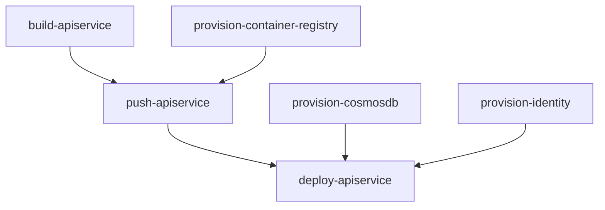
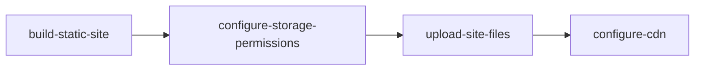

import { Aside, Steps, Tabs, TabItem } from '@astrojs/starlight/components';
import LearnMore from '@components/LearnMore.astro';

Aspire の **AppHost** で分散アプリを構成するということは、単にローカル開発やオーケストレーションのためにサービスを定義するだけではありません。デプロイのための基盤も同時に整えていることになります。ローカルで実行・デバッグする際に使用する同じ構成が、アプリを発行（publish）する際にも活用され、開発から本番環境まで一貫性が保たれます。

## 再利用可能なアプリケーショントポロジー

Aspire は、既存のデプロイワークフローを妨げることはありません。むしろ、さまざまな環境やプラットフォームにデプロイ可能な、一貫した方法でアプリケーションの構成（アーキテクチャ）を定義できるようにします。

三層アーキテクチャの例を引き続き用いると、ローカルマシン、クラウドプロバイダー、自社サーバーなど、どのような環境であっても、同じアプリトポロジーをそのままデプロイできます。

```mermaid
architecture-beta

  service db(logos:postgresql)[PostgreSQL]
  service api(logos:dotnet)[API Service]
  service frontend(logos:react)[Frontend]

  api:R --> L:db
  frontend:R --> L:api
```



この表は、同じリソースを異なるプラットフォームにデプロイする方法を示しています:

| Resource       | Local                                          | AWS                         | Azure                 | On-Premises |
| -------------- | ---------------------------------------------- | --------------------------- | --------------------- | ----------- |
| フロントエンド | `npm run dev`                                  | Elastic Container Service   | Container Apps        | カスタム    |
| API サービス   | `dotnet run --project ../<API_PROJECT>.csproj` | AWS Lambda                  | Functions             | カスタム    |
| PostgreSQL     | `docker.io/library/postgres`                   | Relational Database Service | Database for Postgres | カスタム    |

<Aside type="tip">
  Aspire の AppHost
  を使うことで、プラットフォームに依存しない形でアプリケーションのアーキテクチャを定義できます。つまり、同じコードをそのままローカルで実行したり、変更なしで任意の環境にデプロイしたりすることが可能です。
</Aside>

Aspire は、拡張可能で構成可能なデプロイワークフローを実現する、パイプラインベースのデプロイシステムを採用しています。この仕組みにより、異なる環境間での一貫性を保ちながら、アプリケーションのデプロイ方法を柔軟にカスタマイズできます。

<Aside type="note">
  パイプラインベースのデプロイは、Aspire 13 における実験的な機能です。API
  や機能は、今後のリリースで変更される可能性があります。
</Aside>

## 概要

パイプライン デプロイ システムは、クラウド アプリケーションをデプロイするための柔軟かつ並列実行可能なモデルを提供します。パイプラインは、デプロイを明確に定義された個別のステップに分割し、パフォーマンスと信頼性を最適化しながら、デプロイ プロセス全体の可視性を維持します。

### なぜパイプラインが重要なのか

現代のクラウド アプリケーションでは、分散システムの複雑さに対応するため、高度なデプロイ オーケストレーションが求められます。Aspire のパイプライン システムは、次のような機能を提供します:

- **インテリジェントな並列実行**: 独立した処理を並列で実行し、リソースの利用効率を最大化するとともに、全体のデプロイ時間を最小化します
- **粒度の細かい制御**: 各ステップを個別に実行・監視・再試行でき、詳細なエラー報告や的確なリカバリーが可能です
- **スマートな依存関係管理**: 実際に必要な依存関係のみを待機することで、正しさを保ちつつ最適な実行順序を実現します
- **包括的な可観測性**: ステップ単位およびサブタスク単位でのリアルタイムな進捗表示により、デプロイ作業の状況を明確に把握できます
- **柔軟な実行**: 完全なデプロイの実行だけでなく、要件に応じた特定ステップのみの実行も可能です

### コア機能

パイプライン デプロイ システムは、以下の主要な機能を実現します:

- **デプロイの拡張**: 特定のリソースやシナリオ向けに、カスタム デプロイ ステップを追加可能
- **実行順序の制御**: ステップ間の依存関係を宣言し、正しい順序で実行
- **選択的なステップ実行**: 特定のステップとその依存関係のみを実行し、高速な反復を実現
- **処理の並列化**: 独立したステップを同時に実行し、パフォーマンスを向上
- **状態の永続化**: 複数回のデプロイ実行にわたって、デプロイ状態やパラメータをキャッシュ
- **インテリジェントな粒度調整**: 細かな制御とデプロイ効率のバランスを最適化

## コア コンセプト

パイプライン システムは、柔軟かつ効率的なデプロイ オーケストレーションを実現するために、いくつかの基本的な概念を中心に構成されています。

### パイプライン ステップ

パイプライン ステップは、アプリケーション パイプラインにおける個別の作業単位を表します。各ステップはデプロイ プロセスの特定の側面をカプセル化しており、全体の処理をより管理しやすく、デバッグしやすいものにします。

各ステップには、次の要素があります:

- **名前**: ステップを一意に識別するための識別子
- **アクション**: デプロイ中に実行される処理内容
- **依存関係**: このステップが実行される前に完了している必要がある他のステップ
- **リソース コンテキスト**: アプリケーションのリソース モデルや構成情報へのアクセス

パイプライン ステップは、異なる粒度レベルで動作します。たとえば、フロントエンド、API サービス、データベース、ストレージを持つ一般的な Web アプリケーションをデプロイする場合、パイプラインには次のようなステップが含まれることがあります:

**インフラ ステップ** (並列実行可能):

- `provision-cosmosdb`: Cosmos DB データベースをプロビジョニング
- `provision-storage`: Azure Storage アカウントをプロビジョニング
- `provision-aca-env`: Azure Container Apps 環境をプロビジョニング
- `provision-container-registry`: コンテナー イメージ レジストリをセットアップ

**ビルド ステップ** (並列実行可能):

- `build-apiservice`: API サービス用のコンテナー イメージをビルド
- `build-webfrontend`: フロントエンド用のコンテナー イメージをビルド

**デプロイ ステップ** (ビルドおよびインフラに依存):

- `push-apiservice`: API サービスのイメージをレジストリにプッシュ
- `push-webfrontend`: フロントエンドのイメージをレジストリにプッシュ
- `deploy-apiservice`: API サービスを実行基盤にデプロイ
- `deploy-webfrontend`: フロントエンドを実行基盤にデプロイ

このような粒度の細かいアプローチにより、パイプラインは並列性を最大限に活用できます。たとえば、データベースのプロビジョニングを行いながらコンテナー イメージのビルドを進めることができ、コンテナー レジストリとイメージの両方が準備でき次第、他の無関係な処理を待つことなく、すぐにイメージをプッシュできます。

### ステップの実行フェーズ

パイプライン システムは、次の 3 つの明確に分かれたフェーズを通じて動作します:

<Steps>

1. #### 登録フェーズ

   ステップは、以下の 2 つのソースから収集されます:
   - **リソース アノテーション**: アプリケーション モデル内の各リソースが提供するステップ（例：データベース リソースがプロビジョニング用のステップを提供）
   - **パイプライン API 呼び出し**: AppHost 内のパイプライン構成を通じて、直接追加されるステップ

   この分散型のアプローチにより、中央集約的な構成を変更することなく、フレームワークのコンポーネントとユーザーコードの両方がデプロイ プロセスに参加できます。

1. #### 解決フェーズ

   パイプライン システムは、登録されたすべてのステップを解析し、以下を行います:
   - **依存関係の検証**: 参照されているすべてのステップが存在すること、および循環依存がないことを確認
   - **実行順序の算出**: すべての依存関係制約を満たす最適な実行順序を決定
   - **並列実行の特定**: 並列で実行可能なステップをグループ化

1. #### 実行フェーズ

   解決された計画に基づいて、ステップが実行されます。:
   - **並列実行**: 独立したステップは同時に開始
   - **依存関係の待機**: 無関係な処理ではなく、必要な依存ステップのみを待機
   - **進捗レポート**: 個々のステップおよびパイプライン全体の進捗状況をリアルタイムで表示
   - **エラーの分離**: 失敗したステップが、無関係な他の処理をブロックしない

</Steps>

### 依存関係の管理

Aspire のパイプラインにおける依存関係は、従来のデプロイ システムのように暗黙的であったり過度に広範であったりするものとは異なり、明示的かつ目的に沿って定義されます。

ステップは、次のような方法で相互の関係を宣言します:

- `PipelineStep.DependsOn`: このステップは、指定された別のステップが正常に完了した後に実行されます
- `PipelineStep.RequiredBy`: 別のステップが、このステップの完了後に実行される必要があります（逆方向の依存関係の宣言）

**依存関係の例:**



この例では、次のような関係になります:

- `push-apiservice` は、イメージのビルド完了とレジストリが利用可能であることの両方に依存しています
- `deploy-apiservice` は、イメージがプッシュされ、データベースのプロビジョニングが完了し、マネージド ID が構成され次第、実行を開始できます
- `provision-cosmosdb` と `build-apiservice` は互いに依存していないため、並列で実行できます

パイプライン システムは、依存関係を検証することで、次の点を保証します:

- **循環依存がないこと**: ステップ A がステップ B に依存し、同時にステップ B がステップ A に依存することはできません
- **すべての参照が存在すること**: 依存関係の宣言が、実際に登録されているステップを参照していること
- **論理的な整合性**: 依存関係グラフが、有効な実行計画として成立していること

## デプロイ パターン

Aspire のパイプライン システムは、デプロイ操作をインテリジェントにオーケストレーションすることを前提に設計されており、さまざまな環境においてアプリケーションを効率的かつ確実にデプロイできるようにします。

### 最適な粒度設計

パイプライン システムは、デプロイ効率を維持しながらきめ細かな制御と高い可視性を提供するために、細粒度のステップを採用しています:

**リソース レベルの粒度**: 各インフラ リソース（データベース、ストレージ アカウント、コンテナー レジストリなど）は、それぞれ独立したステップとしてプロビジョニングされます。これにより、次のような利点があります:

- **正確なエラー報告**: 特定のリソースで障害が発生した場合、どこで何が問題になったのかを正確に把握できます
- **的確な再試行**: 正常に完了したコンポーネントに影響を与えることなく、失敗したリソースのみを再試行できます
- **進捗の透明性**: どのリソースがプロビジョニング中なのか、現在の状態が明確に可視化されます
- **柔軟なリカバリー**: 問題を修正したうえで、失敗した地点から処理を再開できます

**操作レベルでの整理**: 関連する操作は論理的にグループ化されつつも、相互の独立性は保たれます:

- **ビルド操作**: 利用可能なシステム リソースを活用し、複数のコンテナー イメージを並列でビルド可能
- **プッシュ操作**: イメージのビルド完了後、レジストリが利用可能になり次第、即座にプッシュ可能
- **デプロイ操作**: イメージやインフラなどの依存関係が整い次第、サービスをすぐにデプロイ可能

## 既定のステップ

Aspire では、デプロイ パイプラインの統合ポイントとして機能する、既定の「既定のステップ」が登録されています。これらのステップは、リソースやアプリケーションが共通のデプロイ ワークフローに参加するための標準的な方法を提供します。

### エントリ ポイント ステップ

- **`WellKnownSteps.Deploy`**: `aspire deploy` コマンドの主要なエントリ ポイントです。インフラのプロビジョニング、イメージのビルド、アプリケーションのデプロイを含む、デプロイ全体のプロセスをオーケストレーションします。

- **`WellKnownSteps.Publish`**: `aspire publish` コマンドのエントリ ポイントです。通常は、実際のデプロイを実行せずに、デプロイ用アーティファクトを生成します。

- **`WellKnownSteps.Build`**: `aspire do build` コマンドのエントリ ポイントです。アプリケーションで定義されたコンピュート リソース向けのコンテナー イメージをビルドします。

### 前提条件ステップ

- **`WellKnownSteps.DeployPrereqs`**: 認証、環境検証、前提リソースのチェックなど、デプロイ前に必要となるステップを定義します。

- **`WellKnownSteps.PublishPrereqs`**: ビルド環境のセットアップやアーティファクト準備など、発行（publish）前に必要となるステップを定義します。

これらの既知のステップは、システムの各要素が予測可能な形で統合できるようにするための「契約」を形成します。たとえば、カスタムの認証ステップは `DeployPrereqs` に依存するよう宣言することで、すべてのデプロイ操作が始まる前に必ず実行されるようにできます。

### リソースによって提供されるステップ

アプリケーション モデル内のリソースは、アノテーションを通じて独自のパイプライン ステップを提供できます。このパターンにより、ライブラリや各種統合機能は、アプリケーション コードを変更することなく、デプロイ ロジックをカプセル化できます。

**リソース提供ステップの仕組み:**

<Steps>

1. **アノテーションによる登録**: リソースがアノテーションを使ってパイプライン ステップを宣言
2. **自動検出**: 登録フェーズで、パイプライン システムがすべてのリソースからステップを自動的に検出
3. **依存関係の統合**: リソースのステップは、既知のステップや他のリソース ステップに依存可能

</Steps>

**例：静的サイト リソースが提供するステップ**

静的サイト リソースは、複数の関連ステップを提供する場合があります:



各ステップは、静的サイトのデプロイにおける特定の役割を担当します:

<Steps>

1. **Building site artifacts**: 静的ファイルのコンパイル、最適化、準備
2. **Configuring storage permissions**: 適切なアクセス制御の設定
3. **Uploading files**: ビルド済みアーティファクトをクラウド ストレージへ転送
4. **Configuring CDN**: コンテンツ配信およびルーティングの設定

</Steps>

このアプローチにより、デプロイ ロジックをリソース定義の近くに保ちながら、パイプライン システムが実行順序の最適化や依存関係の処理を自動的に行えるようになります。

### アプリケーション固有のステップ

アプリケーションは、特定のリソースには属さないものの、アプリケーション固有の要件に基づく処理について、パイプライン API を通じて直接カスタム ステップを追加できます。

**代表的なアプリケーション固有ステップの例:**

- **データベース マイグレーション**: スキーマ更新やデータ変換の実行
- **スモーク テスト**: デプロイ後のサービスが正常に動作しているかの検証
- **構成更新**: 外部サービスやサードパーティ連携の設定更新
- **通知ワークフロー**: デプロイ状況をチームのコミュニケーション チャネルへ通知

**例：カスタム検証ステップの追加**

```csharp title="C# — AppHost.cs"
var builder = DistributedApplication.CreateBuilder(args);

// カスタム デプロイ検証の追加
builder.Pipeline.AddStep("validate-deployment", async context =>
{
    // カスタム検証ロジック
    await ValidateApiHealth(context);
    await ValidateDatabaseConnection(context);
}, requiredBy: WellKnownPipelineSteps.Deploy);

// リソース定義
var database = builder.AddPostgres("myapp-db");
var api = builder.AddProject<Api>("api").WithReference(database);
```

このパターンにより、アプリケーションはパイプラインの依存関係管理や実行調整の恩恵を受けながら、独自のロジックをデプロイ プロセスに柔軟に組み込むことができます。

## 実行制御

パイプライン システムは、デプロイ ステップを「いつ」「どのように」実行するかを制御するための高度な仕組みを提供します。これにより、デプロイ プロセスをきめ細かく、正確にコントロールできます。

### 特定ステップの実行

`aspire do` コマンドを使用すると、個別のステップとその依存関係のみを実行できます。これにより、デプロイ全体を実行する必要がない、あるいは望ましくない現実的なシナリオに対応できます。

**選択的ステップ実行のユースケース:**

- **インクリメンタル デプロイ**: フロントエンドのコードのみを変更した場合、アプリ全体を再ビルド・再デプロイせず、フロントエンド関連のステップだけを実行
- **トラブルシューティングと再試行**: 特定のステップ（例：データベースのプロビジョニングがタイムアウトした場合）のみを、その依存ステップとあわせて再試行
- **開発時のワークフロー**: インフラは一度だけプロビジョニングし、その後はリソースを再作成せずにコード変更のみを繰り返しデプロイ
- **選択的な操作**: 組織のポリシーや承認プロセスに合わせて、インフラのプロビジョニングとアプリケーションのデプロイを分離

**選択的実行の仕組み:**

特定のステップを指定すると、パイプライン システムは自動的に次の処理を行います:

<Steps>

1. **すべての依存関係を含める**: 前提となるステップが正しい順序で実行されるよう保証
2. **不要なステップをスキップ**: 対象ステップに不要な処理は実行しない
3. **一貫性を維持**: デプロイ状態が整合性を保っていることを検証

</Steps>

**選択的実行の例:**

```bash
# インフラ リソースのみをプロビジョニング
aspire do provision-infra

# コード変更後に特定のサービスのみをデプロイ
aspire do deploy-apiservice

# フルデプロイを行わずにデータベース マイグレーションを実行
aspire do migrate-database
```

### 並列実行とパフォーマンス最適化

パイプライン システムは、正しさと信頼性を維持しながら、インテリジェントな並列実行によってデプロイ パフォーマンスを最大化するよう設計されています。

**並列性の解析と最適化:**

システムは高度な依存関係解析を行い、並列化の機会を特定・活用します:

- **独立した処理**: 相互に依存しないステップは同時に実行され、利用可能なシステム リソースを最大限活用
- **リソースのグルーピング**: 複数のイメージ ビルドなど、関連する操作を効率よく調整
- **クリティカル パスの最適化**: 最も長い依存チェーンを特定し、全体のデプロイ時間を最小化
- **リソースを考慮したスケジューリング**: CPU 負荷、I/O、ネットワーク処理のバランスを取り、リソース競合を回避

**実運用でのパフォーマンス効果:**

一般的な Web アプリケーションのデプロイでは、パイプラインの並列化により次のような効果が得られます:

**パイプライン実行による最適なパフォーマンス**: 合計 5～7 分

- インフラ プロビジョニング（並列）: 3 分（最も遅いリソースに依存）
- イメージ ビルド（並列）: 2 分（最も遅いビルドに依存）
- デプロイ操作: 2～3 分（依存関係を考慮）

**インテリジェントなリソース活用:**

- **CPU 集約型処理** (コンテナー イメージのビルド): 複数コアを活用し、ビルド能力を最大限に利用
- **I/O 集約型処理** (イメージ プッシュ、ファイル アップロード): ネットワークを過負荷にしないよう制御しつつ並列実行
- **クラウド API 操作** (リソース プロビジョニング): プロバイダーのレート制限やクォータを考慮しながら並列実行

**障害対応と耐障害性:**

パイプライン システムは、並列実行時にも堅牢な障害処理を提供します:

<Steps>

1. **即時の障害検出**: 無関係な処理の完了を待つことなく、失敗したステップを迅速に特定・報告
2. **スマートな依存関係の連鎖防止**: あるステップが失敗した場合でも、そのステップに依存するものだけがキャンセルされ、無関係な処理は継続
3. **部分的成功の保持**: 正常に完了したステップは状態が維持され、再試行時に再実行する必要はない
4. **エラーの分離**: パイプラインの一部で発生した障害が、独立した他の処理に影響を与えることはない

</Steps>

このシステムは、効率的なデバッグとリカバリーを支援するために、包括的なログおよび状態情報を保持します。その結果、開発者は成功した作業を保持したまま、問題を迅速に特定し、解決することができます。
